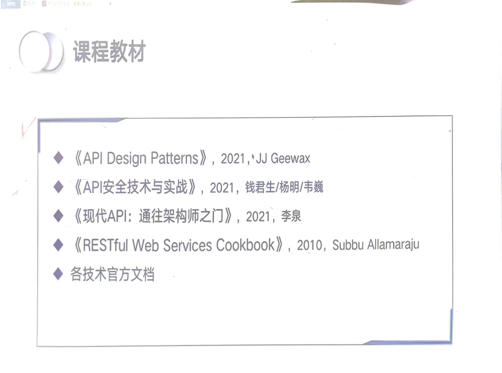
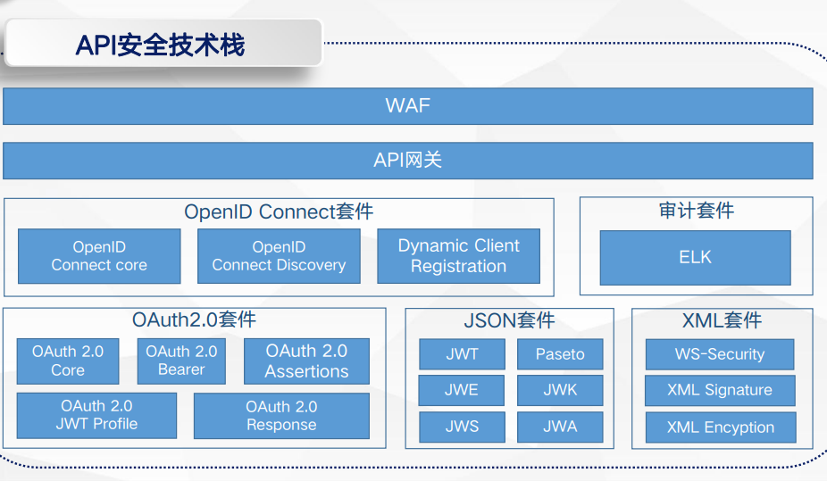
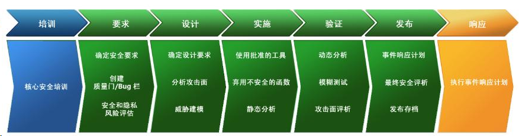
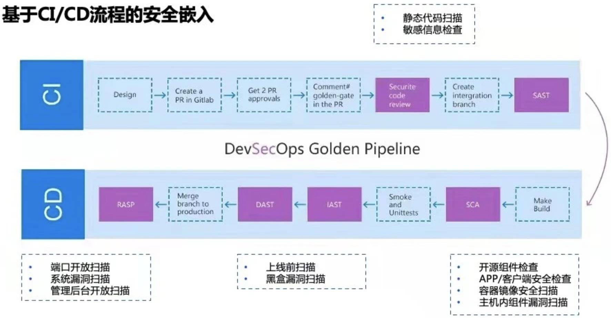
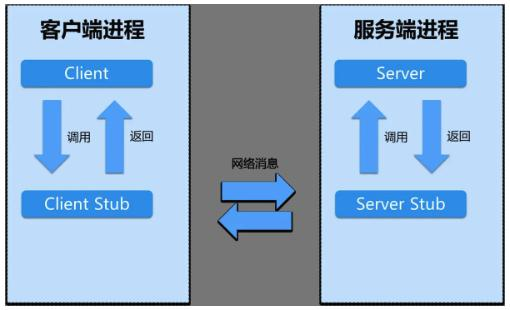

[TOC]

# Introduction

陈长兵

50% 平时分
50% 大作业

## 课程教材

# 绪论

## API研究方法

### API位置

- 调用软件库的方法
- 与操作系统交互
- 与数据库交互
- 使用第三方提供的服务
- 通过网络调用服务
- ...

### API作用

- 提供软件之前交互的方法
- 开放能力，提供服务的一种方式
- 支持模块化
- 隐藏细节

### 行业发展需要

- 企业协作
- 大规模集成
- 开放式创新

### API面临的挑战

- 现代软件开发模式，迭代&敏捷
- 灵活性 & 开放性
- 刚性 & 脆弱性

# API设计概论

## API是什么

- 应用程序编程接口，不同计算机程序之间的通信交互方式
- 软件接口的一种，向软件的其他模块提供服务
- 两种形态，API规格说明书和API实现

## 为什么需要API

**隔离**

> - 屏蔽底层细节
> - 维持一致连贯性
> - 安全保障

**简化**

> - 避免重复造轮子

**抽象**

> - 建立契约，等价性
> - 突出行为，掩盖特征
> - 高内聚低耦合

**共享**

> - 服务标准化、产品化
> - 建立合作关系
> - 价值链延伸

## API分类

基于服务对象

> 公有型API
> 私有型API
> 混合型API

基于技术类型

> gRPC API
> SOAP API
> RESTful API
> GraphQL API

## API服务模式

### ESB

**企业服务总线Enterprise Service Bus**是连接个应用系统之间的中央枢纽
基于SOA(面向资源的体系架构)的设计思路，主流

### 微服务

MicroServices，由一组完全独立的应用服务构成，独自独立部署和松耦合交互，共同完成特定的业务需求

## API经济

企业与企业之间通过API建立合作关系  1

# API设计规范

## API设计评估

- Operational 可行，可用
- Expressive 富有表象，表达能力强
- Simple 简单，简洁
- Predictable 可预测性

## 通用设计原则

- 简单原则
  - 声明直观清晰
  - 功能可见性
  - 简单易用程度
  - 单一职责
- 抽象原则
  - 按业务特征抽象实体
  - 最小信息，接口粒度
  - 恰当的抽象与具体
  - 更好的适用性、拓展性
- 兼容扩展原则
  - 开闭原则
  - 保证API的后向兼容
  - 拓展参数便利
- 统一原则
  - 统一的命名规范
  - 统一的入/出参规范
  - 统一的错误码规范
  - 统一的版本规范 
- 正交原则
  - 覆盖全业务流程
  - MECE原则，相互独立&完全穷尽
  - 高内聚低耦合
- 安全原则
  - 认证授权，访问控制
  - API自身保护
  - 传输数据保护

## API设计原则

API构成

> - 操作
> - 参数
> - 组织结构

### 命名规则

#### 好的命名特点

- Expressive
- Simple
- Predictable

命名的机制

> - 一致性
>   - 美式英语&英式英语
> - 语法
>   - 命令式动词
>   - 介词
>   - 复数
> - 词法
>   - 大小写
>   - 关键词

#### 四种命名方法

- 帕斯卡命名法
  首字母大写，单词无连接
- 驼峰命名法
  - 小驼峰法，除第一单词外首字母
  - 大驼峰法，帕斯卡
- 下划线命名法
- 匈牙利命名法
  `构成=属性+类型+对象描述`

#### 其他考虑因素

- 上下文Context
  - 上下文携带信息，影响名字的含义
  - 限定含义，或赋予特有含义
- 数据类型和单位
  - 数据没有单位会引起混乱
  - 引入丰富的数据类型

### 数据类型和默认值

- 数据类型是每个编程语言的重要组成部分
- 动态类型，Dynamic Typing
- 序列化 & 反序列化， 信息丢失
- 缺失与空值

#### 布尔类型

- 一定应用场景
- 二值表达力有限，可能有更好的方案
- 避免double negative（双重否定）

#### 数值类型

- 存在算数计算诉求场景
- 不适用于纯数值类标识符
- 边界
- 默认值
- 序列化

#### 字符类型

- 最通用的数据类型
- 编码，byte & char & Character
- 边界
- 序列化
  标准等级与兼容等价，组合和独立字符两个维度

#### 枚举类型

Name(字符) + Value(数值)

优势：校验，压缩
不足：依赖码表，变更同步

**API场景传输时，优先字符类型**

#### 列表类型

- 基本类型的集合，也可以是其他列表或Map类型
- 原子性
- 边界
- 默认值

#### Map类型

- 边界
- 默认值

### 资源范围和层级

#### 资源布局

是一种实体关系模型，实体与实体之间的关系

- 关系的种类
  - 引用关系
  - Many-to-One关系
  - 自引用关系
  - 层级关系
- ER图

**如何选择正确的关系**

> - 是否需要建立一个关系
>   - 建立关系是有代价的，性能变差，维护复杂
>   - 关系也是有价值的，比如社交网络
>   - 新增关系 一定与 某个重要的业务需求挂钩
> - 使用引用reference还是内嵌in-line
>   - 引用方式：通过指针找到真实对象
>   - 内嵌方式：存储对象的全部数据
>   - 差异：交互次数，传输数据大小
>   - 考虑因素；具体场景具体看，需求意图，底层存储方式
> - 层级
>   - 层级关系or引用关系
>   - 层级关系特点：操作的级联性

# API设计模式

## 标准方法

标准方法，直观明义

仍有大量细节隐藏和丢失

| API 标准方法 | 描述                 |
| ------------ | -------------------- |
| GET          | 获取资源或数据       |
| POST         | 创建新资源或提交数据 |
| PUT          | 更新或替换资源       |
| PATCH        | 更新资源的部分内容   |
| DELETE       | 删除资源             |

一般而言都要实现，除非有明确的的合理的不能实现的理由

### 幂等性和副作用

- 幂等性 idempotence
  - 多次(同一个)操作，结果是一致的
  - 分布式场景，重复请求，应用超时或失败重试，网络抖动
  - 数据丢失，数据损坏，数据不一致
- 副作用 side-effect
  - 非预期的影响，没有额外的行为
  - 新建邮件，涉及邮件发送逻辑

---

- GET
  - 幂等性
  - 没有副作用
- List
  - 根据查询条件返回符合条件的资源列表
  - 资源列表，可能是资源集合的一个子集，也可能属于某个其他资源
  - 访问控制
  - 结果数量
  - 排序
  - 过滤
- Create
  - 建议使用POST方法
  - 标识符
  - 一致性
- Update
  - 建议使用PATCH方法，部分更新
  - 更新资源的信息
  - 特殊的更新：变更资源的状态
- Delete
  - 建议使用DELETE方法
  - 幂等性
- Replace
  - 建议使用PUT方法
  - 强Schema场景，整体替换，没有中间状态
  - 能否用于创建新资源？
  - 能否指定标识符？

### Trade-off

- 放弃一些灵活性
- 完全自定义的RPC风格API
- 规范，一致，成本
- 不绝对，二八原则，标准方法解决80%的问题

## 定制方式(自定义方法)

因为标准方法不是万能的

**概述**

> - 不满足标准方法上的严格约束
> - 没有约束，完全自由发挥
> - 杂乱发展，将难以维护
> - 在整个API设计中，仍需保持某一种一致性的约束

### 方法命名

- 与标准方法相同命名习惯
- 构成格式：动词 + 名词
- 其他约束也要遵循：介词，复数等

### 副作用

- 与标准方法最大的差异
- 标准方法的强约束：没有副作用，不涉及额外的操作
- 如发送邮件、触发底层操作、更新多个资源

### 方法放在哪里

资源还是集合？

### Stateless场景

- 即时处理请求后返回结果，不涉及其他数据的获取或存储
- FaaS函数即服务，业务逻辑
- 完全无状态，上下文？

### Trade-off

- 与REST设计原则会有冲突
- 在简洁的资源体系下，扩展非标准交互的能力
- 经常被误用或过度使用

## 部分更新与检索

- 部分检索
  - 边缘设备处理能力
  - 网络带宽
- 部分更新
  - 数据一致性
  - 数据丢失
  - 细粒度的使用场景

---

一种简洁的实现方式，使用字段掩码field mask

### 如何传输

对服务端的server有不同方法

- HTTP协议构成
  - 请求串，请求体，Header
  - GET没有请求体
  - PATCH请求体应该只包含资源部分
- 不同HttpServer服务端，对请求串中数组的处理方式存在差异

### Map或嵌套类型

- 请求的参数不是平铺的，多层数据结构

- fieldmask数据格式约定

  > - 使用逗点连接不同的部分
  > - 使用星号标识某个嵌套信息中的所有字段
  > - Map Key是字符类型
  > - Map Key中特殊字符使用反引号字符转义
  > - Map Key中反引号字符使用两个反引号转义

### 列表类型

- 可以与Map类型类似

### 默认值

- 部分检索
  - 与标准Get方法默认一致，需要列出所有字段
  - 接口升级，增加字段，客户端需要更新
  - 引入星号，代表所有字段
- 部分更新
  - 默认所有字段
  - 基于输入数据，自动推断

### 隐式field maks

- 标准update方法使用PATCH
- 根据请求数据推断field mask
  - 提供了哪些字段，就更新哪些字段
  - 某个字段值为null，如何处理

### 更新动态数据结构

- 三种情况：有值、null值、key缺失
- 删除某个key
  - 标准replace方法
  - PATCH方法，在field mask指定字段，在请求体不存在
  - `fieldMask=settings.test&fieldMask=title`
  - `{"title":"new title"}`

### 无效字段

- 静态数据结构，检索或更新不存在的字段
- 防御性编码策略
  - 抛出异常，返回错误
- 一致按undefined处理

### Trade-off

- 应用场景约束
  - 最小化非必要数据的从传输
  - 精细化数据修改
- 为保持一致性，所有接口通用支持

## 批操作

- 是否需要完全成熟的通用事务设计模型
  - 支持必要原子操作  
- 在标准方法前期加上Batch
  - BatchDeleteMessages
  - 方法类似，但实现会有差异

- HTTP方法 类似自定义方法，优先使用POST 或类似标准方法
- 要考虑如何保持原子性
  - 批量查询，如果一个字段被删除了，是否整个都失败
  - 能否在多个父资源的进行操作？

### 原子性

- 定义：表示一组操作是原子性的，他们之间不可分割。整体操作只能全部成功或全部失败，没有中间状态。
- 设计考量：通常，原子性是批处理的核心诉求（优先）。但也要考虑复杂度和实现成本,此时可允许部分失败。
- 设计目标：批处理模式下的操作都要保持原子性。

- 操作位置
  - 父资源   `/chatRooms/*:batchUpdateMessage`
  - 资源集合  `/chatRooms/*/messages:batchUpdate`

### 结果顺序

- 结果的顺序，与请求的顺序一致
- 如果返回数据未保持顺序，要分析结果与请求的对应关系 

### 常用字段

两种策略

> 请求对象数组，通用性好，如针对不同父对象的操作
> 主键字段数组，更简洁，如获取或删除一组资源

两种策略混用，要注意，可能APIServer拒绝执行

### 跨父资源操作

使用对象数组，比共用更优
每个请求对象，单独指定父资源

### BatchGet操作

- 除了顶层资源，一般都有一个parent指示字段

- 跨父资源，可使用通配符，比如连接字段

- 跨父资源有时不合理

  > 分布式系统中，不同父资源可能存储在不同位置
  > 只要一个失败，则都会失败。可能需要更宽松的保证

- 部分检索 统一的fieldmask

- 批操作一般不实现分页，而是限制返回数量

### BatchDelete操作

- 使用主键字段数组，使用POST方法
- 除了顶层资源，一般都有一个parent指示字段
- 跨父资源，使用通配符，同时要充分考虑合理性和可行性
- 原子性，删除所有给定的所有资源，或整体失败

### BatchCreate操作

- 请求使用对象数组 
- 除了顶层资源，一般都有一个parent指示字段 
- 预先是没有主键字段的，这个是API Server端创建的 
- 请求与结果的顺序一致性

### BatchUpdate操作

- 与BatchCreate基本相似
- 差异，部分更新 部分更新字段需要，每个资源可以不同 fieldmash针对单个的资源
- 使用POST方法 与标准Update方法的PATCH不同

### Trade-offs

- 首先把原子性放在首位，即使实现不方便
- 一致性
  - 简单性优于一致性
  - 请求有时是主键字段，有些是对象

## 分页

- 资源的大小和数量，量级非常大。通过单次请求和响应获取数据，可能会非常慢或不可行
- 如果将数据切割成可管理的分区，消费者可轻易获取单个分区

---

- 每次**返回一页中的记录**，同时**返回下一次消费的指针位置**
- 引入**光标**的思想
- 我需要一页（获取新的信息或咨询） & 我需要第*页（随机访问 有先验知识）

### page size

- 默认值 视资源大小而定 一般十条
- 上界和下界
  负数，和超过一定数值，可以直接拒绝

### page tokens

- 如何表示终止 返回一页数据不满 或 返回空页
- 一致性
  - 新增删除数据 下一页返回结果与当前页相同
  - 依赖使用的存储系统
  - 避免使用绝对偏移量 使用相对偏移量

### total count

- 友好的用户体验
- 总数非常大时 操作困难
- 不提供准确值 只提供预估值 耗时更短

### 单一大资源分页 

page token，Max bytes

## 长耗时操作

- 复杂操作，处理大数据量。占用服务器资源与网络资源。系统需要一直等待。
- 用于即时操作的设计方法在此时不一定能适用
- 需要能够支持异步的交互

---

- 类似Future或Promise机制
  - 启动任务，不阻塞，立即返回一个Promise对象
  - 在Promise对象上等待，或注册回调函数
- 与这种机制还有一些差异
  - 资源需要**持久化**
  - 需要一些**元数据** 如进度开始或完成的时间 当前执行的动作
  - 需要一种**发现和管理LROs**的方法

> 两个部分：定义Operation资源 & 发现和管理LROs的API接口

### LRO(Large Receive Offload)资源

- 作为一种资源，能够交互
- **最终返回结果**
  - 最终返回结果
  - 要考虑有错误发生或者未成功完成
  - 标识成功完成，没有其他结果信息
  - 所有结果字段是可选的，是正常的结果类型（泛型），或者操作错误类型

- **状态标识**
  - done标识字段，是否已结束
  - pending（堵塞），resolved（恢复），rejected（拒绝）

- **元数据信息**
  - 在结束前，提供一些任务的动态信息
  - 进度信息，预估剩余时间
- *最终返回结果，和元数据信息，有时都是非必须的*

### LRO 资源的层级 

集中式顶层资源集合

### LRO 解析

- Polling，轮训，`GetOperation`
  客户端，检查频次，停止检查
  不能立即知道结果
- Waiting，等待，`WaitOperation`
  一直维持链接，一旦结束，立即知道结果
  服务端的轮训，链接丢失，可以再使用轮训方式

### 错误处理

- Http请求，错误处理使用 **http错误码**
- LRO不能使用
  - 返回的http错误码，不能区分是操作的结果，还是`GetOperation`的处理结果
  - **http错误码仅用来表示资源操作的处理结果**
- LRO的处理结果，放在最终返回结果字段`OperationError`
  - 错误码&错误信息
  - 除错误类型，额外信息，最好结构化，机器可识别的方式

### 进度监控

`MetaData`来表达
	任务开始时间，任务进度
	预估剩余时间，已处理字节数量

应用
每轮轮巡时，获取进度

### 取消操作

错误数据创建需要取消

自定义方法，`CancelOperation`

- 需要等待完成，阻塞
- 中间结果要清理，回到初始状态
- 有些无法清理的，反馈，元数据信息
- 不是所有操作都可取消

### 暂停和恢复操作

只有合理和可行的场景可暂停和恢复

自定义方法，`PauseOperation, ResumeOperation`
元数据新增一个布尔字段, `paused`

### 持久化

持久化策略

- 其他常规资源保持一致
- 滚动窗口，比如30天有效期，有效期外，会被删除
- 其他策略，操作对应的资源删除了，二级有效期，归档，删除归档

### Trade-offs

最简单的办法就是等待

- 可能不能很好适应分布式系统
- 一个微服务初始化任务，另一个监控进度
- 监控进度，意味着一直阻塞等待
- 如果链接短了，就可能会丧失恢复的能力

## 可重复运行作业

场景

> 虽然有异步调用的API，但仍需客户端触发执行
> 异步执行，但每次调用需要提供所有相关配置
> 按需执行模型，混合两种权限：执行方法的能力，和配置参数的能力
> 按某种循环计划的方式自动执行

**job概念**

> 特殊的资源类型
> 配置过程
> 执行过程
>
> 一次配置多次执行，划分两个方法更便于控制权限，在调度系统中，只调用执行接口即可，不需要关注大量繁琐的配置

### 基本属性

- 标识符
- 所属资源
- 配置信息

### 标准方法

`Create, Get, Delete, List`

同步并立即返回
并非所有方法都要支持，比如Job是不可变更的，可忽略update方法

### 自定义方法run

入参只有`Job Id`，返回LRO对象

### Execution执行资源

属于特定的Job类型下

Job & Execution & Operation

### Trade-offs

多种解决方案

- 针对权限问题，可以设计高级的权限系统
  - API方法 + 方法参数都进行检查控制
  - 缺点，实现逻辑复杂
- 执行计划，可以只保持Operation资源
  - 作为输出的引用
  - 缺点，过滤Operation资源获取Job关注的信息

## 导入导出

有一些序列化数据需要导入

### 自定义方法

`import & export`, 返回类型是LRO

### 存储系统交互

单个schema，保存所有配置
使用接口，针对不同存储系统特定实现

**针对import和export不共用，`DataSource & DataDestination`**

### 资源与二进制的转化

序列与反序列化

**配置`InputConfig, OutputConfig`**

### 一致性

导出数据时，首先要保障导出所有或满足条件的所有数据

导出时，资源变更怎么办

> - 依赖底层存储系统的快照和事务能力，读取特定时间点的所有数据(数据量大，不容易支持)
> - 接受现实，尽最大的可能是精确的数据
> - 导出期间，禁止变更

导出数据，与备份数据，差异

> - 备份是一种快照
> - 导出是通过数据检索的方式，转义到外部存储设备

### 主键与冲突

> 导入数据主键已经存在
> 导出后再次导入，但不同的父资源
> 有些API不允许用户指定标识符

导入&导出不能直接用于备份和恢复
**需要更严苛的数据检查，备份时需要一致性快照，导入时是完整的替换**

### 处理关联资源

针对父资源，不一定包含所有子资源

**与备份和恢复，需要再次划清界限**

### 失败和重试

两种问题原因:
API服务的问题
存储系统的问题

**导出失败**

> 每次导出独立，重试安全
> 每次导出的执行可能不同
> 存储系统的话如磁盘空间不足

**导入失败**

> 不能像导出一样，无法简单的直接重试
> 因为数据校验，而不是网络问题，再次重试还是有问题
> 即使是偶发性问题，也不能直接重试，前一次导入可能创建新资源，数据重复

**导入失败处置策略**

> 在一个事务执行导入操作(不是所有存储系统都支持)
> 同一事务导入大批量数据也不可行
>
> 另一办法是支持请求去重
> 不一定是资源标识符，可以是每条记录的导入请求id
> 导出时，可配置是否序列化到输出数据中

### Trade-offs

**这个模式定位非常窄和具体**
只是作为API和外部存储系统的中间桥梁，替代了编写应用程序实现数据转移

**这导致有两个缺点**
只能用于转移一种资源类型，否则就不是简单的纯粹的一种数据转移，而是包含业务逻辑
容易与数据备份和恢复功能混淆，没有一致性保障

# API安全

## API安全概述

从安全的角度关注API领域的安全问题和这些问题的解决方案，从 技术和管理两个层面提高API自身和API周边生态的安全性

### 安全内容

> 网络安全
> Web应用安全
> 安全开发
> 监管合规

### 安全问题主要成因

API安全意识不足
技术革新导致API安全风险增加
API自身安全机制不足

### 安全面临的主要挑战

API广泛使用带来攻击面的扩大
API安全实践经验缺失
外部环境变化带来的合规性挑战

### 常见API安全漏洞类型

未受保护的API
弱身份鉴别
中间人劫持
传统web攻击
弱绘画控制
反向控制
框架攻击

### OWASP API安全漏洞

OWASP(Open Web Application Security Project)，开放式Web应用程序安全项目，开源的、非盈利的全球性安全组织

**OWASP API安全Top10**
挑选十大API安全漏洞类型

> API1-失效的对象级授权
> API2-失效的用户认证
> API3-过度的数据暴露
> API4-缺乏资源和速率控制
> API5-失效的功能级授权
> API6-批量分配
> API7-安全性配置错误
> API8-注入
> API9-资产管理不当
> API10-日志记录和监控不足

## 安全设计原则

### 5A原则

从5方面综合考量安全设计的合理性

> - **Authentication身份认证**
>   谁在与API服务进行通信，是否允许客户端请求
> - **Authorization授权**
>   身份认证后，可以访问哪些API
> - **AccessControl访问控制**
>   对授权后的客户端访问时的正确性验证，与授权的差异：一个配置、一个行为
> - **Auditable可审计性**
>   记录接口调用的关键信息，以便通过审计手段及时发现问题，并在发生问题 时通过审计日志进行溯源，找到问题的发生点
> - **AssetProtection资产保护**
>   主要是指API接口自身的保护，限速限流，防止恶意调用，传输的个人信息，隐私数据，信息资产保护

### 纵深防御

**在不同层面使用不同的安全技术，来达到纵深防御的目的**

- API业务属性划分
  - 公共型API、私有型API
- 根据业务需求、组细粒度划分
  - 采用不同的身份认证和授权技术实现

---

- 5A原则
  - 重点强调每一层安全架构设计的合理性
  - 是横向的安全防护，强调宽度 

- 纵深防御
  - 是对同一问题从不同的层次、不同的角度做安全防护
  - 是纵向的安全防护，强调深度 
- 两者构成有机的防护整体

## API安全技术

### API安全技术栈

- 最上层WAF、API网关
  - API安全的基础套件
  - 为API安全提供综合的安全支撑能力
- 认证与授权
  - 以OpenID Connect套件、OAuth2.0套件为代表
  - 提供API的身份证和鉴权解决方案
- 审计套件、JSON套件、XML套件
  - 为API消息保护和安全审计提供技术支持

### 身份认证技术

**认证方式**

> - 基于用户身份的认证技术
>   - 用户名/密码认证
>   - 动态口令
>   - 数字证书认证
>   - 生物特征认证
>   - **多因子认证**，以上的排列组合
>   - **CAS单点登录**，在多个应用系统中，用户只需登录一次就可以访问所有相互信任的应用系统
> - 基于应用程序身份的认证技术
>   - AK/SK认证
>   - HTTP Basic认证(RFC2617)
>   - Token认证
>   - 数字证书认证

### 授权与访问控制技术

#### 授权方式

> - 基于使用者身份代理的授权与访问控制技术
>   - 以OAuth2.0协议为代表
>   - 获取使用者的权限许可(使用者: 某某个自然人用户，或者谋个客户端的应用程序)
> - 基于使用者角色的授权与访问控制技术
>   - 以RBAC模型为代表
>   - 授予角色，角色包含资源的访问权限

#### OAuth协议

基本思路

> 采用授权令牌的代理机制
> 在客户端应用程序、授权服务器、被调用API或资源之间，构建一个虚拟的令牌层
> 用于资源访问的授权确认

核心流程

> 访问客户端应用程序
> 请求授权
> 确认授权
> 申请令牌
> 颁发令牌
> 申请资源
> 开放资源

**四种授权模式**

> 授权码模式 (Authorization Code)
> 隐式模式或简化模式 (Implict)
> 密码模式 (Password)
> 客户端凭证模式 (Client Credentials)

#### RBAC模型

**Role-Based Access Control**基于角色的访问控制

**基础是业务角色**
依赖于角色构建授权和访问控制能力
**授权核心要素**

> 账号，代表用户身份或者调用应用客户端的身份
> 权限，将系统提供的业务功能安装数据和功能维度划分数据权限和功能权限
> 角色，是账号和权限之间的桥梁，将调用者身份与可操作的具体功能或数据进行授权关联

**4级RBAC模型**

> RBAC0: 最基础的RBAC模型，三元素用户、角色和权限
> RBAC1: 引入角色之间的继承关系，新增角色的层级架构
> RBAC2: 新增责任分离关系，通过角色授权约束
> RBAC3: 同时兼备RBAC1和RBAC2的全部特点

### 消息保护机制

#### 保护机制

**通信链路保护**
在传输层保护，使用TLS/SSL

**应用层消息加密和签名**
应用层对消息体进行加密和签名

#### 防护套件

JSON和XML作为消息传递的数据格式
相关技术标准JWT、JWE、WS-Security等

#### 加密算法

- 对称算法
  - 通信双方使用相同秘钥
  - 多方都知道秘钥，安全性大大降低
- 非对称加密算法
  - 公钥加密，私钥解密
  - 性能影响
  - 协商对称加密的秘钥，使用非对称加密算法加密消息体

### 日志审计

#### 目的

通过审计策略和日志分析，发现系统在某一时间内发生的异常事件，通过事件关联和追溯，分析与事件相关联的内外部人员、系统、事件涉及的范围等。

#### 日志结构

> 时间：一般精确到毫秒
> 来源：日志操作的来源，比如源IP、源主机
> 结果：日志涉及的操作是否成功
> 操作者：由谁操作，某个用户或者客户端应用程序
> 操作详情：具体操作内容，比如给某个API授权
> 目标对象：被操作的对象，比如被请求的API端点

#### 采集位置

接口层
记录什么时间谁调用，是否成功
API网关，使用代理或切面

操作层
记录API端点被调用执行的业务操作
与业务逻辑相关，按照日志标准格式输出

### 威胁防护

#### 当前WAF产品的不足

> - 认证和授权流程的绕过
> - 数据格式难以识别
> - 流量控制能力难以满足业务需求

#### 针对API安全的防御安全

WAF
开发安全机制
使用RASP防护 (Runtime Application Self-Protection)，防护功能注入到程序中
限流和熔断需求
流量控制策略
关注策略触发优先级

## API安全治理

### SDL

SDL关键安全活动

#### API安全培训

**开展安全培训活动考虑内容**

> 培训对象
> 培训目标和内容
> 培训形式
> 培训计划
> 效果评估

**培训对象**

>  项目经理
> 技术负责人
> 架构师
> 开发工程师
> 测试工程师
> 运维工程师
> 质量工程师

**培训内容**

>API安全管理框架和关键指标
>常见API安全问题
>常见API安全技术和安全设计
>API安全编码案例
>API安全测试与工具使用

#### API安全需求

过程保证类需求，组织级的安全要求
监管合规率需求，监管部门的安全要求
技术保障类需求，从安全攻防的角度

#### API安全设计

将安全需求分析后确定所采取的的风险处理措施，应用到技术架构设计中，并形成相关规范

- 减少攻击面
- 威胁建模
- 安全设计参考资料

#### API安全实现

侧重编码开发，根据安全设计阶段的产物，选择相应的编程语言，
完成API编码实现过程。

一般包括三个阶段：

> 安全编码培训
> 安全编码
> 静态检测

静态检测工具衡量指标

> 支持的开发语言
> 漏报率
> 误报率
> 运行环境与配置
> 报告格式
> 报告内容
> 性价比或购买方式

#### API安全验证

对SDL流程中安全需求、安全设计、安全实现环节的验证，通过管理手段和技术手段来评估安全实现的正确性，保证安全设计与安全实现的一致性。

一般包括三种方式 ：

> 工具验证
> SDL过程保证
> 个人隐私合规类的安全验证

### DevSecOps

#### 软件产品生命周期

产品需求-设计-开发-测试-部署维护

涉及几个不同的团队

> 负责产品的客户需求与市场推广
> 产品的设计与开发
> 产品的运维和客户服务

#### DevOps理念

业务高速发展，团队协作效率

一种新型的协作方式

> 注重于构建容易维护和自动化运维的产品和服务
> 起源于通过合并开发和运维实践
> 消除隔离，统一关注点
> 提升团队和产品的效率和性能

#### 实施关键点

安全左移：在设计开发阶段就引入安全环节，从整个生命周期开发与维护的视角关注安全质量与成本

安全自动化：关注整个流程的工具化与自动化，在CI/CD工具链嵌入安全检查流程，减少对研发流程的影响

持续运营：采取循序渐进的方式在组织中推进解决安全问题，构建数字化运营指标，获得最佳的投入产出比

#### DevSecOps管道

为减轻安全活动介入后对原有流程的影响，将安全工作加入现有的开发平台和工具中

> 在项目管理平台导入安全等级定义
> 在需求管理平台导入安全需求
> 在持续集成平台与安全测试能力对接
> 在缺陷管理系统导入安全测试结果

#### API安全实践

**设置关键卡点**

> 落实自动化API安全测试
> 采用API网关
> 接入Web应用防火墙

构建不同层面的安全能力

> 持续集成管道安全，保证CI/CI环境的安全性
> API基础设施安全，保证API运行环境的安全性

### API网关

是面向API、串行、集中化的管控工具，提供高性能的API托管服务，使用户能够快速、低成本、低风险地开放服务能力

#### 优势

将内部服务和外部调用隔离，隐藏 内部服务数据，保障了服务的私密性和安全性
在整体架构上，可以让业务提供者抽出更多精力来关注核心业务能力建设，而不是通用的安全性、流控等边界特性的问题
在快速增加新业务或改变原有应用系统、服务时，对现有架构和应用程序的影响降低到最小

#### 功能

由核心控制系统和后台管理系统两部分构成
核心控制系统
后台管理系统

#### 网关边界

和后端API服务之间的关系
API提供者在提供稳定的API后，在API网关中注册并发布API，才可以本终端业务系统调用

和客户端应用程序之间的关系
不同的客户端或终端应用程序首先访问API网关，经过一系列的API控制器、网关路由到目标API

和运维监控系统之间的关系
API网关接入运维监控系统，用于监控网关和服务器的运行情况，也监控各个已注册API的运行健康情况，并在异常时触发告警

和日志平台之间的关系
API网关接入日志平台，用于采集API的调用信息，完成问题分析、调用链跟踪、调用数据统计等

#### 应用场景

多种API协议转换
API安全接入

### 数据隐私

数据隐私法律框架

数据隐私的含义

数据生命周期

数据生命周期各阶段安全

# API技术实现

## 基于RPC

### RPC基础

**IPC进程间通信**

> Inter-Process Communication
> 多CPU之间的数据交换
> 管道，匿名管道，信号
> 消息队列，信号量，共享内存区
> Socket套接字，不同主机上的进程通信

**RPC远程过程调用**

> Remote Procedure Call
> 调用远程方法像调用本地方法一样简单
> 不同主机上的进程通信
> 基于Socket套接字

**I/O模型**

- 阻塞&非阻塞
- 同步&异步
- 用户态&内核态
- 用户线程&内核线程
- 用户空间&内核空间
- 阻塞I/O&非阻塞I/O
- 同步I/O&异步I/O

**Linux I/O模型**

- 阻塞IO，BIO，Blocking IO
- 非阻塞IO，NIO，None Blocking IO
- 多路复用IO，IO Multiplexing
- 信号驱动IO，Signal-driven IO
- 异步IO，AIO，Asynchronous IO

**Java I/O模型**

- BIO，阻塞IO
- NIO，New IO (面向缓冲)
- AIO，异步IO

**Reactor模式**

非阻塞同步网络模式
基于I/O多路复用机制监听事件，收到事件后，根据事件类型分配给某个进程/线程
由Reactor和处理资源池两个核心部分构成

> Reactor负责监听和分发事件，事件类型包括连接事件、读写事件
> 处理资源池负责处理事件，如read -> 业务逻辑 -> send

**Proactor模式**

异步网络模式
采用异步I/O技术，感知已完成的读写事件

**RPC构成**

RPC由四个部分构成

- 客户端：服务的调用方
- 客户端存根：client stub，存放服务端的地址信息，再将客户端的请求参数打包成网络消息，然后通过网络远程发送给服务方
- 服务端：服务的提供者
- 服务端存根：server stub，接收客户端发送过来的消息，将消息解包，并调用本地的方法

两个概念

- Marshalling：对请求参数进行封包
- UnMarshalling：对封包消息进行解包

**RPC与RMI**

RPC

> 远程过程调用
> Remote Procedure Call
> 面向过程

RMI

> 远程方法调用
> Remote Method Invocation
> 面向对象

stub，存根，客户端代理
skeleton，骨架，服务端代理

### RPC框架

解决网络通信的某一类问题
框架与类库的区别，框架内部的类有相互协作的功能 
不用感知RPC调用实现的细节

## 基于REST

## 基于GraphQL

