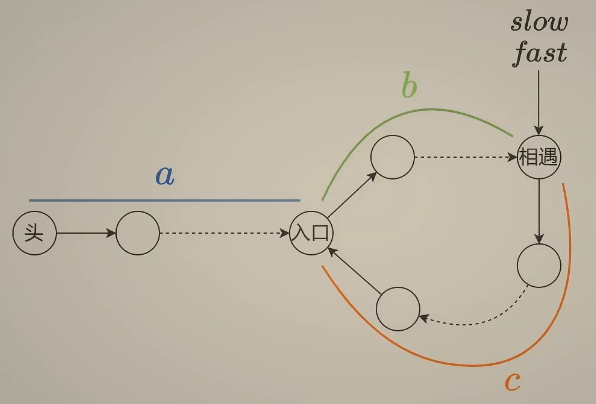

# 数组

## 二分查找

### [704. 二分查找 - 力扣（LeetCode）](https://leetcode.cn/problems/binary-search/)

```c++
class Solution {
public:
    int search(vector<int>& nums, int target) {
        int left = 0;
        int right = nums.size() - 1;
        while (left <= right) {
            int middle = left + (right - left)/2;
            if (nums[middle] < target) {
                left = middle + 1;
            }
            else if (nums[middle] > target) {
                right = middle - 1;
            }
            else {
                return middle;
            }
        }
        return -1;
    }
};
```

注意left和right的界

### **相关题目**

#### 搜索插入位置

[35. 搜索插入位置 - 力扣（LeetCode）](https://leetcode.cn/problems/search-insert-position/submissions/)

```c++
class Solution {
public:
    int searchInsert(vector<int>& nums, int target) {
        int left = 0;
        int right = nums.size() - 1;
        while(left <= right) {
            int middle = (right + left) / 2;
            if (nums[middle] < target) {
                left = middle + 1;
            }
            else {
                right = middle - 1;
            }
        }
        return left;
    }
};
```

注意不需要返回middle而是返回left

#### 排序数组查找元素的第一个和最后一个位置

[34. 在排序数组中查找元素的第一个和最后一个位置 - 力扣（LeetCode）](https://leetcode.cn/problems/find-first-and-last-position-of-element-in-sorted-array/)

```c++
class Solution {
public:
    vector<int> searchRange(vector<int>& nums, int target) {
        int firstTarget = findFirstTarget(nums, target);
        int lastTarget = findLastTarget(nums, target);
        if (firstTarget == -2) {
            return {-1, -1 };
        }
        else if (lastTarget == -2) {
            return {-1, -1};
        }
        else if (lastTarget - firstTarget > 1 ){
            return { firstTarget + 1, lastTarget - 1};
        }
        else return {-1, -1};
            
    }
private:
    int findFirstTarget(vector<int>& nums, int target) {
        int left = 0;
        int right = nums.size() - 1;
        int border = -2;
        while (left <= right) {
            int middle = left + ((right - left) / 2);
            if (nums[middle] >= target) {
                right = middle - 1;
                border = right;
            }
            else {
                left = middle + 1;
            }
        }
        return border;
    }

    int findLastTarget(vector<int>& nums, int target) {
        int left = 0;
        int right = nums.size() - 1;
        int border = -2;
        while (left <= right) {
            int middle = left + ((right - left) / 2);
            if (nums[middle] > target) {
                right = middle - 1;
            }
            else {
                left = middle + 1;
                border = left;
            }
        }
        return border;
    }
};
```

未赋值不能为-1，有可能本身middle-1得出-1，较为复杂


## 移除元素

[27. 移除元素 - 力扣（LeetCode）](https://leetcode.cn/problems/remove-element/)

```c++
class Solution {
public:
    int removeElement(vector<int>& nums, int val) {
        int slow = 0;
        int count = 0;
        for (int fast = 0; fast < nums.size(); fast++) {
            if (nums[fast] != val) {
                nums[slow] = nums[fast];
                slow++;
            }
            else {
                count++;
            }
        }
        for (int i = 0; i < count; i++) {
            nums.pop_back();
        }

        return nums.size();
    }
};
```

双指针

## 有序数组的平方

[977. 有序数组的平方 - 力扣（LeetCode）](https://leetcode.cn/problems/squares-of-a-sorted-array/submissions/)

```c++
class Solution {
public:
    vector<int> sortedSquares(vector<int>& nums) {
        int left =0;
        int right = nums.size() - 1;
        vector<int> newNums;
        while(left != right){
            if (nums[left] * nums[left] >= nums[right] * nums[right]){
                newNums.insert(newNums.begin(), nums[left] * nums[left]);
                left++;
            }
            else {
                newNums.insert(newNums.begin(), nums[right] * nums[right]);
                right--;
            }
        }
        newNums.insert(newNums.begin(), nums[left] * nums[left]);
        return newNums;
    }
};
```

## 长度最小的子数组

[209. 长度最小的子数组 - 力扣（LeetCode）](https://leetcode.cn/problems/minimum-size-subarray-sum/)

```c++
class Solution {
public:
    int minSubArrayLen(int target, vector<int>& nums) {
        int left = 0;
        int minLen = INT32_MAX;
        int sum = 0;
        bool flag = true;

        for (int right = left; right < nums.size(); right++) {
            sum += nums[right];
            while (sum >= target) {
                if (minLen > right - left + 1){
                    minLen = right - left + 1;
                }
                sum -= nums[left++];
            }
        }
        if (minLen == INT32_MAX){
            return 0;
        }
        else {
            return minLen;
        }
    }
};
```

滑动窗口
外面用for，里面用while，sum不能硬求要随时+-，妙手

## 螺旋矩阵

[59. 螺旋矩阵 II - 力扣（LeetCode）](https://leetcode.cn/problems/spiral-matrix-ii/submissions/)

```c++
class Solution {
public:
    vector<vector<int>> generateMatrix(int n) {
        vector<vector<int>> matrix(n);
        for (int i = 0; i < n; i++) {
            matrix[i].resize(n);
        }
        int direction = 0;
        int x = 0;
        int y = 0;

        int x_left = 0;
        int x_right = n - 1;
        int y_top = 1;
        int y_bot = n - 1;

        for (int i = 1; i <= n * n; i++) {
            switch (direction) {
            case 0:
                matrix[y][x] = i;
                if (x + 1 > x_right) {
                    direction = 1;
                    y++;
                    x_right = x - 1;
                    break;
                }
                else {
                    x++;
                }
                break;
            case 1:
                matrix[y][x] = i;
                if (y + 1 > y_bot) {
                    direction = 2;
                    x--;
                    y_bot = y - 1;
                    break;
                }
                else {
                    y++;
                }
                break;
            case 2:
                matrix[y][x] = i;
                if (x - 1 < x_left) {
                    direction = 3;
                    y--;
                    x_left = x + 1;
                    break;
                }
                else {
                    x--;
                }
                break;
            case 3:
                matrix[y][x] = i;
                if (y - 1 < y_top) {
                    direction = 0;
                    x++;
                    y_top = y + 1;
                    break;
                }
                else {
                    y--;
                }
                break;
            }
        }
        return matrix;

    }
};
```

思路很简单就按着大小去走，撞到墙就换方向并更新墙的位置。

# 链表

## 移除链表元素

[203. 移除链表元素 - 力扣（LeetCode）](https://leetcode.cn/problems/remove-linked-list-elements/submissions/)

```c++
/**
 * Definition for singly-linked list.
 * struct ListNode {
 *     int val;
 *     ListNode *next;
 *     ListNode() : val(0), next(nullptr) {}
 *     ListNode(int x) : val(x), next(nullptr) {}
 *     ListNode(int x, ListNode *next) : val(x), next(next) {}
 * };
 */
class Solution {
public:
    ListNode* removeElements(ListNode* head, int val) {
        // 去掉开头的val
        ListNode* temp_head = head;
        while (temp_head != NULL && temp_head->val == val) {
            temp_head = temp_head->next;
        }
        head = temp_head;
        // 去掉后序的val
        while (temp_head != NULL && temp_head->next != NULL) {
            if (temp_head->next->val == val) {
                temp_head->next = temp_head->next->next;
            }
            else {
                temp_head = temp_head->next;
            }
        }
        return head;
    }
};
```

## 设计链表

[707. 设计链表 - 力扣（LeetCode）](https://leetcode.cn/problems/design-linked-list/)

```c++
class MyLinkedList {
public:
    struct LinkedNode{
        int val;
        LinkedNode* next;
        LinkedNode(int val):val(val), next(nullptr){};
    };

    MyLinkedList() {
        _dummyHead = new LinkedNode(0);
        _size = 0;
    }
    
    int get(int index) {
        if (index < 0 || index > (_size - 1)) {
            return -1;
        }
        else {
            LinkedNode* temp = _dummyHead->next;
            while (index--) {
                temp = temp->next;
            }
            return temp->val;
        }

    }
    
    void addAtHead(int val) {
        if (_dummyHead->next == nullptr) {
            _dummyHead->next = new LinkedNode(val);
        }
        else {
            LinkedNode* temp = _dummyHead->next;
            _dummyHead->next = new LinkedNode(val);
            _dummyHead->next->next = temp;
        }
        _size++;
    }
    
    void addAtTail(int val) {
        LinkedNode* temp = _dummyHead;
        while(temp->next != nullptr) {
            temp = temp->next;
        }
        temp->next = new LinkedNode(val);
        _size++;
    }
    
    void addAtIndex(int index, int val) {
        if (index > _size) {
            return;
        }
        else if (index < 0) {
            if (_dummyHead->next == nullptr) {
            _dummyHead->next = new LinkedNode(val);
            }
            else {
                LinkedNode* temp = _dummyHead->next;
                _dummyHead->next = new LinkedNode(val);
                _dummyHead->next->next = temp;
            }
            _size++;
        }
        else {
            LinkedNode* temp = _dummyHead;
            while(index--) {
                temp = temp->next;
            }
            LinkedNode* temp_next = temp->next;
            temp->next = new LinkedNode(val);
            temp->next->next = temp_next;
        }
        _size++;
    }
    
    void deleteAtIndex(int index) {
        if (index >= 0 && index <= (_size - 1)) {
            LinkedNode* temp = _dummyHead;
            while(index--) {
                temp = temp->next;
            }
            LinkedNode* delete_temp = temp->next;
            temp->next = temp->next->next;
            delete delete_temp;
            _size--;
        }
    }

private:
    int _size;
    LinkedNode* _dummyHead;
};
```

## 翻转链表

[206. 反转链表 - 力扣（Leetcode）](https://leetcode.cn/problems/reverse-linked-list/)

使用pre和cur两个指针，以及需要一个temp指针来进行保存临时指针

```c++
class Solution {
public:
    ListNode* reverseList(ListNode* head) {
        ListNode* pre = nullptr;
        ListNode* cur = head;
        ListNode* temp = cur;
        while(cur != nullptr) {
            ListNode* temp = cur;
            cur = cur->next;
            temp->next = pre;
            pre = temp; 
        }
        return pre;
    }
};
```

## 两两交换链表中的节点

[24. 两两交换链表中的节点 - 力扣（Leetcode）](https://leetcode.cn/problems/swap-nodes-in-pairs/)

```c++
class Solution {
public:
    ListNode* swapPairs(ListNode* head) {
        ListNode* dummy = new ListNode(0);
        dummy->next = head;
        ListNode* pre = dummy;
        ListNode* cur = head;
        ListNode* post = new ListNode(0);
        if (head == nullptr) {
            return head;
        }
        else if (head->next == nullptr) {
            return head;
        }
        else if (head->next->next == nullptr) {
            post = nullptr;
        }
        else {
            post = cur->next->next;
        }
        while (cur->next != nullptr) {
            pre->next = cur->next;
            pre->next->next = cur;
            pre = cur;
            cur->next = post;
            cur = post;
            if (cur ==nullptr) {
                break;
            }
            else if (cur->next == nullptr){
                break;
            }
            post = cur->next->next;
        }
    return dummy->next;
    }
};
```

## 删除链表的倒数第N个节点

[19. 删除链表的倒数第 N 个结点 - 力扣（Leetcode）](https://leetcode.cn/problems/remove-nth-node-from-end-of-list/)

```c++
class Solution {
public:
    ListNode* removeNthFromEnd(ListNode* head, int n) {
        ListNode* dummyhead = new ListNode(0);
        dummyhead->next = head;
        ListNode* fast = dummyhead;
        ListNode* slow = dummyhead;
        for(int i = 0; i < n; i++) {
            if (fast == nullptr) break;
            fast = fast->next;
        }
        while (fast->next != nullptr) {
            fast = fast->next;
            slow = slow->next;
        }
        slow->next = slow->next->next;
        return dummyhead->next;
    }
};
```

## 链表相交

[面试题 02.07. Intersection of Two Linked Lists LCCI - 力扣（Leetcode）](https://leetcode.cn/problems/intersection-of-two-linked-lists-lcci/)

```c++
class Solution {
public:
    ListNode *getIntersectionNode(ListNode *headA, ListNode *headB) {
        ListNode* curA = headA;
        ListNode* curB = headB;
        int lenA = 0, lenB = 0;
        while (curA != NULL) { // 求链表A的长度
            lenA++;
            curA = curA->next;
        }
        while (curB != NULL) { // 求链表B的长度
            lenB++;
            curB = curB->next;
        }
        curA = headA;
        curB = headB;
        // 让curA为最长链表的头，lenA为其长度
        if (lenB > lenA) {
            swap (lenA, lenB);
            swap (curA, curB);
        }
        // 求长度差
        int gap = lenA - lenB;
        // 让curA和curB在同一起点上（末尾位置对齐）
        while (gap--) {
            curA = curA->next;
        }
        // 遍历curA 和 curB，遇到相同则直接返回
        while (curA != NULL) {
            if (curA == curB) {
                return curA;
            }
            curA = curA->next;
            curB = curB->next;
        }
        return NULL;
    }
};
```

## 环形链表II

[142. 环形链表 II - 力扣（Leetcode）](https://leetcode.cn/problems/linked-list-cycle-ii/)

使用快慢指针

 环长=b+c；慢指针移动距离 = a + b; 快指针移动距离 = a + b + k(b+c)

从快指针移动距离是慢指针的两倍`2(a + b) = a + b +k(b+c)`推导出`a - c = (k - 1)(b + c)`

意味着slow从相遇点出发，head从头结点出发，走c步后，slow在入口，head到入口的距离也恰好是环长的倍数，继续走两者必然会在入口相遇。

```c++
class Solution {
public:
    ListNode *detectCycle(ListNode *head) {
        ListNode* slow = head;
        ListNode* fast = head;
        while(fast && fast->next) {
            fast = fast->next->next;
            slow = slow->next;
            if (fast == slow) {
                while (slow != head) {
                    slow = slow->next;
                    head = head->next;
                }
                return slow;
            }
        }
        return NULL;

    }
};
```

# 哈希表

## 有效的字幕异位词

[242. 有效的字母异位词 - 力扣（Leetcode）](https://leetcode.cn/problems/valid-anagram/)

int数组来记录每个英文字符出现的次数，使用`当前字符- 'a'`来表示当前字符应存在哪个位置

```c++
class Solution {
public:
    bool isAnagram(string s, string t) {
        if (s.size() != t.size()) {
            return false;
        }
        int record[26] = {0};
        for(int i = 0; i < s.size(); i++) {
            record[s[i] - 'a']++;
        }
        
        for(int i = 0; i < t.size(); i++) {
            record[t[i] - 'a']--;
        }
        for(int i = 0; i < 26; i++) {
            if (record[i] != 0) return false;
        }
        return true;
    }
};
```

## 两个数组的交集

[349. 两个数组的交集 - 力扣（Leetcode）](https://leetcode.cn/problems/intersection-of-two-arrays/)

使用unordered_set

```c++
class Solution {
public:
    vector<int> intersection(vector<int>& nums1, vector<int>& nums2) {
        unordered_set<int> result;
        unordered_set<int> num_set(nums1.begin(), nums1.end());
        for(int num : nums2) {
            if (num_set.find(num) != num_set.end()) {
                    result.insert(num);
            }
        }
        return vector<int> (result.begin(), result.end());
    }
};
```

## 快乐数

[202. Happy Number - 力扣（Leetcode）](https://leetcode.cn/problems/happy-number/)

```c++
class Solution {
public:
    int getValue(int n) {
        int sum = 0;
        while(n) {
            sum += (n % 10) * (n % 10);
            n = n / 10;
        }
        return sum;
    }

    bool isHappy(int n) {
        int sum = n;
        unordered_set<int> result;
        // 使用while进行求和
        while(sum != 1) {
            sum = getValue(sum);
            if (result.find(sum) != result.end()) {
                return false;
            }
            else {
                result.insert(sum);
            }
        }
        return true;
    }
};
```

## 两数之和

[1. 两数之和 - 力扣（Leetcode）](https://leetcode.cn/problems/two-sum/)

使用unordered_map来记录之前是否遍历过

哈希表`iter`迭代器有两个成员`first`代表迭代器所指向元素的键，`second`表示迭代器所指向元素的值

```c++
class Solution {
public:
    vector<int> twoSum(vector<int>& nums, int target) {
        unordered_map<int, int> map;
        for(int i = 0;i < nums.size(); i++) {
            auto iter = map.find(target - nums[i]);
            if(iter != map.end()) {
                return {iter->second, i};
            }
            map.insert(pair<int, int> (nums[i], i));
        }
        return {};
    }
};
```

## 四数相加

[454. 四数相加 II - 力扣（Leetcode）](https://leetcode.cn/problems/4sum-ii/)

分成两个组合，第一个用一个unordered_map来存储

```c++
class Solution {
public:
    int fourSumCount(vector<int>& nums1, vector<int>& nums2, vector<int>& nums3, vector<int>& nums4) {
        // 遍历nums1&nums2获得一个新的map
        unordered_map<int, int> mapA;
        int target = 0;
        for(int a : nums1) {
            for (int b : nums2) {
                mapA[a+b]++;
            }
        }
        int count = 0;
        // 遍历nums3&nums4来查看是否存在合适的mapA里的值
        for(int c : nums3) {
            for(int d : nums4) {
                if(mapA.find(target - c - d) != mapA.end()) {
                    count += mapA[target - c - d];
                }
            }
        }
        return count;
    }
};
```

## 赎金信

[383. 赎金信 - 力扣（Leetcode）](https://leetcode.cn/problems/ransom-note/)

```c++
class Solution {
public:
    bool canConstruct(string ransomNote, string magazine) {
        unordered_map<char, int> magaMap;
        for (int i = 0; i < magazine.size(); i++) {
            magaMap[magazine[i]]++;
        }

        for (int i = 0; i < ransomNote.size(); i++) {
            if (magaMap.find(ransomNote[i]) != magaMap.end()) {
                if (magaMap[ransomNote[i]] <= 0) return false;
                else magaMap[ransomNote[i]]--;
            }
            else return false;
        }
        return true;
    }
};
```

## 三数之和

[15. 三数之和 - 力扣（Leetcode）](https://leetcode.cn/problems/3sum/)

使用双指针，去重要求较多

```c++
class Solution {
public:
    vector<vector<int>> threeSum(vector<int>& nums) {
        // 给nums排序
        sort(nums.begin(), nums.end());
        vector<vector<int>> result;
        if (nums.size() < 3) return result;
        for (int i = 0; i < nums.size(); i++) {
            if (nums[i] > 0) return result;
            if (i > 0 && nums[i] == nums[i - 1]) continue;

            int left = i + 1;
            int right = nums.size() - 1;

            while (left < right) {
                if (nums[i] + nums[left] + nums[right] == 0) {
                    result.push_back(vector<int> {nums[i], nums[left], nums[right]});
                    while (left < right && nums[right] == nums[right - 1]) right--;
                    while (left < right && nums[left] == nums[left + 1]) left++;
                    right--;
                    left++;

                }
                else if (nums[i] + nums[left] + nums[right] > 0) right--;
                else left++;
            }
        }
        return result;
    }
};
```

## 四数之和

[18. 四数之和 - 力扣（Leetcode）](https://leetcode.cn/problems/4sum/)

与三数之和差不多，都是双指针不过比三数之和多了一个for循环嵌套

```c++
class Solution {
public:
    vector<vector<int>> fourSum(vector<int>& nums, int target) {
        vector<vector<int>> result;
        sort(nums.begin(), nums.end());
        for (int i = 0; i < nums.size(); i++) {
            if (nums[i] > target && nums[i] >= 0) break;

            if (i > 0 && nums[i] == nums[i - 1]) continue;
            
            for (int j = i + 1; j < nums.size(); j++) {
                if (nums[i] + nums[j] > target && nums[i] + nums[j] >= 0) break;

                if (j > i + 1 && nums[j] == nums[j - 1]) continue;

                int left = j + 1;
                int right = nums.size() - 1;
                while (left < right) {
                    if ((long)nums[i] + nums[j] + nums[left] + nums[right] == target) {
                        result.push_back(vector<int> {nums[i], nums[j], nums[left], nums[right]});
                        while (left < right && nums[right] == nums[right - 1]) right--;
                        while (left < right && nums[left] == nums[left + 1]) left++;
                        right--;
                        left++;
                    }
                    else if ((long)nums[i] + nums[j] + nums[left] + nums[right] < target) left++;
                    else right--;
                }
            }
        }
        return result;
    }
};
```

# 字符串

## 反转字符串

[344. 反转字符串 - 力扣（Leetcode）](https://leetcode.cn/problems/reverse-string/)

较简单，可以使用双指针

```c++
class Solution {
public:
    void reverseString(vector<char>& s) {
        char temp;
        for(int i = 0; i < s.size()/2; i++) {
            char temp = s[i];
            s[i] = s[s.size() - i - 1];
            s[s.size() - i - 1] = temp;
        }
    }
};
```

## 反转字符串II

[541. 反转字符串 II - 力扣（Leetcode）](https://leetcode.cn/problems/reverse-string-ii/)

for循环将i每次+2*k个

```c++
class Solution {
public:
    string reverseStr(string s, int k) {
        for (int i = 0; i < s.size(); i+=(2*k)) {
            if (s.size() - i < k) reverse(s.begin() + i, s.end());
            else reverse(s.begin() + i, s.begin() + i + k);
        }
        return s;
    }
};
```

## 替换空格

[剑指 Offer 05. 替换空格 - 力扣（Leetcode）](https://leetcode.cn/problems/ti-huan-kong-ge-lcof/)

需要先扩充然后再使用双指针从后往前遍历替换

```c++
class Solution {
public:
    string replaceSpace(string s) {
        int count = 0;
        int oldSize = s.size();
        for (int i = 0; i < s.size(); i++) {
            if (s[i] == ' ') count++;
        }
        int newSize = oldSize + count * 2;

        // 扩充到newSize
        s.resize(newSize);
        int i = oldSize - 1, j = newSize - 1;
        while(j > i) {
            if (s[i] != ' ') {
                s[j] = s[i];
                j--;
            }
            else {
                s[j] = '0';
                s[j - 1] = '2';
                s[j - 2] = '%';
                j -= 3;
            }
            i--;
        }
        return s;
    }
};
```

## 翻转字符里的单词

[151. Reverse Words in a String - 力扣（Leetcode）](https://leetcode.cn/problems/reverse-words-in-a-string/)

先使用双指针去除多与空格，然后全部翻转再局部翻转

```c++
class Solution {
public:
    void removeSpaceExtra(string& s) {
        int slow = 0;
        for (int i = 0; i < s.size(); i++) {
            if (s[i] != ' ') {
                if (slow != 0) s[slow++] = ' ';
                while (i < s.size() && s[i] != ' ') {
                    s[slow++] = s[i++];
                }
            }
        }
        s.resize(slow);
    }

    void reverseAll(string& s) {
        char temp;
        for (int i = 0; i < s.size()/2; i++) {
            temp = s[i];
            s[i] = s[s.size() - i - 1];
            s[s.size() - i - 1] = temp;
        }
        return;
    }

    void reverseTopo(string& s) {
        int left = 0, right = 0;
        char temp;
        while(left < s.size()) {
            if (s[right + 1] == ' ' || right == s.size() - 1) {
                for (int i = left; i < left + (right - left + 1) / 2; i++) {
                    temp = s[i];
                    s[i] = s[right + left - i];
                    s[right + left - i] = temp;
                }
                right += 2;
                left = right;
            }
            else {
                right++;
            }
        }
    }

    string reverseWords(string s) {
        // 去除多余空格
        removeSpaceExtra(s);
        // 翻转整个字符串
        reverseAll(s);
        // 局部翻转
        reverseTopo(s);
        return s;
    }
};
```

## 左旋转字符串

[剑指 Offer 58 - II. 左旋转字符串 - 力扣（Leetcode）](https://leetcode.cn/problems/zuo-xuan-zhuan-zi-fu-chuan-lcof/)

先将前n个翻转，在把后n个翻转，然后翻转全部

```c++
class Solution {
public:
    string reverseLeftWords(string s, int n) {
        char temp;
        // 翻转前n个字符串
        for (int i = 0; i < n / 2; i++) {
            temp = s[i];
            s[i] = s[n - i - 1];
            s[n - i - 1] = temp;
        }

        for (int i = n; i < n + (s.size() - n) / 2; i++) {
            temp = s[i];
            s[i] = s[s.size() + n - i - 1];
            s[s.size() + n - i - 1] = temp;
        }

        for (int i = 0; i < s.size() / 2; i++) {
            temp = s[i];
            s[i] = s[s.size() - i - 1];
            s[s.size() - i - 1] = temp;
        }
        return s;
    }
};
```

## 实现strStr()

[28. 找出字符串中第一个匹配项的下标 - 力扣（Leetcode）](https://leetcode.cn/problems/find-the-index-of-the-first-occurrence-in-a-string/)

kmp算法，思路比较好想，但实现还有些需要注意

```c++
class Solution {
public:
    int strStr(string haystack, string needle) {
        // 生成needle的next数组
        vector<int> next(needle.size());
        int pre, post;
        int count;
        for (int i = 0; i < needle.size(); i++) {
            // 找到最长相等前后缀
            if (i == 0) {
                next[i] = 0;
            }
            else {
                int last = i - 1;
                count = 0;
                pre = last;
                post = i;
                while (pre >= 0) {
                    if (needle[pre] == needle[post]) {
                        count++;
                        pre--;
                        post--;
                    }
                    else {
                        last--;
                        pre = last;
                        count = 0;
                        post = i;
                    }
                }
                next[i] = count;
            }
        }

        // 开始匹配
        int j = 0;
        for (int i = 0; i < haystack.size(); i++) {
            if (haystack[i] == needle[j]) {
                j++;
            }
            else {
                if (j > 0) {
                    j = next[j - 1];
                    if (i > 0) i--;
                }
            }
            if (j > needle.size() - 1) return i - j + 1;
        }
        return -1;
    }
};
```

## 重复的子字符串

[459. 重复的子字符串 - 力扣（Leetcode）](https://leetcode.cn/problems/repeated-substring-pattern/)

具体实现还应继续加深印象

1. 首先调用 getNext 函数，该函数通过计算字符串的next数组来求出每个位置的前缀和后缀的最大相同长度。
2. 再回到repeatedSubstringPattern函数，在该函数中，先判断next数组的最后一个值是否不为0，即是否有重复子串。
3. 如果有重复子串，再通过判断字符串的长度是否能被字符串长度减去数组next最后一个值（即重复子串的长度）整除，来确定是否有完整的重复子串。

```cpp
class Solution {
public:
    void getNext (vector<int>& next, const string& s){
        next[0] = 0;
        int j = 0;
        for(int i = 1;i < s.size(); i++){
            while(j > 0 && s[i] != s[j]) {
                j = next[j - 1];
            }
            if(s[i] == s[j]) {
                j++;
            }
            next[i] = j;
        }
    }

    bool repeatedSubstringPattern(string s) {
        vector<int> next(s.size());
        getNext(next, s);
        if (next[next.size() - 1] == 0) return false;
        else {
            if (s.size() % (s.size() - next[next.size() - 1]) == 0) return true;
            else return false;
        }
    }
};
```

# 栈与队列

## 栈实现队列

[232. 用栈实现队列 - 力扣（Leetcode）](https://leetcode.cn/problems/implement-queue-using-stacks/)

使用两个栈，一进一出


```c++
class MyQueue {
public:
    stack<int> stackIn;
    stack<int> stackOut;
    MyQueue() {
    }
    
    void push(int x) {
        stackIn.push(x);
    }
    
    int pop() {
        if (stackOut.size() == 0) {
            int inSize = stackIn.size();
            for (int i = 0; i < inSize; i++) {
                stackOut.push(stackIn.top());
                stackIn.pop();
            }
        }
        int temp = stackOut.top();
        stackOut.pop();
        return temp;
    }
    
    int peek() {
        if (stackOut.size() == 0) {
            int inSize = stackIn.size();
            for (int i = 0; i < inSize; i++) {
                stackOut.push(stackIn.top());
                stackIn.pop();
            }
        }
        return stackOut.top();
    }
    
    bool empty() {
        if (stackIn.size() + stackOut.size() == 0) return true;
        else return false;
    }
};
```

## 用队列实现栈

[225. 用队列实现栈 - 力扣（Leetcode）](https://leetcode.cn/problems/implement-stack-using-queues/)

一个主队列，一个临时队列。

也可以进行优化成一个队列，将临时队列放在主队列的尾就好。


```c++
class MyStack {
public:
    queue<int> mainQueue;
    queue<int> tempQueue;
    MyStack() {

    }
    
    void push(int x) {
        mainQueue.push(x);
    }
    
    int pop() {
        int temp = mainQueue.size();
        int result = 0;
        for (int i = 0; i < temp; i++) {
            if (i == temp - 1) {
                result = mainQueue.front();
                mainQueue.pop();
            }
            else {
                tempQueue.push(mainQueue.front());
                mainQueue.pop();
            }
        }
        
        for (int i = 0; i < temp - 1; i++) {
            mainQueue.push(tempQueue.front());
            tempQueue.pop();
        }
        return result;
    }
    
    int top() {
        int temp = mainQueue.size();
        int result = 0;
        for (int i = 0; i < temp; i++) {
            if (i == temp - 1) result = mainQueue.front();
            tempQueue.push(mainQueue.front());
            mainQueue.pop();
        }
        for (int i = 0; i < temp; i++) {
            mainQueue.push(tempQueue.front());
            tempQueue.pop();
        }
        return result;
    }
    
    bool empty() {
        if (mainQueue.size() == 0) return true;
        else return false;
    }
};
```

## 有效的括号

[20. 有效的括号 - 力扣（Leetcode）](https://leetcode.cn/problems/valid-parentheses/)

使用堆栈简单求解

```c++
class Solution {
public:
    bool isValid(string s) {
        stack<char> st;
        for (int i = 0; i < s.size(); i++) {
            if (s[i] == '(' || s[i] == '['|| s[i] == '{') st.push(s[i]);
            else if (s[i] == ')') {
                if (!st.empty() && st.top() == '(') st.pop();
                else return false;
            }
            else if (s[i] == ']') {
                if (!st.empty() && st.top() == '[') st.pop();
                else return false;
            }
            else if (s[i] == '}') {
                if (!st.empty() && st.top() == '{') st.pop();
                else return false;
            }
        }
        if (st.empty()) return true;
        else return false;
    }
};
```

## 删除字符串中的所有相邻重复项

[1047. 删除字符串中的所有相邻重复项 - 力扣（Leetcode）](https://leetcode.cn/problems/remove-all-adjacent-duplicates-in-string/)

与有效的括号类似，较简单

```c++
class Solution {
public:
    string removeDuplicates(string s) {
        stack<char> st;
        for (int i = 0; i < s.size(); i++) {
            if (!st.empty() && st.top() == s[i]) st.pop();
            else st.push(s[i]);
        }
        stack<char> temp;
        int st_size = st.size();
        for (int i = 0; i < st_size; i++) {
            temp.push(st.top());
            st.pop();
        }
        int temp_size = temp.size();
        for (int i = 0; i < temp_size; i++) {
            s[i] = temp.top();
            temp.pop();
        }
        s.resize(temp_size);
        return s;
    }
};
```

## 逆波兰表达式求值

[150. 逆波兰表达式求值 - 力扣（Leetcode）](https://leetcode.cn/problems/evaluate-reverse-polish-notation/)

数字入栈， 运算符号则将栈顶两个元素进行计算

```c++
class Solution {
public:
    int evalRPN(vector<string>& tokens) {
        stack<int> st;
        int left, right = 0;
        for (int i = 0; i < tokens.size(); i++) {
            if (tokens[i] == "+") {
                right = st.top();
                st.pop();
                left = st.top();
                st.pop();
                st.push(left + right);
            }
            else if (tokens[i] == "-") {
                right = st.top();
                st.pop();
                left = st.top();
                st.pop();
                st.push(left - right);
            }
            else if (tokens[i] == "*") {
                right = st.top();
                st.pop();
                left = st.top();
                st.pop();
                st.push(left * right);
            }
            else if (tokens[i] == "/") {
                right = st.top();
                st.pop();
                left = st.top();
                st.pop();
                st.push(left / right);
            }
            else st.push(stoi(tokens[i]));
        }
        return st.top();
    }
};
```

## 滑动窗口最大值

[239. 滑动窗口最大值 - 力扣（Leetcode）](https://leetcode.cn/problems/sliding-window-maximum/)

单调队列，难度较高


```c++
class Solution {
private:
    class MyQueue {
    public:
        deque<int> que;

        void pop(int value) {
            if (!que.empty() && que.front() == value)
                que.pop_front();
        }

        void push(int value) {
            while (!que.empty() && que.back() < value) {
                que.pop_back();
            }
            que.push_back(value);
        }

        int front() {
            return que.front();
        }
    };
public:
    vector<int> maxSlidingWindow(vector<int>& nums, int k) {
        MyQueue myQueue;
        vector<int> result;
        for (int i = 0; i < k; i++) {
            myQueue.push(nums[i]);
        }
        result.push_back(myQueue.front());
        for (int i = k; i < nums.size(); i++) {
            myQueue.pop(nums[i-k]);
            myQueue.push(nums[i]);
            result.push_back(myQueue.front());
        }
        return result;
    }
};
```

## 前K个高频元素

[347. Top K Frequent Elements - 力扣（Leetcode）](https://leetcode.cn/problems/top-k-frequent-elements/)

可使用unordered_map然后使用vector容器来进行sort

```c++
class Solution {
public:
    vector<int> topKFrequent(vector<int>& nums, int k) {
        unordered_map<int, int> nums_time;
        for (int i = 0; i < nums.size(); i++) {
            nums_time[nums[i]]++;
        }

        // 将map按从大到小排序
        vector<pair<int, int>> vMap;
        for (auto it = nums_time.begin(); it != nums_time.end(); it++) {
            vMap.push_back(make_pair(it->first, it->second));
        }
        sort(vMap.begin(), vMap.end(),
            [](const pair<int, int> &x, const pair<int, int> &y) -> int {
            return x.second > y.second;
        });

        vector<int> result;
        for (int i = 0; i < k; i++) {
            result.push_back(vMap[i].first);
        }
        return result;
    }
};
```

# 二叉树

## 二叉树的定义

```cpp
struct TreeNode {
    int val;
    TreeNode *left;
    TreeNode *right;
    TreeNode(int x) : val(x), left(NULL), right(NULL) {}
};
```

## 二叉树的递归遍历

1. 确定递归函数的参数和返回值

   ```c++
   void traversal(TreeNode* cur, vector<int>& vec)
   ```

2. 确定终止条件

   ```c++
   if (cur == NULL) return;
   ```

3. 确定单层递归的逻辑

   ```cpp
   vec.push_back(cur->val);    // 中
   traversal(cur->left, vec);  // 左
   traversal(cur->right, vec); // 右
   ```

### 前序遍历

[144. 二叉树的前序遍历 - 力扣（Leetcode）](https://leetcode.cn/problems/binary-tree-preorder-traversal/)

```cpp
void traversal(TreeNode* cur, vector<int>& vec) {
        if (cur == NULL) return;
        vec.push_back(cur->val);    // 中
        traversal(cur->left, vec);  // 左
        traversal(cur->right, vec); // 右
    }
    vector<int> preorderTraversal(TreeNode* root) {
        vector<int> result;
        traversal(root, result);
        return result;
}
```

### 中序遍历

[94. 二叉树的中序遍历 - 力扣（Leetcode）](https://leetcode.cn/problems/binary-tree-inorder-traversal/)

```cpp
void traversal(TreeNode* cur, vector<int>& vec) {
    if (cur == NULL) return;
    traversal(cur->left, vec);  // 左
    vec.push_back(cur->val);    // 中
    traversal(cur->right, vec); // 右
}
```

### 后序遍历

[145. 二叉树的后序遍历 - 力扣（Leetcode）](https://leetcode.cn/problems/binary-tree-postorder-traversal/)

```cpp
void traversal(TreeNode* cur, vector<int>& vec) {
    if (cur == NULL) return;
    traversal(cur->left, vec);  // 左
    traversal(cur->right, vec); // 右
    vec.push_back(cur->val);    // 中
}
```

## 二叉树层序遍历


```cpp
vector<vector<int>> levelOrder(TreeNode* root) {
    queue<TreeNode*> que;
    if (root != NULL) que.push(root);
    vector<vector<int>> result;
    while (!que.empty()) {
        int size = que.size();
        vector<int> vec;
        // 这里一定要使用固定大小size，不要使用que.size()，因为que.size是不断变化的
        for (int i = 0; i < size; i++) {
            TreeNode* node = que.front();
            que.pop();
            vec.push_back(node->val);
            if (node->left) que.push(node->left);
            if (node->right) que.push(node->right);
        }
        result.push_back(vec);
    }
    return result;
}
```

[107. 二叉树的层序遍历 II - 力扣（Leetcode）](https://leetcode.cn/problems/binary-tree-level-order-traversal-ii/)

[199. 二叉树的右视图 - 力扣（Leetcode）](https://leetcode.cn/problems/binary-tree-right-side-view/)

[637. 二叉树的层平均值 - 力扣（Leetcode）](https://leetcode.cn/problems/average-of-levels-in-binary-tree/)

[429. N 叉树的层序遍历 - 力扣（Leetcode）](https://leetcode.cn/problems/n-ary-tree-level-order-traversal/)

[515. 在每个树行中找最大值 - 力扣（Leetcode）](https://leetcode.cn/problems/find-largest-value-in-each-tree-row/)

## 对称二叉树

[101. 对称二叉树 - 力扣（Leetcode）](https://leetcode.cn/problems/symmetric-tree/)

递归方法，主要看递归的截止条件，判断为空的情况

- 左节点为空，右节点不为空，不对称，return false
- 左不为空，右为空，不对称 return false
- 左右都为空，对称，返回true

```cpp
class Solution {
public:
    bool compare(TreeNode* left, TreeNode* right) {
        // 排除空节点
        if (left == NULL && right != NULL) return false;
        else if (left != NULL && right == NULL) return false;
        else if (left == NULL && right == NULL) return true;
        else if (left->val != right->val) return false;

        bool outside = compare(left->left, right->right);
        bool inside = compare(left->right, right->left);
        return (outside && inside);
    }
    bool isSymmetric(TreeNode* root) {
        if (root == NULL) return true;
        return compare(root->left, root->right);
    }
};
```

还可以用队列实现迭代的方法

```cpp
class Solution {
public:
    bool isSymmetric(TreeNode* root) {
        if (root == NULL) return true;
        queue<TreeNode*> que;
        que.push(root->left);   // 将左子树头结点加入队列
        que.push(root->right);  // 将右子树头结点加入队列
        
        while (!que.empty()) {  // 接下来就要判断这两个树是否相互翻转
            TreeNode* leftNode = que.front(); que.pop();
            TreeNode* rightNode = que.front(); que.pop();
            if (!leftNode && !rightNode) {  // 左节点为空、右节点为空，此时说明是对称的
                continue;
            }

            // 左右一个节点不为空，或者都不为空但数值不相同，返回false
            if ((!leftNode || !rightNode || (leftNode->val != rightNode->val))) {
                return false;
            }
            que.push(leftNode->left);   // 加入左节点左孩子
            que.push(rightNode->right); // 加入右节点右孩子
            que.push(leftNode->right);  // 加入左节点右孩子
            que.push(rightNode->left);  // 加入右节点左孩子
        }
        return true;
    }
};
```

## 完全二叉树的节点个数

[222. 完全二叉树的节点个数 - 力扣（Leetcode）](https://leetcode.cn/problems/count-complete-tree-nodes/)‘

普通递归可以使用

```c++
class Solution {
public:
    void traversal(TreeNode* cur, int& count) {
        if (cur == NULL) return;
        traversal(cur->left, count);
        traversal(cur->right,count);
        count++;
        return;
    }
    int countNodes(TreeNode* root) {
        int count = 0;
        traversal(root, count);
        return count;
    }
};
```

也可以利用完全二叉树的特性，找到左右深度不一样的位置

```cpp
class Solution {
public:
    int countNodes(TreeNode* root) {
        if (root == nullptr) return 0;
        TreeNode* left = root->left;
        TreeNode* right = root->right;
        int leftDepth = 0, rightDepth = 0; // 这里初始为0是有目的的，为了下面求指数方便
        while (left) {  // 求左子树深度
            left = left->left;
            leftDepth++;
        }
        while (right) { // 求右子树深度
            right = right->right;
            rightDepth++;
        }
        if (leftDepth == rightDepth) {
            return (2 << leftDepth) - 1; // 注意(2<<1) 相当于2^2，所以leftDepth初始为0
        }
        return countNodes(root->left) + countNodes(root->right) + 1;
    }
};
```

## 平衡二叉树

[110. 平衡二叉树 - 力扣（Leetcode）](https://leetcode.cn/problems/balanced-binary-tree/description/)

平衡二叉树：每个节点的左右子树的高度差都不大于1

```cpp
class Solution {
public:
    int getHeight(TreeNode* cur) {
        int count = 0;
        queue<TreeNode*> que;
        if (cur != NULL) que.push(cur);
        while(!que.empty()) {
            int size = que.size();
            count++;
            for (int i = 0; i < size; i++) {
                TreeNode* temp = que.front();
                que.pop();
                if (temp->left) que.push(temp->left);
                if (temp->right) que.push(temp->right);
            }
        }
        return count;
    }
    bool isBalanced(TreeNode* root) {
        // 后序遍历所有左右节点
        if (root == NULL) return true;
        int max = -1;
        queue<TreeNode*> que;
        que.push(root);
        while(!que.empty()) {
            int size = que.size();
            for (int i = 0; i <size; i++) {
                TreeNode* node = que.front();
                if (abs(getHeight(node->left) - getHeight(node->right)) > max) max = abs(getHeight(node->left) - getHeight(node->right));
                que.pop();
                if (node->left) que.push(node->left);
                if (node->right) que.push(node->right);
            }
        }
        if (max > 1) return false;
        else return true;
    }
};
```

## 二叉树的所有路径

[257. 二叉树的所有路径 - 力扣（Leetcode）](https://leetcode.cn/problems/binary-tree-paths/)

回溯放在递归中

```cpp
class Solution {
public:
    void traversal(TreeNode* cur, vector<int>& path, vector<string>& spath) {
        path.push_back(cur->val);
        if (!cur->left && !cur->right) {
            string string_path;
            for (int i = 0; i < path.size() - 1; i++) {
                string_path += to_string(path[i]);
                string_path += "->";
            }
            string_path += to_string(path[path.size() - 1]);
            spath.push_back(string_path);
            return;
        }
        if (cur->left) {
            traversal(cur->left, path, spath);
            path.pop_back();
        }
        if (cur->right) {
            traversal(cur->right, path, spath);
            path.pop_back();
        }
    }
    vector<string> binaryTreePaths(TreeNode* root) {
        vector<int> path;
        vector<string> spath;
        traversal(root, path, spath);
        return spath;
    }
};
```

## 左叶子之和

[404. Sum of Left Leaves - 力扣（Leetcode）](https://leetcode.cn/problems/sum-of-left-leaves/)

遍历每个节点，查看其左节点是否为叶子结点

```cpp
class Solution {
public:
    int sumOfLeftLeaves(TreeNode* root) {
        int amount = 0;
        queue<TreeNode*> que;
        if (root != NULL) que.push(root);
        while(!que.empty()) {
            int size = que.size();
            for (int i = 0; i < size; i++) {
                TreeNode* node = que.front();
                que.pop();
                if (node->left != NULL && node->left->left == NULL && node->left->right == NULL)
                    amount += node->left->val;

                if (node->left) {
                    que.push(node->left);
                }
                if (node->right) {
                    que.push(node->right);
                }
            }
        }
        return amount;
    }
};
```

## 找数左下角的值

[513. 找树左下角的值 - 力扣（Leetcode）](https://leetcode.cn/problems/find-bottom-left-tree-value/)

层次遍历找到最后一行的第一个值

```cpp
class Solution {
public:
    int findBottomLeftValue(TreeNode* root) {
        int amount = 0;
        queue<TreeNode*> que;
        if (root != NULL) que.push(root);
        while(!que.empty()) {
            int size = que.size();
            for (int i = 0; i < size; i++) {
                TreeNode* node = que.front();
                que.pop();
                if (i == 0) amount = node->val;

                if (node->left) {
                    que.push(node->left);
                }
                if (node->right) {
                    que.push(node->right);
                }
            }
        }
        return amount;
    }
};
```

## 路径总和

[112. 路径总和 - 力扣（Leetcode）](https://leetcode.cn/problems/path-sum/)

递归回溯做，若能成功在叶子节点处把targetNum变为0，则返回`true`

```cpp
class Solution {
public:
    bool traversal(TreeNode* cur, int count) {
        if (!cur->left && !cur->right && count == 0) return true;
        if (!cur->left && !cur->right) return false;

        if (cur->left) {
            count -= cur->left->val;
            if (traversal(cur->left, count)) return true;
            count += cur->left->val;
        }

        if (cur->right) {
            count -= cur->right->val;
            if (traversal(cur->right, count)) return true;
            count += cur->right->val;
        }
        return false;
    }
    bool hasPathSum(TreeNode* root, int targetSum) {
        if (root == NULL) return false;
        return traversal(root, targetSum - root->val);
    }
};
```

[113. 路径总和 II - 力扣（Leetcode）](https://leetcode.cn/problems/path-sum-ii/)

只是需要带上走过的路径和输出的路径vector

```cpp
class Solution {
public:
    void traversal(TreeNode* cur, int count,vector<int>& path, vector<vector<int>>& result) {
        path.push_back(cur->val);
        if (!cur->left && !cur->right && count == 0) result.push_back(path);
        if (!cur->left && !cur->right) return;

        if (cur->left) {
            count -= cur->left->val;
            traversal(cur->left, count, path, result);
            count += cur->left->val;
            path.pop_back();
        }

        if (cur->right) {
            count -= cur->right->val;
            traversal(cur->right, count, path, result);
            count += cur->right->val;
            path.pop_back();
        }
        return;
    }
    vector<vector<int>> pathSum(TreeNode* root, int targetSum) {
        vector<vector<int>> result;
        vector<int> path;
        if (root == NULL) return result;
        traversal(root, targetSum - root->val, path, result);
        return result;
    }
};
```

## 中序与后序遍历构造二叉树

[106. 从中序与后序遍历序列构造二叉树 - 力扣（Leetcode）](https://leetcode.cn/problems/construct-binary-tree-from-inorder-and-postorder-traversal/)

```cpp
class Solution {
public:
    TreeNode* traversal(vector<int>& inorder, vector<int>& postorder) {
        if (inorder.size() == 0) return NULL;

        // 后序遍历数组最后一个元素，就是当前的中间节点
        int rootValue = postorder[postorder.size() - 1];
        TreeNode* root = new TreeNode(rootValue);

        if (postorder.size() == 1) return root;
        // 找到后序的最后一个节点值, 定位中序, 找到中间节点
        int rootIndex;
        for (rootIndex = 0; rootIndex < inorder.size(); rootIndex++) {
            if (inorder[rootIndex] == rootValue) break;
        }

        // 切割中序
        // 注意为左闭右开, 去掉中间的点
        vector<int> leftInorder(inorder.begin(), inorder.begin() + rootIndex);
        vector<int> rightInorder(inorder.begin() + rootIndex + 1,inorder.end());

        postorder.resize(postorder.size() - 1);
        // 切割后序, 左中序数组大小作为切割点
        vector<int> leftPostorder(postorder.begin(), postorder.begin() + leftInorder.size());
        vector<int> rightPostorder(postorder.begin() + leftInorder.size(), postorder.end());

        root->left = traversal(leftInorder, leftPostorder);
        root->right = traversal(rightInorder, rightPostorder);
        
        return root;
    }
    TreeNode* buildTree(vector<int>& inorder, vector<int>& postorder) {
        if (inorder.size() == 0 || postorder.size() == 0) return NULL;
        return traversal(inorder,postorder);
    }
};
```

[105. 从前序与中序遍历序列构造二叉树 - 力扣（Leetcode）](https://leetcode.cn/problems/construct-binary-tree-from-preorder-and-inorder-traversal/)

同理后序

## 最大二叉树

[654. 最大二叉树 - 力扣（Leetcode）](https://leetcode.cn/problems/maximum-binary-tree/)

构造方法和以上的方法类似，注意递归终止条件

```cpp
class Solution {
public:
    TreeNode* traversal(vector<int>& nums) {
        if (nums.size() == 0) return NULL;
        
        int max = 0,index = 0;
        for (int i = 0; i < nums.size(); i++) {
            if (nums[i] > max) {
                index = i;
                max = nums[i];
            }
        }
        vector<int> left(nums.begin(), nums.begin() + index);
        vector<int> right(nums.begin() + index + 1, nums.end());
        TreeNode* root = new TreeNode(max);

        if (nums.size() == 1) return root;

        root->left = traversal(left);
        root->right = traversal(right);
        return root;
        
    }
    TreeNode* constructMaximumBinaryTree(vector<int>& nums) {
        if (nums.size() == 0) return NULL;
        return traversal(nums);
    }
};
```

## 合并二叉树

[617. 合并二叉树 - 力扣（Leetcode）](https://leetcode.cn/problems/merge-two-binary-trees/)

使用迭代的方法，如果两个节点都有那么可以合并；root1有，root2没有则不用管；roo1没有，root2有则将把root2的直接赋到root1上。

```cpp
class Solution {
public:
    TreeNode* mergeTrees(TreeNode* root1, TreeNode* root2) {
        if (root1 == NULL) return root2;
        if (root2 == NULL) return root1;
        queue<TreeNode*> que;
        if (root1) que.push(root1);
        if (root2) que.push(root2);
        while (!que.empty()) {
            TreeNode* node1 = que.front();
            que.pop();
            TreeNode* node2 = que.front();
            que.pop();

            node1->val += node2->val;

            if (node1->left != NULL && node2->left != NULL) {
                que.push(node1->left);
                que.push(node2->left);
            }

            if (node1->right != NULL && node2->right != NULL) {
                que.push(node1->right);
                que.push(node2->right);
            }

            if (node1->left == NULL && node2->left != NULL) {
                node1->left = node2->left;
            }

            if (node1->right == NULL && node2->right != NULL) {
                node1->right = node2->right;
            }
        }
        return root1;
    }
};
```

## 二叉搜索树中的搜索

[700. 二叉搜索树中的搜索 - 力扣（Leetcode）](https://leetcode.cn/problems/search-in-a-binary-search-tree/)

```cpp
class Solution {
public:
    TreeNode* searchBST(TreeNode* root, int val) {
        while (true) {
            if (root == NULL) return NULL;
            if (root->val == val) return root;
            if (root->val > val) root = root->left;
            else root = root->right;
        }
    }
};
```

## 验证二叉搜索树

[98. 验证二叉搜索树 - 力扣（Leetcode）](https://leetcode.cn/problems/validate-binary-search-tree/)

此处还有些许疑问？

```cpp
class Solution {
public:
    bool isValidBST(TreeNode* root) {
        stack<TreeNode*> st;
        TreeNode* cur = root;
        TreeNode* pre = NULL;
        while (cur != NULL || !st.empty()) {
            if (cur != NULL) {
                st.push(cur);
                cur = cur->left;
            }
            else {
                cur = st.top();
                st.pop();
                if (pre != NULL && cur->val <= pre->val) return false;
                pre = cur;

                cur = cur->right;
            }
        }
        return true;
    }
};
```

## 二叉搜索树的最小绝对差

[530. 二叉搜索树的最小绝对差 - 力扣（Leetcode）](https://leetcode.cn/problems/minimum-absolute-difference-in-bst/)

转换为中序遍历就是有序数组

```cpp
class Solution {
public:
    // 中序遍历输出一个列表
    void traversal(TreeNode* cur, vector<int>& nums) {
        if (cur == NULL) return;
        traversal(cur->left, nums);
        nums.push_back(cur->val);
        traversal(cur->right, nums);
    }
    int getMinimumDifference(TreeNode* root) {
        vector<int> nums;
        traversal(root, nums);
        int min = 99999;
        for (int i = 0; i < nums.size() - 1; i++) {
            if (nums[i+1] - nums[i] < min) min = nums[i+1] - nums[i];
        }
        return min;
    }
};
```

## 二叉搜索树的众数

[501. 二叉搜索树中的众数 - 力扣（Leetcode）](https://leetcode.cn/problems/find-mode-in-binary-search-tree/)

需要记录最大频率和统计频率，因为是二叉搜索树相当于对一个数组进行统计

```cpp
class Solution {
public:
    int maxCount = 0; // 最大频率
    int count = 0; // 统计频率
    TreeNode* pre = NULL;
    vector<int> result;
    void searchBST(TreeNode* cur) {
        if (cur == NULL) return ;

        searchBST(cur->left);       // 左
                                    // 中
        if (pre == NULL) { // 第一个节点
            count = 1;
        } else if (pre->val == cur->val) { // 与前一个节点数值相同
            count++;
        } else { // 与前一个节点数值不同
            count = 1;
        }
        pre = cur; // 更新上一个节点

        if (count == maxCount) { // 如果和最大值相同，放进result中
            result.push_back(cur->val);
        }

        if (count > maxCount) { // 如果计数大于最大值频率
            maxCount = count;   // 更新最大频率
            result.clear();     // 很关键的一步，不要忘记清空result，之前result里的元素都失效了
            result.push_back(cur->val);
        }

        searchBST(cur->right);      // 右
        return ;
    }
    vector<int> findMode(TreeNode* root) {
        count = 0;
        maxCount = 0;
        TreeNode* pre = NULL; // 记录前一个节点
        result.clear();

        searchBST(root);
        return result;
    }
};
```

## 二叉树的最近公共祖先

[236. 二叉树的最近公共祖先 - 力扣（Leetcode）](https://leetcode.cn/problems/lowest-common-ancestor-of-a-binary-tree/)


使用回溯的方法将来把p,q两值网上层回溯

```cpp
class Solution {
public:
    TreeNode* lowestCommonAncestor(TreeNode* root, TreeNode* p, TreeNode* q) {
        if (root == p || root == q || root == NULL) return root;
        TreeNode* left = lowestCommonAncestor(root->left, p, q);
        TreeNode* right = lowestCommonAncestor(root->right, p, q);
        if (left != NULL && right != NULL) return root;

        if (left == NULL && right != NULL) return right;
        else if (left != NULL && right == NULL) return left;
        else return NULL;
    }
};
```

## 二叉搜索树的最近公共祖先

[235. 二叉搜索树的最近公共祖先 - 力扣（Leetcode）](https://leetcode.cn/problems/lowest-common-ancestor-of-a-binary-search-tree/)

比两值都大往左走，比两值都小往右走，在两值之间则为最近公共祖先

```cpp
class Solution {
public:
    TreeNode* lowestCommonAncestor(TreeNode* root, TreeNode* p, TreeNode* q) {
        while(root) {
            if (root->val > p->val && root->val > q->val) {
                root = root->left;
            } else if (root->val < p->val && root->val < q->val) {
                root = root->right;
            } else return root;
        }
        return NULL;
    }
};
```

## 二叉搜索树中的插入操作

[701. 二叉搜索树中的插入操作 - 力扣（Leetcode）](https://leetcode.cn/problems/insert-into-a-binary-search-tree/)

直接遍历找到空来插

```cpp
class Solution {
public:
    TreeNode* insertIntoBST(TreeNode* root, int val) {
        if (root == NULL) {
            TreeNode* node = new TreeNode(val);
            return node;
        }
        TreeNode* head = root;
        while (true) {
            if (root->val > val) {
                if (root->left == NULL) {
                    TreeNode* node = new TreeNode(val);
                    root->left = node;
                    break;
                }
                else root = root->left;
            }
            else {
                if (root->right == NULL) {
                    TreeNode* node = new TreeNode(val);
                    root->right = node;
                    break;
                }
                else root = root->right;
            }
        }
        return head;
    }
};
```
