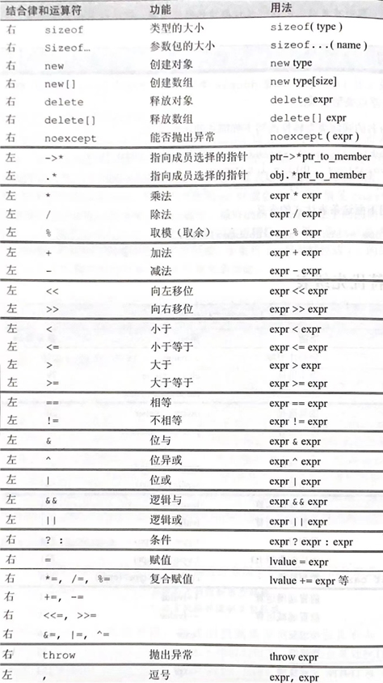

# C++概述

- C++之父、了解C++哲学、C++重要版本
- 理解C++组成: 面向过程、面向对象、泛型编程、函数式编程等
- 了解C++与其他语言区别 : 如无GC、RAII等
- 了解C++程序组成: main函数、头文件&源文件等
- 了解C++多文件编译时的注意事项: 头文件保护、namespace等
- 了解C++程序从文本文件到可执行文件的过程
  - 预处理、编译、汇编、链接 -> 运行
- 熟悉常用C++替换C风格的写法及其原因 : 宏、NULL等

## C++之父**Bjarne Stroustrup**


## #include

#include <headfile> 与 #include "headfile"

区别是若 #include "" 查找成功，则遮蔽 #include <> 所能找到的同名文件；否则再按照 #include <> 的方式查找文件。另外标准库头文件都放在 #include <> 所查找的位置。
一般来说 #include <> 的查找位置是标准库头文件所在目录， #include "" 的查找位置是当前源文件所在目录。

头文件使用#pragma once或#ifndef、#define、#endif进行头文件保护
使用预编译指令pragma once或预编译判断指令可防止头文件被重复包含，两者可一起使用。

## main函数

main函数须返回int值，不应返回空
main函数末尾无返回语句隐含return 0;
特殊场景下主函数名不为main，实际存在隐含main

## C++编译过程

1.删除所有注释
2.处理#define：宏展开并删除#define标记
3.处理#include：将被包含的文件插入到预编译指令#include位置，递归进行
4.处理#if、#ifdef、#elif、#endif等条件预编译指令
5.添加行号和文件名标识

## 命名空间namespace

不要将using namespace语句放入头文件中

# C++基础语法

- 内置类型: 大小端与平台关系、浮点数精度、算数隐式&显式转换
- 自定义类型 : 熟悉指针&引用、熟悉类&结构体、了解enum
- 变量: 熟悉名称要求、了解命名规范、熟悉重点关键字
- 字面值常量 : 了解典型字面值( 前后缀 ) 的类型
- 运算符:了解重点运算符( 运算符重载
- 函数: 熟悉不同参数传递的区别、了解函数调用开销
- 熟悉内联函数、函数重载、默认参数值，了解可能歧义
- 场景内存模型 : 熟练区分自由存储区( 堆)、自动存储区()、静态存储区

## 内置类型

### **大小端**

X86结构是小端模式，KeilC51为大端模式，ARM和DSP很多为小端模式

- 大端模式（Big-endian），是指数据的高字节保存在内存的低地址中，而数据的低字节保存在内存的高地址中，这样的存储模式有点儿类似于把数据当作字符串顺序处理：地址由小向大增加，而数据从高位往低位放；这和我们的阅读习惯一致。
- 小端模式（Little-endian），是指数据的高字节保存在内存的高地址中，而数据的低字节保存在内存的低地址中，这种存储模式将地址的高低和数据位权有效地结合起来，高地址部分权值高，低地址部分权值低。

### **浮点数精度**

| 数据类型 | 关键字      | 大小    | 范 围           | 有效数字 |
| -------- | ----------- | ------- | --------------- | -------- |
| 单精度   | float       | 32bit   | -2^128,2^128    | 7        |
| 双精度   | double      | 64bit   | -2^1024, 2^1024 | 16       |
| 高双精度 | long double | >=64bit |                 |          |

**禁止使用==判断两个浮点数相等**，应使用浮点数差距小于某个小阈值，例：
使用if (abs(f – 0.7) < 1e-8)替换if (f == 0.7) 进行判断

### 算数隐式

**整体规则就是低类型的转换成高类型**

- 字符类型需要先转换成成int类型（c语言中字符类型和整型之间可以通用）
- float类型需要转换成double类型
- 3short类型转换成int类型

| **转换类型**               | **问题**                                                     |
| -------------------------- | ------------------------------------------------------------ |
| 高精度浮点型转低精度浮点型 | 有效小数位数减少，整数部分可能超出表达范围，具体行为未定义   |
| 浮点数转整数               | 小数部分截断，如超出目标整数类型的表达范围，具体行为未定义   |
| 长整数转短整数             | 当数据超出目标类型范围后出现截断，只有低位数据被拷贝，高位数据舍弃 |

### 显式转换

```c++
int v = 1;
long v1 = (long)v;		// C语言显式转换
long v2 = long(v);		// C语言显式转换
```

除了上述转换方式，C++还提供了另外四个显式类型转换关键

- static_cast：任何有明确定义的类型转换(不包含const)，如**替代算数转换**
- const_cast：改变运算对象的底层const
- dynamic_cast：根据运行时类型识别进行转换
- reinterpret_cast：按位重新解释，一般被认为是风险较大的操作

## 自定义类型

### 指针

指针是指向另外一种类型的复合类型
指针本身是一个变量，变量中存储的是另一个变量的内存地址

&取地址操作符
*解引用操作符

### 引用

引用为对象起了一个别名
注意区分取地址运算符和引用定义用到的**&**符号这实际是C++对于内置运算符的重载。

引用本身不是一个对象，**不能**定义引用的引用
引用声明/定义的时候**必须初始化**绑定某个**变量**
引用**不能和字面值常量绑定**
引用**不能重新绑定**到初始化对象外的其他对象

### 类

**成员变量**一般在后加下划线 _ 或前加字符_
**成员函数**会用c的方式(以下划线分割)

C++中class和struct大括号要加分号
因为需要大量定义后就声明

无特殊理由，class的成员变量不设计为public访问

函数作为接口来读写可以继续在函数中实现一些功能（如给多线程加锁）

**成员函数可以直接访问成员变量**

**const**成员变量在初始化后不允许修改
**const**成员函数不允许修改一般成员变量
mutable修饰的变量在const成员函数中仍可被修改

class默认访问权限和继承时默认访问权限是private，struct为public	

### 结构体

C++中的**结构体与类没有实质区别**，两者唯一的差异是默认访问控制类型

### enum

```c++
enum <类型名> {<枚举常量表>};
```

默认状态下，这个整数就是所列举元素的序号，序号从0开始

## 变量

C++变量初始语法：

- C语言初始化语法
- 小括号参数初始化语法
- 列表初始化语法

**若没有定初值，变量被默认初始化：**

- 全局变量为0
- 局部变量不被初始化（函数存在在stack中，全局变量在data中）

extern关键字，从别的模块获得局部变量

## 字面值常量


## 运算符

**常用运算符**

- 算数运算符：+，-，*，/，%，++，--
- 关系运算符：==，!=，>，<，>=，<=
- 逻辑运算符：&&，||，!
- 位运算符：&，|，^，~，<<，>>
- 赋值运算符：=，+=，-=，*=，/=，%=，&=，|=，^=，<<=，>>=
- 其他运算符：?:，sizeof，逗号运算符




## 函数

### 内联函数

内联函数通过在函数定义前添加inline关键字实现
内联函数能够避免每次调用时的堆栈操作，加快执行速度，但会造成编译后的二进制文件增大

以下情况内联函数可能失效

- 函数体中包含循环
- 函数中包含静态变量
- 递归函数
- 函数中包含switch或goto关键字

### 引用参数

& 避免传参数据拷贝，修改后实参也会改变

左值 lvalue 能够取内存地址，不能被移动的值

右值 rvalue 表达式的中间结果，函数返回值

**const引用参数可以接受右值**，给函数传递右值参数后，编译器自动生成了一个临时左值变量作为函数参数额

左值引用&

右值引用&&

常值引用 const type&

**右值引用能够避免参数拷贝，提高执行效率**
std::move()将左值转换为右值

### 函数默认参数

必须全部设为默认参数

只允许在声明中出现

必须从左往右写，不允许跳过

### 函数重载

静态多态性的体现

慎用，可以尝试自定义数据结构作为函数参数，避免定义多种重载函数

### 函数的内存模型

栈帧是指为一个函数调用单独分配的那部分栈空间

ebp帧指针指向底部
esp栈指针指向顶部

## 场景内存模型

### 自由存储区（堆）

 堆，编译器不用去管，可以使用new和malloc来申请内存，但必须在不使用的时候使用delete和free释放掉。

### 自动存储区（栈）

栈中存放着局部变量，函数参数，局部常量。

### 静态存储区

主要存储全局静态变量，局部静态变量，全局变量，以及虚函数表，没错，你没听错，就是虚函数表。

### 常量存储区

全局常量，函数指针，常量数组，对函数指针

### 代码区

存放代码，只读

# C++面向对象

- 掌握访问限定符在类内及继承关系间的权限控制
- 理解类的静态成员与非静态成员的差异、理解this指针与const修饰符
- 熟练实现**类的六类特殊成员函数** + 与封装、继承、多态结合
- 掌握特殊成员函数参数类型、拷贝赋值函数自赋值的处理、了解右值
- 掌握类的初始化顺序: 初始值列表、类内初始值、构造函数 + 特殊成员、继承结合
- 理解隐式类型转换的发生与禁止方式
- 熟练实现典型运算符重载、理解运算符重载的限定条件与实现方式
- 了解友元函数与友元类
- 理解深拷贝与浅拷贝的区别、了解三/五/零法则
- 掌握公有继承下的权限控制、成员隐藏与覆盖
- 了解继承关系下的内存结构，掌握共有继承下构造、析构顺序
- 理解引用兼容性和继承类之间的类型转换
- 了解多态的实现原理，了解静态类型、动态类型、静态绑定与动态绑定
- 理解多态的使用成本，掌握多态使用场景与正确用法( 合理使用关键字)
- 了解纯虚函数与虚基类的关系与使用
- 理解多继承情况下菱形继承产生的问题，掌握虚继承的实现方法
- 了解组合、私有继承、保护继承的使用场景与建议

## 访问限定符在类内及继承关系间的权限控制

- public：可以被该类中的函数、子类的函数、友元函数访问，也可以由该类的对象访问；
- protected：可以被该类中的函数、子类的函数、友元函数访问，但不可以由该类的对象访问；
- private：可以被该类中的函数、友元函数访问，但不可以由子类的函数、该类的对象、访问。

## 静态成员与非静态成员

由static关键字修饰的成员变量或成员函数称为类的静态成员
静态成员属于类型本身，而不属于类的某个特定对象实例(所有类的对象共有)
静态成员变量需要定义（const特例），定义时无需static关键字
静态成员函数不能访问非静态成员
静态成员变量不由构造函数创建，也无法通过析构函数销毁
静态成员变量的生命周期和程序一致，不随单个对象实例创建或销毁而变化
静态成员变量允许出现不完整类型（incomplete type）

## this指针

普通成员函数可以通过this关键字获取当前对象的指针
主要应用场景：

- 避免同名变量歧义
- 返回对象指针支持链式调用
- 模板类继承访问成员变量

## const与mutable修饰符

可使用const修饰成员变量或成员函数
const成员变量在初始化后不允许修改
const成员函数不允许修改一般成员变量
const静态变量可以作为成员函数的默认参数
使用const static成员变量定义一些类内使用的常量（替代#define）
由mutable修饰的变量在const成员函数中仍可被修改

## 六类特殊成员函数

### 构造函数

与类名相同，无返回值，对象实例化时调用，初始化类内成员变量，参与隐式类型转换，支持默认参数，支持重载

当类不存在默认构造函数时，或者希望指定每个元素的构造参数，可用列表初始化方式：

```c++
People plist[4] = {
      People(“mike”, 21),
      People(“Joe”, 22),
      People(“john”, 19),
      People(“hank”, 18)
}
```

默认构造函数

- 当class中没有声明任何构造函数时，编译器自动生成无参数的默认构造函数；
- 当class中声明构造函数时，编译器不会自动添加默认构造函数

必须使用初始值列表的应用场景：

- **const成员变量初始化**
- **引用成员变量初始化**
- 对象成员变量初始化

### 析构函数

~类名无返回值，不接受任何参数，对象销毁时自动调用，释放内存等资源

RAII(Resource Acquisition Is Initialization)：获得资源同时立即放进管理对象中，最常见的方式就是在构造函数中处理资源获取及检查工作。

### 拷贝构造函数

拷贝构造函数是以同类型对象为参数，生成一个新对象的构造函数

```c++
StringBad::StringBad(const char* s) {
     len_ = std::strlen(s);
     str_ = new char[len_ + 1];
     std::strcpy(str_, s);
     ++counter;
}
```

调用场景：

- 当需要用一个已有同类对象初始化新对象时
- 当函数参数为自定义类型的值传递时
- 某些情况下编译器会生成临时变量，也可能触发拷贝构造

默认构造函数：

- 逐个拷贝类中的每一个非static成员变量
- 如果成员变量中存在自定义类型，则调用该自定义类型的拷贝构造函数
- 这种拷贝方式被称为浅拷贝（调用默认拷贝构造函数发生浅拷贝时，仅拷贝对象中成员函数的指针，而不会拷贝指针指向的内容）

**浅拷贝会造成指针悬挂**

自定义拷贝构造函数，引入**深拷贝**机制

```c++
StringBad::StringBad(const StringBad& s) {
     ++counter；
     len_ = s.len_;
     str_ = new char[s.len_ + 1];
     strcpy(str_, s.str_);
}
```

**拷贝构造函数参数不可以是值类型**，会造成无限递归

### 拷贝赋值函数

当开发者未重载赋值操作符时，编译器自动生成默认赋值操作函数，默认赋值操作函数具有如下特性：

- 对类内的所有**非静态**成员变量逐一进行赋值操作
- 如果成员变量为指针，只拷贝指针本身，不拷贝指针指向的内容
- 如果成员包含自定义类型，则调用该类型的赋值操作函数

与默认拷贝构造函数类似，默认赋值操作函数也属于**浅拷贝**，可能会造成**指针悬挂**等问题

重载赋值操作符的方式和自定义拷贝构造函数的方式类似，都需要重新申请内存已经拷贝指针指向的内容。主要区别在于

- **重载赋值操作符需要释放原有内存**，否则会出现内存泄漏
- 返回自身引用

```c++
StringBad& StringBad::operator=(const StringBad& s)  {
      if (this == &s) { return *this; }   // 证同测试，防止自赋值导致问题
      len_ = s.len_;
      delete[] str_;		              	// 先释放原有内存
      this.str_ = new char[s.len_ + 1];	// 重新申请内存
      strcpy(this.str_, s.str_);		// 拷贝指针指向的内容
      return *this;			             // 返回自身引用
}
```

还可以使用copy-and-swap策略，传值调用拷贝构造函数，交换指针，资源释放交给析构处理

### 移动构造函数

移动构造函数实现移动语义，直接将对象资源控制权进行转移

注意：**移动后需保证来源对象可以正常析构**

```c++
StringBad::StringBad(StringBad&& s) : len_(s.len_), str_(s.str_) {
     s.str_ = nullptr;	// 移动操作不析构s，s对应对象仍可赋新值
};
```

### 移动赋值函数

移动赋值函数直接接管对象资源控制权

注意点：赋值注意事项(返回引用、处理自赋值) + 移动注意事项(源对象可析构)

```c++
StringBad& StringBad::operator=(StringBad&& s) {
     if (this == &s) { return *this; }   // 处理自赋值
     len_ = s.len_;
     delete[] str_;		              // 先释放原有内存
     str_ = s.str_;	                           // 接管s资源
     s.str_ = nullptr;
     return *this;			// 返回自身引用
};
```

## 左值与右值

- 左值持久，右值短暂
- 变量是左值
- 函数的非引用返回值为右值
- 右值意味着对象将要被销毁
- 右值意味着对象没有其他用户
- 右值引用&&
- 左值常引用/右值引用可绑右值
- 可自由接管右值引用的资源(移动)
- 标准库std::move函数可将左值显式转换为对应的右值引用类型

```c++
int i = 42;	
int& r = i;		// 正确 
int&& rr = i;		// 错误
int& r2 = i * 42;		// 错误
const int& r3 = i * 42; 	// 正确
int&& rr2 = i * 42;		// 正确
int&& rr3 = 42;		// 正确
int&& rr4 = rr3;		// 错误

int&& rr5 = std::move(rr3);   // 正确
```

## 类的初始化顺序

1. 基类的静态变量或全局变量
2. 派生类的静态变量或全局变量
3. 基类的成员变量
4. 派生类的成员变量

## 隐式类型转换的发生与禁止方式

通常以下四种情况会触发隐式类型转换：

- 赋值操作时，左值和右值类型不同时，右值隐式转换成左值类型
- 多元运算表达式的多个操作数类型不同时，计算前隐式类型转换
- 函数形参实参类型不同时，实参隐式转换成形参类型
- 函数返回值类型和return参数不同时，return参数转换成返回类型

C++允许将自定义类型转换成**内置类型**或者**其他自定义类型**，前提是这种类型转换是合理的
用户可以通过**重载类型转换运算符（type conversion operator）**或**自定义构造函数(constructor)**实现这种转换

**explicit关键字**是用来防止由构造函数定义的隐式转换。
explicit关键字只能用于类内部的构造函数声明上，而不能用在类外部的函数定义上

## 运算符重载

运算符重载本质上是**函数重载**的一种特例
运算符重载是C++多态性的一种体现
运算符重载可以使代码更清晰易读

### 限定条件

以下运算符是不可重载的


重载运算符必须至少有一个操作数（operand）是自定义类型，不允许重载C++内置类型的运算符
重载运算符不能改变运算符的使用方式，e.g. 二元运算符不能重载成一元
只能重载C++中已有的运算符，不能自定义新运算符

### 运算符重载的两种方式

#### 成员函数重载

```c++
// 成员函数重载
class Cargo {
public:
  Cargo(int c, int  b, int m)
  : car_(c), bike_(b), motor(m) {}
  Cargo operator+(const Cargo& c) const;
private:
  int car_;
  int bike_;
  int motor_;
};
```

#### 非成员函数重载（友元函数）

成员函数与非成员函数的运算符重载使用方式一致，通常开发者可以自由选择，编译器会自动选择调用方式：
T1 = T2 + T3;
编译器翻译为：
T1 = T2.operator+(T3);
或者：
T1 = operator+(T1, T2);

注意：成员函数和非成员函数的运算符重载只能实现**一种**，如果两者都实现编译时会出现歧义

**只能用成员函数重载（=,(), [], ->）**
**只能用非成员函数方式重载（流操作符 <<, >>）**

**常用的运算符重载场景：**

- 自定义容器类根据下标访问元素
  operator[](…)
- 仿函数（functor）
  operator()(…)

```c++
Cargo operator+(const Cargo& c1, const Cargo& c2) {
  Cargo ret(0, 0, 0);
  ret.car_ = c1.car_ + c2.car_;
  ret.bike_ = c1.bike_ + c2.bike_;
  ret.motor_ = c1.motor_ + c2.motor_;
  return ret;
}

ostream& operator<<(ostream& out, Cargo& c) {
  out << “car: “ << c.car_ << “ bike: “ <<c.bike_ << “ motor: “ << c.motor_;
  return out;
}

istream& operator>>(istream& in, Cargo& c) {
  in >> c.car_ >> c.bike_ >> c.motor_;
  return in;
}
```

## 友元

在某些场景下需要从外部访问类的私有/保护成员，这时我们需要用到友元（关键字friend）

### 友元函数

友元函数不是类的成员函数，而是一个独立于类的外部函数。能够通过友元函数访问类中的所有成员变量和成员函数。
鉴于友元函数不属于任何一个对象，所以友元函数无法访问this指针
友元函数在类内声明，并且不受访问限定符的影响（永远是public的）
友元函数的参数中通常包含当前对象（指针、引用）

### 友元类

C++允许将一个类声明成目标类的友元，该类的成员函数将可以访问目标类的所有成员
友元类的关系的单向的
友元类的关系不具备传递性
友元关系不能被继承

友元的常见用法
单元测试
降低代码复杂度
运算符重载
友元工厂

## 深拷贝与浅拷贝

什么情况下需要**深拷贝**？（什么情况下需要定义拷贝构造函数和拷贝赋值函数）

- 三/五/零法则：需要自定义析构函数的类通常也需要拷贝构造和拷贝赋值
- 成员变量包含指针类型时
- 成员变量包含引用其他成员变量的引用类型时

**三/五/零法则**当定义一个类时，我们显式地或隐式地指定了此类型的对象在拷贝、赋值和销毁时做什么。一个类通过定义三种特殊的成员函数来控制这些操作：**拷贝构造函数**、**拷贝赋值运算符**和**析构函数**。

拷贝构造函数定义了当用同类型的另一个对象初始化新对象时做什么，拷贝赋值运算符定义了将一个对象赋予同类型的另一个对象时做什么，析构函数定义了此类型的对象销毁时做什么。我们将这些操作称为**拷贝控制操作**。

> 　　由于拷贝控制操作是由三个特殊的成员函数来完成的，所以我们称此为“C++三法则”。在较新的 C++11 标准中，为了支持移动语义，
> 　　又增加了移动构造函数和移动赋值运算符，这样共有五个特殊的成员函数，所以又称为“C++五法则”。
> 　　也就是说，“三法则”是针对较旧的 C++89 标准说的，“五法则”是针对较新的 C++11 标准说的。
> 　　为了统一称呼，后来人们把它叫做“C++ 三/五法则”。

## 公有继承关系下的权限控制、成员隐藏与覆盖

### 权限控制

派生类可以直接访问基类中的public和protected成员
外部使用派生类时，成员的可见性取决于派生类和基类的访问限定符以及派生类的派生限定方式（public/private/protected）

- 若继承方式是public，基类成员在派生类中的访问权限保持不变，也就是说，基类中的成员访问权限，在派生类中仍然保持原来的访问权限；
- 若继承方式是private，基类所有成员在派生类中的访问权限都会变为私有(private)权限；
- 若继承方式是protected，基类的共有成员和保护成员在派生类中的访问权限都会变为保护(protected)权限，私有成员在派生类中的访问权限仍然是私有(private)权限。

### 成员隐藏与覆盖

如果有需求，可以重写（覆盖 override）基类成员函数
通常不推荐覆盖成员函数，而是通过虚函数实现
成员变量覆盖的应用场景极少，不推荐这样做

## 继承关系的内存结构，继承下构造、析构顺序


## 构造


### 析构

- **派生对象的销毁过程与创建正好相反**：先销毁派生类新添加的成员，再销毁基类的成员
- 派生对象析构时先调用派生类的析构函数，再自动调用基类的析构函数，无需人工干预
- 派生类的析构函数只需要释放派生类新增的资源，基类申请的资源由基类的析构函数自动释放

## 引用兼容性和继承类之间的类型转换

派生类的地址能够赋值给指向基类的指针
派生类能够初始化基类类型的引用

基类类型的指针只能访问基类的成员变量，并且只能调用基类的成员函数

我们把这种特性称为基类和派生类的**引用兼容性**
引用兼容性是**单向的**，派生类型的指针或者引用不允许指向基类对象
引用兼容性**只对公有继承有效**，私有继承和保护继承是无效的

## 多态

调用相同的函数，根据对象类型的不同产生不同的行为

公有继承实现多态性的三个条件：
在派生类中重新定义需要实现多态性的成员函数
将这些实现多态性的函数定义为**虚函数**（virtual）
使用**基类**的**指针**或者**引用**调用这些虚函数

```c++
class Car {
private:
    …
public:
      void PrintSpecs() { cout<<“Car”};
};
class SUV : public Car {
private:
      int color;
public:
      void PrintSpecs()  { cout<<“SUV”};	// 覆盖
      void RepaintSUV(int c)  {color=c};
};
```

### 静态多态

编译时多态，包含函数重载、模板

### 动态多态

运行时多态，公有继承和虚函数

### 静态绑定

绑定：将标识符（变量或者函数名称）转换为地址的过程

编译期绑定，编译器直接将符号和地址关联起来，程序的执行路径在编译期间是决定好的

### 动态绑定

运行时多态，编译器添加在运行时识别对象类型的代码，然后根据对象的真实类型选择需要执行的函数

通过**虚函数**实现，**virtual关键字**

```c++
class Car {
private:
      …
public:
      virtual void PrintSpecs() { std::cout<<“Car”; }
};
class SUV : public Car {
private:
      int color;
public:
      virtual void PrintSpecs()  { std::cout<<“SUV”; }
      void RepaintSUV(int c)  {color=c};
};
```

C++编译器通过虚函数表实现动态绑定
编译器为每一个包含虚函数的类生成一个虚函数表(virtual table)
虚函数表中存放着该类的虚函数地址，不包含非虚函数地址
虚函数类的每个对象都包含一个指向虚函数表的指针**_vptr**
函数调用时通过**_vptr**找到虚表后根据函数签名调用函数
编译器会根据派生类是否重写基类的虚函数为派生类生成虚函数表

虚函数表指针_vptr也属于基类部分，所以通过基类指针调用虚成员函数时，依然会根据对象本身的虚函数表获取派生类的函数地址

## 多态的使用成本，多态使用场景与正确用法

### 使用成本

虚函数对内存的占用大

### 使用场景

向上类型转换（upcasting）和向下类型转换（downcasting）：
公有继承表征is-a关系（派生类是一种基类），向上类型转换是合理的
继承的is-a关系是单向的，所以无法将派生类对象赋值给基类的指针或引用（向下类型转换，downcasting）

**向上类型转换**（upcasting）的使用场景：
将基类指针（引用）作为函数形参，统一函数接口
用存放指针的容器（数组）存放不同派生类实例

**向上类型转换**（upcasting）的使用限制：
基类指针（引用）只能访问基类的成员变量，调用基类的成员函数
当基类同名函数在派生类被覆盖时，基类指针（引用）仍然只能调用基类的函数版本

## 纯虚函数与虚基类

C++依靠公有继承实现了两种相互耦合的功能：
代码复用与多态性

在很多场景中，我们只需要利用其中一种特性：
当只需要代码复用功能时，可以利用私有继承和保护继承
当只需要多态性时，我们利用C++中的纯虚函数

C++允许基类中的虚函数只有声明而无需定义函数逻辑，**纯虚函数**的声明方式为在函数末尾添加 = 0：

包含纯虚函数的类被称为**虚基类**（Abstruct Class），虚基类只能作为抽象接口（类似interface）使用，无法实例化对象

## 菱形继承

容易产生bug，大多数情况都是冗余的

## 组合、私有继承、保护继承的使用场景与建议

### 组合

一个类包含另一个类对象
继承是一种is-a的关系。也就是说**每个子类对象都是一个基类对象**；
组合是一种has-a的关系。假设B组合了A，**每个B对象中都有一个A对象**(一个对象里套了另外一个对象)

### 私有继承

私有继承时，基类的公有成员和保护成员都被派生类继承下来之后变成私有成员，派生类的新增成员可以访问基类的公有成员和保护成员，但是访问不了基类的私有成员。派生类的对象不能访问派生类继承基类的公有成员，保护成员和私有成员。

### 保护继承

保护继承中，基类的公有成员和保护成员被派生类继承后变成保护成员，派生类的新增成员可以访问基类的公有成员和保护成员，但是访问不了基类的私有成员。派生类的对象不能访问派生类继承基类的公有成员，保护成员和私有成员。

# C++泛型编程

- 掌握模板函数/类实现语法，理解模板与重载的关系及优先级
- 理解模板实例化过程，了解多文件场景下模板的使用方式
- 理解模板特化的应用场景，掌握函数模板特化的实现方式
- 了解模板偏特化概念、与模板特化的异同
- 了解模板使用默认参数的方法与可能产生的问题

# C++基础库与其他

- 掌握IO库、std::string、std::vector的基本使用方式
- 了解STL各组件及相互关系
- 了解STL使用迭代器、仿函数的原因与典型使用场景
- 掌握cin、cout、fstream对象特点与使用方法
- 了解读写文件操作方式与异同、了解fstream对象内部状态表示方法
- 掌握异常使用方式、理解异常栈展开与异常捕获过程
- 了解C++异常的使用场景与原因

# 重点程序代码

- 掌握包含资源分配(动态内存等)分配的类的特殊函数实现
- 掌握支持多态使用场景的继承类正确实现方式与使用方法
- 掌握模板函数、模板类的实现方式与( 偏)特化方法
- 掌握通过合理设置函数参数与返回值类型实现高效、安全的函数
- 了解运用封装特性实现特定访问方式的类方法
- 了解std::vector、std::string、文件读写基础使用方式

# 概念辨析

- 声明 vs 定义
- 初始化/构造 vs 赋值
- 隐藏 vs 覆盖
- 静态多态 vs 动态多态
- 函数重载 vs 模板函数

# 重点关键字、运算符及特殊值

- 熟悉const、 static、friend、inline、 explicit、 this、 auto
- 了解mutable、typename、 extern、 override、final
- 熟悉new、delete
- 了解sizeof、static cast/const cast/dynamic_cast/reinterpret_cast
- 熟悉nullptr

