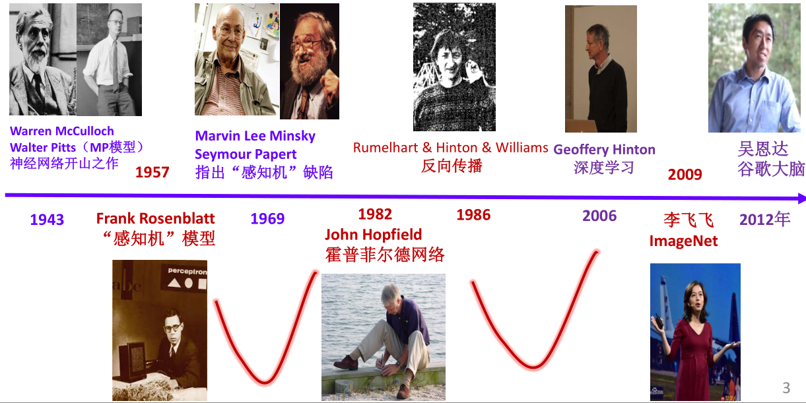

[TOC]

# 1.人工智能概述

## 1.人工智能的萌芽与诞生

### 1.人工智能的萌芽

**1936** 图灵提出**图灵机** 奠定理论基础
**1940-1942** 爱荷华州立大学J.V.Atanasoff和C.Berry装配**第一台电子计算机** 命名为ABC
**1943** 美国神经生理学家沃伦·麦卡洛奇(W.McCulloch)与数理逻辑学家沃尔特·皮茨 (W.Pitts) 提出了 **人工神经元**的概念。建立了第一个 **神经网络模型**(M-P模型)
**1950** 图灵提出“图灵测试” **2000** 图灵预言能够蒙骗30%的人 **2014** 尤金欺骗30%的测试者
**1966** ACM设立图灵奖

### 2.人工智能的诞生

**1956** “达特茅斯夏季人工智能研究计划”会议，是被广泛公认的 **人工智能诞生地**。 麦卡锡被称为**人工智能之父**

马文 文• 明斯基（Marvin Lee Minsky）1927-2016
**人工智能之父**
**1975** 首创**框架理论** （知识表示的一种方法）
**1969** 首位获得 **图灵奖** 的人工智能学者

约翰 翰• 麦卡锡（John McCarthy）
1927-2011
• 人工智能之父
• **首次提出 “人工智能”的概念**
• LISP 语言的发明者
• Won **Turing Award** in **1971**

赫伯特• 西蒙（Herbert A. Simon ，1916-2001）
 符号主义学派的创始人
 爱好广泛的全能科学家
 **1975**年,与他的博士Newell共同获得图灵奖Ph.D student.
 **1978**年，获得诺贝尔经济学奖
 中国科学院外籍院士

艾伦 伦• 纽厄尔（Allen Newell）（1927 — 1992 ）
 符号主义学派的创始人之一
 西蒙的学生与同事
 1975年与西蒙同获图灵奖

2019年3月27日，ACM宣布，深度学习的三位创造者Yoshua Bengio（深度学习鼻祖）, Yann LeCun（卷积神经网络之父）, 以及Geoffrey Hinton 获得了2018 年的图灵奖。

## 2.人工智能的定义

人工智能 是研究开发能够模拟、延伸和扩展人类智能的理论、方法 、技术及应用系统的一门新的技术科学 。

 **弱人工智能** ( weak artificial intelligence)是能够完成某一特定领域中某种特定具体任务的人工智能。
 **强人工智能** ( strong artificial intelligence)也称为 通用人工智能 ，是具备与人类同等智慧，或超越人类的人工智能，能表现正常人类所具有的所有智能行为。

## 3.人工智能的发展简史

（1） 1930s-1956：AI的孕育期
（2） 1956年：人工智能诞生
（3 ）1956- 1960s中期： 通用方法 时代 （黄金期）
（4） 1960 年代中期-1970 年代初 ： 第一个 寒冬 期
（5） 1970 年代初-1980 年代末 ： 专家系统与知识工程时代 （繁荣期）
（6） 1980 年代末-1997 ： 第二个寒冬期
（7） 1997-2011：AI的复苏期
（8） 2012至今：AI的蓬勃发展期

## 4.人工智能的流派

符号主义和连接主义研究流派，在 人工智能发展的 的60-70 年中，此消彼长，轮流占上风 。目前， **连接主义是业界关注的焦点**。

### 1.符号主义

符号 主义是一种基于逻辑推理的智能模拟方法，源于数学逻辑。它认为：人工智能本质是 知识符号化，只要将世界知识转换为某种符号系统，智能机器就可以根据该符号体系，解决真实世界的问题。其 成果有 ：机器定理证明、专家系统、启发式搜索算法

### 2.连接主义

连接主义源于仿生学，特别是人脑模型的研究。它认为，大脑是智能产生的根源，因此实现人工智能应该研究大脑的结构、信息处理机制、运行方式，然后在机器上 模拟人类大脑，实现人工智能。这就是现在阶段主流的人工神经网络方法。

### 3.行为主义

行为主义(actionism),又称为进化主义(evolutionism)或控制论学派(cyberneticsism) 。该学派的理论基础是控制论，其核心思想是基于控制论构建感知-动作型控制系统。

 行为主义学派认为：智能行为是在现实世界中与**周围环境交互**而获得并表现出来的，人工智能可以像人类的智能一样逐步进化，所以称为进化主义。
 行为主义还认为智能取决于感知和动作，无需知识、表示和推理，只需要表现出智能行为即可， **强化学习**就属于这一流派。

## 5.人工智能研究的基本内容

### 1.知识表示

 符号 表示法：用各种包含具体含义的符号，以各种不同的方式和顺序组合起来表示知识的一类方法。例如，一阶逻辑、 产生式等。
 连接机制 表示法：把各种物理对象以不同的方式及顺序连接起来，并在其间互相传递及加工各种包含具体意义的信息，以此来表示相关的概念及知识。例如，神经网络等。

### 2.机器感知

是使计算机系统模拟人类通过其感官与周围世界联系的方式具有解释和理解外部信息的能力。以机器 视觉与机器 听觉为主。

### 3.机器思维

又称为计算机思维（Computer Thinking），就是研究如何使机器或计算机能像人类一样进行思维活动，自主处理通过感知获得的外部信息和机器内部的各种工作信息，更通俗地说，就是要研制会自主思考的机器 。

### 4.机器学习

 人类是通过学习具有智能的，计算机若要具有真正的智能，也必须像人类那样学习。
 机器学习：研究如何使计算机具有类似于人的学习能力，使它能通过学习自动地获取知识。

### 5.机器行为

 指机器具有人工智能的行为，或者说，机器能模拟、延伸与扩展人的行为。

## 6.人工智能的主要研究领域

1. 深度 学习
2. 自然语言理解
3. 计算机视觉
4. 智能机器人
5. 自动程序设计
6. 数据挖掘与知识发现

# 2.知识表示与知识图谱

## 1.知识的概述

知识是智能的基础。

### 1.知识的定义

至今，对于知识还没有一个统一而明确的界定。比较有代表性的定义如下：
（1） 费根鲍姆（Feigenbaum）说：知识是经过裁剪塑造、解释、选择和转换了的信息。
（2） 伯恩斯坦（Bernstein）说：知识由特定领域的描述、关系和过程组成。
（3） 海叶斯—罗斯（Heyes-Roth）说：知识=事实+信念+启发式。
总之， **知识**是人类在长期的生活、社会实践及科学实验中经过总结、提升与凝练的对客观世界（包括人类自身）的认识和经验，也包括对事实和信息的描述或在教育和实践中获得的技能。

### 2.知识的特性

相对正确性 与 不确定性

### 3.知识的分类

（1） **陈述性知识**（descriptive knowledge，或描述性知识），是表示对象及概念的特征及其相互关系的知识，以及问题求解状况的知识，它描述的是“做什么”的知识，即一般性事实，故也称为 事实性 知识 ，是 显式表示的。如：“煤是黑色的”，“北京是中国的首都”。事实性知识是用符号代表概念、命题与原理，是相对 静态的。
（2） **过程性知识** （procedural knowledge，或程序性知识） 表示的是问题求解控制策略，描述的是“如何做”的知识，即做某件事的过程。过程式知识一般利用算法进行描述， 用一段计算机程序来实现。这种知识是 隐含在程序中的，是相对 动态的。

## 2.知识表示的方法

知识表示 （knowledge representation） 就是将人类知识符号化并输入给计算机的过程和方法。

知识表示可以是一种 符号描述 、是 某种约定，也可以是某种 数据结构。
知识表示方法的分类与知识的分类是紧密相关的。知识分为两类：陈述性知识和过程性知识。
从知识的运用角度，可将知识表示方法粗略地分为以下两大类：

### 1.陈述式知识表示

用于描述陈述性知识，即描述“是什么”，而不用描述“怎么做”。 静态描述 显式表达

知识的表示和知识的运用一般是分开的

**优点**：

- **可理解性好**，表示形式简洁、清晰、易懂；
- **易于修改**，一个小的改变不会影响全局，不会引起大的改变；
- **可独立使用**，这种知识表示出来后，可用于不同目的；
- **易于扩充**，这种知识模块性好，扩充后对原有模块没有影响。

**缺点**：将知识与控制分开，求解问题的执行效率低。

### 2.过程式知识表示

过程就是事实的一些客观规律。过程式知识表示方法表达的是如何求解问题， **知识的表示形式就是程序**。

动态过程 隐式表达 在采用过程式知识表示方法描述知识的系统中， 知识的表示和知识的运用一般是不分开的，表示就寓于运用之中，它适合于知识表示与求解结合非常紧密的这一类问题。

优点：

- **执行效率高。**
  知识是用程序表示的，知识库与推理机完全合为一体，即知识与控制融合在一起。

缺点：

- **可理解性较差**，采用隐式表达形式，形式复杂、不直观，不易理解；
- **不易于扩充**，这种知识模块性差，难以添加新知识和扩充新的功能；
- **不易于修改**，想要修改现有知识而不影响其他知识的完整性，比较困难，容易出错。

连接主义只有神经网络

## 3.产生式表示法

“ 产生式（production）” 意思是能够根据已知条件产生新知识的式子。
这些式子往往以规则的形式描述知识，因此 产生式也称作“ 产生式规则”；
产生式表示法也称为 产生式规则表示 法。
它属于 **符号主义流派**的知识表示方法。

产生式表示方法通常用于表示 事实、 规则以及它们的 不确定性度量。
有许多知识本身就是事实描述性的， 事实可看成是一个对象的某属性的值或是多个对象之间关系的陈述句。
事实又分为**确定性事实**和 **不确定性事实**。

### 1.产生式

#### 1.确定性事实的产生式表示

确定性事实一般采用三元组表示，有两种形式：
 属性型事实知识：描述一个对象的某种属性，形式为 (对象，属性，值)
	如，“李丽的年龄是30岁”表示为 （李丽，年龄，30）
 关系型事实知识：描述两个对象之间的关系，形式为（对象1，对象2，关系）
	如，“李丽和王军是朋友”表示为（李丽，王军，朋友），此处，关系就是一个词，而不是数字。

#### 2.不确定事实的产生式表示

不确定性事实可以用一个不确定度量值（∈（0，1））表示其不确定程度，即置信度或可信度，一般采用四元组表示，也有两种形式：
 属性 型事实知识：描述一个对象的某种属性，形式为（对象，属性，值，置信度）
	如，“李丽的年龄很可能是30岁”表示为 （李丽，年龄，30，0.85），此处，置信度0.85表示“很可能”。
 关系型 事实知识：描述两个对象之间的关系，形式为（对象1，对象2，关系，置信度）
	例如，“李丽和王军不太可能是朋友”表示为（李丽，王军，朋友，0.15），此处，置信度0.15表示“不太可能”。

除了描述事实，产生式还可以描述规则，规则用于表示有关问题领域中事物之间的因果关系，在产生式表示法中**将规则作为知识的单位**。
规则可分为 **确定性规则**和 **不确定性规则**

#### 3.确定性规则的产生式表示

确定性规则的产生式表示的基本形式是
IF condition THEN action 或者 condition → action
其中condition称为 条件或 前件或 前提，action 称为 动作或 后件或 结论。
语义含义是：如果condition所表示的条件被满足，则可得到action所表示的结论或者执行action所表示的动作，即action是由condition来触发的。例如，有如下规则：

- 如果下雨，则出门带伞；
- 小刚很聪明∧小刚学习很勤奋→小刚的学习成绩很好；

#### 4.不确定性规则的产生式表示

若规则是不确定的，则需增加置信度的度量值。不确定性规则的产生式表示的基本形式是
IF condition THEN action （置信度）或者 condition → action (置信度)
例如，有一条产生式为： 发烧呕吐∧出现黄疸→肝炎（0.7）

### 2.产生式系统

一个产生式系统的基本结构由 **规则库**（production rules base）、 **综合数据库**（global
database）和 **控制系统** （control system）三部分组成.
**综合数据库**和**规则库**共同组成了 **知识库**；
**控制系统**又称为 **推理机**，包括 **控制程序**和 **推理程序**两部分。

1. **综合数据库**
综合数据库又称为 **事实库**，是产生式系统所使用的主要数据结构，其中存放问题的初始状态、输入的已知事实、推理过程中得到的中间结果及最终结论等信息。
2. **规则库**
在产生式系统中，用产生式规则描述与所求解问题相关的领域知识，规则库就是所有这些 **产生式规则的集合**，其中包含了将问题从初始状态转换成目标状态所需的所有规则。
3. **推理机**
推理机是一组 **规则解释程序**，包括控制策略和推理方式。推理机协同规则库与综合数据库，控制问题求解过程的推理路线，负责整个产生式系统的运行，实现对问题的求解。

### 3.产生式表示法的特点

产生式表示法的 **主要优点**
(1)格式单一，计算简单。
(2)模块性，便于知识的操作和管理。
(3)形式自然，便于理解、推理和解释。
(4)表达较全面，应用广泛。

产生式表示法的 **主要缺点**
(1)求解效率不高。
(2)无法表示具有结构关系的知识。

## 4.状态空间表示法

**状态空间** （state space）表示法是人工智能中最基本的形式化方法，是其他形式化方法和问题求解技术的出发点。
**状态**（state）就是用来描述在问题求解过程中某一个时刻进展情况等**陈述性知识**的一组变量或数组，是某种结构的符号或数据。

状态（state）是一组变量q0，q1，q2，…，qn的有序集合，其形式如下： Q={ q0，q1，q2，…，qn }其中，每个元素qi 称为一个状态变量。
状态的表示还可以根据具体应用，采取合适的数据结构，如符号、字符串、多维数组、树和图等。

**操作**也称为 **运算**，用来表示引起状态变化的 **过程性知识**的一组关系或函数，它会引起状态中的某些分量发生改变，从而使问题由一个具体状态转换到另一个具体状态。
操作可以是一个动作（如棋子的移动）、过程、规则、数学算子等，表示状态之间存在的关系。
用于表示操作的符号，称为 **操作符**（operator）或 **操作算子**、 **运算符**。
**状态空间**是采用状态变量和操作符号表示系统或问题的有关知识的符号体系。

问题的状态空间是一个表示该问题全部可能状态及其相互关系的集合，
常用一个 **四元组**（S,O,S0 ,G）来表示，其中:

- S 为问题的状态集合；
- O 为操作符的集合；
- S0 是问题的初始状态，是S的一个非空真子集，即S 0 ⊂ S；
- G 为问题的目标状态，它既可以是若干具体状态，也可以是满足某些性质的路径信息描述，G ⊂ S。

状态空间通常用 **有向图**来表示，其中， **结点**表示问题的**状态**，结点之间的 **有向边**表示引起状态变换的**操作**，有时边上还赋有**权值**，表示变换所需的**代价**。
在状态空间中，求解一个问题就是从初始状态出发，不断运用可使用的操作，在满足约束的条件下达到目标状态。
**问题的解**可能是图中的一个状态，也可能是从初始状态到某个目标状态的一条路径，还可能是达到目标所花费的代价。
下图中， **问题的解**便是一条从结点 S 0 到结点 G 的路径，它是一个从初始状态到目标状态的有限的操作算子序列{O 1 ，O 2 ，…O k }，称为**求解路径**。**问题的解往往并不唯一**。

#### 例2.1 八数码问题

#### 例2.2 旅行商问题

对于大规模的问题，例如旅行商问题中有100个城市，要在有限时间内画出其全部状态空间图，是不可能的。
对于 **简单问题**，可以采用有向图 **直接画出状态空间**。
对于大多数 **复杂的问题**，是根本 **无法完全画出其状态空间**的，此时只需清晰定义状态变换的方式即可，也可以建模。

## 5.知识图谱

**符号主义知识表示方法**经过历代人工智能科研人员的不断完善， **演变为知识图谱**这一符合互联网时代新需求的知识表示方法。
知识图谱是一种用图结构来描述知识及其之间关联关系的技术方法，旨在利用知识工程理论建立大规模知识资源，**是语义Web技术在互联网大数据时代的成功应用**。
**知识图谱**（Knowledge Graph）又称为 **科学知识图谱**，知识图谱这一名词是谷歌公司于2012年5月17日首先提出的，其 **初衷**是为了提高搜索引擎的能力，改善用户的搜索质量以及搜索体验， **目标**是构建一个可提供智能搜索服务的大型知识库。

### 1.知识图谱的定义

至今，知识图谱尚未有一个统一的定义。本质上，知识图谱是一种揭示客观世界中存在的**实体**（Entity）、 **概念**（concept）及其之间**各种关系**的大规模语义网络，它以图结构表示知识，可理解为是一种描述语义知识的形式化框架， 知识图谱就是这样一类知识表示和应用技术的总称。
知识图谱是一种**图结构的语义知识库**，组成单位是**实体**、**属性**和 **关系**。

- **结点**表示实体（entity）或概念（concept）或属性值(attribute value)
- 结点之间的 **边**（edge）表示属性（attribute）或关系（relationship）
- **边的方向**表示关系的方向
- **边上的标记**表示属性名称或关系类型。

####  1.概念

也称为 **类别**（Type）、 **类**（Category或Class）， 是某一领域内具有相同性质的对象构成的集合，如在描述大学领域的知识图谱中，教师、学生和课程是必要的概念，而体育比赛领域中的概念则可能包括运动员、裁判员、教练、奖项等。概念主要用于表示集合、类别、对象类型、事物的种类。

#### 2.实体

有时也称为 **实例**(instance)或 **对象**（Object），实体是知识图谱中的最基本元素，是概念中的具体元素，它是 **独立存在且可相互区别的客观事物**。例如，“C罗”是“足球运动员”这一概念的一个实例，“金球奖”是“奖项”这一概念的一个实例。

#### 3.属性

**描述实体或概念的特性或 性质**。 **属性值** 可能是一个 **实体** 、一个 **字符串** 或一个 **数值**。例如运动员的属性“国籍”的值是一个具体的国家（实例），属性“性别”的值是一个具体的字符串（male / female），而属性“身高”的值则是一个具体的数值

#### 4.关系

**是指概念之间或实体之间或概念与实例之间的联系**，如“运动员”与“足球运动员”两个 概念之间存在的 **父类与子类**（subclassOf）的层次关系；“车轮”和“汽车”两个 **概念之间**存在的 **部分与整体**（partOf）关系；“中国”与“北京”两个 **实体之间**是“首都”关系；“国家”（概念）与“中国”（实体）间是 **实例化**（instanceOf）关系。

### 2.知识图谱的表示

在典型的知识图谱中，每个实体或每个概念用一个全局唯一确定的ID 来标识，称为标识符(identifier)。
**概念**和 **实体**都是通过若干 **属性**来刻画其内在特性。
**概念之间**常见的关系有 **父类与子类**（subclassOf）关系、 **部分与整体**（partOf）关系
实体之间的关系多种多样，不同实体之间存在不同的关系。例如，
“山东省”和“济南市” **两个实体**分别有各自的属性，两者之间存在“provincial_capital”的关系；
“中国”和“北京” **两个实体**之间存在“capital”的关系。所有实体和概念相互关联，形成复杂的“图”。

知识图谱的一种通用表示方式是 三元组，与事实性知识的产生式表示方法类
似，也有两种形式：

**属性型联系**：用“属性-值”对(Attribute-Value Pair，AVP)来描述一个
实体具有某种内在属性，形式为 （实体，属性，属性值）
例如，“山东省的面积是15.58平方公里”表示为（山东，面积，15，58平方公里）
**关系型联系**：描述两个实例之间的关系，形式为（实体1，关系，实体2）
例如，“中国的首都是北京”表示为（中国，首都，北京）

### 3.知识图谱的发展历史

#### 1.语义网络表示

**1968**年，认知科学家Allan M. Collins和M. Ross Quillian等人提出了语 语义网络（semantic network， 不是语义网）的心理学模型。

**优点** ：表达形式简单、直观、自然，因此容易理解和展示、相关概念容易聚类。
**缺点**：
（1）没有定义结点与边的值的标准，完全由用户自己定义；
（2）无法区分 **概念结点**和 **实体结点**，如哺乳动物是个 抽象概念，世界上
并没有一种动物名字就叫哺乳动物；；
（3）无法定义节点和边的标签；
（4）难以融合多源数据，不便于知识的共享。
上述缺点导致 **语义网络难以应用于实践**。

#### 2.本体知识表示

**1980** 年，“本体”这一哲学概念被引入人工智能领域中用于刻画知识，便产生了基于本体的知识表示方法，这种知识表示是一种“ **形式化的、对于共享概念体系的明确且详细的说明**”。

本体 显式地定义了领域中的 概念、关系和公理（总是为真的陈述）及其之间的 联系。

#### 3.语义万维网知识表示

语义万维网（Semantic Web）也称为 **语义Web**或语义 **语义网**，与 语义网络（semantic network）的技术理念**完全不同**。

最主要的**区别**在于： 语义网络知识表示与互联网无关，但 语义万维网知识表示却是构建在万维网（world wide web）上的。

**1963**年，泰德·尼尔森（Ted Nelson）创造了“超文本（HyperText）”一词，其含义是用超链接的方法将各种不同空间的文字信息组织在一起的 网状文本。
**1969** 年， 因特网诞生于美国，它的前身“阿帕网”( ARPAnet)是一个军用研究系统，后来才发展成为覆盖五大洲 150 多个国家的开放型全球计算机网络系统，也称为**互联网**。
**1989** 年，英国计算机科学家蒂姆·伯纳斯·李（Lee）创新性地提出了 将**超文本用于因特网**上的构想，并于1990年与同事 Robert Cailliau合作发明了**万维网**（world wide web）技术。
蒂姆·伯纳斯·李又于**1998**年 年提出了“ 语义万维网（语义 Web）”的概念。

**语义web**旨在对互联网内容进行 **语义化表示**，通过对网页进行语义描述，得到网页的语义信息，从而使计算机能够 **理解、推理**互联网信息。
**语义web**是个庞大的构想，仅靠采用可扩展标记语言(extensible markup language，**XML**)标注web页面的数据内容是远远不够的，而是需要新的知识表示手段和方法。
在这样的背景下，科研工作者相继提出了“ **资源描述框架**（ResourceDescription Framework，**RDF**）”和“ **网络本体语言**（Web ontology language，**OWL**）”等面向 Web 的知识表示框架。

**RDF** 包含 主语、谓词和宾语，简称SPO三元组，其中主语和宾语分别表示两个资源，谓词表示两个资源间的关系。
	<Bob> <is a> <person>，
	<Bob> <is a friend of> <Alice>，
	<Bob> <is born on> <the 4th of July 1990>
RDF的 的 局限性： 无法描述类别和属性的 **层级结构、包含关系**。

**OWL** 2001 年，W3C又开发了OWL
OWL 主要在 RDFs 基础上 **扩展了表示类和属性约束的表示能力**，如：复杂类表达（intersection, union 和 complement 等）和属性约束（existential quantification, universal quantification, hasValue 等）， 使得能构建更为复杂且完备的本体。
OWL **复杂度非常高**，在逻辑接近完美，但 工程上实现却**太过复杂**。

**语义网络语语义Web对比**
相较于语义网络，语义Web更加注重于描述万维网中资源、数据之间的语义关系。
W3C针对 **语义Web**制定的标准**解决了语义网络存在的不足**：
	RDF为结点和边的取值提供了 **统一标准**，为多源数据的融合提供了便利；
	RDFs/OWL解决了 **概念和对象的区分问题**，即定义了Class 和 Object(也称作 Instance, Entity)。
**这些标准**从三个方面完善了语义 **完善了语义Web**：
	一是保证了语义Web的内容有准确的含义；
	二是保证了语义Web的内容可以被计算机理解并处理；
	三是计算机可从 Web 上整合各种网页中的内容信息。

此阶段为从“弱语义”到“强语义”的探索

#### 4.链接数据

**2006**年，Lee逐渐意识到 **语义web 的发展遇到了瓶颈**

Lee提出了 **链接数据**（Linked Data）的设想，号召各家单位分享自己的知识库，合并起来形成开放的语义网。
该设想最大的项目是**2007**年5月提出的LOD

自从实践数据链接开始， 在**技术层面**，语义web开始 **弱化“语义推理”**的功能，而更调“Web”的作用，即 **侧重数据的互联互通**，因此linked data可以看作是语义Web的一个简化集合。
在 **实现层面**，linked data提倡使用RDF三元组形式描述知识，很少使用理论更完备的OWL系列方法，降低了实现数据链接的技术难度。
自此，语义Web开始进入 **“弱语义”**的阶段，语义Web的体系结构开始**向知识 图谱过渡**发展。

#### 5.知识图谱的正式提出

 **2012** 年 5 月 17 日，Google 正式提出了知识图谱的概念，发布了称之为“知识图谱”的项目

**谷歌知识图谱进一步弱化了语义，仅保留了 了语义，仅保留了RDF三元组的基本形式**

### 4.典型的知识图谱

“强语义”阶段的典型知识库
是从二十世纪六十年代到2006年，期间，重点研究如何建立语义表示体系，知识库的构建往往依赖于 **专家制定、人工添加、合作编辑**的模式。
此阶段典型知识库应用有：Cyc、WordNet、HowNet和ConceptNet。

“弱语义”阶段的典型知识图谱
自2006年起进入互联网时代后，随着知识库规模的不断增大，搜索引擎成为获取信息的主要手段，人们更多关注的是“是否存在某种知识，且能否找到某种知识”，而不是“是否可以理解、推理某种知识”。显然，这种需求使得知识库越来越 **倾向于“弱语义、大规模 ” ， 不再 强调逻辑复杂的语义及其推理**，而是 **强调**如何利用互联网知识 **自动构建大规模知识图谱**。

### 5.知识图谱的应用

**语义搜索**：

知识图谱引入搜索引擎之后，利用其推理技术，可以发现用户检索词的深层含义，从而以更精确的方式给出搜索结果。

**知识问答**：

问答系统（Question Answering, QA）是指让计算机自动回答用户所提出的问题，是信息服务的一种高级形式。不同于现有的搜索引擎，问答系统返回用户的不再是若干相关文档，而是精准的、单一的语言形式的答案。

# 3.搜索策略

## 1.图搜索策略

图搜索策略就是一种在图中寻找解路径的方法

为了提高搜索效率，图搜索并不是先生成所有状态的连接图、再进行搜索，而是**边搜索边生成图**，直到找到一个符合条件的解，即路径为止。
在搜索的过程中， **生成的无用状态越少**--即非路径上的状态越少，搜索的效率就越高，所对应的 **搜索策略就越好**。

## 2.盲目搜索

盲目搜索也被称为 **无信息搜索 、 通用搜索**。即该搜索策略不使用 **超出问题定义**提供的状态之外的附加信息，只使用问题定义中可用的信息。

完备性：
	当问题有解 时， 保证能找到一个解 。
	当问题 有解，却找不到，就不具有完备性。
最优性 ：
	当问题 有最优解时，保证 能找到最优解（最小损耗路径） 。
	当问题 有最优解，但 找不到， 找到 的 只 是 次优解 ，则不具有最优性。

### 1.深度优先搜索

深度优先搜索的 **基本思想**是**优先扩展深度最深的结点**。
在一个图中，初始 结点 的 深度定义为0，其他结点的深度定义为其父结点的深度加1。

DFS是将OPEN表中的结点按搜索树中结点 **深度** 的 **降序** 排序，深度最大的结点排在最前面，深度相同的结点可以任意排列 。
DFS每次选择一个**深度最深的结点**进行扩展；
如果有相同深度的**多个**结点，则按照事先的约定从中选择一个。
如果该结点 **没有子结点**，即是叶子结点，则选择一个除了该结点以外的深度最深的结点进行扩展。
依次进行下去，直到**找到问题的解**，则结束;
若**再也没有结点可扩展**，则结束，这种情况下表示没有找到问题的解。

**DFS的实现方法**

使用 LIFO (Last-In First-Out)的 **栈**存储OPEN表，把后继结点放在**栈顶**。

**深度优先的性质**

DFS 是**不完备的**、也**不是最优的**。
当深度限制 过深时，会陷入“ 深渊”， **求解效率低**；
若深度限制 过浅，可能找不到解，**即不完备**
最坏情况时，搜索空间等同于穷举

#### 例2.1 八数码问题

第一个不算，应为30步

### 2.宽度优先搜索

宽度优先的**搜索策略**：
先扩展根结点，接着扩展根结点的所有后继，然后再扩展它们的后继，依此类推。
BFS每次总是 **优先**扩展 **深度最浅**的结点。
如果有多个结点深度是相同的，则按照事先约定的规则从深度最浅的几个结点中选择一个。
一般地，在下一层的任何结点扩展之前，搜索树上本层深度的所有结点都应该已经扩展过。

**实现方法** 使用**FIFO** (First-In First-Out) **队列**存储OPEN表。

BFS是将OPEN表中的结点按搜索树中结点**深度的增序**排序，**深度最浅**的结点排在最前面（ **队头**），深度相同的结点可以任意排列。
新结点（结点比其父结点深）总是加入到 **队尾**，这意味着浅层的老结点会在深层的新结点之前被扩展。

当问题有解时，一定能找到解. 即BFS 是**完备的**（ （complete） ）。
当问题为单位代价，且问题有解时，一定能找到最优解，即BFS 具有**最优性**。
BFS是一个通用的、与问题无关的方法.
**缺点**：求解问题的**效率较低**。

与BFS相比， **DFS优势**在于：空间复杂度低，因为只存储一条从根到叶子的路径。

在**不要求求解速度**且目标结点的层次 **较深**的情况下, **BFS优于DFS**, 因为BFS一定能够求得问题的解，而DFS在一个扩展得很深但又没有解的分支上进行搜索，是一种无效搜索, 降低了求解的效率,有时甚至不一定能找到问题的解；
在**要求求解速度**且目标结点的层次 **较浅**的情况下, **DFS优于BFS**。因为DFS可快速深入较浅的分支，找到解。

### 3.盲目搜索的特点

盲目搜索策略采用 “**固定**”的搜索模式，不针对具体问题。
**优点**是：适用性强，几乎所有问题都能通过 **深度优先**或者**宽度优先**搜索来求得**全局最优解**。
**缺点**是： 搜索范围比较大，效率比较低

在许多不太复杂的情况下，使用盲目搜索策略也能够取得很好的效果。

## 3.启发式搜索

**启发式搜索策略**采用 **超出问题本身定义**的、问题特有的知识，因此能够找到比无信息搜索更有效的解。

### 评价函数

f(n) = g(n) + h(n). 其中，n为当前结点，即待评价结点。

f(n) 是从初始结点出发、经过结点 n 、到达目标结点的 最佳路径代价值的估计值.
(1) **g(n)** 为从初始结点到结点n 的 最佳路径代价值的 估计值；
(2) **h(n)** 为从结点 n 到目标结点的 最佳路径代价值的估计值，称为**启发式函数**

#### 例 八数码问题

### 1.A Search，最佳优先搜索

A 搜索又称为 **最佳优先搜索**（Best-First Search）。
搜索策略：选择数**评价函数 f(n)值最低**的结点作为下一个将要被扩展的结点。
**实现方法**
A 搜索采用 队列存放OPEN表，其中所有结点按照 评价函数值进行 升序排列，最佳结点排在最前面，因此称为“ 最佳优先搜索”。

贪婪搜索是最佳优先搜索的特例, 即 f(n) = h(n)，相当于 g(n)=0

贪婪搜索策略不考虑整体最优，仅求取 **局部最优**。
贪婪搜索 不能保证得到最优解，所以，它 **不是最优的**. 但其搜索 **速度非常快**。
贪婪搜索 是**不完备的**。

### 2.A* Search

如果启发函数h(n)满足如下条件：**h(n) ≤ h* (n)**
则可以证明当问题有解时，A算法一定可以找到一个代价值最小的结果，即 **最优解**。满足该条件的A算法称作**A* 算法**。
A*搜索是**最佳优先搜索**的最广为人知的形式，也称为 **最佳图搜索算法**。

A* 算法与A 算法没有 本质区别，只是规定了启发函数的上限，即 h(n) ≤ h* (n)。

**A 搜索既不是完备，也不是最优的 。**
**A* 搜索既是完备的，也是最优的。**

#### 例 八数码问题

#### 例 修道士与野人

## 4.超越经典搜索

### 1.爬山搜索

#### 1.爬山法

爬山法是最基本的局部搜索技术。爬山法(最陡上升版本)搜索，是简单的循环过程，不断向值增加的方向持续移动—— 即，登高

这里，最佳邻接结点就是 启发式 代价评估 函数h值 值最低的邻接结点。

爬山法是一种 **迭代算法**：开始时选择问题的一个任意解，然后递增地修改该解的一个元素，若得到一个更好的解，则将该修改作为新的解；重复上述步骤直到无法找到进一步的改善。

爬山法有时被称为 **贪婪局部搜索**

#### 2.爬山法的弱点

1.局部最大值 爬山法到达局部极大值附近，就会被拉向峰顶，然后就卡在局部极大值处无处可走。

2.高原 是一块平原区域，是平的局部极大值，不存在上山的出口。

3.山脊 结果是一系列局部最大值，非常难爬行

#### 例 解决n皇后问题

贪婪算法 **很难处理陷入局部极大值**的情况。
在这种情况下，爬山法均无法再取得进展。
从随机生成的八皇后问题开始，采用最陡上升的爬山法，其中**86% 的情况下会被卡住**， **只有14% 的问题实例能求得解**。
到现在为止，我们描述的爬山法是**不完备的**—— 它们经常会在存在目标的情况下，因为被局部极大值卡住而**找不到目标**。

#### 3.爬山法变型

Stochastic hill-climbing **随机爬山法**
在向上移动的过程中， **随机地选择下一步，即不一定选择最陡的路径走**, 被选中的概率可能随向上移动的陡峭程度的不同而变化。
与最陡上升算法相比， 收敛速度通常较慢。
**随机爬山法仍然不完备**，还会被局部极大值卡住。

Random-restart hill-climbing **随机重启爬山法**
**随机生成一个初始状态**，开始搜索，执行一系列这样的爬山搜索，直到找到目标为止。
随机重启 爬山法**依然不完备**，**但以逼近1 的概率接近完备**，因为最终它将生成一个目标状态作为初始状态。
如果每次爬山搜索成功的概率为p，则重启需要的期望值是1/p。
对于八皇后问题，随机重启爬山法实际上是有效的。即使**有300 万个皇后，这个方法找到解的时间不超过1分钟**。
爬山法成功与否**严重依赖于状态空间地形图的形状**：如果在图中几乎没有局部极大值和高原， 随机重启爬山法会很快找到一个好的解。

### 2.模拟退火搜索

将 爬山法 和随机行走以某种方式 结合，同时得到 效率 和 完备性的想法是合理的。模拟退火就是这样的算法。

模拟退火算法的内层循环与爬山法类似，只是它 没有选择最佳移动，选择的是 随机移动。
如果该移动能改善情况，该移动则被接受；否则，算法以某个小于1 的概率接受该（变坏的）移动。
随着移动导致状态“变坏”， **接受概率会呈指数级下降**——根据**能量差值**ΔE 判断。
这个**概率也随“温度”T的降低而下降**：开始T高的时候，可能允许“坏的”移动；当T降低时，则不可能允许“坏的”移动。
如果调度让温度T下降得足够慢，算法找到全局最优解的概率接近于1。
模拟退火在20 世纪80 年代早期，被广泛用于求解VLSI (大规模集成电路)布局问题。现在它已经广泛地应用于工厂调度和其他大型最优化任务。

### 3.遗传算法

遗传算法是一种模仿自然选择过程的**启发式搜索**算法。

遗传算法属于**进化算法**这个大分类。

**种群**（Population）：是初始时给定的**多个解的集合**，其中有一组k个随机生成的状态，称其为 **种群**。
**个体**（Individual）：指种群中的单个状态，用于描述其基本遗传结构的**数据结构**，表示为有限字母表上的一个字符串，通常是0和1的字符串。
**染色体**（Chromosome）：指对个体进行编码后所得到的**编码串**。染色体中的每一位称为基因，染色体上由若干个基因构成的一个有效信息段称为**基因组**。例如：11011为一个染色体，每一位上的0或1表示基因。

**适应度**（Fitness） **函数**：一种用来对种群中各个个体的**环境适应性**进行度量的**函数**。其函数值是遗传算法实现 **优胜劣汰**的主要依据。
对于好的状态，适应度函数应返回较高的值，即： **适应度越高，越好**。
**遗传操作**（Genetic Operator）：指作用于种群而产生新的种群的操作。
标准的遗传操作包括以下三种基本形式：
	选择（Selection）
	交叉（Crossover）
	变异（Mutation）

#### 例8皇后

# 4.机器学习 

## 1.机器学习的三个视角

### 1.机器学习的概念

**机器学习**是**人工智能**的一个分支，是实现智能的关键。其目标是要构建可以从数据中**学习**、并对数据进行**预测**的系统。

### 2.机器学习的发展历史

三个学派：连接主义，符号主义，行为主义

### 3.机器学习的三个不同视角

**学习任务**

**学习范式**

**学习模型**

### 4.机器学习的应用术语

**Samples 样本**
用于学习或评估的数据项或实例。

**Features 特征**
属性集，通常表示为与样本相关的向量：
	**Handcrafted features: 手工式特征**
	e.g., SIFT, HOG, SURF, LBP, GLOH, LESH, CENTRIST.
	**Learned features: 学习式特征**
	例如：通过卷积神经网络获得的特征。

**Labels 标记**: 在样本上指定的值或类别。
	分类问题中，标记就是样本被指定的特定类别。
	回归问题中，标记就是项被指定的实值。

**Training sample 训练样本**: 用于训练学习算法的样本。
	对于垃圾邮件问题，训练样本由一组邮件样本以及相关标签组成。

**Validation sample 验证样本**
	验证 样本是用于调整学习算法 **超参数**的、已标注的数据。
	学习算法通常具有一个或多个 **自由参数**，因而**验证样本**用于为这些模型的 **超参数**（如网络层数、网络节点数、迭代次数、学习率 或 KNN中的k）选择适当的值。

**Test sample 测试样本**：
	测试集既不参与参数的学习过程，也不参与参数的选择过程，仅用于模型评价.
	用于 **评估学习算法性能**的样本。
	然后将这些预测与测试样本的标签进行比较，以衡量算法的性能。

**Loss function 损失函数**
	用于度量预测标签和真实标签之间差异或损失。
	将所有真实的标签集表示为Y， 将可能的预测集表示为Y’，则损失函数L为映射：
L: Y×Y’→ℝ+

**Hypothesis set 假设集**（即函数集）
	假设集是将 特征映射到 标签集Y上的函数集。
	例如，将电子邮件特征映射到Y上的函数集：Y={spam, non−spam}.

**Abstraction 抽象**
其含义是将数据转化为更广泛的表示。

**Generalization 泛化**
它形容将**抽象知识**转化为可用于**动作形式**的过程。它也是学习算法具有学习数据集的经验后，可以 **对未知样本正确地进行处理的能力**。

## 2.机器学习的任务

### 1.分类

#### 1.分类

#### 2.线性和非线性分类

 **Linear Classification**
	**线性分类**是通过线性分类器来进行分类。
	一个线线性分类器就是一个线性判别函数。

**Nonlinear Classification 非线性分类**
	非线性分类是通过一个非线性分类器来进行分类。
	一个非线性分类器就是一个非线性函数。

#### 3.维度与类别

**Dimensions 维度**
如果问题空间是n维的，则它的分类器是维度为 n-1的超平面。

**Classes 类别**
	分成几类

**Softmax 分类器**是一个 **多元分类器**，由 Softmax 函数来实现。
Softmax 函数，记为σ(x)，它将一个任意实数值的K 维向量x 映射到一个实数值的K维向量 (范围0到1，和为1)。

#### 4.应用于算法

** K-nearest neighbors （KNN）K-近邻**
** Support vector machine (SVM) 支撑向量机**
 AdaBoost
 Decision tree 决策树
 Artificial neural networks 人工神经网络
 Bayesian networks 贝叶斯网络
 Hidden Markov models 隐马可夫模型
 Kernel method 核方法
 Linear discriminant analysis 线性判别分析
 Naive Bayes classifier 朴素贝叶斯分类器
 Softmax

### 2.回归

#### 1.回归的定义

预测每个项的实数（连续）值。

#### 2.线性与非线性回归

**Linear Regression 线性回归**

线性回归中，采用具有如下特征的函数对观测数据进行建模：
	该函数是模型参数的线性组合；
	该函数取决于一个或多个独立变量。

**Nonlinear Regression 非线性回归**

非线性回归中，采用具有如下特征的函数对观测数据进行建模：
	该函数是模型参数的非线性组合；
	该函数取决于一个或多个独立变量。

#### 3.逻辑回归

逻辑回归又称为逻辑回归分析，是通过历史数据的表现对未来结果发生的概率进行预测。

**线性回归**用于**预测**连续值， **逻辑回归**主要用于解决**分类**问题。

逻辑回归的 **自变量**可以有一个，也可以有多个。一个自变量的叫做**一元回归分析**，超过一个自变量的叫做**多元回归分析**。
logistic回归的 **因变量**可以是 **二分类**（binary classification），也可以是 **多分类**。**二分类更为 用**，也更容易解释。
**使用sigmoid 函数，就是二分类**，若阈值取到0.5，也就是说大于0.5的是一类；小于0.5的是另一类。
**使用softmax 就是多分类。**

Sigmoid函数特性

（1）定义域为R R
（2）值域为（ 0,1 ）
（3）函数在定义域内为 连续 和 光滑 的函数
（4） 处处可导 ，且导函数足 满足g ' (x) = g(x)(1- g(x))
（5）S S 形函数，中间梯度大，越趋近于两端梯度越小，容易梯度消失。
（6）导数值域为(0,0.25]

**优点**：平滑、易于求导。
**缺点**：激活函数 **计算量大**，反向传播求误差梯度时，求导涉及除法；反向传播时，很容易就会出现 **梯度消失**的情况，从而无法完成深层网络的训练。

#### 4.应用与算法

回归 被广泛地用于 预测和 预报。
 Trend estimation 趋势估计
 Epidemiology 传染病学
 Finance 金融：分析与量化投资的系统性风险。
 Economics 经济
	预测消费支出、固定资产投资支出、持有流动资产需求、等等。
 Environmental science 环境科学

**Typical Algorithms of Regression 回归的典型算法**
 Bayesian linear regression 贝叶斯线性回归
 Percentage regression 百分比回归
 Kernel ridge regression, 核岭回归
 Support-vector regression, 支撑向量回归
 Quantile regression, 分位数回归
 Regression Trees, 回归树
 Cascade Correlation, 级联相关
 Group Method Data Handling (GMDH), 分组方法数据处理
 Multivariate Adaptive Regression Splines (MARS), 多元自适应回归样条
 Multilinear Interpolation 多线性插值

### 3.聚类

#### 1.聚类定义

**聚类**是 将 **对象进行分组**的任务，使得同一组中的对象彼此之间比其他组中的对象更相似。即，聚类是 将 相似的输入数据分在同一类别。

#### 2.聚类的主要方法

1) **层次聚类**
基于 对象间距离的层次聚类。
2) **基于中心点聚类**
找到 k个类别中心，并将对象分配到最近的类别中心点，也称为 划分聚类。
3) **基于密度聚类**
将稠密区域连接的对象组成一个类别。

#### 3.应用于算法

典型 的聚类算法
 k-means （k 均值）
 k-modes（k众数）
 PAM
 CLARA
 FCM
 BIRCH
 CURE
 ROCK
 Chameleon
 Echidna
 DBSCAN
 DBCLASD
 OPTICS
 DENCLUE
 Wave-Cluster
 CLIQUE
 STING
 OptiGrid
 EM
 CLASSIT
 COBWEB
 SOMs

### 4.排名

### 5.降维

## 3.机器学习的范式（类型）

### 1.监督学习

智能体接收一组 **标注**的对象作为训练数据，然后对所有的未知点进行推测。
这种方式试图 **生成**从输入到输出的 函数或映射，然后可以将其用于对预先未知的数据生成输出。

#### 1.监督学习的步骤

1) 收集 **训练集**和 **测试集**
    训练集和 测试 集是两个不相交的数据集。
    例如，对于手写体识别，可以是手写字符、手写单词等。
2) 确定特征提取方法
通常，有两种从输入数据提取特征的方法：
**手工特征提取**：通过某种特征描述子。
    SIFT (Scale-invariant feature transform, 尺度不变特征变换)
    HOG (Histogram of Oriented Gradient, 方向梯度直方图)
**自动特征提取**：通过某种深度神经网络。
3) 选择完成该任务的学习算法，这取决于你的任务是什么。
    例如，对于**分类**来说，你可以选择使用SVM、决策树、KNN、等等。**聚类**：k-means
4) 采用该学习算法训练模型
在收集的训练数据集上运行该学习算法。
某些算法需要用户来确定某些 **控制参数（超参）**。
这些 **参数**可以通过在训练子集上优化性能来调整。
5) 评估模型的精确性
在 **参数**调整和学习之后，应当在（独立于训练集的） **测试集**上对模型（函数）的性能进行度量。

#### 2.有监督学习的相关任务

**分类**
输出空间Y是一组 **类别**。离散的类别，如：二分类（垃圾、非垃圾）、多分类（0---9）
**回归**
输出空间Y是一组 **连续的实数值**。如房屋价格预测：建筑年代、面积大小、地理位置、学区房 School District ）
**排名**
输出空间Y是一组 **相对的顺序**。例如：对搜索输出结果的排名

#### 3.有监督学习的应用

垃圾 邮件检 测（二分类问题）
	将电子邮件分为{Spam, Not Spam}
数字 识别 （多分类问题）
	将手写体数字映射为{0, 1, 2, 3, 4, 5, 6, 7, 8, 9}
二手车/ 房屋价 格预测 （线性回归）
	根据二手车市场收集到的历史数据，估算一台二手车的实际价格。

#### 4.KNN

KNN算法是典型的监督学习算法，可以用于 **分类**，还可以用于 **回归**。
KNN算法的思路：
	**分类**： 给定待测样本A，在特征空间中找出与样本A最相似（即在特征空间中最邻近）的k个样本，然后统计这k个样本属于各类别的样本数，找到样本数最多的类别，则样本A也归于该类，属于分类问题。
	**回归**：找出一个样本A在特征空间中的k个最相似样本，将这k 个样本属性的 平均值赋给样本A，就可以得到样本A的属性，属于回归问题。

KNN algorithm process:
1. 计算待测样本A到训练集中每个样本的距离
2. 将所有样本按照与A的距离的 **增序**排列
3. 选取与A最近的k个训练样本，即k个最近的邻居
4. 统计这k个邻居的类别频率
5. 找到k个邻居中频率最高的类别，作为测试样本的类别。

#### 5.SVM

**间隔（Margins）**

线性分类器的**间隔**定义为：在碰到数据点之前边界的宽度。
直观上， **间隔越大大越好**
超平面只由几个数据点确定：
– Support Vectors（这几个数据点称为 **支持向量**）
– 其余的数据可被忽略

### 2.无监督学习

接收**未标注数据**，并对所有的未知点做出预测。

Supervised learning 有监督学习
	给予学习器的对象是 **已标注的**
	对象用于 **训练该算法**。
Unsupervised learning 无监督学习
	给予学习器的对象是 **未标注的**
	**没有训练过程**。

#### 1.聚类分析

**找到对象的分组**
– 相似的对象被分在同一组。
– 不同的对象被分在不同的组。
**Unsupervised Learning**
– 数据没有标签
– 数据驱动的

#### 2.K-means

给定参数**k（类别的个数）**，把 m个对象分为k个组，使组内对象具有较高的相似度，而组间对象具有较低的相似度。

k-means算法的处理过程如下：
(1) 从数据集D中随机选择k个对象作为初始簇的中心;
(2) 计算每个对象与k个簇中心的距离，并将它划分到距离其最近的簇;
(3) 重新计算k个新簇的中心（即该簇内所有数据点的平均值）。
(4) 重复执行第(2)-(3)步，直到簇中的对象不再变化。

通常，采用平方误差准则，即最小化每个对象到最近质心的欧几里得距离的平方和。

目标：最后到达“**类内的点都足够近，类间的点都足够远**”的目标效果。

### 3.强化学习

#### 1.强化学习定义

在强化学习中，其学习器是一个进行决策的智能体，在环境下采取行动并获得这些动作的回报。
经过一系列试错运行之后，该智能体能够学到最优策略。
该策略是经过一个阶段的动作以及与环境的交互之后，使其回报最大化。

#### 2.强化学习的类型

1) **Model-based 基于 模型学习**
    构建环境的模型。
    首先以 **马可夫决策过程**方式动作，并学习 T 和 R；
    然后用学习的 T 和 R 进行数值迭代或策略迭代。
2) **Model-free 无 模型 学习**
    学习策略而没有任何模型。
    避开学习 T 和 R 的过程，采用直接评估策略。
    基于预测的时间差分(TD) 法 。

#### 3.Q-learning

Q-learning is a Model-free Method. Q 表示（状态，动作）对的值。
	Q-Learning是通过Q估计来进行决策，更新学习。
	Q 估计表示为Q(s,a)，是在某状态 s 下(s∈S)，采取 动作a (a∈A)能获得收益的期望;
	环境会根据agent采取的动作，反馈相应的回报 r;
	算法的主要思想就是将State与Action构建成一张Q-table来存储Q值，然后根据Q值来选取能够获得最大收益的动作。

**2015**年2月，谷歌DeepMind发表了 深度Q- 网络

#### 4.强化学习的应用

Robots 机器人
 Robotic arms 机器人手臂
	控制得到最有效的电机组合。
 Robot navigation 机器人导航
	可通过负反馈来学会碰撞躲避行为。
Computer games 计算机游戏
 Backgammom, 西洋双陆棋
 Chess, 国际象棋
 Go. 围棋

## 4.机器学习模型

概率模型
几何模型
逻辑模型
网络模型
	Artificial Neural Networks (ANN)
	Convolutional Neural Networks (CNN)
	Deep Neural Networks (DNN)

# 5.神经网络

## 1.人工神经网络的发展历史

## 2.人工神经网络

**人工神经网络（ANN）**是受构成动物大脑的生物神经网络的启发而建立的计算系统。

### 1.Artificial Neuron 人工神经元

人工神经元是对生物大脑中神经元的松散模拟。

在常见的ANN实现中，人工神经元间连接处的信号是实数，并且每个人工神经元的输出都是通过对其输入求和（**线性组合**）、再进行 **非线性函数**计算而得到的。
人工神经元之间的连接称为“**边**”，边具有**权重**，可在学习过程中进行调整。权重可增强或减弱在**连接处信号**的强度。(用于模拟： **突触**的传递作用可增强和减弱)
人工神经元也可设置 **阈值**，仅当聚合信号超过该阈值时才发送信号（模拟：兴奋、抑制状态）。

### 2.感知机

**1957年**神经学家罗森布拉特提出的感知机，是一种 **二元线性分类器**。
所有输入直接连接到输出的网络称为 **单层神经网络**，也称为 **感知机**.
感知机只有 **一组输入单元**(输入层) 和 **一个输出单元**（输出层）。

**缺点**：感知机只能解决线性可分的分类问题。
**解决方法**：增加感知机的层数，使其能解决复杂问题。

### 3.多层神经网络

**1985** ：Multilayer Neural Network (MNN) 多层神经网络

除了输入层和输出层外，引入了中间层，称为 **隐藏层**，可以有多层隐藏层。
每层单元的输出作为下一层单元的输入。
**隐含层**：如同其名，不直接与外部环境打交道，隐含层的层数可从零到若干层。网络

在统计神经网络层数（即深度）时，**不算输入层，只算隐含层和输出层的数量**。
当神经网络层数达到一定数量时，称之为 **深度神经网络（ DNN ）**。

就划分浅层神经网络与深层神经网络的深度而言，尚未有公认的观点。
但大多数研究人员认为， **深度神经网络的隐藏层超过2 （即3层隐层）**，而隐藏层**大于10的为超深度神经网络**。

### 4.激活函数

早期人工神经元的激活函数用于模拟生物学上的 **动作电位（阈值）**，若膜电位超过它，则细胞处于兴奋状态，输出信号，否则细胞处于抑制状态，不输出信号。因此，**采用阶跃函数**。
后来，当将单层NN扩展为多层NN时，发现：每一层的输出都是上层输入的线性函数，无论神经网络有多少层，输出都是输入的线性组合， **线性模型无法解决非线性问题**。
于是，给神经元引入非线性激活函数，目的是将线性转化为非线性。使得**神经网络可以逼近任何非线性函数，这样神经网络就可用于解决非线性问题**。

**有5种常用的激活函数**
(1) Linear：阈值函数, 即阶跃函数
(2) Non-linear Function：ReLU ，Logistic-Sigmoid，Tanh-Sigmoid，Softmax
S形函数包括：逻辑S形函数、双曲正切(tanh)（也称为双极S形函数）

Sigmoid 是 softmax的特例。当类别数为2时, softmax就是Sigmoid 。
Sigmoid 用于解决 **二分类**问题，而 softmax 用于解决 **多分类**问题。
当分类数为2时，全连接且不含隐藏层的神经网络，就变为**logistic 回归**

Softmax 的多类别间是**互斥的**，即一个输入只能被归为**一类**
**多个logistic回归**也可实现多分类，但输出的**类别并不互斥**

### 5.神经网络的结构

根据单元之间的连接范围，可以把神经网络分为 **全连接神经网络**和 **部分连接神经网络**
在全连接神经网络中，每个单元和相邻层的所有单元都相连。

据层次之间的连接方式，可以把神经网络分为**前馈型神经网络**和**反馈型神经网络**。

在**前馈型**神经网络中，连接是单向的，上层神经元的输出是下层神经元的输入。BP神经网络是一种前馈型 神经 网络 。
在**反馈型**神经网络中，除了单向连接之外，最后一层神经元的输出返回去作为第一层神经元的输入。 如：Hopfield神经网络

**多层前馈神经网络**

多层前馈神经网络又称为 多 层前馈 全连接网。
**多层**是指：除了输入层和输出层以外，还存在一个或者多个隐含层。
**前馈**是指：外界信号从输入层，经由隐含层到达输出层，不存在信号的逆向传播。
**全连接**是指：每层神经元与下一层神经元全部互相连接，同层神经元之间不存在连接， 也不存在跨层连接。
多层前馈神经网络的表达能力比单层感知机要强得多。
要学习多层前馈神经网络，单层感知机的学习规则是远远不够的，需要更强大的学习算法。

### 6.BP算法

**1974**年Werbos提出了BP算法.

由于前馈型神经网络多采用 **反向传播**学习算法进行训练，故被称为**BP网络**。
BP算法是训练人工神经网络的常用方法，与 **梯度下降**优化方法结合使用。
需要指出的是，BP算法不仅可用于多层前馈神经网络，还可用于其他类型的神经网络，比如 **循环神经网络（RNN）**。

BP算法的学习过程由**正向传播**和**反向传播**两个阶段组成。
(1) 在 **正向传播**阶段中，输入信号（即训练样本）从输入层经隐藏层 逐层处理，并传向输出层，每一层神经元的状态只影响下一层神经元的状态。

(2)若输出层的**实际输出**与**期望输出**不同，则转入 **反向传播阶段**，将误差信号沿原来的连接通路返回，采用**梯度下降法修改**各层神经元的**连接权值**，使得误差信号递减到最小。更新权值的过程是“**反向**”进行的，即，由输出层，依次经由每个隐藏层，到达输入层。
重复阶段 (1) 和 (2) 的操作，直到网络的性能得到满足。

在反向传播过程中， **更新每个权值**
将其输出差值与输入激活相乘，以便得到该权值梯度。
从权值中减去 **梯度的比值**（百分比）。该比值称为 **学习率**。
	比值越大，神经元训练越快（但越不准确）；
	比值越低，训练精度越高（训练所需的时间越长、越慢）。
就像用折线逼近一个圆，线长越小，越逼近圆；线长越大，完成逼近的过程越快，但越不精确。

**BP算法的缺陷**
**（1）过拟合问题**（Overfitting Problem）
一般情况下，随着训练能力地提高，预测能力会得到提高。
但随着训练能力的提高，预测能力反而会下降，称为“**过拟合**”现象，即训练误差小，然而测试误差减小到某个值之后却反而开始增大。
在训练数据不够多，或模型过于复杂时，常会导致模型对训练数据集 **过拟合**。
**预测能力**也称 **泛化能力**或 **推广能力**，而 **训练能力**也称**逼近能力**或 **学习能力**。
Solution strategy:
 Early-stopping（ 早停法 ）
 **Dropout ( 随机失活/ 抛弃 )**
 Data enhancement ( 数据增强 )
 Weight regularization ( 权重正则化 )

**（2）局部极小值问题**（Local minimum problem）
BP算法是一种局部搜索的优化方法，在训练多层神经网络时，可能会陷入 局部极小值，而非全局最小值。
**（3）“梯度消失”问题**（Gradient vanishing problem ）
由于BP算法使用 **梯度下降法**更新权重，它所要优化的目标函数非常复杂，则会在神经元输出接近0或1的情况下，出现一些平坦区，使得梯度消失；
这会导致后面层的权重基本不更新，训练过程几乎停顿，导致了BP神经网络算法收敛速度慢的现象。 解决：Relu激活函数

BP–NN采用全连接，**权值数量多**，
BP–NN**需要大量训练样本，计算量大**。
**应对之道**：采用**局部连接**和**权值共享**方法，用以减少权值个数

## 3.卷积神经网络

卷积神经网络是一种**特殊的多层神经网络**.
像几乎所有其他的神经网络一样，它们也是**用反向传播算法训练模型**，它们的不同之处只是在于网络结构。
CNN是可直接从图像中识别视觉模式的神经网络，其**预处理量最小**（不用提取手工特征） 。
CNN可识别具有极端可变性的模式(如手写字符)，并且**对扭曲和简单的几何转换（平移、旋转、缩放）具有鲁棒性**。

CNN是一种前馈式人工神经网络，使用至少一个卷积层来代替一般的矩阵乘法。

**四个关键思想**：
	局部连接（卷积）
	共享权值
	池化（采样）
	多层卷积

### 1.CNN优点

卷积神经网络采用以下 两种方法减少参数个数：
**局部连接（local connections）**
	卷积即局部感知野，用于局部连接。
	因为在图像空间中，邻近像素的关联较紧密，而相距较远的像素相关性较弱。
	因此，每个神经元没必要感知全局图像，只需感知其邻近的局部像素，然后在更高层网络将局部信息综合起来可得到全局信息。
**权值共享 (weight sharing)**

### 2.CNN基础结构

#### 1.卷积层

卷积层包含一组可学习的滤波器，每个滤波器对输入的数据进行卷积，计算滤波器和输入数据之间的**点积**，生成该滤波器的一个2维特征映射图。

每个滤波器就是一个神经元，滤波器覆盖的范围称为**感受野**（receptive field，窗口）。

与卷积层相关的术语：
**Depth（深度）**：RGB image，depth=3
**Stride（步长）**：(窗口一次滑动的长度) 水平与垂直方向的步长相同
**zero-padding**（以0填充）

##### 灰度图上的单个卷积核

在灰度图像上使用单卷积核：抽取单个特征。
卷积运算
	用同一个卷积核从左到右Z字形滑动遍历每一个可能的局部位置.
	在每个位置计算卷积核和局部数据的点积值
Terms （术语）
𝑥：input，image（输入）
𝑤：**filter=kernel**, 只有在单通道/灰度图像上：**卷积核=滤波器**，**等价**
𝑠：feature map，activation map，convolved feature（特征映射）

##### RGB图上的单个过滤器

大多数输入图像都是 3 通道的。
RGB图像上使用单个滤波器，其作用是：抽取单个特征。
RGB输入通道的每个图层都有一个唯一的卷积核. 如3 × 3 的卷积核，共3个卷积核。
滤波器就是各图层上卷积核的集合。

**每个卷积核的大小**: 3 × × 3,Height ×Width
**滤波器的深度** = 卷积核的个数= 前一层输出数据的深度即Depth=3

滤波器的每个卷积核在各自的输入通道上「滑动」，产生各自的计算结果
然后将滤波器的每个卷积核各自产生的结果汇在一起，形成一个总的输出通道。
即一个滤波器（不管其中包含几个卷积核）只产生一个输出结果。
**偏置**的作用是对每个滤波器的输出增加偏置项，以便产生最终输出通道。

##### RGB图上的多个过滤器

RGB图像上使用多个滤波器：用于提取多个不同特征。
一个滤波器提取图像的一种局部特征。

**上一层滤波器的个数**= **下一层输入数据的深度**= **下一卷积层波器的深度**
滤波器的个数= 提取特征的数量，每层滤波器的个数都是超参数，程序员可以自己调节。

**卷积的步长**

若将步长的值设置大于1，就相当于在stride=1的卷积结果中作了**下采样**
实际上，是跳过去、不计算某些像素，能够成倍减少计算量。

**卷积的填充**

卷积核的大小不再限制CNN的深度, CNN能够发展得越来越深.

**Padding = valid（不补0）**
若不进行补零操作，每卷积一次，宽和高方向的数据维度下降(F – 1)，其中**F为卷积核大小**.

**Padding = same （补0）**
	在输入的边界周围进行0或复制填充
	卷积前、后特征图的高与宽不变

#### 2.池化层

池化是一种非线性下采样。它将输入图像分割成一组不重叠的矩形，对每个这样的子区域，输出其最大值或平均值。相当于卷积核的stride （步长）=F（尺寸）
池化层夹在连续的卷积层中间， 用于压缩数据和参数的量，减小过拟合。

池化方法：**Max pooling** 和 **average pooling**，
实际用的较多的是Max pooling .

#### 3.激励层

**激励（激活）函数**就是将卷积层输出的结果做非线性映射。
**CNN**采用的激励函数一般为**ReLU** (Rectified Linear Unit/修正线性单元)，它的特点是收敛快，求梯度简单，但较脆弱，落入硬饱和区（<0），导致对应权重无法更新。这种现象被称为“神经元死亡” 。

**共享权值**

在卷积层中, 每个神经元连接数据窗的权重是固定的，每个神经元只关注一个特性。

所有这些神经元加起来, 就是整张图像的特征提取器的集合。
**权值共享就是用一组固定的卷积（权重）与不同窗口内数据做内积（卷积 ）。**
采用共享权值的 好处：减少需要学习的权重个数.
例如：AlexNet 的参数有1亿 ，采用共享权值后，减至 6000万。

#### 4.全连接层

**全连接**是指相邻两层上所有神经元之间都相互连接。
通常全连接层在CNN尾部，与传统神经网络的神经元连接方式是一样的。

全连接层在整个卷积神经网络中起到“分类器”的作用，即通过**卷积、激活函数、池化**等网络层后，再经过全连接层对结果进行识别、分类。
首先，将经过卷积、激活函数、池化的**多层特征向量**抻直成一个 **一维的向量**；
然后，采用 **全连接**的方式将上述 **一维向量**与 **输出层**连接。

#### 5.CNN总结

**卷积神经网络之训练算法**

1.与一般机器学习算法相同：先定义Loss function，衡量 **输出**和 **真实结果**之间差距。

2.找到最小化损失函数的W和b， CNN中用的算法是SGD（**随机梯度下降**）。

**卷积神经网络之优缺点**
优点
(1) 共享卷积核，对高维数据处理无压力
(2) 无需手动选取特征，训练好权重，即得特征，分类效果好
缺点
(1) 需要调参，需要大样本量，训练时需要GPU
(2) 物理含义不明确（也就说，我们并不知道每个卷积层到底提取到的是什么特征，而且神经网络本身就是一种 **难以解释的“ 黑箱模型”**）

## 4.深度神经网络

深度神经网络通常指包含2个以上隐含层的神经网络，用于深度神经网络的学习方法称为深度学习。

# 6.图像识别

## 1.图像识别面临挑战

**语义鸿沟现象 Semantic Gap**

图像的 底层视觉特性和 高层语义概念之间的鸿沟.

## 2.深度学习与图像识别

### 1.深度学习起源与发展

**1989**年提出cnn

**1998**年应用于手写体数字识别

### 2.深度学习在图像处理领域的应用

### 3.如何使用深度学习识别图像

使用机器学习（深度学习）的**目的**：寻找一个合适的**函数/模型**

**学习过程**

#### 1.建立模型

**激活函数**

**前馈神经网络**

**输出层**

常用**softmax函数**作为输出层的激活函数，因为它容易理解、便于计算。

#### 2.损失函数

常用损失函数：平方误差，交叉熵

好的参数使得所有训练数据的损失越小越好

计算的值与实际值的差为损失l

#### 3.参数学习方法

梯度下降法

**BP算法**

求偏导

#### 4.评价指标

**正确率（accuracy）**
accuracy = （TP+TN）/(P+N)，即被分对的样本数除以所有的样本数，正确率越高，分类器越好；
**错误率（error rate)**
error rate = (FP+FN)/(P+N)，对某一个实例来说，分对与分错是互斥事件，所以accuracy =1 - error rate；
**精度（precision）**
表示被分为正例的样例且实际为正例的比例，precision=TP/（TP+FP）；
**召回率（recall）**
召回率是覆盖面的度量，度量有多个正例被分为正例，recall=TP/(TP+FN)=TP/P。

## 3.LeNet-5的网络结构

**1989 yann lecun 1998 手写体数字识别**

其学习目标是从一系列由32×32×1灰度图像表示的手写数字中，识别和区分0-9。LeNet-5的隐含层由**2个卷积层、2个池化层、2个全连接层、1个输出层**组成

LenNet-5的输入层图像大小是32 * 32（Caffe中Mnist数据库为28*28）
LenNet-5**共有7层**（不包括输入层），分别是C1,S2,C3,S4,F5,F6,output，C是Convolutions，S 是SubSampling，F是Fullconnection; 每层都包含不同数量的训练参数 。

### 1.C1卷积层

都是6个 **5 * 5大小的卷积核**/过滤器 **步长为1** **6个特征图谱**

卷积 核有5x5 个连接 参数，加上1个偏置，共**26 个参数。**
卷积区域每次滑动一个像素，这样卷积层形成的每个特征图谱大小是(32-5)/1+1=28x28。
C1层共有26x6=156个训练参数，有(5x5+1)x28x28x6=122304个连接。

### 2.S2池化层

C1层输出的是6个28x28的特征图谱，再分别进行用**2x2池化**，得到S2层的结果为6个14x14【(28-2)/2+1】的图。
每个特征图谱使用一个池化核，有(2x2+1个偏置)x14x14x6=5880个连接。

### 3.C3卷积层

C3层有**16 个5*5 的滤波器**，C3的每个滤波器与S2中的多个（不是所有）特征图相连，即S2 （ 6个14x14 的图层 ）与C3 不是全连接

C3层输出**16个10x10（14-5+1）的特征图**。

该层有(5x5x3+1)x6 + (5x5x4 + 1) x 6 + (5x5x4 +1)x3 + (5x5x6+1)x1 = 1516个训练参数，共有1516x10x10=151600个连接。

### 4.S4池化层

C3层的输出是16 个10x10的图，再分别进行做**2x2的池化**，得到**16 个5x5的图**。
(2x2+1个偏置)x5x5x16=2000个连接。连接的方式与S2层类似

### 5.C5全连接层

C5层是一个全连接层（卷积层），采用**120个16x5x5**的滤波器。
由于**S4层的输出为16个5x5**的特征图，与C5的卷积核大小相同，所以卷积后形成的图的大小为1x1。
C5的输出为120位的1维向量。**每个都与上一层的16个图层相连（所以是全连接）**。所以共有(5x5x16+1)x120 = 48120个参数，同样有48120个连接。

### 6.F6全连接层

F6层是全连接层。其输入为**C5层的120维向量**。**F6层有84个节点**，对应于一个**7x12的比特图**，该层的训练参数和连接数都是(120 + 1)x84=10164.

### 7.Output全连接层

Output层也是全连接层，共有**10个节点**，分别代表数字0到9

该层有**84x10=840个设定的参数和连接**。连接的方式如上图.
以上是LeNet-5的卷积神经网络的完整结构，共约有60,840个训练参数，340,908个连接。
