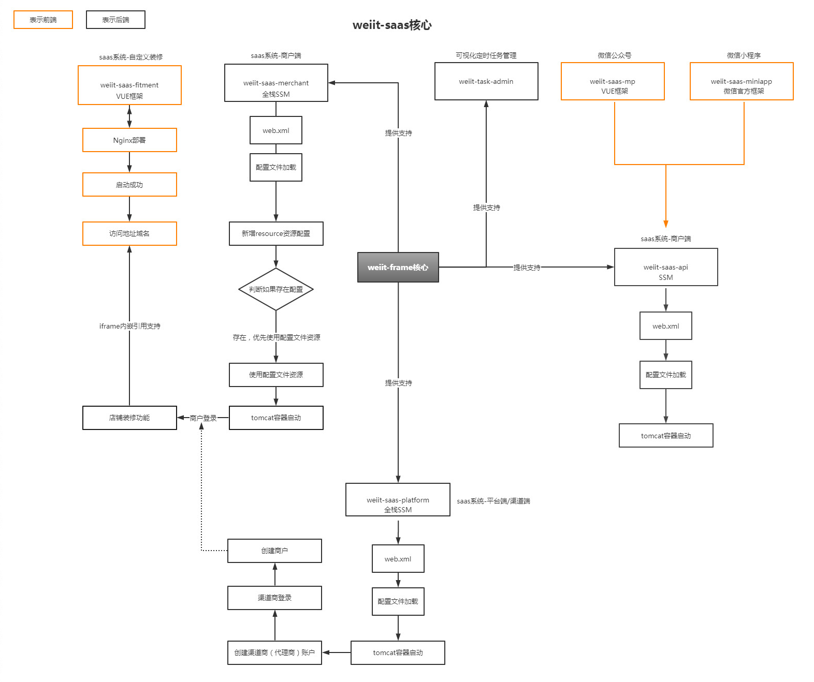
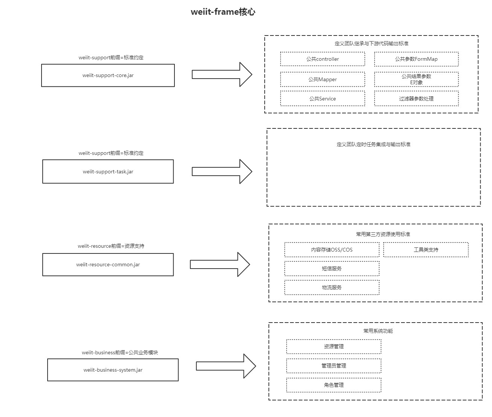
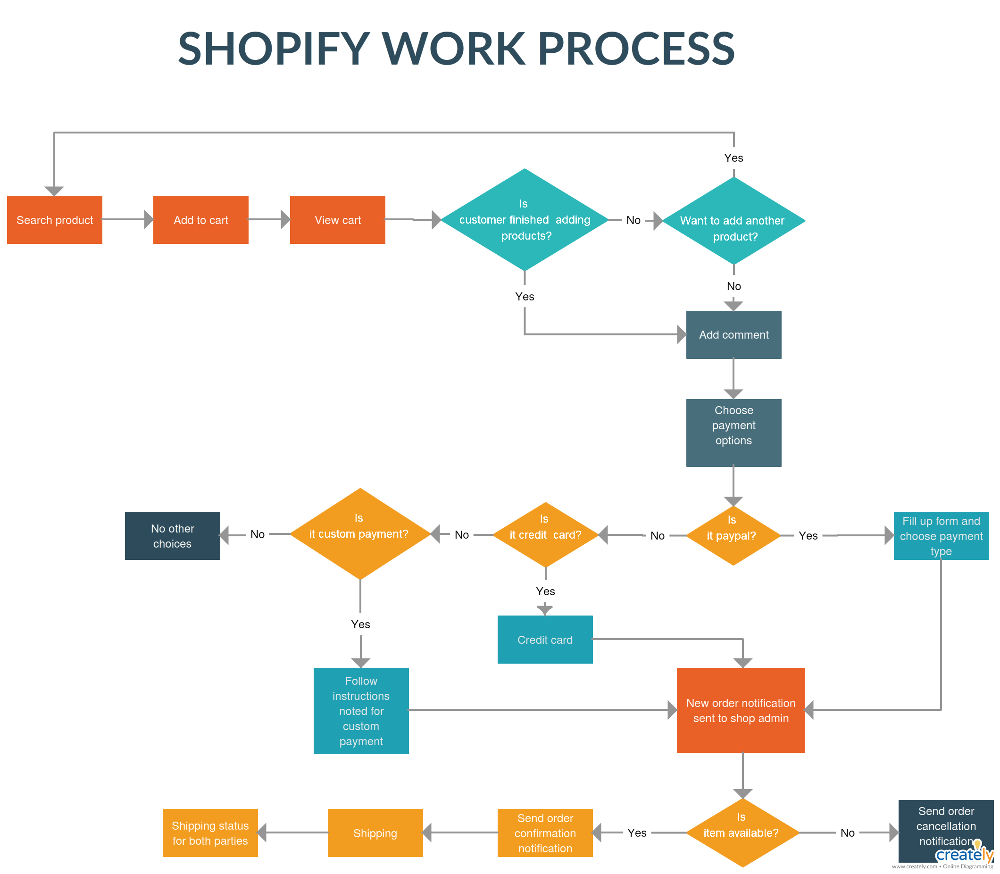

# 整体设计

采用Spring+SpringMVC+Mybatis主流开源框架，遵循MVC架构

## 架构设计

## 功能介绍

- 项目完成了对阿里云、腾讯云、微信生态的快速接入与代码示例，并成功运用到了商业中，方便大家学习对**OSS/COS/短信服务/快递服务/公众号/小程序/微信开放平台/微信支付**的技术点与应用场景的学习；
- 小程序与公众号第三方授权集成，让开发者与企业省去繁琐的配置，对**AppId/AppSecret**集成彻底告别；
- 微信支付**第三方授权**集成，让开发者与企业省去繁琐的配置，让企业服务成本大大降低；
- 小程序**代码自动push与升级**，公众号基本常规功能（**自定义菜单、图文、素材，群发**）全部接管，让企业无需登录微信官方入口，统一化管理企业信息与数据；
- 微信**消息通知与模板**自动同步与管理，让企业场景融合无障碍；
- **自定义装修功能**，实现企业电商场景多元化，解决不同行业不同模板，让企业需求得到真正解决；
- 丰富的**营销工具**，解决企业微营销需求，并集中化管理。拼团活动、积分活动、砍价，优惠券，卡券，礼品卡，邀请有礼等营销活动，方便二次开发；
- 不同企业数据隔离，真正实现SAAS数据隔离模型，让企业数据互不干扰。
- 不同企业不同域名自动分配，让企业小程序、公众号前端隔离，避免因为公众号或者小程序推广时导致域名被检测导致的封号问题出现，即不同企业不同域，意在防止saas平台中的企业受到其他企业的影响。

# 核心模块设计

# 高可用性设计及说明

无

# 交互设计

类似Shopify的交互流

# 风险评估及其他系统影响

## 已知的或可预知的风险

- 不同企业数据隔离，真正实现SAAS数据隔离模型，让企业数据互不干扰。
- 不同企业不同域名自动分配，让企业小程序、公众号前端隔离，避免因为公众号或者小程序推广时导致域名被检测导致的封号问题出现，即不同企业不同域，意在防止saas平台中的企业受到其他企业的影响。

## 与其他系统可能得影响

无
