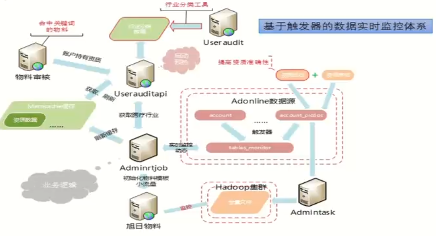
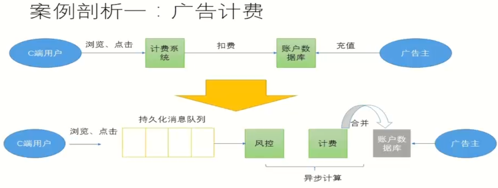
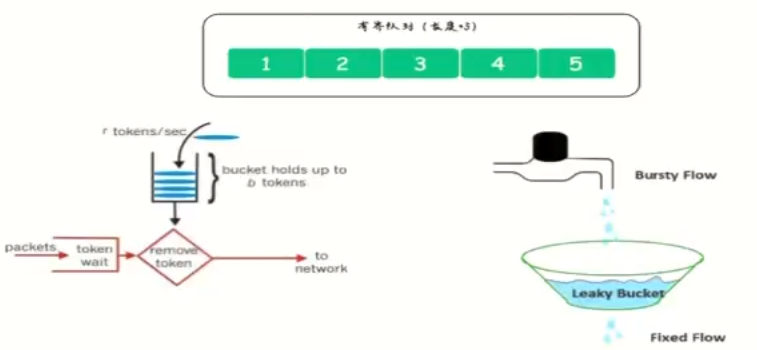
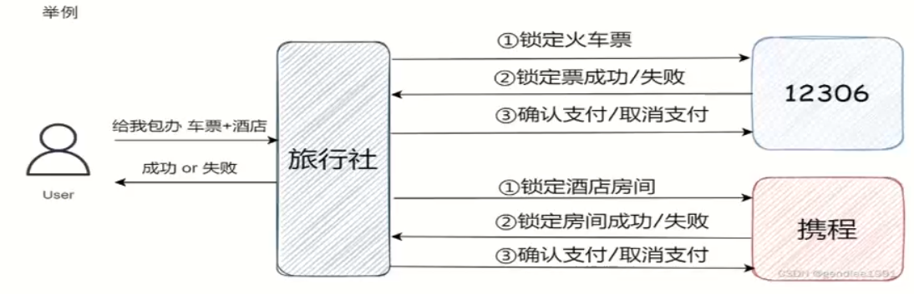
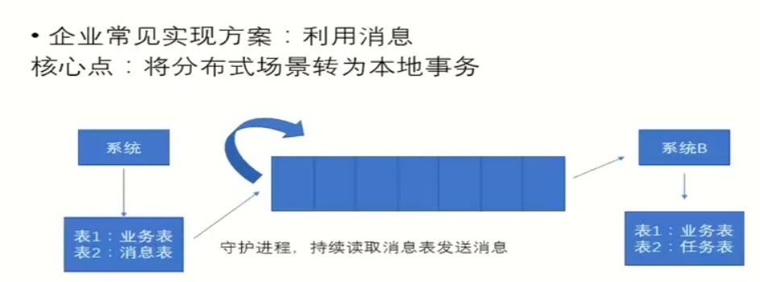
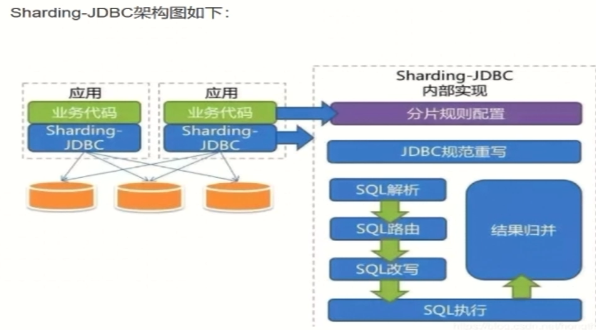

[TOC]

# Introduction

平时 50% (出勤率 + 响应率 + 答辩贡献权值 + 组内积极性) 小组成绩*个人系数
测验 50% (5道大题 架构分析+架构设计)

TL：记录成员关键指标，绩效排序；准备答辩材料分工、协作；提高团队响应率、出勤率。

# 大型平台概述

- 高并发，高可用
- 数据量大
- 用户分布广泛，基数大，网络情况复杂
- 随用户需求持续跌打
- 有时间和技术的沉淀，渐进式发展
- 安全环境恶劣

## 平台架构

平台架构是针对平台设计及演进过程中所有关键问题的解决方案总和。

架构就是一切从实际出发，解决已发生，或者大概率即将会遇到的问题。

## 基本概念介绍

### 分布式架构

相对于单体架构或者集中式架构而言，将相同或不同的功能模块运行在**不同的机器**上，互相之间**通过网络通信**
**高性价比**相对于单体架构难以解决的问题

### 微服务架构

将单一应用程序划分为一组小的服务，服务之间相互协调配合，采用轻量级的通讯协议沟通。每个服务都围绕着具体的业务进行构建，并且能够被独立的部署到生产环境

对于传统服务的区别

> 优点:
>
> 1. 研发成本低
> 2. 本地性能好
> 3. 没有分布式的管理和调用小号
>
> 缺点:
>
> 1. 多版本并行效率低
> 2. 随业务发展越发庞大，迁一处动全身
> 3. 上手成本高，坑多
> 4. 稳定性差，代码模块莫名受牵连
> 5. 瓶颈低

### 微服务基于分布式做了什么

1. 网络层协议标准化
2. 数据层协议标准化
3. 网络开发框架标准化
4. 统一服务注册与发现机制
5. 全链路分布式追踪
6. 统一限流、熔断、降级、服务监控体系等等

## 大型平台的质量

- 性能

  - 衡量指标：响应时间、并发数、吞吐量

  - 响应时间：从请求发出到收到响应的时间

  - 并发数：平台用户数->平台在线用户数->网络并发用户数

  - 吞吐量: TPS(每秒事务数)，HPS(每秒HTTP请求数)， QPS(每秒查询数)，访问数/天，业务数/小时

  - 性能优化策略

    > - web前端性能优化
    >   - 浏览器访问优化
    >   - CDN
    >   - 反向代理
    > - 应用服务器性能优化
    >   - 负载均衡
    >   - 分布式
    >   - 集群
    >   - 缓存
    >   - 异步
    > - 存储性能优化
    >   - 主从分离
    >   - 分布式存储

- 可用性

  - 衡量指标：一台或多台服务器宕机，系统仍然可用。目标就是达到7*24可用，常用几个9来衡量，四个9指全年99.99%时间可用

  - 可用性优化策略

    > - 

- 伸缩性

  - 衡量标准：是否可以用多台服务器构建集群，能否向集群中增减服务器，增减服务器之后是否能保证像原来一样可用。让服务“无状态”

  - 伸缩性优化策略

    > 总的来说，有状态服务和无状态服务各有优缺点，选择哪种类型的服务应该根据具体应用场景和需求来确定。例如，需要维护用户登录状态的应用程序可能需要有状态服务，而具有大量请求并需要高度扩展性的应用程序可能更适合使用无状态服务。

- 拓展性

  - 衡量标准：增加新的业务流程时，或基于已有业务流程扩展时，是否可以实现对现有业务透明无影响

  - 拓展性优化策略

    > - 抽象可复用的基础服务，做好封装
    > - 松耦合设计
    > - 基于业务和技术的发展预见性设计

- 安全性

  - 衡量标准：对攻击与窃密手段，是否有应对策略

好的架构要看具体需求、成本

# 分布式架构

## 分布式系统概述

相对于单体架构或者集中式架构而言，将相同或不同的功能模块运行在**不同的机器**上，互相之间**通过网络通信**

### 分布式系统特点

- 分布性
- 对等性
- 并发性
- 全局时钟
- 故障总是发生

### 分布式面临的经典问题

- 高并发的分片策略、异步化任务调度等
- 分布式场景下，数据一致性
- 数据分区或多副本场景下数据一致性问题
- 多结点的不稳定、容灾等问题
- 高并发时的数据预期问题

### TiDB核心特性

- 水平拓展
  计算能力和存储能力
- 高可用
  TiDB/TiKv/PD三个组件都能容忍部分实例失效

### Kafka

消息系统，使用推拉模型将生产者和消费者分离

#### 副本

副本保证高可用，不会等全部副本，部分副本可用

#### 分区

分区保证消费高并发

## CAP经典理论

一个分布式系统不可能同时满足

- 一致性(Consistency)
- 可用性(Availability)
- 分区容错性(Partition tolerance)

这三个基本需求

### 一致性

数据的多个副本间能否保持一致的特性

> 针对某一数据项的修改成功后，可使所有用户或业务场景立刻读取或感知到最新的值，则该系统可以认为具有强一致性

### 可用性

系统提供的服务必须一直处于可用的状态，对于用户的所有请求都能够在"有限的时间"内"返回结果"

### 分区容错性

系统遇到网络分区故障的时候，需要能够保证对外提供满足一致性和可用性的服务，除非整个网络环境都发生了故障

## 高并发

### 读

**读写分离**

- 动静分离与CND加速
- 加缓存
  - 缓存雪崩
  - 缓存击穿
  - 大量的热Key过期
- 异步化
- 转批量(预读)
- **重写轻读**

### 写

- 数据分片
  DB的分库分表，JDK的currentHashMap、kafka的分区
- 任务分片
  多线程、桂明思路(map\reduce)
- 异步化(LSM树 log structed tree)
  **LSM树**存储的有序的，又能高效写，有日志，然后用内存来排序，最后异步写进磁盘
  
- 转批量

**消息队列缓冲，削峰**

**及时止损**
资质双写双读策略——采用DFS存储备份，同步备份，实时补救的，巡检+监控

### 读写设计原理

**常用基本概念：吞吐量、响应时间、并发数**
吞吐量：单位时间内可处理的请求数量，QPS、TPS
响应时间：处理每个请求所需时间。TP95、TP99
并发数：服务器能同时处理的请求个数。

`吞吐量 × 响应时间 = 并发数(单CPU)`

**并行系统复杂的多**

`机器数 = 总请求预估/单机能承载的最大请求`
总请求按照场景去平均值和峰值

> **如何去估计QPS**
>
> - 利用IO和CPU耗时比例估算
>
>   200ms = 30ms (cpu) + 120ms (IO) + 50ms (内存)
>   充分利用cpu的方法：开多线程、异步IO
>
> - 压力测试
>   准备好环境
>   核心读写接口压力测试
>   全链路压力测试与单机压力

**限流**：通过限制单位时间内请求次数的方式来实现保护服务应用的一种策略

> **单机限流**：
>
> - 有界的任务队列
> - 令牌桶算法
> - 漏桶算法
>
> 
>
> **中央限流**：用来控制总流量

**熔断与降级**
熔断一般是服务调用者对自我体系的保护机制

> - 基于请求失败率为基准做熔断策略
> - 基于请求耗时为基准做熔断策略

降级往往是服务调用者为了保证自身核心服务和数据的稳定，对非核心功能和流程采取的"忽略"行为

> 降级不单单是接口请求级别的降级，也可以是功能主动降级和服务主动降级
>
> 比如在大促前夜，为了降低DB读写压力，会主动关闭评论相关功能，以保证下单交易的顺利进行

**请求重试**

## 高可用

### 高可用的基本框架思维

#### 故障检测

常见方式: 心跳检测

探测失败可能是

> - A 进程宕机了
> - B 进程所在的机器宕机了
> - C 进程卡住了，无法响应心跳
> - D 进程存活，网络和其他原因

#### 解决脑裂

发生C和D时，部分服务切到新的master，但旧的master还存活，数据错乱

解决方法:

> - 隔离，对旧的master隔离直接杀死
> - 每次新的master上位，开启新纪元，旧master感知自己是旧的，主动下线

#### 视业务场景做到数据一致性

场景如下

- 弱一致性
- 最终一致性
- 强一致性

#### 对客户端尽量透明

解决点对点问题：VIP, DNS, 维护IP列表, 使用名字列表, 增加服务代理等等

#### 要避免高可用依赖的连环问题

主从服务，主宕机时，从注册主的ip

### 一致性算法

解决数据一致性，没有老大，选出老大

> Paxos
> Raft
> 出现多候选人重新投票
> 
>
> Zab

### 运维层面问题

- 冷备，平常不用，使用时要立刻激活
- 热备，日常要承担

### 多活部署

同城的延迟可忽略
异地延迟很大

**同城容灾**
**异地容灾**通常冷备，紧急启动时需慎重

- 单机房，2台比3台平均成本更高（剩余的实例能够承担100%的流量）
- 同城多机房
  
- 两地三中心，同城双中心+异地备灾

### SET化

数据分片，一个服务器的集合

## 分布式事务

### 经典解决方案

#### 2pc理论（两阶段提交）

最简单的例子

#### 3pc理论（三阶段提交）

#### TCC实现方式

系统并发量高不适用，并发量不高对数据一致性要求高，适合

### 企业常见实现方案：

#### 代码耦合

发消息失败需要人工介入

#### 利用消息

发消息失败重试即可

#### 事务消息RocketMQ

在企业中的应用较多

#### 事务消息 基于kafka自研

#### 事务状态表+事务补偿

#### 同步多写+异步对账

#### 最终一致性方案

重试+回滚+报警+人工干预

### 开源解决方案

#### Seata

>  Seata的设计目标是对业务无侵入，因此从业务无侵入的2Pc方案着手，在传统2PC的基础上演进。它把一个分布式事务理解成个包含了若干分支事务的全局事务。全局事务的职责是协调其下
> 管辖的分支事务达成一致，要么一起成功提交，要么一起失败回滚。此外，通常分支事务本身就是一个关系数据库的本地事务。

- 角色组成

- 执行流程

事务隔离级别：Read Uncommited，读未提交，即一个事务可以读取另一个未提交事务的数据；并发操作会导致脏读

因为DB回滚的概率不大，先提交以提高效率

## 分布式存储

> 持久化存储作为计算机系统最重要的外设之一，几十年来不断进化，最主要目标如下：
>
> - 单位体积的存储密度
>
> - 存储容量
> - 读写速度
> - 存储成本

### ceph

> Ceph 是一个开源的分布式存储系统，它提供了对象存储、块存储和文件存储等多种存储方式。Ceph 的设计目标是提供高可用性、高性能、可扩展性和易管理性的分布式存储方案，它采用了多个创新的技术来实现这些目标。

- 特性

- 数据写入流程

### redis

- 发展史

### mysql

>  常规mysql的分布式实现：sharding
> 一般的机器(4核16G)，单库的MySQL并发(QPS+TPS)超过了2k,系统基本就完蛋了。最好是并发量控制在1k左右。
> 1、高并发情况下，会造成IO读写频繁，自然就会造成读写缓慢，甚至是宕机。一般单库不
> 要超过2k并发.NB的机器除外。
> 2、数据量大的问题。主要由于底层索引实现导致，MySQL的索引实现为B+TREE,数据量
> 增加，会导致索引树十分庞大，造成查询缓慢。
> 分库分表的目的，是将一个表拆成N个表，就是让每个表的数据量控制在一定范围内，保证
> SQL的性能。一个表数据建议不要超过500W。从而解决高并发，和数据量大的问题。

#### 拆表方式

#### 不停机拆分

#### sharding-jdbc

Sharding的第一个组件：
jar包

- SQL解析
- 执行器优化
- SQL路由
- SQL改写
- SQL执行
- 结果归并

# 业务架构与微服务架构

## 微服务概述

将大型系统或复杂应用分割成多个服务的架构，**松耦合**
每一个小服务都独立裕兴，采用轻量级的API通讯，必须围绕业务能力来实现。通过全自动的方式来独立部署

引入微服务体系，难

## 微服务的拆分原则

### TOGAF方法论

**架构框架**，提供很多方法和工具帮助接收、生产、使用和维护企业级架构。
基于迭代的流程模式，有最佳实践以及可重用的架构资产

ADM架构开发方法主要分为 **目标、远景、原则**

### 拆分原则

| 编号 | 主要原则                                                   | 说明                                         |
| ---- | ---------------------------------------------------------- | -------------------------------------------- |
| R1   | 基于业务分析，拆分                                         | 基于TOGAF等                                  |
| R2   | 或者DDD领域驱动设计中的子域设计                            | 基于领域驱动设计                             |
| R3   | 根据动作和用例拆分                                         | 比如支付                                     |
| R4   | 根据名词或者资源拆                                         | 比如账号                                     |
| R5   | 架构稳定                                                   | 拆分的结构稳定，不会经常修改                 |
| R6   | 服务是可测试的                                             | 集成测试要可定义，测试可回溯                 |
| R7   | 单一原则                                                   | 一个服务做一个业务，自己治理自己的数据库     |
| R8   | 开闭原则                                                   | 面向对象理论，对拓展开放，对修改关闭         |
| R9   | 高内聚                                                     | 强一致，强依赖关系的放在一起，减少分布式事务 |
| R10  | 松耦合                                                     | 服务间互相独立                               |
| R11  | 足够小的团队可维护，最大两个pizza team                     | pizza team                                   |
| R12  | 团队自治，自己的服务的开发和发布要跟别的团队尽可能小的协调 |                                              |

### 技术侧重点

| 编号 | 技术侧重点                                                   | 说明                                 |
| ---- | ------------------------------------------------------------ | ------------------------------------ |
| T1   | 潜在风险                                                     | 服务的风险性                         |
| T2   | 资源性能 - 计算性能 - 硬盘性能 - 内存容量 - 网络带宽 | 机器的性能决定了方案的部分选择       |
| T3   | 安全                                                         | 安全要求是否很高，安全的策略         |
| T4   | 高并发 - 瞬时并发 - 持续并发                       | 并发的种类，持续的时间               |
| T5   | 数据库 - 数据量大小 - 读操作 - 写操作 - 数据类型 | 数据的类型，读写的多少，数据量的大小 |
| T6   | 价格                                                         | 预算，人力成本                       |
| T7   | 时间                                                         | 项目的紧急程度，时间的长短           |
| T8   | 人                                                           | 人员结构，成员素质，技术积累         |

### 微服务带来的问题

- 依赖服务接口变更
  - 服务接口如何管理
  - 接口变更跟踪难
  - 依赖服务调试麻烦
- 部分模块重复构建
  - 安全认证 (**Oauth2.0**)
  - 配置日志
- 分布式带来的问题
  - 分布式事务问题
  - 依赖服务不稳定
  - 需要引入异步模式
- 运维复杂度陡增
  - 部署物数量倍增
  - 监控进程倍增
  - 故障定位难
  - 问题追溯难

## 微服务接口的设计原则

// TODO

## 微服务的注册与发现

在分布式架构中，服务会注册进去，当服务需要调用其他服务时，就这里找到服务的地址，进行调用。

三个角色

> provider
> consumer
> register center

## 业务架构的应用与实践理解

## 案例分析

# 云原生

