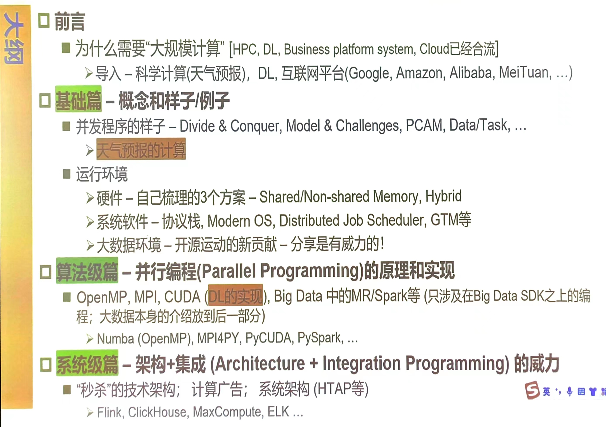

# Introduction

两个项目

- 50 pts Algorithm programming
  concurrent programming projects with MPI, OpenMP, CUDA and Big Data framework
  MPI/Spark + GPU 热传导方程计算
- 50 pts Integration programming 计算广告ctr

MPI
OpenMP
Pthread
CUDA
Hadoop&Spark

# Tools

## python

- [x] MPI4PY
- [ ] Numba
- [ ] PyCUDA
- [ ] PySpark

## platform

高性能计算

# HPC

## Conceptual Model of a LSC(large scale Data or Modules)'s program

divide & conquer

**decomposition and collaboration**