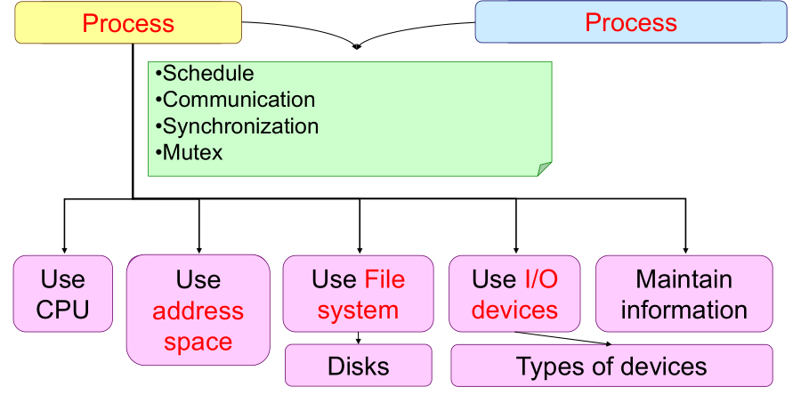

# Introduction

- 1 goal
  - How to support the CONCURRENT execution of many programs in a von Neumann computer (with 1- or N-PUs)
- 2 roles
  - Resource manager, friendly interface
- 3 levels to understand the internals (Fundamental functions) of OS
  - Manage and dispatch resources [**resources are stable, no cooperation**]
  - Coordinate the programs to use resources (Synchronization and Data consistency) [**resources are stable, cooperation**]
  - Fault tolerance [**resources are unstable , cooperation**]

# Process

