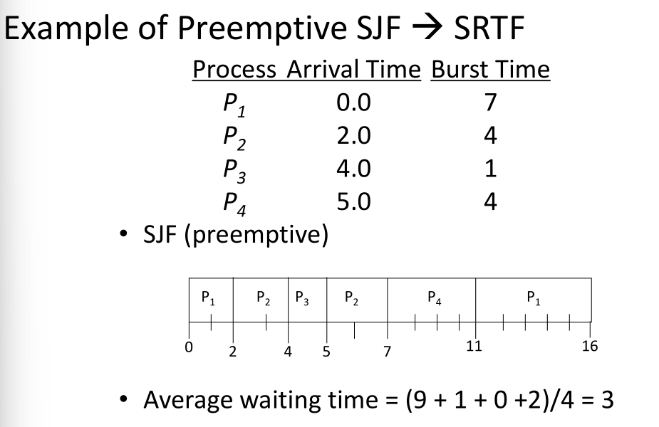

# 考试信息

英文试卷
闭卷考试，纸质词典

# Introduction

## uniprogramming and multiprogramming

单线程与多线程

## Start on OS

- bootstrap program
  - stored in the ROM
  - known as the firmware or bootloader
- bootstrap program initialize the computer (Register content, device controller contents, etc)
- locates and loads the **OS kernel** into memory
- kernel starts the first process

## User mode vs Kernel mode

### user mode

protected instructions cannot be executed

### kernel mode

all instructions can be executed

## OS events

### interrupts

are caused by external events (hardware)

### traps

are caused by executing instructions (software)

## System calls

a system call is a special kind of trap

every **Instruction Set Architecture(ISA)** provide a system call instruction

# OS Structures

## Components

- Process Management
- Main-Memory Management
- Secondary-Storage Management
- File Management
- I/O System management
- User Interfaces
- Networking
- Protection System

# Processes

Process is an **instance** of a program running on a computer

**Operating system processes** and **User processes**

process **active, dynamic, temporary**
program **passive, static, permanence**

the **elements** of process and program are different

> Process: Process Control Block(PCB)
> Program: Code and Data 

## Scheduler

- **Long-term scheduler** - job scheduling, select job from external storage to memory and create a process
  - invoked **very infrequently** (seconds, minutes) -> (may be slow)
- **Short-term scheduler** - process scheduling, select the ready process to run on the processor 
  - invoked **very frequently** (milliseconds) -> (must be fast)
- **Medium-term scheduler** - solves the problem of insufficient memory, using secondary storage to alleviate

## Context switch

system must **save the state of the old process** and **load the saved state for the new process**

## interprocess communication

- Shared memory
- Message system
  - message queue
  - Direction communication
    **name each other explictly**
  - Indirect communication
    from **mailboxes**

## Blocking vs Non-Blocking

### Blocking

is considered **synchronous**
the sender is blocked until the message is received
the reciver is blocked until a message is available

### Non-Blocking

is considered **asynchronous**
the sender sends the message and continue
the receiver receives a valid message or null

# Thread

a sequential execution stream within a process

Process still contains a **single** address space
No protection between threads

## Lifecycle of thread

same like process

## Thread types

User-level threads
Kernel-supported thread 开销更大

## Thread pool

maintains **multiple threads** waiting for tasks to be allocated for concurrent execution

# CPU Scheduling

- CPU utilization [ **CPU 使用率** ] ( Efficiency )
  - keep the CPU as busy as possible (from 0% to 100%)
- Fairness: each process gets a “fair share” of the CPU
- Throughput [ **吞吐量** ]
  -  of processes that complete their execution per time unit
- Turnaround time [ **周转时间** ]
  - amount of time to execute a particular Process
    • i.e. execution time + waiting time
- Waiting time [ **等待时间** ]
  - amount of time a process has been waiting in the ready queue
- Response time [ **响应时间** ]
  - amount of time it takes from when a request was submitteduntil the first response is produced , not output (for time-sharing environment)

## Preemptive and nonpreemptive

抢占和非抢占，是否实时进行监测，若非抢占直到一个process完成后才会进行调度

## Different Scheduling Algorithms 必考！

### FCFS first Come First Serve Scheduling

先来先做

画甘特图

### Shortest Job First SJF

最短先做

Determining length of next CPU Burst

### Shortest-Remaining-Job-First SRJF

剩的最少先做

### Priority

越小等级越高

**Preemptive 和 Non- preemptive的区别**：Preemptive在有新进程加入中也是一个调度时间

Aging - 随等待时间更多，优先级提高

### Round-Robin Scheduling

Preemtive, 将CPU服务轮换切片

- Short quantum: great response/interactivity but high overhead
  - Hopefully not too high if the dispatcher is fast enough
- Long quantum: poor response/interactivity, but low overhead
  - With a very long time quantum, RR Scheduling becomes FCFS Scheduling

## Hard vs soft realtime

- Hard real-time systems 不可出错
  - Requires to complete a critical task within a guaranteed amount of time
  - Missing a deadline is a total system failure
- Soft real-time systems 有容错
  - Requires that critical processes receive priority over less fortunate ones
  - Can miss some deadlines, but eventually performance will degrade if too many are missed

# Process Synchronization

**Race condition竞争条件**
The situation where several processes access and manipulate shared data concurrently. **The final value of the shared data depends upon which process finishes last.**
出现静态条件就会导致出现不确定性和不可重现性的现象

**Atomic Operation原子操作**
an operation that always runs to completion or not at all

### 一次不存在任何终端或者失败的操作

**Mutual Exclusion互斥** (现象)
ensuring that only one process does a particular thing at a time

**Critical Section临界区** (代码)
piece of code that **only one** process can execute at once. **Only one** process at a time will get into this section of code.

Critical section and mutual exclusion are two ways of describing the same thing.

## Semaphore 信号量 必考！！

P(): an atomic operation that waits for semaphore to become positive, then decrements it by 1
think of this as the wait() operation

V(): an atomic operation that increments the semaphore by 1, waking up a waiting P, if any

### two types semaphore

Binary semaphore - integer value can range only between 0 and 1; can be simpler to implement.
Also known as **mutex locks**
就是只有0和1两个值

Counting semaphore - integer value can range over an unrestricted domain.
Can implement a counting semaphore S as a binary semaphore.
计数信号量小于等于1

## Deadlock and starvation

**Deadlock死锁** - two or more processes are waiting

**Starvation饥饿** - indefinite blocking. A process may never be removed from the semaphore queue in which it is suspended.

死锁一定会引起饥饿，但饥饿不一定会引起死锁

# Deadlock

A set of blocked processes each holding a resource and waiting to acquire a resource held by another process in the set.

## Requirement for Deadlock

- **Mutual exclusion**
  Only one process at a time can use a resource.
- **Hold and wait**
  Process is **holding** at least one resource and is **waiting** to acquire additional resources held by other processes
- **No preemption**
  Resources are released only voluntarily by the process holding the resource, after bprocess is finished with it
- **Circular wait**
  There exists a set { T 1 , …, T n } of waiting processes

## Deadlock avoidance algorithms

Single instance of a resource type
use a resource-allocation graph

Multiple instances of a resource type
use the **banker's algorithm**

银行家算法
**把计算过程写出来，画整体的表格**
每一次请求先判断
considers the resources currently **available** , the resources currently **allocated** , and the **future (Needed)** requests and releases of each process, and decides whether the current request can be satisfied or must wait to avoid a possible future deadlock.

available = total resource - max
然后选need再一步步来得到序列

# Memory

**Logical address** - generated by the CPU
**Physical address** - address seen by the memory unit

Logical and physical addresses are **the same in compile- time and load-time address-binding schemes**
Logical and physical addresses **differ in execution-time address-binding scheme**

## Storage allocation algorithm (可能考)

- **First-fit** : Allocate the **first** hole that is big enough
  首次匹配 最开始能够匹配的位置
- **Best-fit** : Allocate the **smallest** hole that is big enough; must search entire list, unless ordered by size
  Produces the smallest leftover hole
  最佳匹配找最小可以实现的
- **Worst-fit** : Allocate the largest hole; must also search entire list
  Produces the largest leftover hole
  最差匹配与best-fit相对
- **Next-fit**: Scans memory from the location of the last placement
  临近匹配 从上一次place的地方开始

## Fragmentation

Internal Fragmentation
内碎片，分配在内存内部没有使用的内存

External Fragmentation
total memory space exists to satisfy a request, but it is not contiguous

## Paging

**page数据结构**

| Page | Frame |
| ---- | ----- |

### TLB

translation lookaside buffer is a memory cache that is used to reduce the time taken to access a user memory location.

## Segmentation

Segmentation is a memory-management scheme that supports user view of memory

# Virtual Memory

separation of user logical memory from physical memory.

## Page fault

a page not in main memory

### 处理流程

1. Operating system looks at another table to decide:
   - Invalid reference -> abort
   - Just not in memory
2. Get empty frame
3. Swap page into frame
4. Reset table
5. Set validation bit = v
6. Restart the instruction that caused the page fault

### Page replacement algorithm

#### FIFO/FCFS

first in first out

#### Optimal/Minimum Page Replacement

Impossible to implement (need to know thefuture) but serves as a standard to compare with the other algorithms we shall study.

#### LRU(Least Recently Used) Policy

Replaces the page that has not been referenced for the longest time recently

#### Clock Policy

- Replaces an old page, but not the oldest page
- Arranges physical pages in a circle
- Each page has a used bit
  - Set to 1 on reference
  - On page fault, sweep the clock hand
    - If the used bit == 1, set it to 0 and advance the hand
    - If the used bit == 0, pick the page for replacement

享受机会可以踢掉

# File System

**File System**: Layer of OS that transforms block interface of disks (or other block devices) into Files,
Directories, etc.
**File** : user-visible group of blocks arranged sequentially in logical space
**file** is **a collection of blocks**
**Directory** : user-visible index mapping names to files (later)

## Organize files on disk

### Continuous Allocation 连续存储

Use continuous range of blocks in logical block space

### Linked List Approach 链式存储

- Each block, pointer to next on disk
- File-Allocation Table (FAT)

### Indexed Files

System allocates file header block to hold array of pointers big enough to point to all blocks

inode... 计算题或大题

> Key idea: efficient for small files, but still allow big files
> **“ inode ”** in Linux:
>
> 15 pointers
> Block size: 1KB
> Pointer length: 4Byte
> First 12 pointers are to data blocks
> Pointer 12 points to “indirect block” containing 256 block ptrs
> Pointer 13 points to “doubly indirect block” containing 256 indirect block ptrs for total of 64K blocks
> Pointer 14 points to a triply indirect block (16M blocks)
> **MAX file size: 12K+256K+64M+16G**

## File control block (FCB)

All information about a file contained in its File Control Block (FCB)
UNIX calls this an “inode”

## Manage free space on disk

- Linked Free Space List
- Bit map
  Bit vector (use on bit to indicate block status)
- Grouping
- Counting

## Directory structures

- Single-level directory
- Two-level directory
- Tree-structured directory (more common)
- Acyclic-graph directory (cycle-detection is expensive)

# Mass Storage Structure

Platter, Track, Sector, Block, Cylinder

**Disk Rotational latency** time
转到合适的扇区的延迟

**Disk seek** time
磁头找到合适的轨道的延迟

**Transfer time**
复制bits从磁面到内存

**Random access/ Positioning Time**
seek + latency

**Access Time**
seel + latency + transfer

>  8 platter surfaces; 1024 tracks per surface; 64 sectors per track; 1KByte per sector. Average seek time is 8ms; rotate at 7200 rpm.
> • What is the size of this hard disk?
> 8×1024×64×1K = 512 MB
> • What is the average positioning time?
> 8+(60×1000)/7200/2 = 12.17 ms
> **注意rpm计算出rotational latency time需要用60000ms除以rpm除2**

## I/0 requests algorithm (大概率考)

Several algorithms exist to schedule the disk I/O requests
We illustrate them **with a request queue (0-199).**
**– 98, 183, 37, 122, 14, 124, 65, 67**
**– After visiting 40, current Head pointer is at 53**

### FCFS 先来先服务

### SSTF 最短寻道时间优先

### elevator algorithm电梯算法

#### SCAN

#### C-SCAN

#### LOOK

#### C-LOOK

# IO System

## Dimensions of I/O devices

- Character-stream or block
- Sequential or random-access
- Sharable or dedicated
- Speed of operation
- Read-write, read only, or write only

## I/O Hardware

- Common concepts
  - Port -- address
  - Bus
  - Controller (host adapter)
    - Contains a set of registers that can be read and written
    - May contain memory
- I/O instructions control devices
- Devices have addresses

## Polling, Interrupt-driven I/O, DMA

- Polling
  - The host repeatedly reads the busy bit until that bit becomes clear
- Interrupt-driven I/O
  - CPU is responsible for moving chars to/from controller buffer
  - Interrupt signal informs CPU when IO operation completes
- DMA - Direct Memory Access
  - Bypasses CPU to transfer data directly between I/O device and memory
- SPOOLing (Simultaneous Peripheral Operation On Line)
  hold output for a device
  If device can serve only one request at a time
