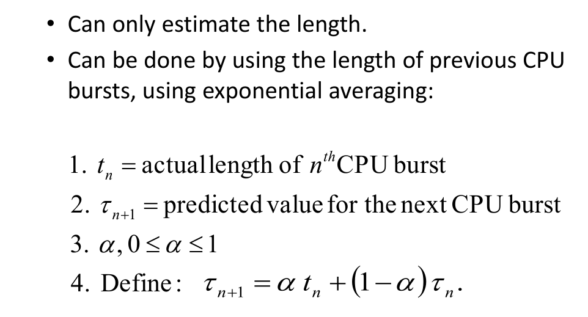
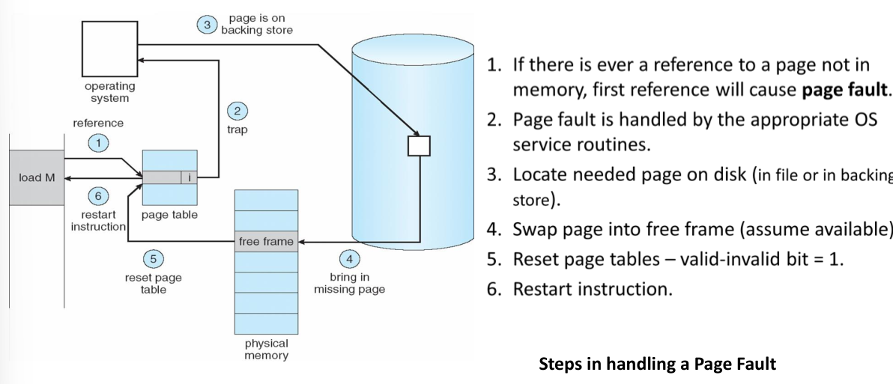
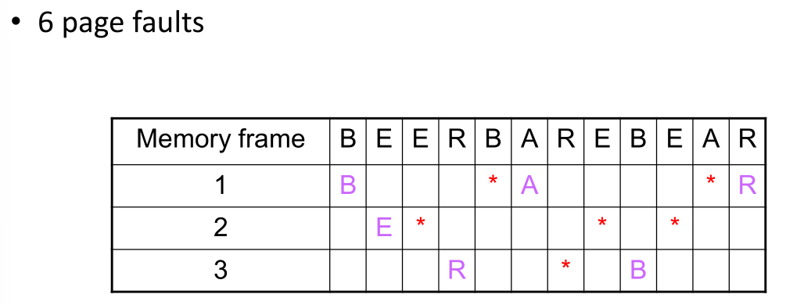
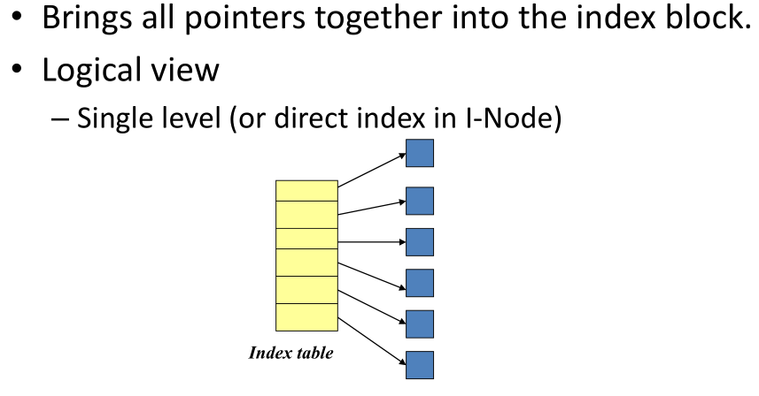
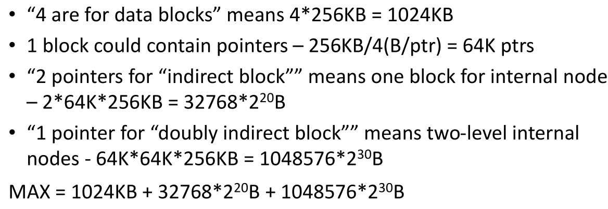

# 考试信息

英文试卷
闭卷考试，纸质词典

# Introduction

## uniprogramming and multiprogramming

### uniprogramming 单道批处理

外设和CPU交替空闲和忙碌

特点：自动、批量、单道
缺点：作业运行过程中若发生IO请求，高速的CPU要等待低速的I/O操作完成，导致CPU资源利用率和系统吞吐量降低。

### multiprogramming 多道批处理

内存中存放多道程序，当某道程序因某种原因如执行I/O操作时而不能继续运行放弃CPU时，操作系统便调度另一程序运行，这样CPU就尽量忙碌，达到提高系统效率的目的。

特点：多道、宏观上并行、微观上串行
缺点：作业处理时间长、交互能力差、运行过程不确定

### time-sharing 分时

主机以很短的时间片为单位，把CPU轮流分配给每个终端使用；直到所有作业被运行完。若某个作业在分配给它的时间片内未完成计算，则该作业暂停运行，把处理器让给其他作业使用，等待下一轮再继续使用。

特点：多路调制性、独占性、交互性
缺点：不能用于系统能对于外部信息在规定的时间作出处理的情况

## Start on OS

初始化硬件信息、将OS内核读取到memory中、内核运行第一个进程

- bootstrap program
  - stored in the ROM
  - known as the firmware or bootloader
- bootstrap program initialize the computer (Register content, device controller contents, etc)
- locates and loads the **OS kernel** into memory
- kernel starts the first process

## User mode vs Kernel mode

### user mode

protected instructions cannot be executed

### kernel mode

all instructions can be executed

## OS events

### interrupts

are caused by external events (hardware)

由外设或硬件触发，如read系统调用后，系统发出读磁盘的操作，当磁盘数据准备好后，向OS发出一个异步通知消息，即中断。一般来说，中断是异步的方式。

### traps

are caused by executing instructions (software)

陷阱指令可以使执行流程从用户态陷入内核（这也就是为什么叫做陷阱，而不是捕猎的陷阱）并把控制权转移给操作系统，使得用户程序可以调用内核函数和使用硬件从而获得操作系统所提供的服务

## System calls

a system call is a special kind of trap

every **Instruction Set Architecture(ISA)** provide a system call instruction
**指令集架构（ISA, Instrucion Set Architecture）**定义了基本数据类型（BYTE/HALFWORD/WORD/…）、寄存器（Register）、指令、寻址模式、异常或者中断的处理方式等。一台计算机的指令系统反映了该计算机的全部功能，机器类型不同，其指令系统也不同，因而功能也不同。

# OS Structures

## Components

- Process Management 进程
- Main-Memory Management 内存
- Secondary-Storage Management 二级存储
- File Management 文件管理
- I/O System management IO系统管理
- User Interfaces 用户界面
- Networking 网络
- Protection System 保护系统

# Processes

Process is an **instance** of a program running on a computer

**Operating system processes** and **User processes**

process **active, dynamic, temporary**
program **passive, static, permanence**

the **elements** of process and program are different

> Process: Process Control Block(PCB)
> Program: Code and Data 

## PCB

1. Process location information
2. Process identification information
3. Process state information
4. Process control information

## Scheduler

长期是job，短期是process，中期交换数据

- **Long-term scheduler** - job scheduling, select job from external storage to memory and create a process
  
  - invoked **very infrequently** (seconds, minutes) -> (may be slow)
  
  长期调度，又称为作业调度或高级调度，这种调度将已进入系统并处于后备状态的作业按某种算法选择一个或一批，为其建立进程，并进入主机，当该作业执行完毕时，还负责回收系统资源，在批处理系统中，需要有作业调度的过程，以便将它们分批地装入内存，在分时系统和实时系统中，通常不需要长期调度。它的频率比较低，主要用来控制内存中进程的数量。
- **Short-term scheduler** - process scheduling, select the ready process to run on the processor 
  
  - invoked **very frequently** (milliseconds) -> (must be fast)
  
  又称为交换调度。它的核心思想是能将进程从内存或从CPU竞争中移出，从而降低多道程序设计的程度，之后进程能被重新调入内存，并从中断处继续执行，这种交换的操作可以调整进程在内存中的存在数量和时机。其主要任务是按照给定的原则和策略，将处于外存交换区中的就绪状态或等待状态的进程调入内存，或把处于内存就绪状态或内存等待状态的进程交换到外存交换区。
- **Medium-term scheduler** - solves the problem of insufficient memory, using secondary storage to alleviate
  又称为进程调度、低级调度或微观调度。这也是通常所说的调度，一般情况下使用最多的就是短期调度。它的主要任务是按照某种策略和算法将处理机分配给一个处于就绪状态的进程，分为抢占式和非抢占式。

## Context switch

system must **save the state of the old process** and **load the saved state for the new process**

Context-switch time is overhead ; the system does no useful work while switching
在上下文切换的过程中，**消耗的时间无法避免**

## interprocess communication

- Shared memory
  进程间共享同一段物理内存
- Message system
  - message queue
    消息队列是消息的链表，存放在内核中并由消息队列标识符表示。 
    消息队列提供了一个从一个进程向另一个进程发送数据块的方法，每个数据块都可以被认为是有一个类型，接受者接受的数据块可以有不同的类型。 
  - Direction communication
    **name each other explictly**
  - Indirect communication
    from **mailboxes**

## Blocking vs Non-Blocking

### Blocking

is considered **synchronous**
the sender is blocked until the message is received
the reciver is blocked until a message is available

### Non-Blocking

is considered **asynchronous**
the sender sends the message and continue
the receiver receives a valid message or null

# Thread

a sequential execution stream within a process

Process still contains a **single** address space
No protection between threads

## Lifecycle of thread

same like process

new生成新的thread，admitted之后存在ready队列中，通过scheduler dispatch来分配任务进行running状态，之后使用exit来进行terminated。
除此之外，在running状态可以使用中断来重新将此thread放在ready队列中或者通过I/O、event 等待来放在waiting队列中，等待I/O、event 完成再放在ready队列中

## Thread types

User-level threads
Kernel-supported thread 开销更大

## Thread pool

maintains **multiple threads** waiting for tasks to be allocated for concurrent execution

Servicing a request with an existing thread is **faster** than waiting to create a thread.

## Thread vs process

| Process                                                | Thread                                                       |
| ------------------------------------------------------ | ------------------------------------------------------------ |
| **系统(OS)分配资源和调度运行**的基本单位               | 进程(Process)中**执行运算**的基本单位                        |
| 独立的虚拟地址和处理器调度，**进程之间不可通信**       | 共享的内存和指令，**线程之间可直接通信**，但有独立的栈和指令指针(PC)等以及独立的执行序列 |
| 进程是**系统中的并发执行**的单位                       | 线程是**进程中的并发执行**的单位                             |
| 在分布式存储设备或共享存储设备上执行并行计算           | 仅在共享存储设备上执行并行计算                               |
| 开销大，复制父进程的内存等资源                         | 开销小，与父进程共享 内存等资源                              |
| 基于Process的并行:(Message Passing Interface, **MPI**) | 基于Thread 的并行:(Open Multi-Processing, **OpenMP**)  (POSIX Thread, **Pthread**) |

# CPU Scheduling

- CPU utilization [ **CPU 使用率** ] ( Efficiency )
  - keep the CPU as busy as possible (from 0% to 100%)
- Fairness: each process gets a “fair share” of the CPU
- Throughput [ **吞吐量** ]
  -  of processes that complete their execution per time unit
- Turnaround time [ **周转时间** ] 总时间
  - amount of time to execute a particular Process
    • i.e. execution time + waiting time
- Waiting time [ **等待时间** ] 在ready队列等待的全部时间
  - amount of time a process has been waiting in the ready queue
- Response time [ **响应时间** ] submission到第一个响应的时间
  - amount of time it takes from when a request was submitteduntil the first response is produced , not output (for time-sharing environment)

## Preemptive and nonpreemptive

抢占和非抢占，是否实时进行监测，若非抢占直到一个process完成后才会进行调度

## Different Scheduling Algorithms 必考！

### FCFS first Come First Serve Scheduling

先来先做

画甘特图

### Shortest Job First SJF

最短先做

Determining length of next CPU Burst

### Shortest-Remaining-Job-First SRJF

剩的最少先做

### Priority

越小等级越高

**Preemptive 和 Non- preemptive的区别**：Preemptive在有新进程加入中也是一个调度时间

Aging - 随等待时间更多，优先级提高

### Round-Robin Scheduling

Preemtive, 将CPU服务轮换切片

- Short quantum: great response/interactivity but high overhead
  - Hopefully not too high if the dispatcher is fast enough
- Long quantum: poor response/interactivity, but low overhead
  - With a very long time quantum, RR Scheduling becomes FCFS Scheduling

## Hard vs soft realtime

- Hard real-time systems 不可出错
  - Requires to complete a critical task within a guaranteed amount of time
  - Missing a deadline is a total system failure
- Soft real-time systems 有容错
  - Requires that critical processes receive priority over less fortunate ones
  - Can miss some deadlines, but eventually performance will degrade if too many are missed

# Process Synchronization

**Race condition竞争条件**
The situation where several processes access and manipulate shared data concurrently. **The final value of the shared data depends upon which process finishes last.**
出现静态条件就会导致出现不确定性和不可重现性的现象

**Atomic Operation原子操作**
an operation that always runs to completion or not at all

### 一次不存在任何终端或者失败的操作

**Mutual Exclusion互斥** (现象)
ensuring that only one process does a particular thing at a time

**Critical Section临界区** (代码)
piece of code that **only one** process can execute at once. **Only one** process at a time will get into this section of code.

Critical section and mutual exclusion are two ways of describing the same thing.

## Semaphore 信号量 必考！！

P(): an atomic operation that waits for semaphore to become positive, then decrements it by 1
think of this as the wait() operation

V(): an atomic operation that increments the semaphore by 1, waking up a waiting P, if any

### two types semaphore

Binary semaphore - integer value can range only between 0 and 1; can be simpler to implement.
Also known as **mutex locks**
就是只有0和1两个值

Counting semaphore - integer value can range over an unrestricted domain.
Can implement a counting semaphore S as a binary semaphore.
**计数信号量小于等于设定的最大值**

## Deadlock and starvation

**Deadlock死锁** - two or more processes are waiting

**Starvation饥饿** - indefinite blocking. A process may never be removed from the semaphore queue in which it is suspended.

**死锁一定会引起饥饿，但饥饿不一定会引起死锁**

# Deadlock

A set of blocked processes each holding a resource and waiting to acquire a resource held by another process in the set.

## Requirement for Deadlock

- **Mutual exclusion** 互斥
  Only one process at a time can use a resource.
- **Hold and wait** 占有并等待
  Process is **holding** at least one resource and is **waiting** to acquire additional resources held by other processes
- **No preemption** 非抢占
  Resources are released only voluntarily by the process holding the resource, after bprocess is finished with it
- **Circular wait** 循环等待
  There exists a set { T 1 , …, T n } of waiting processes

## Deadlock avoidance algorithms

Single instance of a resource type
use a resource-allocation graph

Multiple instances of a resource type
use the **banker's algorithm**

银行家算法
**把计算过程写出来，画整体的表格**
每一次请求先判断
considers the resources currently **available** , the resources currently **allocated** , and the **future (Needed)** requests and releases of each process, and decides whether the current request can be satisfied or must wait to avoid a possible future deadlock.

available = total resource - max
然后选need再一步步来得到序列

## Safe condition

 If the number of system resources satisfies the following equation, then the system is safe!

# Memory

**Logical address** - generated by the CPU
**Physical address** - address seen by the memory unit

Logical and physical addresses are **the same in compile- time and load-time address-binding schemes**
Logical and physical addresses **differ in execution-time address-binding scheme**

## Storage allocation algorithm (可能考)

- **First-fit** : Allocate the **first** hole that is big enough
  首次匹配 最开始能够匹配的位置
- **Best-fit** : Allocate the **smallest** hole that is big enough; must search entire list, unless ordered by size
  Produces the smallest leftover hole
  最佳匹配找最小可以实现的
- **Worst-fit** : Allocate the largest hole; must also search entire list
  Produces the largest leftover hole
  最差匹配与best-fit相对
- **Next-fit**: Scans memory from the location of the last placement
  临近匹配 从上一次place的地方开始

## Fragmentation

Internal Fragmentation
内碎片，分配在内存内部没有使用的内存
内部碎片就是已经被分配出去（能明确指出属于哪个进程）却不能被利用的内存空间

External Fragmentation
total memory space exists to satisfy a request, but it is not contiguous
外部碎片指的是还没有被分配出去（不属于任何进程），但由于太小了无法分配给申请内存空间的新进程的内存空闲区域。

| 分配方式                                   | 内碎片 | 外碎片 | 跨进程共享代码 |
| ------------------------------------------ | ------ | ------ | -------------- |
| 固定分区分配 fixed-size blocks             | 是     | 否     | 否             |
| 可变分区分配 variable partition allocation | 否     | 是     | 否             |
| 页式分配 page                              | 是     | 否     | 是             |
| 段式分配 segment                           | 否     | 是     | 是             |
| 段页式分配 segment-page                    | 是     | 否     | 是             |

## Paging

**page数据结构**

| Page | Frame |
| ---- | ----- |

0 - > 2;
physical address = offset * pagesize

### TLB

translation lookaside buffer is a memory cache that is used to reduce the time taken to access a user memory location.

## Segmentation

Segmentation is a memory-management scheme that supports user view of memory

# Virtual Memory

separation of user logical memory from physical memory.

## Page fault

a page not in main memory

### 处理流程

1. Operating system looks at another table to decide:
   - Invalid reference -> abort
   - Just not in memory
2. Get empty frame
3. Swap page into frame
4. Reset table
5. Set validation bit = v
6. Restart the instruction that caused the page fault

#### Effective Access Time (EAT)

p means page fault rate

### Page replacement algorithm

#### FIFO/FCFS

first in first out

#### Optimal/Minimum Page Replacement

Impossible to implement (need to know thefuture) but serves as a standard to compare with the other algorithms we shall study.
从主存中移出永远不再需要的页面，如无这样的页面存在，则应选择最长时间不需要访问的页面。这种方法可用保证最低的缺页率，但是实际中准确预测页面使用情况是很困难的，这种方法无法实现。

#### LRU(Least Recently Used) Policy

Replaces the page that has not been referenced for the longest time recently
替换最早发生替换的frame，看距离现在时间轴的距离的远端替换此frame

#### Clock Policy

- Replaces an old page, but not the oldest page
- Arranges physical pages in a circle
- Each page has a used bit
  - Set to 1 on reference
  - On page fault, sweep the clock hand
    - If the used bit == 1, set it to 0 and advance the hand
    - If the used bit == 0, pick the page for replacement

**享受机会可以踢掉**

# File System

**File System**: Layer of OS that transforms block interface of disks (or other block devices) into Files,
Directories, etc.
**File** : user-visible group of blocks arranged sequentially in logical space
**file** is **a collection of blocks**
**Directory** : user-visible index mapping names to files (later)

## Organize files on disk

文件是BLOCK的集合

### Continuous Allocation 连续存储

Use continuous range of blocks in logical block space

### Linked List Approach 链式存储

- Each block, pointer to next on disk
- File-Allocation Table (FAT)

### Indexed Files

System allocates file header block to hold array of pointers big enough to point to all blocks

> Such as 1 block = 4KB
> Each entry = 4 bytes
> So each block could contain 4×2^10/4 = 1024
> 2-level index could connect 1024×1024 = 2^20 data blocks
> So the total size of data blocks is 2^20 ×4KB = 4GB
>
> 
>
> **要计算1个block的大小、每个entry的大小、每个block能够存多少个block的index**

inode... 计算题或大题

> Key idea: efficient for small files, but still allow big files
> **“ inode ”** in Linux:
>
> 15 pointers
> Block size: 1KB
> Pointer length: 4Byte
> First 12 pointers are to data blocks
> Pointer 12 points to “indirect block” containing 256 block ptrs
> Pointer 13 points to “doubly indirect block” containing 256 indirect block ptrs for total of 64K blocks
> Pointer 14 points to a triply indirect block (16M blocks)
> **MAX file size: 12K+256K+64M+16G**

## File control block (FCB)

All information about a file contained in its File Control Block (FCB)
UNIX calls this an “inode”

## Manage free space on disk

- Linked Free Space List
- Bit map
  Bit vector (use on bit to indicate block status)
  
- Grouping
- Counting

## Directory structures

- Single-level directory
- Two-level directory
- Tree-structured directory (more common)
- Acyclic-graph directory (cycle-detection is expensive)

# Mass Storage Structure

Platter, Track, Sector, Block, Cylinder

**Disk Rotational latency** time
转到合适的扇区的延迟

**Disk seek** time
磁头找到合适的轨道的延迟

**Transfer time**
复制bits从磁面到内存

**Random access/ Positioning Time**
seek + latency

**Access Time**
seel + latency + transfer

>  8 platter surfaces; 1024 tracks per surface; 64 sectors per track; 1KByte per sector. Average seek time is 8ms; rotate at 7200 rpm.
> • What is the size of this hard disk?
> 8×1024×64×1K = 512 MB
> • What is the average positioning time?
> 8+(60×1000)/7200/2 = 12.17 ms
> **注意rpm计算出rotational latency time需要用60000ms除以rpm除2**

## I/0 requests algorithm (大概率考)

Several algorithms exist to schedule the disk I/O requests
We illustrate them **with a request queue (0-199).**
**– 98, 183, 37, 122, 14, 124, 65, 67**
**– After visiting 40, current Head pointer is at 53**

### FCFS 先来先服务

### SSTF 最短寻道时间优先

### elevator algorithm电梯算法

#### SCAN

#### C-SCAN

#### LOOK

#### C-LOOK

# IO System

## Dimensions of I/O devices

- Character-stream or block
- Sequential or random-access
- Sharable or dedicated
- Speed of operation
- Read-write, read only, or write only

## I/O Hardware

- Common concepts
  - Port -- address
  - Bus
  - Controller (host adapter)
    - Contains a set of registers that can be read and written
    - May contain memory
- I/O instructions control devices
- Devices have addresses

## Polling, Interrupt-driven I/O, DMA

- Polling 轮询模式，是一种软件协议，轮询过程中，cpu周期性地依次询问每一个设备，是否有业务需要处理，每个设备有一个指令就绪bit位，标识了设备是否需要处理器服务的状态，若被置位，cpu将处理
  - The host repeatedly reads the busy bit until that bit becomes clear
- Interrupt-driven I/O 由硬件中断或者软件中断发出中断信号，处理完成后，再次使用中断提醒cpu
  - CPU is responsible for moving chars to/from controller buffer
  - Interrupt signal informs CPU when IO operation completes
- DMA - Direct Memory Access 直接存储器访问，外部设备不通过cpu而直接与系统内存交换数据的接口技术，解决批量数据的输入/输出
  - Bypasses CPU to transfer data directly between I/O device and memory
- SPOOLing (Simultaneous Peripheral Operation On Line) 同时联机外围操作技术，它是关于慢速字符设备如何与计算机主机进行数据交换的一种技术，通常又称假脱机技术。
  在多道程序环境下，利用多道程序中的一道或者两道程序来模拟脱机输入/输出中的外围控制机的功能，以达到“脱机”输入/输出的目的。
  利用这种技术可把独占设备转变成共享的虚拟设备，从而提高独占设备的利用率和进程的推进速度。
  hold output for a device
  If device can serve only one request at a time

## RAID

### strip

### Hamming code

### RAID

#### RAID 0 

No redundant

#### RAID 1

mirror

#### RAID 2

使用hamming code

#### RAID 3

使用奇偶校验

#### RAID 4

BLOCK整个来保存，有一个进行奇偶校验

#### RAID 5

block-level distributed parity

#### RAID 6

dual redundancy
