# 小测1 概念+process schedule

实在没考古到，就是简单的process schedule

# 小测2 synchronize+deadlock

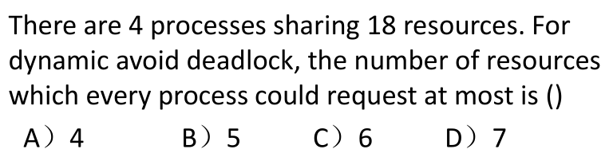

> B
>
> 4(M-1)+1 ≤ 18
> M < 5.25

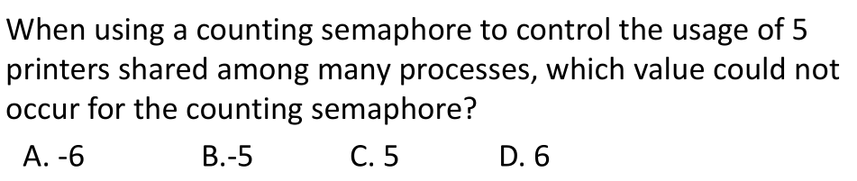

> D
>
> 要小于等于设定的usage值

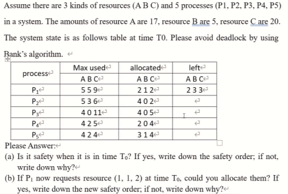

> 银行家算法
> max为总共需要，allocated为已经分配的，left为现有资源，先求need矩阵，为max-allocated
> 然后看如果need小于等于available就可以分配
>
> a.
> 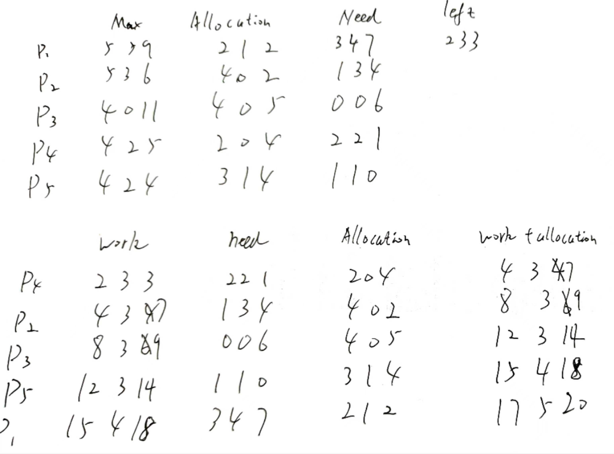
>
> safety order 为p4-p2-p3-p5-p1
>
> b.同理a也是可以的

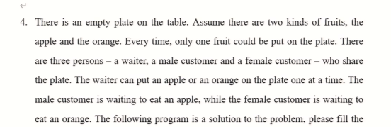

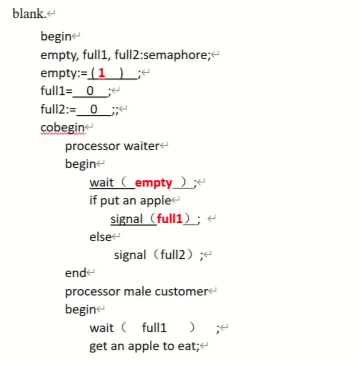

> semophore简单填空即可

# 小测3 memory

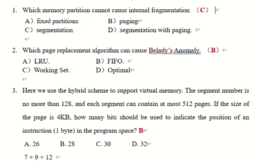

> segement不会造成内碎片
>
> | 分配方式                                   | 内碎片 | 外碎片 | 跨进程共享代码 |
> | ------------------------------------------ | ------ | ------ | -------------- |
> | 固定分区分配 fixed-size blocks             | 是     | 否     | 否             |
> | 可变分区分配 variable partition allocation | 否     | 是     | 否             |
> | 页式分配 page                              | 是     | 否     | 是             |
> | 段式分配 segment                           | 否     | 是     | 是             |
> | 段页式分配 segment-page                    | 是     | 否     | 是             |
>
> FIFO会造成Belady's Anomaly
>
> 2^7 = 128, 2^9=512, 2^12 = 4K

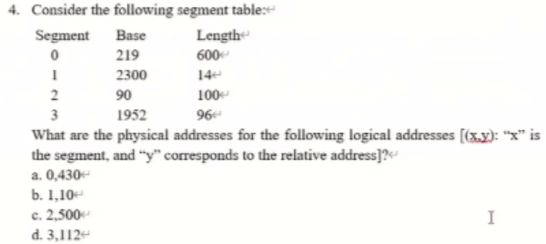

> 看对应segment的length和base推出physical addresses
>
> a 219+430 = 649
> b 2300+10 = 2310
> c 500>length illegal
> d 96>length illegal

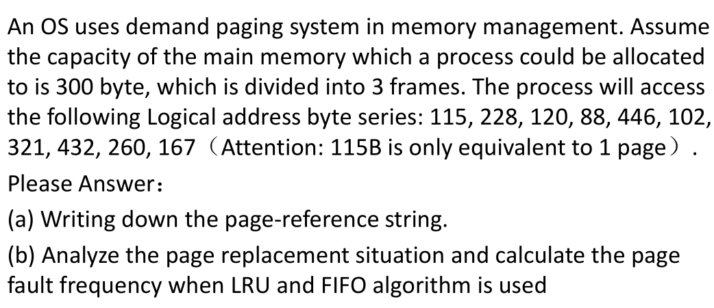

> 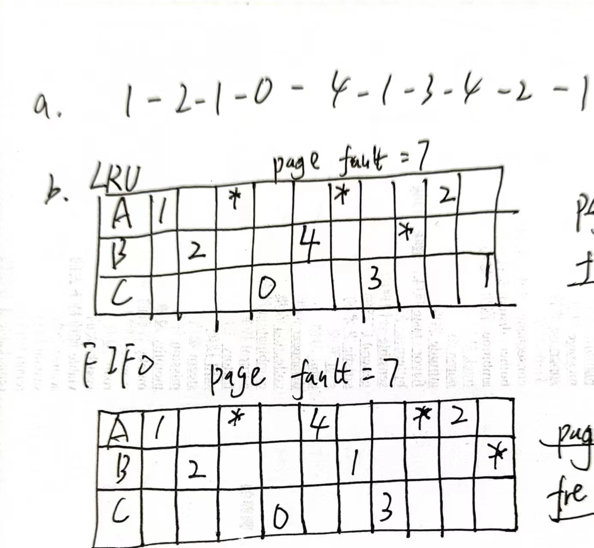

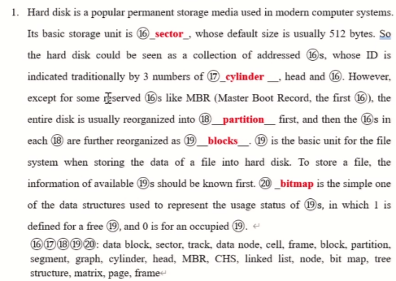

> 就是完形填空

# 小测4 I/O + File System

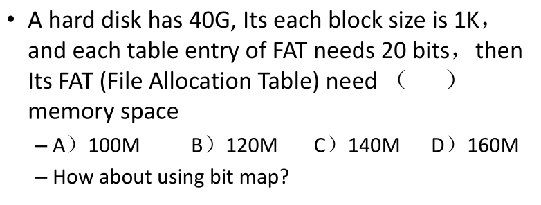

> A
>
> 40G/1K = 40\*2^20
> 40\*2^20\*20bits = 800M bits = 100 M Bytes
>
> bit map = 40K bits = 8 K Bytes

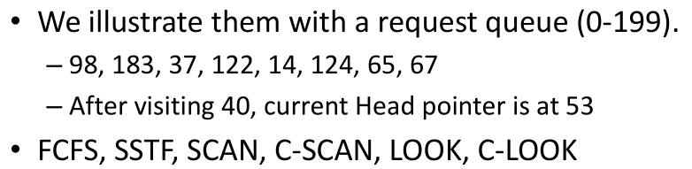

> 很简单直接按照步骤算就行了
> 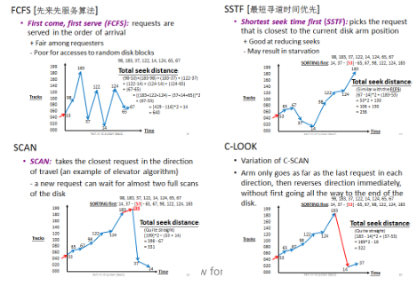

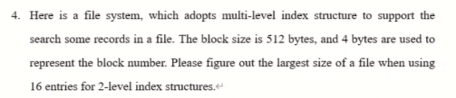

> 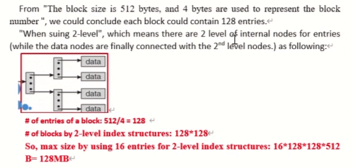
> 每个block能算出可以存128个block的entry
> 第二层的block就是128个
> 第二层的entry就是128\*128个
> 最终计算就是16\*128\*128\*512 bytes = 2^4\*2^7\*2^7\*2^9 = 2^27 bytes = 2^7 MB = 128 MB

