# 概念

## 评估方法

数据集包含1000个样本，其中500个正例，500个反例、将其划分为包含70%样本的训练集和30%样本的测试集用于留出法评估，试估算共有多少种划分方式。

留出法要尽可能保持数据分布的一致性。
因此70%样本的训练集要有700个样本，分别为350个正例和350个反例; 30%的测试集要有300个样本，分别有150个正例和150个反例。

因此共有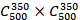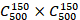种划分方式

# 线性模型

## 一元线性回归

为研究某化学反应过程中，温度x对产品得率y的影响，测得数据如下：

| 温度 | 100  | 110  | 120  | 130  | 140  | 150  | 160  | 170  | 180  | 190  |
| ---- | ---- | ---- | ---- | ---- | ---- | ---- | ---- | ---- | ---- | ---- |
| 得率 | 45   | 51   | 54   | 61   | 66   | 70   | 74   | 78   | 85   | 89   |

根据上述实验数据，建立一元线性回归方程。当温度为200℃时，得率是多少

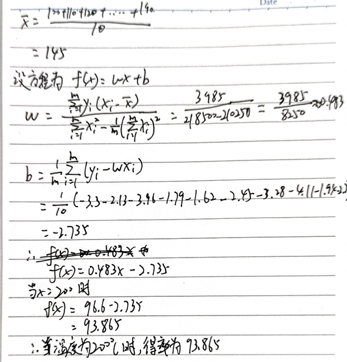

直接使用公式进行求解

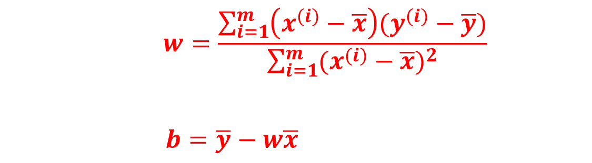

# 感知机和神经网络

## 感知机正常求解

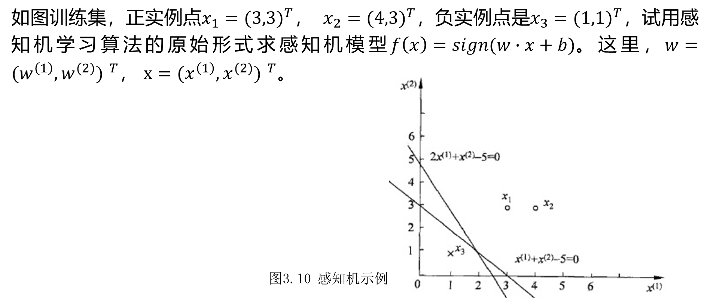

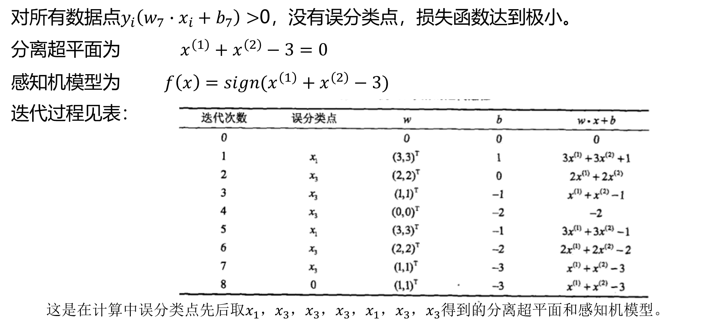

## 感知机对偶形式

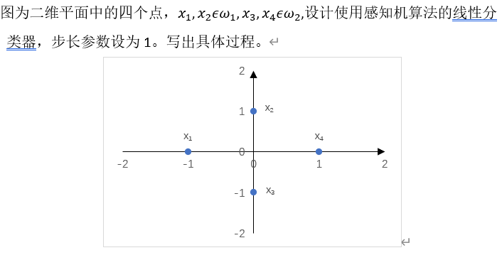

## 感知机求解异或问题

Minsky与Papert指出：感知机因为是线性模型，所以不能表示复杂的函数，如异或（XOR）。（1）验证感知机为什么不能表示异或；（2）设计一个两层感知机用于解决异或问题。

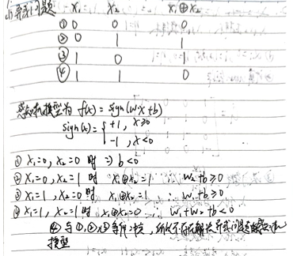

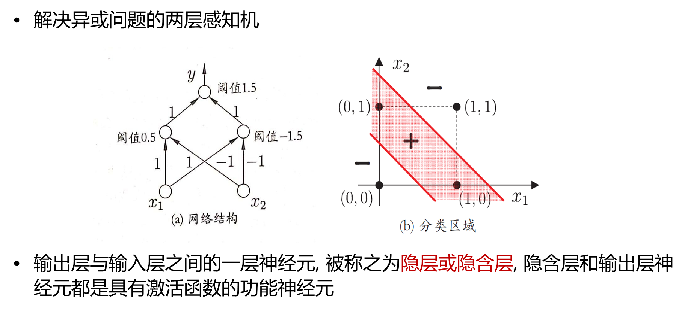

# 支持向量机

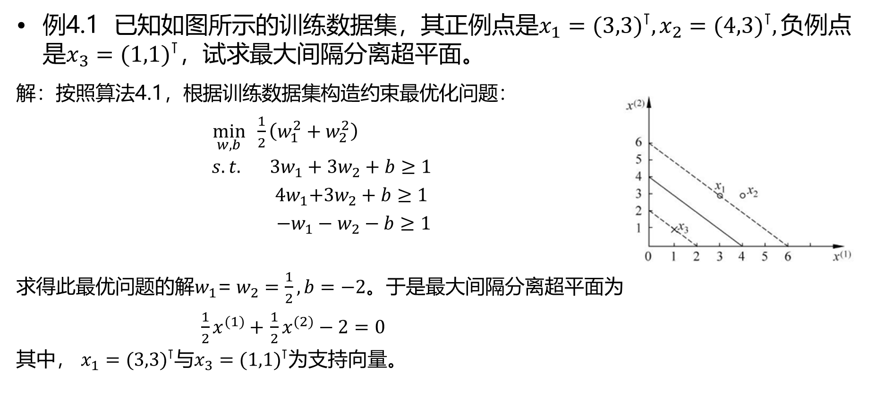

1、已知正例点，，，负例点， 

试求最大间隔分离超平面和分类决策函数,并在图上画出分离超平面、间隔边界及支持向量。

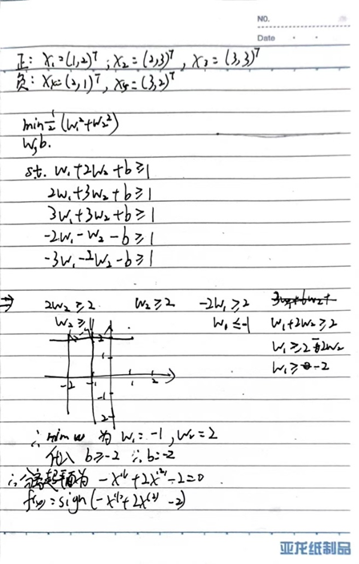

# 贝叶斯分类

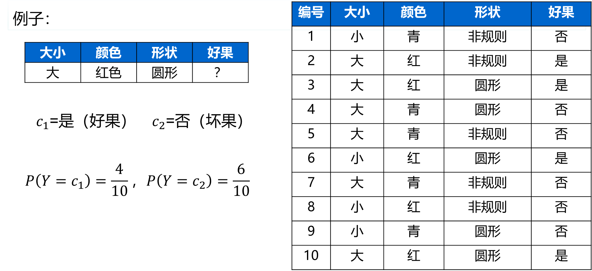

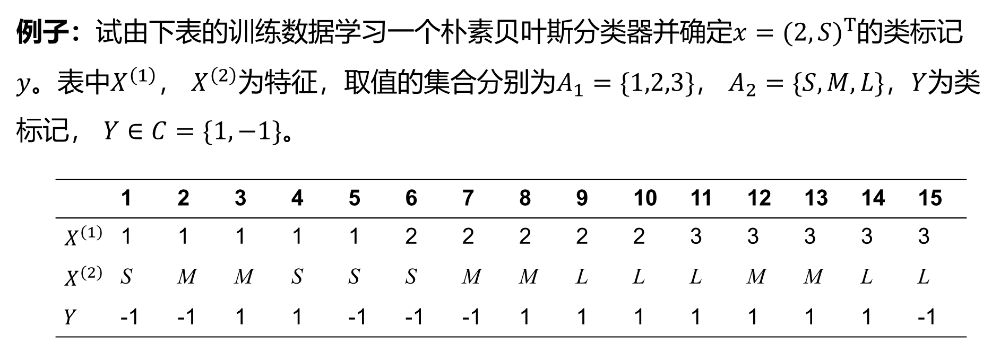

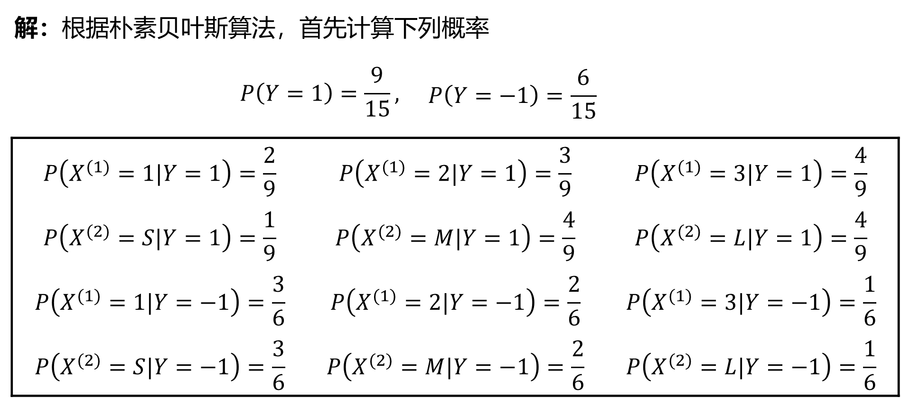

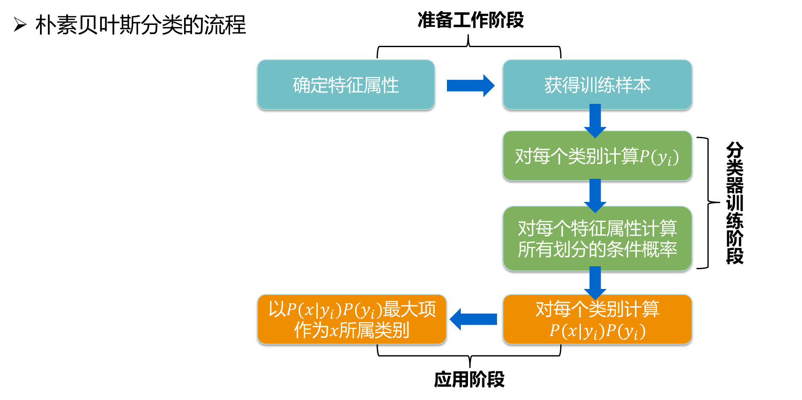

试由下表的训练数据学习一个朴素贝叶斯分类器并确定X=(age="<=30",income="M",student="Y",credit_rating="fair")该样本的buys_computer属性值是啥(Y/N)？

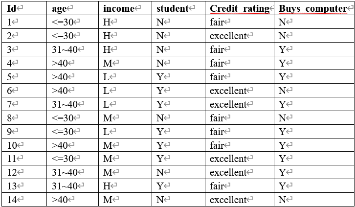

