# 机器学习期末复习

# 线性模型

## 线性回归

线性回归的基本概念、一般形式、向量形式、计算方法

梯度下降-学习率的作用

正则化概念（L1, L2），加正则项的作用

### 线性模型的一般形式与向量形式

一般形式：

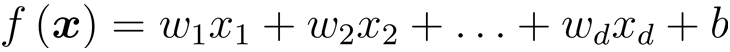

向量形式：

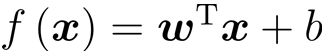

### 计算方法

**梯度下降**：需要选择学习率α，需要多次迭代，当特征数量n大时也能较好适用，适用于各种类型的模型。 

**最小二乘法**：不需要选择学习率α，一次计算得出，需要计算(X^T X)^(-1)，如果特征数量n较大则运算代价大，因为矩阵逆的计算时间复杂度为O(n^3)，通常来说当n小于10000 时还是可以接受的，只适用于线性模型，不适合逻辑回归模型等其他模型。

#### **最小二乘法**

基于均方误差最小化来进行模型求解的方法称为“最小二乘法”

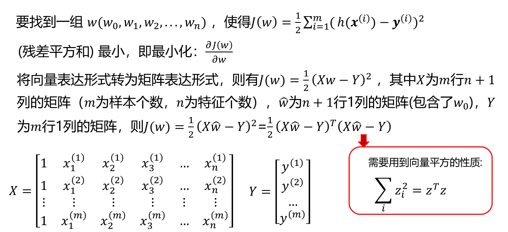

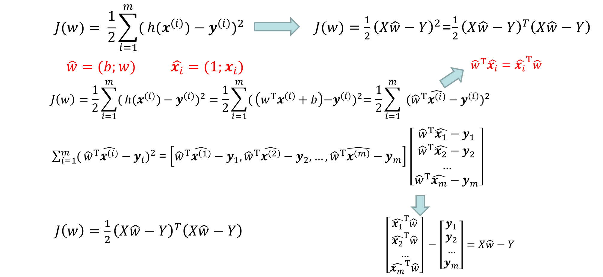

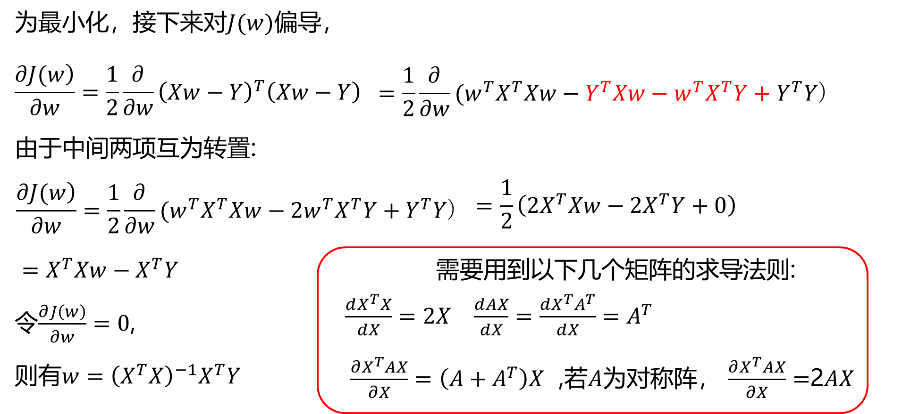

#### **梯度下降**

##### 批量梯度下降 Batch Gradient Descent

梯度下降的每一步中，都用到了**所有**的训练样本

**优点:**

由全体训练集确定的方向能够更好的代表样本总体，从而更准确的朝向极值所在的方向，收敛到全局最小值。

**缺点:**

当样本数m很大时，每次迭代一步都需要对所有样本进行计算，训练过程会很慢。

##### 随机梯度下降 Stochastic Gradient Descent

梯度下降的每一步中，用到一个样本，在每一次计算之后便更新参数 ，而不需要首先将所有的训练集求和

**优点**：

即使是大规模数据集，随机梯度下降法也会很快收敛。

**缺点**：

- 不稳定，因为每一次的方向是不确定的，甚至有可能向反方向前进，准确度下降。
- 可能收敛到局部最优。

##### 小批量梯度下降 Mini-Batch Gradient Descent

梯度下降的每一步中，用到了一定批量的训练样本

### 正则化

正则化(regularization)的技术，保留所有的特征，但是减少参数的大小（magnitude），它可以改善或者减少过拟合问题。

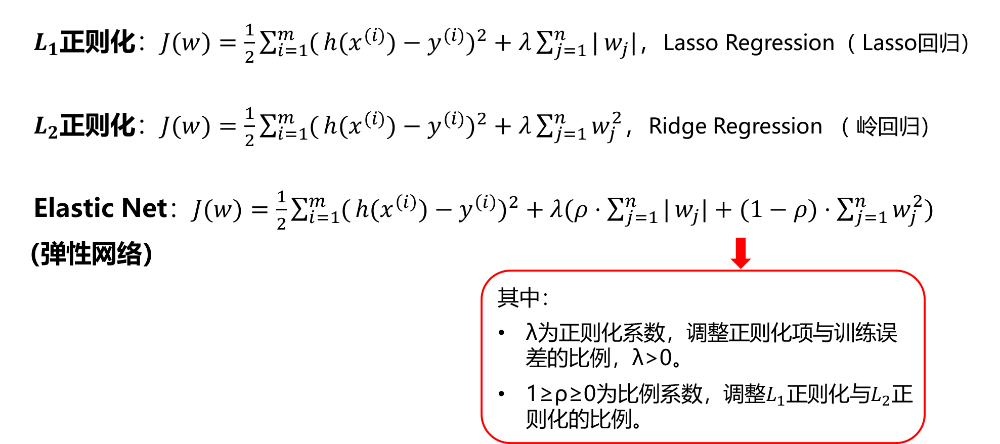

## 逻辑回归

逻辑回归的基本概念、函数形式

### 基本概念

### 函数形式

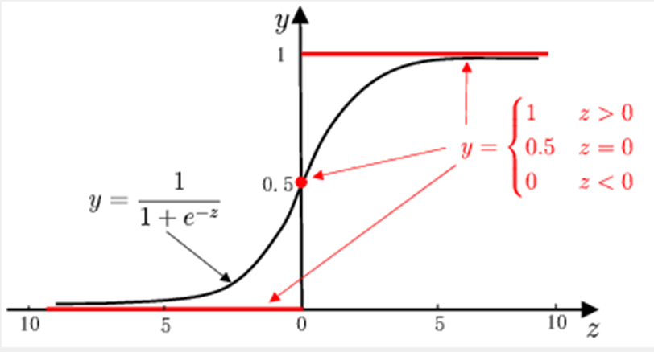

## 线性判别分析

了解

LDA的核心思想
欲使同类样例的投影点尽可能接近，可以让同类样例投影点的协方差尽可能小
欲使异类样例的投影点尽可能远离，可以让不同类中心之间的距离尽可能大

**LDA算法的主要优点:**

- 在降维过程中可以使用类别的先验知识经验。
- LDA在样本分类信息依赖均值而不是方差的时候，比PCA之类的算法较优

**LDA算法的主要缺点:**

- LDA不适合对非高斯分布样本进行降维。
- LDA降维最多降到类别数k-1的维数，如果我们降维的维度大于k-1，则不能使用LDA。当然目前有一些LDA的进化版算法可以绕过这个问题。
- LDA在样本分类信息依赖方差而不是均值的时候，降维效果不好。
- LDA可能过度拟合数据。

# 感知机

## 神经网络发展史/神经元模型

了解

## 感知机模型

感知机模型、作业题

异或问题的处理、设计

对偶形式（先以原始形式为主。有时间再用）

### 感知机模型

感知机是二类分类的线性模型，其输入是实例的特征向量，输出为实例的类别。

f(x)=sign(w∙x+b)

其中w和b为感知机模型参数，w∈R^n叫做权值（weight）或权值向量（weight vector）,b∈R叫做偏置（bias），w∙x表示w和x的内积。sign是符号函数。即
$$
sign(x)=\begin{cases} +1，x≥0\\ -1， u<0\end{cases}
$$

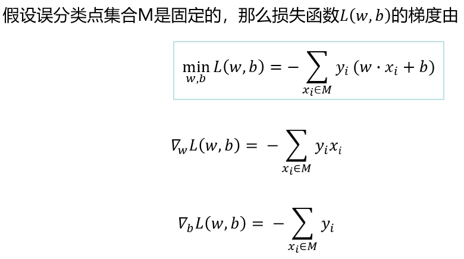

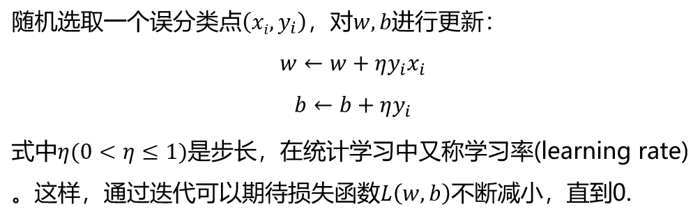

eg.

1. w, b初值为0
2. 带入一个数据，看y(w * x1 + b)是否 ≤ 0，若未能正确分类，更新w, b

#### 算法1 原始形式

#### 算法2 对偶形式

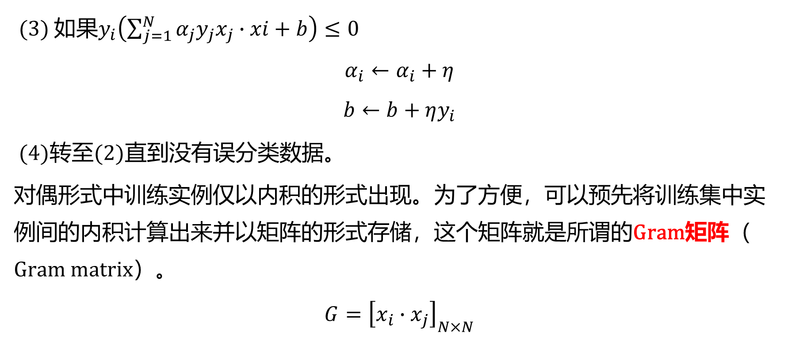

### 作业题

图为二维平面中的四个点，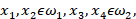设计使用感知机算法的线性分类器，步长参数设为1。写出具体过程。

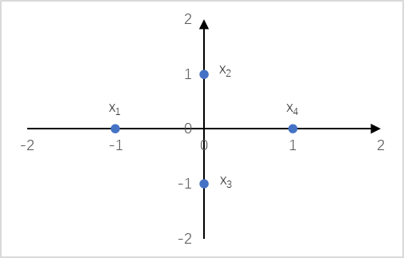

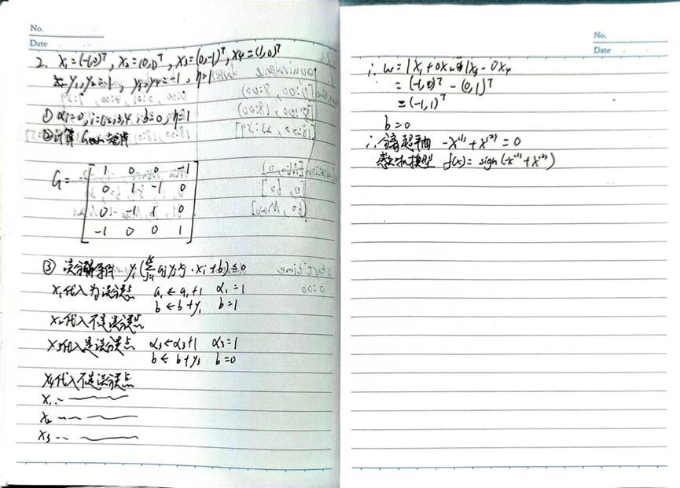

## BP网络...

了解 

# SVM

## SVM相关概念

掌握

## 硬间隔最大化

主要看作业题（对偶不考）

1、已知正例点，，，负例点， 

试求最大间隔分离超平面和分类决策函数,并在图上画出分离超平面、间隔边界及支持向量。

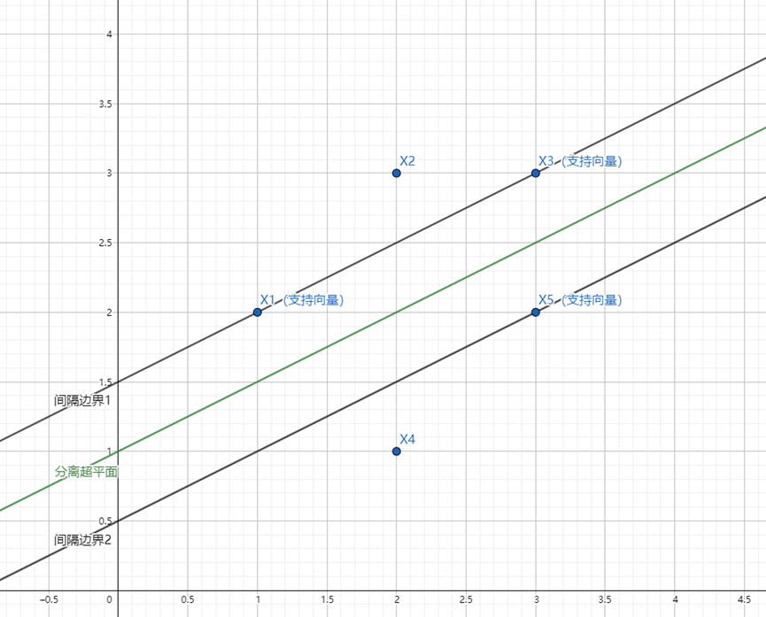

**线性规划**

## 软间隔最大化/核函数

了解

# 贝叶斯分类

## 极大似然估计

会用

## 朴素贝叶斯分类器

掌握，例题会做

直接进行计算

### 作业题

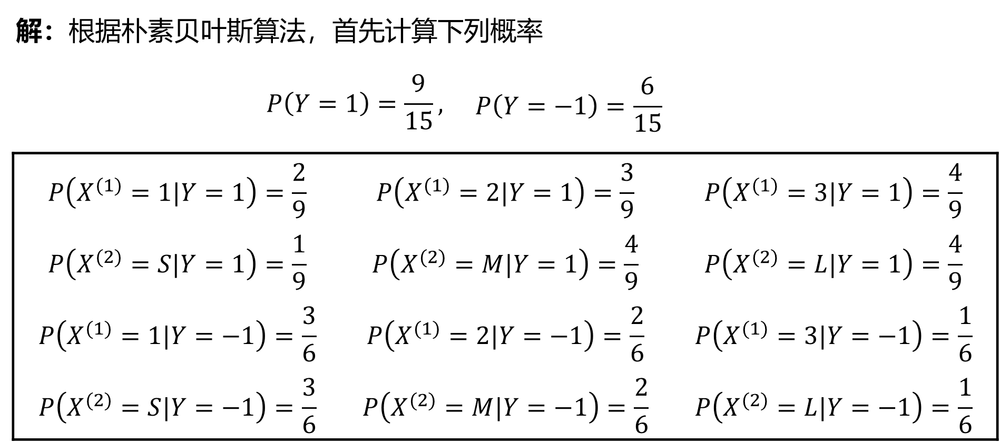

试由下表的训练数据学习一个朴素贝叶斯分类器并确定X=(age="<=30",income="M",student="Y",credit_rating="fair")该样本的buys_computer属性值是啥(Y/N)？

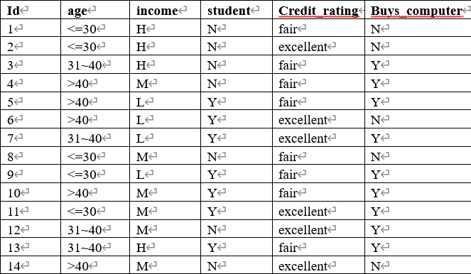

# 决策树

## 特征值选择方法

ID3, C4.5算法，CART（分类参数）

## 剪枝

知道前剪枝和后剪枝

# 集成学习

## AdaBoost、GBDT

主要掌握

## 随机森林

了解

# 聚类

## 原型聚类kmeans

掌握

## 密度聚类DBSCAN

了解算法原理、流程、优势、解决什么问题

# 降维

## KNN

掌握 算法流程

k不同对结果有怎样的影响

## 主成分分析PCA

掌握