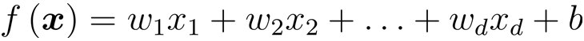
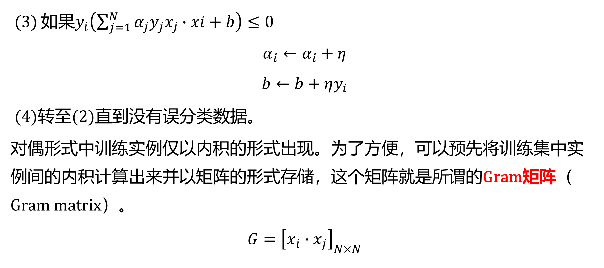
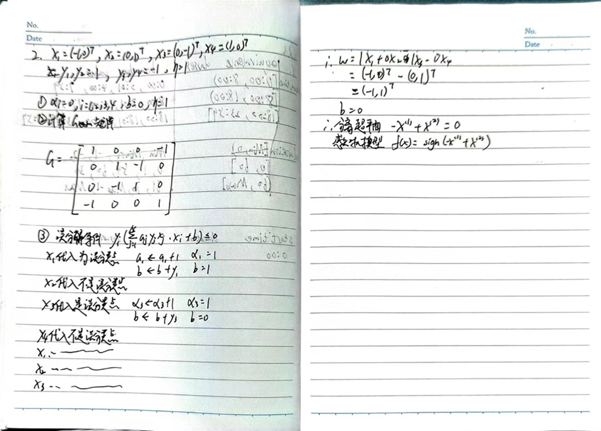
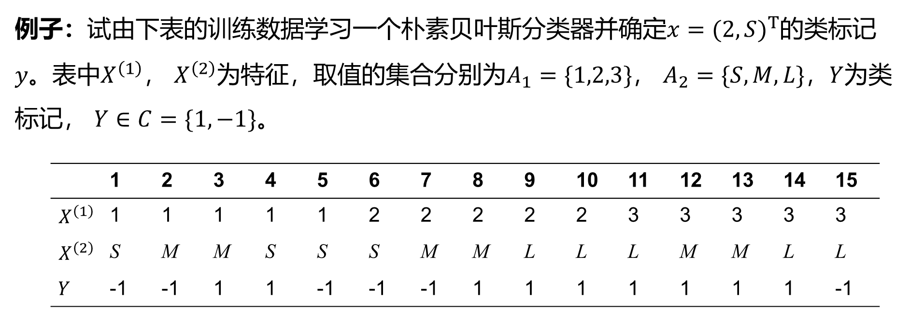
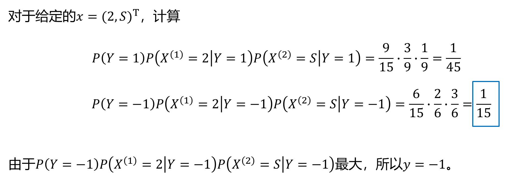
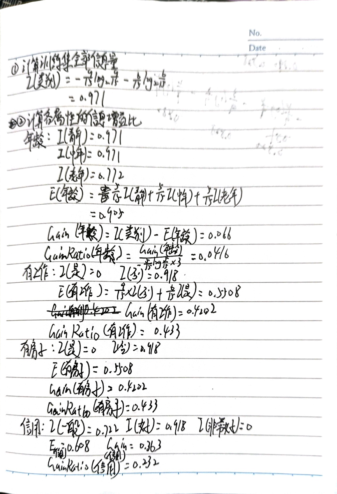

# 机器学习期末复习

# 线性模型

## 线性回归

线性回归的基本概念、一般形式、向量形式、计算方法

梯度下降-学习率的作用

正则化概念（L1, L2），加正则项的作用

### 线性模型的一般形式与向量形式

一般形式：

向量形式：

### 计算方法

**梯度下降**：需要选择学习率α，需要多次迭代，当特征数量n大时也能较好适用，适用于各种类型的模型。 

**最小二乘法**：不需要选择学习率α，一次计算得出，需要计算(X^T X)^(-1)，如果特征数量n较大则运算代价大，因为矩阵逆的计算时间复杂度为O(n^3)，通常来说当n小于10000 时还是可以接受的，只适用于线性模型，不适合逻辑回归模型等其他模型。

#### **最小二乘法**

基于均方误差最小化来进行模型求解的方法称为“最小二乘法”

#### **梯度下降**

##### 批量梯度下降 Batch Gradient Descent

梯度下降的每一步中，都用到了**所有**的训练样本

**优点:**

由全体训练集确定的方向能够更好的代表样本总体，从而更准确的朝向极值所在的方向，收敛到全局最小值。

**缺点:**

当样本数m很大时，每次迭代一步都需要对所有样本进行计算，训练过程会很慢。

##### 随机梯度下降 Stochastic Gradient Descent

梯度下降的每一步中，用到一个样本，在每一次计算之后便更新参数 ，而不需要首先将所有的训练集求和

**优点**：

即使是大规模数据集，随机梯度下降法也会很快收敛。

**缺点**：

- 不稳定，因为每一次的方向是不确定的，甚至有可能向反方向前进，准确度下降。
- 可能收敛到局部最优。

##### 小批量梯度下降 Mini-Batch Gradient Descent

梯度下降的每一步中，用到了一定批量的训练样本

### 正则化

正则化(regularization)的技术，保留所有的特征，但是减少参数的大小（magnitude），它可以改善或者减少过拟合问题。

## 逻辑回归

逻辑回归的基本概念、函数形式

### 基本概念

### 函数形式

## 线性判别分析

了解

LDA的核心思想
欲使同类样例的投影点尽可能接近，可以让同类样例投影点的协方差尽可能小
欲使异类样例的投影点尽可能远离，可以让不同类中心之间的距离尽可能大

**LDA算法的主要优点:**

- 在降维过程中可以使用类别的先验知识经验。
- LDA在样本分类信息依赖均值而不是方差的时候，比PCA之类的算法较优

**LDA算法的主要缺点:**

- LDA不适合对非高斯分布样本进行降维。
- LDA降维最多降到类别数k-1的维数，如果我们降维的维度大于k-1，则不能使用LDA。当然目前有一些LDA的进化版算法可以绕过这个问题。
- LDA在样本分类信息依赖方差而不是均值的时候，降维效果不好。
- LDA可能过度拟合数据。

# 感知机

## 神经网络发展史/神经元模型

了解

## 感知机模型

感知机模型、作业题

异或问题的处理、设计

对偶形式（先以原始形式为主。有时间再用）

### 感知机模型

感知机是二类分类的线性模型，其输入是实例的特征向量，输出为实例的类别。

f(x)=sign(w∙x+b)

其中w和b为感知机模型参数，w∈R^n叫做权值（weight）或权值向量（weight vector）,b∈R叫做偏置（bias），w∙x表示w和x的内积。sign是符号函数。即
$$
sign(x)=\begin{cases} +1，x≥0\\ -1， u<0\end{cases}
$$

eg.

1. w, b初值为0
2. 带入一个数据，看y(w * x1 + b)是否 ≤ 0，若未能正确分类，更新w, b

#### 算法1 原始形式

#### 算法2 对偶形式

### 作业题

图为二维平面中的四个点，设计使用感知机算法的线性分类器，步长参数设为1。写出具体过程。

## BP网络...

了解 

# SVM

## SVM相关概念

掌握

## 硬间隔最大化

主要看作业题（对偶不考）

1、已知正例点，，，负例点， 

试求最大间隔分离超平面和分类决策函数,并在图上画出分离超平面、间隔边界及支持向量。

**线性规划**

## 软间隔最大化/核函数

了解

# 贝叶斯分类

## 极大似然估计

会用

## 朴素贝叶斯分类器

掌握，例题会做

直接进行计算

### 作业题

试由下表的训练数据学习一个朴素贝叶斯分类器并确定X=(age="<=30",income="M",student="Y",credit_rating="fair")该样本的buys_computer属性值是啥(Y/N)？

# 决策树

## 特征值选择方法

ID3, C4.5算法，CART（分类参数）

### ID3

ID3算法的基本思想是：以信息熵为度量，用于决策树节点的属性选择，每次优先选取信息量最多的属性，亦即能使熵值变为最小的属性，以构造一棵熵值下降最快的决策树，到叶子节点处的熵值为0。此时，每个叶子节点对应的实例集中的实例属于同一类。，其大致步骤为：

1.初始化特征集合和数据集合；

2.计算数据集合**信息熵**和所有特征的**条件熵**，选择**信息增益**最大的特征作为当前决策节点；

3.更新数据集合和特征集合（删除上一步使用的特征，并按照特征值来划分不同分支的数据集合）；

4.重复 2，3 两步，若子集值包含单一特征，则为分支叶子节点。

### C4.5

用信息增益率来选择属性，克服了用信息增益选择的不足。
定义：信息增益与训练数据集D关于特征A的值的熵之比

### 作业题

根据表1中所给的训练数据集，利用信息增益比（C4.5算法）生成决策树。表1是一个由15个样本组成的贷款申请训练数据。数据包括贷款申请人的4个特征（属性）：第1个特征是年龄，有3个可能值：青年，中年，老年；第2个特征是有工作，有2个可能值：是，否；第3个特征是有自己的房子，有2个可能值：是，否；第4个特征是信贷情况，有3个可能值：非常好，好，一般。表的最后一列是类别，是否同意贷款，取2个值：是，否。

## 剪枝

知道前剪枝和后剪枝

### 预剪枝

预剪枝不仅可以降低过拟合的风险而且还可以减少训练时间，但另一方面，它是基于“贪心”策略，会带来欠拟合风险。

#### 剪枝策略

在节点划分前确定是否继续增长，及早停止增长

#### 主要方法

•节点内数据样本低于某一阈值；

•限定决策树的深度；

•节点划分前准确率比划分后准确率高。

### 后剪枝

在已经生成的决策树上进行剪枝，从而得到简化版的剪枝决策树。
后剪枝决策树通常比预剪枝决策树保留了更多的分支。
一般情况下，后剪枝的欠拟合风险更小，泛化性能往往优于预剪枝决策树。

C4.5 采用的悲观剪枝方法，用递归的方式自底向上针对每一个非叶子节点，评估用一个最佳叶子节点去代替这课子树是否有益。如果剪枝后与剪枝前相比其错误率是保持或者下降，则这棵子树就可以被替换掉。C4.5 通过训练数据集上的错误分类数量来估算未知样本上的错误率。

# 集成学习

## AdaBoost、GBDT

主要掌握

### AdaBoost算法思想

初始化训练样本的权值分布，使每个样本具有相同权重；
训练弱分类器，如果样本分类正确，则在构造下一个训练集时，它的权值就会被降低，反之提高；
用更新过的样本集去训练下一个分类器；
将所有弱分类组合成强分类器，各个弱分类器的训练过程结束后，加大分类误差率小的弱分类器的权重，降低分类误差率大的弱分类器的权重。

### GBDT

GBDT是一种迭代的决策树算法，该算法由多棵决策树组成，GBDT 的核心在于累加所有树的结果作为最终结果，所以 GBDT 中的树都是**回归树**，不是分类树，它是属于 Boosting 策略。GBDT 是被公认的泛化能力较强的算法。

## 随机森林

了解

用随机的方式建立一个森林。随机森林算法由很多决策树组成，每一棵决策树之间没有关联。建立完森林后，当有新样本进入时，每棵决策树都会分别进行判断，然后基于投票法给出分类结果。

优点
1.在数据集上表现良好，相对于其他算法有较大的优势
2.易于并行化，在大数据集上有很大的优势；
3.能够处理高维度数据，不用做特征选择。

# 聚类

## 原型聚类kmeans

掌握

K-means算法是一种**无监督学习**方法，是最普及的聚类算法，算法使用一个**没有标签**的数据集，然后将数据聚类成不同的组。
K-means算法具有一个迭代过程，在这个过程中，数据集被分组成若干个预定义的不重叠的聚类或子组，使簇的内部点尽可能相似，同时试图保持簇在不同的空间，它将数据点分配给簇，以便**簇的质心和数据点之间的平方距离之和最小**，在这个位置，簇的质心是簇中数据点的算术平均值。

### 算法流程

1. 选择K个点作为初始质心。

2. 将每个点指派到最近的质心，形成K个簇。 

3. 对于上一步聚类的结果，进行平均计算，得出该簇的新的聚类中心。

4. 重复上述两步/直到迭代结束：质心不发生变化。

### 作业题

试用k均值算法将下列样本聚到2个类中。

## 密度聚类DBSCAN

了解算法原理、流程、优势、解决什么问题

### DBSCAN原理

与划分和层次聚类方法不同，DBSCAN(Density-Based Spatial Clustering of Applications with Noise)是一个比较有代表性的基于密度的聚类算法。它将簇定义为密度相连的点的最大集合，能够把具有**足够高密度的区域划分为簇**，并可**在噪声的空间数据库中发现任意形状的聚类**。
**密度：**空间中任意一点的密度是以该点为圆心，以**扫描半径**构成的圆区域内包含的点数目。

DBSCAN使用**两个超参数**：|
扫描半径 (eps)和最小包含点数(minPts)来获得簇的数量，而不是猜测簇的数目。

**扫描半径(eps)** **:**
用于定位点/检查任何点附近密度的距离度量，即扫描半径。

**最小包含点数(minPts)**：
聚集在一起的最小点数（阈值），该区域被认为是稠密的。

### DBSCAN流程

DBSCAN算法将数据点分为三类：
1.**核心点**：在半径Eps内含有超过MinPts数目的点。
2.**边界点：**在半径Eps内点的数量小于MinPts,但是落在核心点的邻域内的点。
3.**噪音点：**既不是核心点也不是边界点的点。

**算法流程：**

1. 将所有点标记为核心点、边界点或噪声点；

2. 如果选择的点是核心点，则找出所有从该点出发的密度可达对象形成簇；

3. 如果该点是非核心点，将其指派到一个与之关联的核心点的簇中；

4. 重复以上步骤，直到所点都被处理过

### 优势

1.基于密度的层次聚类方法。
2.重点在于它可以将相关数据处理为几个高密度区域。
3.其中一项优势是无需定义聚类个数，而是根据样本分布自动划分。

### 解决什么问题

当数据的空间距离具有显著的集群特性时，例如500个单一类别的样本可用密度聚类技术将它们划分成多个不同的子类。此外，在高斯混合模型中，也非常适用于对数据进行划分。

# 降维

## KNN

掌握 算法流程

**k近邻法**是一种比较成熟也是最简单的机器学习算法，可以用于基本的分类与回归方法。
投票法：选择这**k**个样本中出现最多的类别标记作为预测结果。**（分类任务）**
平均法：将这**k**个样本的实值输出标记的平均值作为预测结果。**（回归任务）**

### 算法流程

算法流程如下：

1.计算测试对象到训练集中每个对象的距离；

2.按照距离的远近排序；

3.选取与当前测试对象最近的k的训练对象，作为该测试对象的邻居；

4.统计这k个邻居的类别频次；

5.k个邻居里频次最高的类别，即为测试对象的类别；

### k不同对结果有怎样的影响

如果k值过小，则模型可能过于敏感，容易受到噪声的影响，导致模型的分类准确率降低。反之，如果k值过大，则模型可能过于平滑，容易把不同类别的样本混淆，导致模型的分类准确率也降低。

## 主成分分析PCA

掌握

**主成分分析（****Principal Component Analysis,****PCA）**是一种降维方法，通过将一个大的特征集转换成一个较小的特征集，这个特征集**仍然包含了原始数据中的大部分信息**，从而降低了原始数据的维数。

### 算法流程

### 作业题

