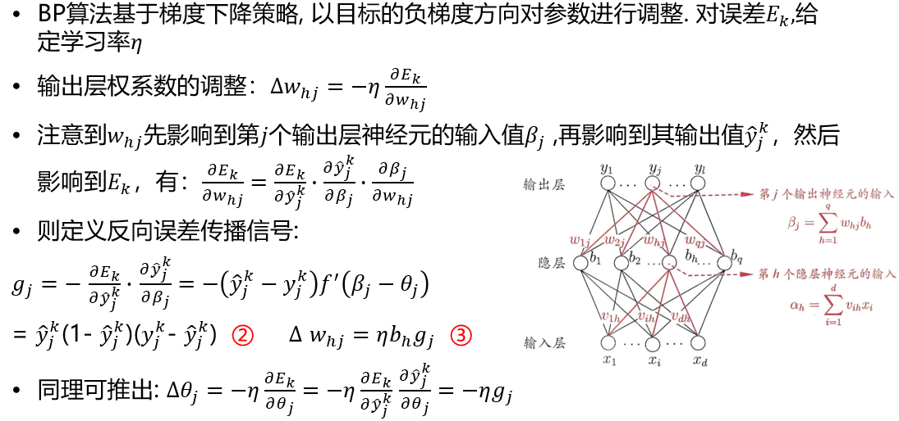
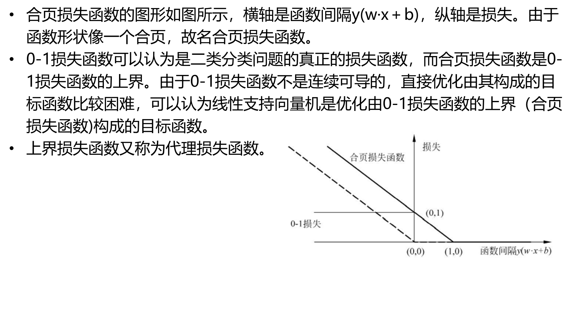
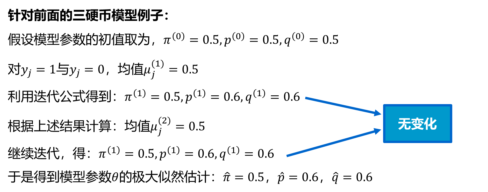
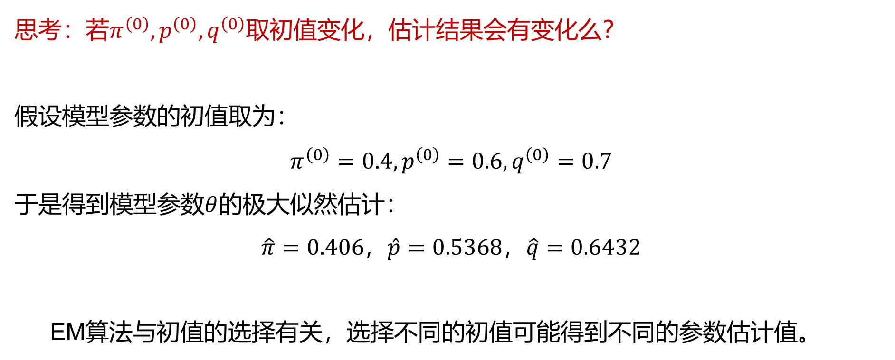

[TOC]

陆帅冰
lushuaibing@bjut.edu.cn

# 课程目标

- 掌握**机器学习基础理论和专业核心知识**，熟悉机器学习的发展现状和趋势，并能够将机器学习知识应用于分析和解决复杂软件工程问题。

- 掌握**机器学习算法的优缺点与适用场景**，能够对复杂软件工程问题进行识别、分析、归类和表达，进而完成文献研究、技术选型和方案比较。

- 能够**运用机器学习算法针对实际问题进行实验研究**，对实验结果进行分析、解释和评价，进而获得实验结论。（4次实验）

# 主要内容

- 基本概念
- 线性模型
- 感知机
- 支持向量机
- 贝叶斯分类
- 决策树
- 集成学习
- 聚类
- 降维
- 半监督学习

# 参考文献

# 考核方式

- 作业 20% （7/8次）
- 实验 30% （4次）
- 考试（未确定） 50%

# 1. 绪论

## 1.1 机器学习概述

## 1.2 机器学习的类型

- 

## 1.3 机器学习的基本术语

### 基本用语

- **数据集**: 数据的集合，分为训练集、测试集。
- **示例/样本**: 数据集中，每条记录都是关于一个事件或者一个对象（这里是一个西瓜）的描述，因此这里的每条记录都被称为“示例或样本”。
- **特征/属性**: 反应对象或者事件在某方面的表现或性质。
- **标记**: 关于示例的结果的信息。比如:(色泽=青绿;根蒂=蜷缩;敲声=沉闷)，好瓜在这里，"好瓜"就是这个示例的标记。
- **标记空间\输出空间**: 所有标记的集合。
- **样例**: 一个示例拥有了标记，就称它为“样例”。
- **学习/训练**: 从数据里学得模型的过程（通过执行某个学习算法来完成)。
- **训练数据**: 训练过程中使用的数据集合。
- **训练样本/训练示例**: 训练过程当中的每个样本。
- **训练集**: 训练样本组成的集合。
- **测试**: 用模型进行预测的过程。
- **测试数据**: 测试过程中使用的数据集合。
- **测试样本/预测示例**: 被预测的样本。
- **测试集**: 测试样本组成的集合。

## 任务

- 分类：离散值
  - 二分类
  - 多分类
- 回归：连续值，即结果是一个连续数字的值，而非一个类别。
- 聚类：无标记信息

### 泛化能力

机器学习的目标是使得学到的模型能很好的适用于“新样本”,而不仅仅是训练集合，我们称模型适用于新样本的能力为泛化(generalization)能力。

### 假设空间

### 版本空间

### 归纳偏好

**归纳偏好：**机器学习算法在学习过程中对某种类型假设的偏好

### No Free Lunch

一个算法ε_a如果在某些问题上比另一个算法ε_b好，必然存在另一些问题，ε_b比ε_a好,也即没有免费的午餐定理。

考虑二分类问题，目标函数可以为任何函数x↦{0,1},函数空间为〖{0,1}〗^(|x|)，对所有可能f按均匀分布对误差求和,有：

### 统计学习三要素

#### 模型

最终得到的用于预测的规律或经验。例如：*y*=*x*+1。

#### 策略

选择模型时使用的准则，即通过什么准则从候选模型集合中选出最终的模型。

- 损失函数：度量模型**一次**预测的好坏
- 风险函数：度量**平均意义下**模型预测的好坏

#### 算法

求解最优模型的算法，主要关注如何更快更好的选出最优模型。算法针对策略。

## 1.4 机器学习的开发流程

1. 数据搜集
2. 数据清洗
3. 特征工程
4. 数据建模

**实现统计机器学习方法的步骤如下：**

1. 得到一个有限的训练数据集合；

2. 确定包含所有可能的模型的假设空间，即学习模型的集合；

3. 确定模型选择的准则，即学习的策略；

4. 实现求解最优模型的算法，即学习的算法；

5. 通过学习方法选择最优模型；

6. 利用学习的最优模型对新数据进行预测或分析。

## 1.5 模型的评估与选择

- **错误率:** 分类错误的样本数占样本总数的比例。
  - 例如: m个样本中有a个样本分类错误，则错误率为:E=a/m
- **精度：**分类正确的样本数占样本总数的比例。
  - 即:精度=1-错误率=1-E
- **误差：**样本真实输出与预测输出之间的差异
  - 训练(经验)误差：训练集上
  - 测试误差：测试集
  - 泛化误差：除训练集外所有样本
- **过拟合：**学习器把训练样本学习的“太好”，将训练样本本身的特点当做所有样本的一般性质，导致泛化性能下降
  - 优化目标加正则项
  - early stop
- **欠拟合：**对训练样本的一般性质尚未学好
  - 决策树：拓展分支
  - 神经网络：增加训练轮数

### 评估方法 - 留出法

- 直接将数据集划分为两个互斥集合
- 训练/测试集划分要尽可能保持数据分布的一致性
- 一般若干次随机划分、重复实验取平均值
- 训练/测试样本比例通常为2:1~4:1

### 评估方法 - 交叉验证法

将数据集分层采样划分为k个大小相似的互斥子集，每次用k-1个子集的并集作为训练集，余下的子集作为测试集，最终返回k个测试结果的均值，k最常用的取值是10。

假设数据集D包含m个样本，若令k=m ，则得到留一法：

- 不受随机样本划分方式的影响
- 结果往往比较准确
- 当数据集比较大时，计算开销难以忍受

### 评估方法 - 自助法

“自助法”以自助采样法为基础，给定包含m个样本的数据集D ，对它进行采样，然后再将该样本放回初始数据集D中,使得该样本下次采样时仍有可能被采到；这个过程重复执行m次后，我们就得到了包含m个样本的数据集D'

- 从初始数据集中产生多个不同的训练集，对集成学习有很大的好处
- 自助法在数据集较小、难以有效划分训练/测试集时很有用
- 由于改变了数据集分布可能引入估计偏差，在数据量足够时，留出法和交叉验证法更常用

### 性能度量

#### 回归任务 - 均方误差

#### 分类任务 - 错误率、精度

- 错误率：分错样本占样本总数的比例
  
- 精度：分对样本占样本总数的比例
  

#### 分类任务 - 查准率、查全率

根据学习器的预测结果按正例可能性大小对样例进行排序，并逐个把样本作为正例进行预测，则可以得到查准率-查全率曲线，简称“P-R曲线”

#### 分类任务 - F1 、Fβ

比P-R曲线平衡点更用常用的是**F1**度量：

比F_1更一般的形式 **Fβ**,

 β=1：标准F_1 : 偏重查全率

 β>1：偏重查全率R(逃犯信息检索)

 β<1：偏重查准率P(商品推荐系统）

#### 分类任务 - TPR、FPR、ROC曲线

类似P-R曲线，根据学习器的预测结果对样例排序，并逐个作为正例进行预测，以“假正例率”为横轴，“真正例率”为纵轴可得到ROC（Receiver Operating Characteristic）曲线，全称“受试者工作特征”.

若某个学习器的ROC曲线被另一个学习器的曲线“包住”，则后者性能优于前者；否则如果曲线交叉，可以根据ROC曲线下面积大小进行比较，也即AUC值.

    很多个梯形求面积

#### 代价敏感错误率

    非均等代价情况下使用

现实任务中不同类型的错误所造成的后果很可能不同，为了权衡不同类型错误所造成的不同损失，可为错误赋予“非均等代价”。

#### 代价曲线

代价曲线图的绘制：ROC曲线上每个点对应了代价曲线上的一条线段，设ROC曲线上点的坐标为(FPR,TPR),则可相应计算出FNR,然后在代价平面上绘制一条从(0,FPR)到(1,FNR)的线段，线段下的面积即表示了该条件下的期望总体代价；如此将ROC曲线上的每个点转化为代价平面上的一条线段，然后取所有线段的下界，围成的面积即为所有条件下学习器的期望总体代价。

#### 偏差与方差

通过实验可以估计学习算法的泛化性能，而“偏差-方差分解”可以用来帮助解释泛化性能。

期望输出与真实标记的差别称为偏差，即〖bias〗^2 (x)=(f ̅〖(x)-y)〗^2为便与讨论，假定噪声期望为0，也即E_D [y_D-y]=0, 对泛化误差分解

**偏差**度量了学习算法期望预测与真实结果的偏离程度；即刻画了学习算法本身的拟合能力；

**方差**度量了同样大小训练集的变动所导致的学习性能的变化；即刻画了数据扰动所造成的影响；

**噪声**表达了在当前任务上任何学习算法所能达到的期望泛化误差的下界；即刻画了学习问题本身的难度。

- 在训练不足时，学习器拟合能力不强，训练数据的扰动不足以使学习器的拟合能力产生显著变化，此时偏差主导泛化错误率；

- 随着训练程度加深，学习器拟合能力逐渐增强，方差逐渐主导泛化错误率；

- 训练充足后，学习器的拟合能力非常强，训练数据的轻微扰动都会导致学习器的显著变化，若训练数据自身非全局特性被学到则会发生过拟合。

# 2. 线性模型

## 2.1 线性回归

### 2.1.1 线性回归概述

#### 概念

是一种通过属性的线性组合来进行预测的**线性模型**，其目的是找到一条直线或者一个平面或者更高维的超平面，**使得预测值与真实值之间的误差最小化**。

#### 优点

- 形式简单、易于建模
- 可解释性
- 非线性模型的基础
  - 引入层级结构或高维映射

#### 推导

**推导**

#### 算法流程

**最小二乘法推导**

#### 广义线性模型

### 2.1.2 梯度下降

- **批量梯度下降**（Batch Gradient Descent,BGD）
  梯度下降的每一步中，都用到了**所有**的训练样本
  

  **优点:**

  由全体训练集确定的方向能够更好的代表样本总体，从而更准确的朝向极值所在的方向，收敛到全局最小值。

  **缺点:**

  当样本数m很大时，每次迭代一步都需要对所有样本进行计算，训练过程会很慢。

- **随机梯度下降**（Stochastic Gradient Descent,SGD）
  梯度下降的每一步中，用到一个样本，在每一次计算之后便更新参数 ，而不需要首先将所有的训练集求和
  
  

  **优点**：

  即使是大规模数据集，随机梯度下降法也会很快收敛。

  **缺点**：

  - 不稳定，因为每一次的方向是不确定的，甚至有可能向反方向前进，准确度下降。
  - 可能收敛到局部最优。

- **小批量梯度下降**（Mini-Batch Gradient Descent,MBGD）
  梯度下降的每一步中，用到了一定批量的训练样本
  

**梯度下降**：需要选择学习率α，需要多次迭代，当特征数量n大时也能较好适用，适用于各种类型的模型。 

**最小二乘法**：不需要选择学习率α，一次计算得出，需要计算(X^T X)^(-1)，如果特征数量n较大则运算代价大，因为矩阵逆的计算时间复杂度为O(n^3)，通常来说当n小于10000 时还是可以接受的，只适用于线性模型，不适合逻辑回归模型等其他模型。

### 2.1.3 正则化

#### 归一化

**需要做数据归一化/标准化**

线性模型，如基于距离度量的模型包括KNN(K近邻)、K-means聚类、感知机和SVM。另外，线性回归类的几个模型一般情况下也是需要做数据归一化/标准化处理的。

**不需要做数据归一化/标准化**

决策树、基于决策树的Boosting和Bagging等集成学习模型对于特征取值大小并不敏感，如随机森林、XGBoost、LightGBM等树模型，以及朴素贝叶斯，以上这些模型一般不需要做数据归一化/标准化处理。

#### 过拟合的处理

**1.获得更多的训练数据**
使用更多的训练数据是解决过拟合问题最有效的手段，因为更多的
样本能够让模型学习到更多更有效的特征，减小噪声的影响。

2.降维
即丢弃一些不能帮助我们正确预测的特征。可以是手工选择保留哪些特征，或者使用一些模型选择的算法来帮忙（例如PCA）。

**3.正则化**
正则化(regularization)的技术，保留所有的特征，但是减少参数的大小（magnitude），它可以改善或者减少过拟合问题。

4.集成学习方法
集成学习是把多个模型集成在一起，来降低单一模型的过拟合风险。

#### 欠拟合的处理

**1.添加新特征**
当特征不足或者现有特征与样本标签的相关性不强时，模型容易出现欠拟合。通过挖掘组合特征等新的特征，往往能够取得更好的效果。

2.增加模型复杂度
简单模型的学习能力较差，通过增加模型的复杂度可以使模型拥有更强的拟合能力。例如，在线性模型中添加高次项，在神经网络模型中增加网络层数或神经元个数等。

3.减小正则化系数
正则化是用来防止过拟合的，但当模型出现欠拟合现象时，则需要有针对性地减小正则化系数。

#### 正则化

### 2.1.4 回归的评价指标

#### 均方误差MSE

MSE越小越好，说明该模型描述实验数据具有更好的精度。

缺点：MSE里面带着平方，会改变量纲；

#### 均方根误差RMSE

**优点：**RMSE的存在是开完根号之后，误差的结果就和数据是一个单位级别的，可以更好的描述数据。

**缺点：**RMSE/MSE对一组测量中对特大/特小误差反映特别敏感，这种局限性常常发生在短时间内变化比较大的数据上，如风电预测、访问量预测等。

#### 平均绝对误差MAE

**预测值和真实值之差的绝对值求平均。**

**MAE越小越好**，但是不常用，**因为它不能求导。**

#### R方RSquare

## 2.2 逻辑回归

### 2.2.1 分类问题

- 二分类
- 多类分类

### 2.2.2 逻辑回归概述

逻辑回归的应用场景：

- 广告点击率
- 是否为垃圾邮件
- 是否患病
- 金融诈骗
- 虚假账号

- 单位阶跃函数缺点
  **不连续**
- 替代函数：对数几率函数（是一种Sigmoid函数）
  **单调可微、任意阶可导**

### 2.2.3 逻辑回归求解

**损失函数**

为了衡量算法在全部训练样本上的表现如何，我们需要定义一个算法的代价函数，算法的代价函数是对m个样本的损失函数求和然后除以m: 

**代价函数**

**代价函数求解过程**

**梯度下降求解过程**

## 2.3 线性判别分析

LDA的核心思想

- 欲使同类样例的投影点尽可能接近，可以让同类样例投影点的协方差尽可能小
- 欲使异类样例的投影点尽可能远离，可以让不同类中心之间的距离尽可能大

LDA算法既可以用来降维，也可以用来分类，但是目前来说，主要还是用于降维。在我们进行图像识别相关的数据分析时，LDA是一个有力的工具。

**LDA算法的主要优点:**

- 在降维过程中可以使用类别的先验知识经验。
- LDA在样本分类信息依赖均值而不是方差的时候，比PCA之类的算法较优

**LDA算法的主要缺点:**

- LDA不适合对非高斯分布样本进行降维。
- LDA降维最多降到类别数k-1的维数，如果我们降维的维度大于k-1，则不能使用LDA。当然目前有一些LDA的进化版算法可以绕过这个问题。
- LDA在样本分类信息依赖方差而不是均值的时候，降维效果不好。
- LDA可能过度拟合数据。

## 2.4 多分类学习

### 2.4.1 一对一

**拆分阶段**

- **N个类别两两配对**
  - N(N-1)/2 个二类任务

- **各个二类任务学习分类器**
  - N(N-1)/2 个二类分类器

**测试阶段**

- **新样本提交给所有分类器预测**
  - N(N-1)/2 个分类结果

- **投票产生最终分类结果**
  - 被预测最多的类别为最终类别

### 2.4.2 一对其余

**任务拆分**

- **某一类作为正例，其他反例**
  - N 个二类任务

- **各个二类任务学习分类器**
  - N 个二类分类器

**测试阶段**

- **新样本提交给所有分类器预测**
  - N 个分类结果
- **比较各分类器预测置信度**
  - 置信度最大的类别作为最终类别

### 2.4.3 多对多

## 2.5 类别不平衡问题

### 2.5.1 类别不平衡概述

类别不平衡(class-imbalance)就是指分类任务中不同类别的训练样例数目差别很大的情况。

### 2.5.2 类别不平衡导致分类困难的原因

- 正负样本特征区别较大，边界较宽;
- 少数类分布的稀疏性（sparsity)以及稀疏性导致的拆分多个子概念(sub-concepts，可理解为子clusters)并且每个子概念仅含有较少的样本数量﹔
- 离群点过多(即过多的少数类样本出现在多数类样本密集的区域);
- 类别之间的分布严重重叠（即不同类别的样本相对密集地出现在特征空间的同一区域);
- 数据中本身存在的噪声，尤其是少数类的噪声。

### 2.5.3 类别不平衡的解决方法

用y=w^T x+b对新样本a进行分类时，事实上是在用预测出的y值与一个阈值进行比较。

例如：

- 通常在g >0.5时判别为正例，否则为反例
- 阈值设置为 0.5 则表示分类器认为真实正、反例可能性相同。
- y实际上表达了正例的可能性
- 几率y/(1-y)则反映了正例可能性与反例可能性之比值

# 3. 感知机与神经网络

## 3.1 神经网络发展史

43年 McCulloch和Pitts提出第一个神经元数学模型——MP模型
86年，Rumelhart BP算法

## 3.2 神经元模型

**输入：**来自其他n个神经元传递过来的输入信号

**处理：**输入信号通过带权重的连接进行传递, 神经元接受到总输入值将与神经元的阈值进行比较

**输出：**通过**激活函数**的处理以得到输出

激活函数：

- 阶跃
- sigmoid
- Tanh
- Relu
- leaky Relu

## 3.3 感知机

感知机是二类分类的线性模型，其输入是实例的特征向量，输出为实例的类别。

f(x)=sign(w∙x+b)

其中w和b为感知机模型参数，w∈R^n叫做权值（weight）或权值向量（weight vector）,b∈R叫做偏置（bias），w∙x表示w和x的内积。sign是符号函数。即
$$
sign(x)=\begin{cases} +1，x≥0\\ -1， u<0\end{cases}
$$
**数据集线性可分**

### 损失函数

- 自然选择：误分类点的综述
- 误分类点到超平面S的总距离
  
  

### 学习算法

**随机梯度下降法**

eg.

1. w, b初值为0
2. 带入一个数据，看y(w * x1 + b)是否 ≤ 0，若未能正确分类，更新w, b

**取数据的顺序对超平面的划分是不一样的**

### 对偶形式

也是随机梯度下降，w和b可以表示为 
α = ni*lr

### 多层前馈神经网络

包含隐层

## 3.4 误差逆传播算法

**累计BP算法** 最小化整个训练集上的累积误差 读取整个训练集一遍才对参数进行更新，参数更新频率较低

## 3.5 其他常见神经网络

**RBF网络**

- 单隐层
- 径向基函数作为隐层神经元激活函数
- 具有足够多隐层神经元RBF神经网络能以任意精度逼近任意连续函数。

**ART网络**

- 竞争学习，常用无监督学习策略

**SOM网络**

- 竞争型无监督神经网络
- 将高维数据映射到低维空间

**级联相关网络**

级联相关网络不仅利用训练样本优化连接权值, 阈值参数, 将网络的结构也当做学习的目标之一, 希望在训练过程中找到适合数据的网络结构。

- 会优化隐层节点数目

**Elman网络**

- 有回路

**Boltzmann机**

神经网络中有一类模型为网络定义一个“能量”,能量最小化时网络达到理想状态, 而网络的训练就是在最小化这个能量函数。

## 3.6 深度学习

CNN...

# 4. 支持向量机

## 4.1 支持向量机的相关概念

支持向量机的基本模型是定义在特征空间上的**间隔最大的线性分类器**，间隔最大使它有别于感知机；支持向量机还包括**核技巧**，这使它成为实质上的**非线性分类器**。

**硬间隔** 不允许有错误
**软间隔** 允许误分

### 分类

- 线性可分支持向量机
- 线性支持向量机（软间隔）
- 非线性支持向量机

### 优点

- 有严格的数学理论支持，可解释性强，不依靠统计方法，从而简化了通常的分类和回归问题;能找出对任务至关重要的关键样本（支持向量);
- 采用映射到高维的解决方法之后，可以处理非线性分类/回归任务;
- 最终决策函数只由少数的支持向量所确定，计算的复杂性取决于支持向量的数目，而不是样本空间的维数，这在某种意义上避免了“维数灾难”。

### 缺点

- 训练时间长。当采用SMO算法时，由于每次都需要挑选一对参数，因此时间复杂度为O(n^2)其中n为训练样本的数量;
- 当采用核技巧时，如果需要存储核矩阵，则空间复杂度为O(n^2);
- 模型预测时，预测时间与支持向量的个数成正比。当支持向量的数量较大时，预测计算复杂度较高。因此支持向量机只适合小批量样本的任务，无法适应百万甚至上亿样本的任务。

### 核函数与核技巧

当输入空间为欧氏空间或离散集合、特征空间为希尔伯特空间时，核函数（kernel function）表示将输入从输入空间映射到特征空间得到的特征向量之间的内积。

## 4.2 线性可分支持向量机与硬间隔最大化

### 线性可分支持向量机定义

### 函数间隔

函数间隔可以表示分类预测的正确性及确信度。

### 几何间隔

函数间隔与集合间隔按比例缩放

**支持向量机学习的基本想法是求解能够正确划分训练数据集并且几何间隔最大的分离超平面**

### 正常求解

[【机器学习】支持向量机 SVM（非常详细） - 知乎 (zhihu.com)](https://zhuanlan.zhihu.com/p/77750026)

### 对偶形式

已知SVM优化主问题是

#### 步骤一

构造拉格朗日函数

#### 步骤二

利用强对偶性转化

现对参数w和b求偏导数

得到：

将结果代回函数中可得：

也就是说：

#### 步骤三

由步骤二得

为二次规划问题，常用SMO(Sequential Minimal Optimization)算法求解
SMO每次只优化一个参数，其他参数先固定住，仅求当前这个优化参数的极值。但此时优化目标有约束条件：，没法一次只变动一个参数。所以一次选择两个参数。具体步骤为:

1. 选择两个需要更新的参数 λi 和 λj ，固定其他参数。
   这样约束就变成了：
   
   其中，由此可以得出 ，也就是说我们可以用 λi 的表达式代替 λj 。这样就相当于把目标问题转化成了仅有一个约束条件的最优化问题，仅有的约束是 λi≥0 。
2. 对于仅有一个约束条件的最优化问题，可以在λi上对优化目标求偏导，令导数为0，从而求出变量值λ_ inew，然后根据λ_ inew求出λ_ jnew。
3. 多次迭代直至收敛

通过SMO求得最优解λ*

#### 步骤四

求偏导时得到：

由上式求得w。
我们知道所有 λi>0 对应的点都是支持向量，我们可以随便找个支持向量，然后带入： y_s(wx_s+b)=1 ，求出 b 即可，两边同乘y_s，得y_s^2（wx_s + b）= y_s。
因为y_s^2 = 1，所以b = y_s 0 wx_s

为了鲁棒性，可以求得支持向量的均值

#### 步骤五

构造出最大分割超平面w^T x + b = 0

分类决策函数: f(x) = sign (w^T x + b)

### e.g.

## 4.3 线性支持向量机与软间隔最大化（可会） 

### 合页损失函数

## 4.4 非线性支持向量机与核函数（可会）

## 4.5 序列最小最优化算法（不讲）

# 5. 贝叶斯分类

## 5.1 概率知识回顾

## 5.2 贝叶斯决策论

### 5.2.1 推导

### 5.2.2 判别式模型

给定**x**，通过直接建模P(c│x), 来预测c。（决策树，BP神经网络，支持向量机）

### 5.2.3 生成式模型

先对联合概率分布P(**x**,c)建模，然后再由此获得P(c│**x)**。生成式模型考虑

## 5.3 极大似然估计

## 5.4 朴素贝叶斯分类器

[贝叶斯分类器 - 知乎 (zhihu.com)](https://zhuanlan.zhihu.com/p/149774236#:~:text=贝叶斯分类算法是,进行分类的算法。)

### 5.4.1 算法

## 5.5 EM算法

Jensen不等式
**应该不考推导**

**收敛、局部最大**

# 6. 决策树

## 6.1 决策树原理

**核心贪心**

## 6.2 CLS算法

CLS基本思想
从一棵空决策树开始，选择某一分类属性作为测试属性。该测试属性对应决策树中的决策结点。根据该属性值的不同，可将训练样本分成相应的子集：

- 如果该子集为空，或该子集中样本属于同一个类，则该子集为叶节点；
- 否则该子集对应于决策树的内部节点，即测试节点，需要选择一个新的分类属性对该子集进行划分，直到所有的子集都为空或者

属于同一类。

1. 生成一棵空决策树和一张训练样本属性集;

2. 若训练样本集T中所有的样本都属于同一类, 则生成结点T , 并终止学习算法;

3. 否则, 根据某种策略从训练样本属性表中选择属性A作为测试属性, 生成测试节点A；

4. 若A的取值为v_1, v_2,  ..., v_m, 则根据A的取值的不同,将T划分成 m个子集T_1, T_2,  〖...,  T〗_m;

5. 从训练样本属性表中删除属性A;

6. 转步骤2, 对每个子集递归调用CLS。

## 6.3 ID3算法

算法的核心是“**信息熵**”, 期望信息越小, 信息熵越大, 样本纯度越低。
ID3 算法是以信息论为基础, 以**信息增益**为衡量标准, 从而实现对数据的归纳分类。
ID3 算法计算每个属性的信息增益, 并选取具有最高增益的属性作为给定的测试属性。

### **条件熵**

### **信息增益**

### **信息增益的算法**

### ID3算法（传统信息增益）

递归操作，从根节点开始算信息增益

## 6.4 C4.5算法(信息增益率)

定义：信息增益与训练数据集D关于特征A的值的熵之比，即：

根据最大增益比准则来进行判断根节点

### C4.5的生成算法

### C4.5的剪枝

剪枝的基本策略有**“预剪枝”（prepruning）和“后剪枝”（post-pruning）**

#### 预剪枝

预剪枝不仅可以降低过拟合的风险而且还可以减少训练时间，但另一方面，它是基于“贪心”策略，会带来欠拟合风险。

**剪枝策略**

在节点划分前确定是否继续增长，及早停止增长

**主要方法有：**

- 节点内数据样本低于某一阈值；
- 限定决策树的深度；
- 节点划分前准确率比划分后准确率高。

#### 后剪枝

在已经生成的决策树上进行剪枝，从而得到简化版的剪枝决策树。后剪枝决策树通常比预剪枝决策树保留了更多的分支。一般情况下，后剪枝的欠拟合风险更小，泛化性能往往优于预剪枝决策树。

C4.5 采用的**悲观剪枝**方法，用递归的方式自底向上针对每一个**非叶子节点**，评估用一个最佳叶子节点去代替这课子树是否有益。如果剪枝后与剪枝前相比其错误率是**保持或者下降**，则这棵子树就可以被**替换**掉。C4.5 通过训练数据集上的错误分类数量来估算未知样本上的错误率。
后剪枝决策树的欠拟合风险很小，泛化性能往往优于预剪枝决策树。

## 6.5 CART算法

用**基尼指数**来选择属性（分类），或用**均方差**来选择属性（回归）。

https://www.bilibili.com/video/BV1cL4y1v76m

# 7. 集成学习

## 7.1 个体与集成

集成学习(ensemble learning)：通过构建并结合多个学习器来完成学习任务。
在二分类问题中，假定三个分类器在三个测试样本上的表现如下图所示，其中√表示分类正确，×表示分类错误，集成的结果通过投票产生。

### 简单分析

## 7.2 集成学习方法概述

两大类：

- **并行：**Bagging与随机森林
- **串行：**Adaboost、GDBT、XGBoost

### Bagging（Bootstarp aggregating，自举汇聚算法）

从训练集中进行子抽样组成每个基模型所需要的子训练集，对所有基模型预测的结果进行综合，产生最终的预测结果：

**特点：**
Bagging通过降低基学习器的方差，改善了泛化误差；
其性能依赖于基学习器的稳定性；
由于每个样本被选中的概率相同，因此Bagging并不侧重于训练数据集中的任何特定实例；
时间复杂度低：假定基学习器的计算复杂度为O(m)，采样与投票/平均过程的复杂度为O(s)，则Bagging的复杂度大致为T(O(m)+O(s))。

### 随机森林（Random Forest，RF）

用随机的方式建立一个森林。随机森林算法由很多决策树组成，每一棵决策树之间没有关联。建立完森林后，当有新样本进入时，每棵决策树都会分别进行判断，然后基于投票法给出分类结果。

**随机森林包括四个部分：**

1.随机选择样本（放回抽样）；

2.随机选择特征；

3.构建决策树；

4.随机森林投票（平均）。

**优点：**

1.在数据集上表现良好，相对于其他算法有较大的优势

2.易于并行化，在大数据集上有很大的优势；

3.能够处理高维度数据，不用做特征选择。

### Boosting

训练过程为阶梯状；
基模型按次序一一进行训练（实现上可以做到并行）；
基模型的训练集按照某种策略每次都进行一定的转化；
对所有基模型预测的结果进行线性综合产生最终的预测结果。

### Stacking

将训练好的所有基模型对训练基进行预测，第j个基模型对第i个训练样本的预测值将作为新的训练集中第i个样本的第j个特征值，最后基于新的训练集进行训练。同理，预测的过程也要先经过所有基模型的预测形成新的测试集，最后再对测试集进行预测。

## 7.3 AdaBoost和GBDT算法 （重要）

### AdaBoost（Adaptive Boosting，自适应增强）

其自适应在于：前一个基分类器分错的样本会得到加强，加权后的全体样本再次被用来训练下一个基分类器。同时，在每一轮中加入一个新的弱分类器，直到达到某个预定的足够小的错误率或达到预先指定的最大迭代次数。

### AdaBoost推导

### 前向分步算法

### 提升树（Boosting Tree）

提升树是以分类树或回归树为基本分类器的提升方法；提升树被认为是统计学习中性能最好的方法之一。
提升方法实际采用：**加法模型**(即基函数的线性组合)与**前向分步算法**，以**决策树**为基函数。

针对不同问题的提升树学习算法，使用的损失函数不同：

- 用平方误差损失函数的回归问题，
- 用指数损失函数的分类问题，
- 用一般损失函数的一般决策问题（自定义）。

对二类分类问题：提升树算法只需将AdaBoost算法中的基本分类器限制为二类分类树即可。

### GBDT（Gradient Boosting Decision Tree)

GBDT是一种迭代的决策树算法，该算法由多棵决策树组成，GBDT 的核心在于累加所有树的结果作为最终结果，所以 GBDT 中的树都是**回归树**，不是分类树，它是属于 Boosting 策略。GBDT 是被公认的泛化能力较强的算法。

优点：
适用范围广。一方面，对于各种类型的数据可以灵活处理（离散连续都可以）。另一方面，分类问题和回归问题都适用。
鲁棒性强。
适用于低维数据和非线性数据。
在相对较少的调参时间下，预测的准确度较好。

缺点：
弱学习器之间的依赖性强，需要一个一个训练，较为耗时。

## 7.4 XGBoost（不会考）

## 7.5 LightGBM（不会考）

# 8. 聚类

## 8.1 无极监督学习概述

- 聚类
- 降维
- 关联关系
- 推荐系统

## 8.2 聚类任务概述

## 8.3 聚类的基本概念

### 相似度或距离

### 闵可夫斯基距离

### 马哈拉诺比斯距离

马哈拉诺比斯距离（Mahalanobis distance)，简称马氏距离，也是另一种常用的相似度，考虑各个分量（特征）之间的相关性并与各个分量的尺度无关。

马哈拉诺比斯距离越大相似度越小，距离越小相似度越大。

### 相关系数

样本之间的相似度也可以用相关系数（correlation coefficient）来表示。
相关系数的绝对值越接近于1，表示样本越相似
越接近于0，表示样本越不相似。

### 夹角余弦

样本之间的相似度也可以用夹角余弦（cosine）来表示。
夹角余弦越接近于1，表示样本越相似
越接近于0，表示样本越不相似。

### 相似度

### 类和簇

通过聚类得到的类或簇，本质是样本的子集。

如果一个聚类方法假定一个样本只能属于一个类，或类的交集为空集，那么该方法称为硬聚类（hard clustering）方法。

如果一个样本可以属于多个类，或类的交集不为空集，那么该方法称为软聚类（soft clustering）方法。

#### 类的均值（类的中心）

#### 类的直径

#### 类的样本散布矩阵与样本协方差矩阵

#### 类与类之间的距离

##### 最短距离或单连接

##### 最长距离或完全连接

##### 中心距离

##### 平均距离

## 8.4 原型聚类

### K-均值算法（K-means）

K-means算法是一种**无监督学习**方法，是最普及的聚类算法，算法使用一个**没有标签**的数据集，然后将数据聚类成不同的组。

K-means算法具有一个迭代过程，在这个过程中，数据集被分组成若干个预定义的不重叠的聚类或子组，使簇的内部点尽可能相似，同时试图保持簇在不同的空间，它将数据点分配给簇，以便**簇的质心和数据点之间的平方距离之和最小**，在这个位置，簇的质心是簇中数据点的算术平均值。

#### 算法流程

1. 选择K个点作为初始质心。

2. 将每个点指派到最近的质心，形成K个簇。 

3. 对于上一步聚类的结果，进行平均计算，得出该簇的新的聚类中心。

4. 重复上述两步/直到迭代结束：质心不发生变化。

K-均值的代价函数（又称**畸变函数** **Distortion** **function**）为：

### 学习向量量化

与一般聚类算法不同的是，学习向量量化(LVQ)假设数据样本带有类别标记，学习过程中利用样本的这些监督信息来辅助聚类。

## 8.5 密度聚类

## 8.6 层次聚类
