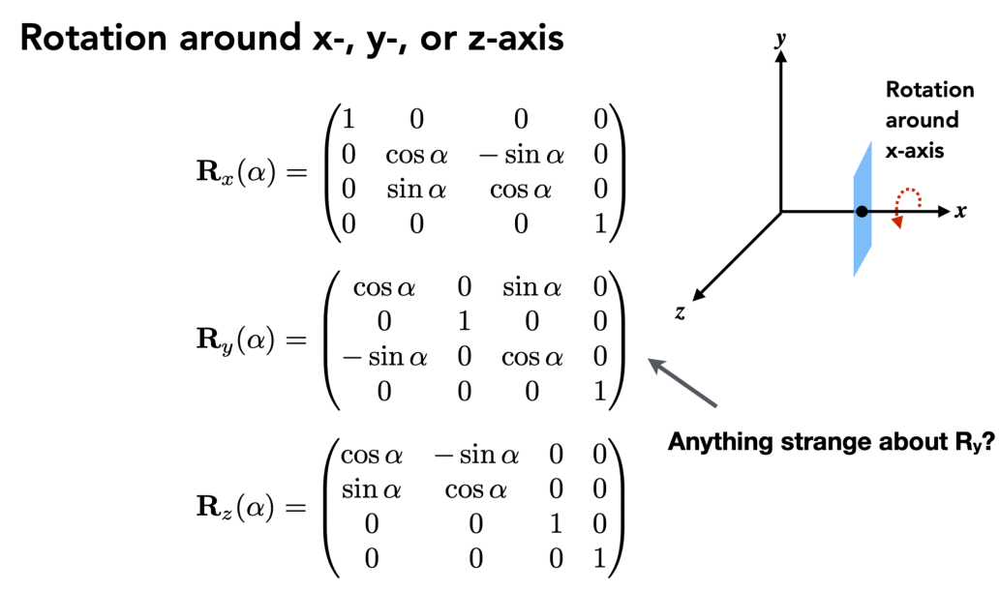

# 课程介绍

吴雨婷
ytwu1@bjtu.edu.cn

朱桂萍
22110144@bjtu.edu.cn

《GAMES101:现代计算机图形学入门》

平时成绩0.5

> 4次课后作业，包含课堂小测试(20%)
> 2次大作业(80%)
>
> 大作业自由组队: 5~6人一组

课程论文0.5

# 计算机图形系统

# OpenGL编程

# 变换

## 二维变换

线性变换

> **线性变换保持向量加法和标量乘法不变**
>
> 可加性
> 齐次性

### 缩放变换

×系数，**对角矩阵**（缩放矩阵）

### 反射变换

(-1 0
   0 1)

### 切变(Shear)

**想要写出变换，找出变换前后的x, y坐标的关系**

### 旋转(Rotate)

默认绕原点为中心，逆时针方向旋转

## 齐次坐标

平移不是线性变换

向量的平移不变性

**矩阵左上为二维变换，右侧为平移变换，最下一行是0, 0, 1**

点+点是中点

### 仿射变换(Affine Transformations)

### 逆变换(Inverse Transform)

逆矩阵

## 组合变换

多个变换进行组合，先旋转，矩阵乘法不满足交换律

## 三维变换

类比二维

**仿射变换**

### 三维旋转

 

任意三维旋转可以变成这三种转轴的旋转的组合

# 光栅化

# 着色

# 几何

# 高级图形技术