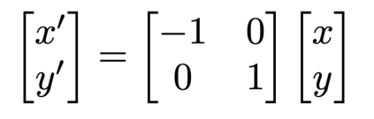
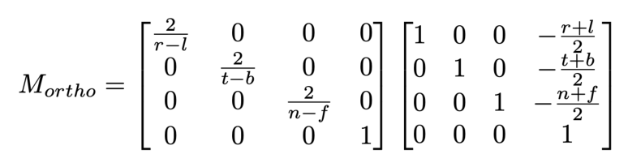
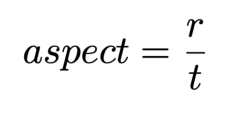

# 课程介绍

吴雨婷
ytwu1@bjtu.edu.cn

朱桂萍
22110144@bjtu.edu.cn

《GAMES101:现代计算机图形学入门》

平时成绩0.5

> 4次课后作业，包含课堂小测试(20%)
> 2次大作业(80%)
>
> 大作业自由组队: 5~6人一组

课程论文0.5

# 计算机图形系统

## 交互式计算机图形处理系统

交互式 = 计算机 + 人

### 图形输入设备

> 键盘、鼠标
> 光笔
> 触摸屏
> 操纵杆
> 数据手套
> 数字化仪
> 图形扫描仪

> 声频输入系统
> 视频输入系统
> 真实物体的三维信息输入

### 图形输出设备

硬拷贝: 打印机和绘图仪

#### 阴极射线管: CRT监视器(指标: 分辨率、显示速度)


#### 彩色阴极射线管

#### CRT图形显示器

**随机扫描的图形显示器**

> 速度快，不用全屏扫描
> 为画线应用设计的，不能显示逼真的有阴影场景

**光栅扫描显示器**

> 电子束横向扫描屏幕，一次一行，从顶到底顺次进行。
> 电子束横向沿每一行移动时，电子束强度不断变化来建立亮点的图案

#### LCD液晶显示器

液晶是一种介于液体和固体之间的特殊物质，受电压影响，改变物理性质而发生形变

### 图形处理器

图形处理器(显卡)

> 主要配件有**显示主芯片、显存和数字模拟转换器(RAMDAC)**
>
> **显示主芯片**是显卡的核心，俗称GPU,它的主要任务是对系统输入的视频信息进行构建和渲染，各图形函数基本上都集成在这里
>
> **显存**用于存储将要显示的图形信息及保存图形运算的中间数据,它与显示主芯片的关系就像计算机的内存与CPU一样密不可分
>
> **RAMDAC**就是视频存储数字模拟转换器。在视频处理中,它的作用就是把二进制的数字转换成为和显示器相适应的模拟信号


# OpenGL编程


# 变换

## 二维变换

线性变换

> **线性变换保持向量加法和标量乘法不变**
>
> 可加性
> 齐次性


### 缩放变换

×系数，**对角矩阵**（缩放矩阵）


### 反射变换

(-1 0
   0 1)



### 切变(Shear)


**想要写出变换，找出变换前后的x, y坐标的关系**

### 旋转(Rotate)

默认绕原点为中心，逆时针方向旋转


## 齐次坐标

平移不是线性变换


向量的平移不变性

**矩阵左上为二维变换，右侧为平移变换，最下一行是0, 0, 1**


点+点是中点

### 仿射变换(Affine Transformations)


### 逆变换(Inverse Transform)

逆矩阵，**旋转矩阵逆矩阵=转置**(因为是正交矩阵)

## 组合变换

多个变换进行组合，先旋转，矩阵乘法不满足交换律
**从右往左**

## 三维变换

类比二维


**仿射变换**


### 三维旋转

 

**任意三维旋转**可以变成这三种转轴的**旋转的组合**

## 观测变换

MVP = model, view, projection

### 视图变换(View / Camera transformation)

定义相机

> Position
> Look-at /gaze direction
> Up direction


**always**

- Position位置 - **原点**，up direction向上方向 - **y轴**，look-at看 - -**z方向**
- 随着相机变换物体

**视图变换实现相机**


不知道角度，不能用θ

### 投影变换

#### 正交投影(Orthographic projection)

**不会受近大远小影响**

**移动到原点**然后**缩放**




**注意！**

OpenGL使用的是左手系，所以有些区别

#### 透视投影(Perspective projection)

一个点乘一个不为0的constant还是那个点

> 先把frustum压缩变为cuboid，再做**正交投影**
>
> 近平面所有点不变，中心点不变
>
> 通过相似三角形来求解


不能直接判断z
但可以**通过f中点来计算**

> 

最后进行正交透视
$$
M_{persp} = M_{ortho}M_{persp->ortho}
$$

### 正交投影 续

水平方向的可视角度(field-of-view(for Y))

> 
>
> 求**field-of-view**
>
> 得到**aspect ratio**
>
> 同理可以对应l, r, b, t

# 光栅化

## 视口变换(Viewport Transformation)

**Canonical Cube to Screen**

screen = an array of pixels (2D)
`pixel index = (x, y)` from (0, 0) to (width - 1, height - 1)

不关注z，将`[-1, -1]^2` 转换成`[0, width] × [0, height]`
`Viewport transform matrix`:

## 光栅化

### 三角形离散化

三角形 - 基础形状

如何显示一个三角形


**采样Sampling**

```c++
bool inside(t, x, y) {
    // 在三角形里面= 1
    // 在三角形外面= 0
}

for (int x = 0 x < xmax; ++x)
	for (int y = 0; y < ymax; ++y)
		image[x][y] = inside(tri, x + 0.5, y + 0.5);
```

**叉积来判断是否在三角形里面**

> 
> p1, p2, p3与 Q的叉积都在**里或者外**那么就在三角形里面

**bounding box加速**


行bounding box


# 着色


# 几何


# 高级图形技术