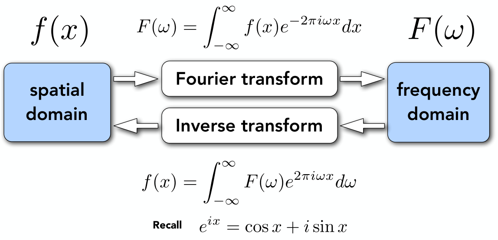
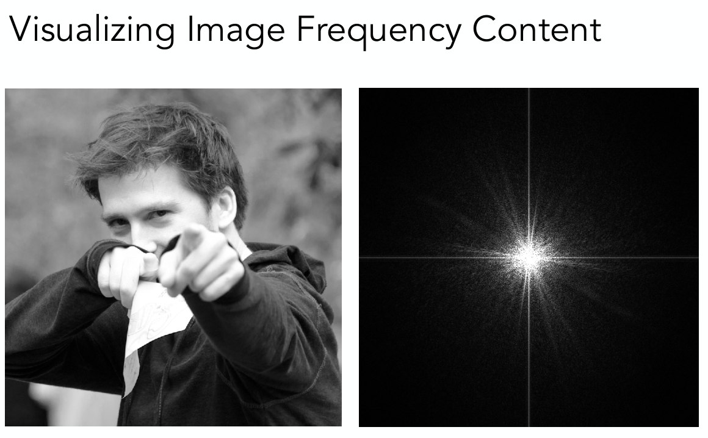
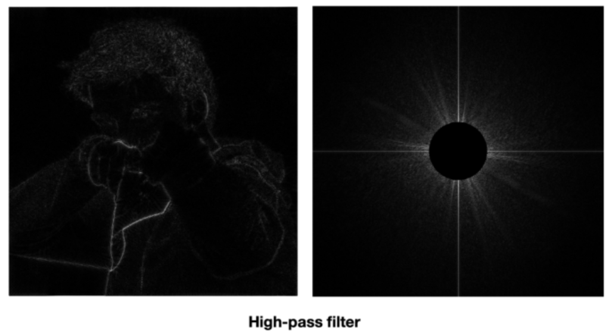
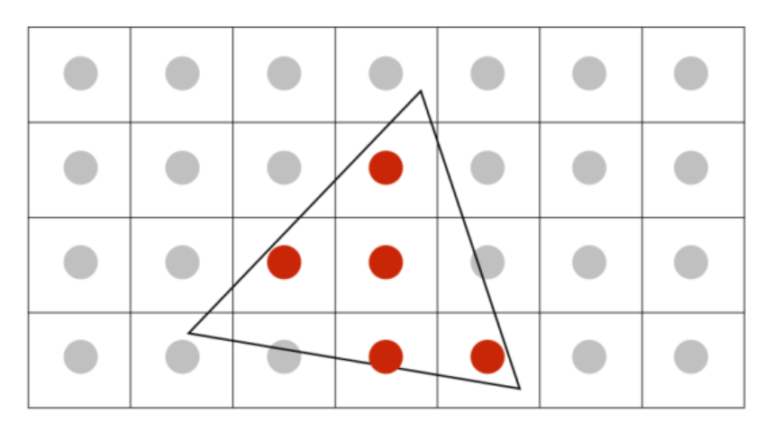
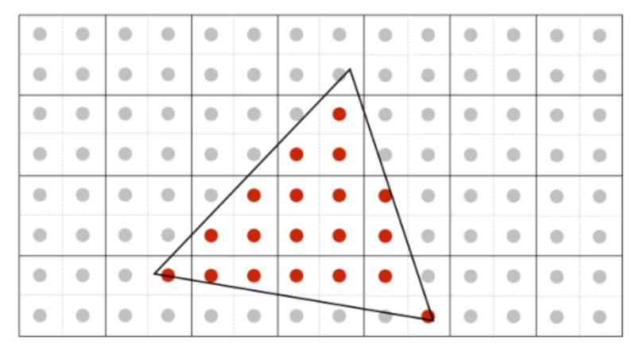
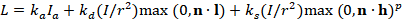
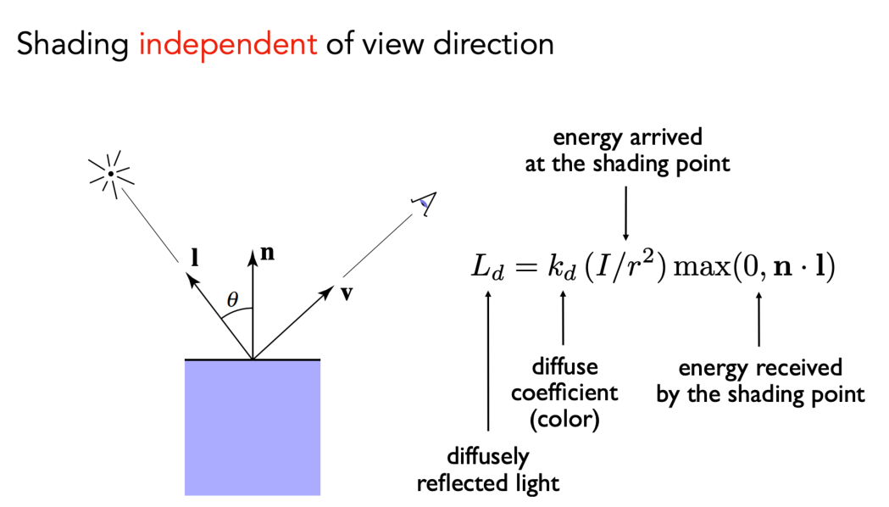

# 《计算机图形学》作业2

姓名: 贺思超
学号: 20301037
学院: 软件学院

# 1.

## 问题

**请解释走样和反走样的概念，给出三种以上反走样方法（只写名称），并简述其中一种反走样方法的原理。（30分）**

## 解答

### 走样和反走样的概念

**走样(Aliasing)**，也称为混叠或者样本混叠，是在数字信号（如图像、音频）采样过程中，如果采样频率低于信号的Nyquist频率（即原信号最高频率的两倍），则会产生一种现象，使得高频信号在低频信号中产生干扰。在计算机图形学中，这通常体现为图像的"锯齿"现象。

具体理论可以通过**傅里叶变换**来将空间域转变为频率域

**Higher Frequencies Need Faster Sampling(高频信号需要更快的采样)**，如下图可以看到高频信号对应着物体边缘以及细节处，而低频信号基本就是平滑过渡的区域。当采样频率达不到高频信号的频率时，就会出现**走样**，就代表着细节的缺失。

**反走样(Antialiasing)**是一种解决走样问题的技术。它的目的是在渲染图像时尽可能减小或消除锯齿现象，提高图像的视觉质量。反走样的基本原理是以更高的分辨率进行采样，并使用适当的算法将多个采样点的信息整合到一个像素中，以获得更平滑、自然的图像效果。

如下图就是通过过滤掉高频信号(在空间域中就是卷积)的方法来进行反走样，还有增加采样率的方法。

### 反走样方法

**反走样方法有:**

- 先模糊后采样(Blurring Before Sampling)
- 多重采样反走样(Multi sample Antialiasing)
- 时域反采样(Temporal Anti-Aliasing)
- 深度学习反走样(DLSS)

### MSAA原理

MSAA 的工作原理是在每个像素内进行多次采样，并对这些采样点进行平均，以获得该像素的颜色值。这意味着对于图像中的每个像素，MSAA 不仅考虑了像素中心的颜色，而且还考虑了像素内其他位置的颜色。

如左图，是一个点采样，没有任何反采样，而右图是增加四倍的采样点数，为本身每个像素采样为2x2个像素在进行平均求和来进行反采样

但是MSAA并不完美

> - MSAA 在与 HDR 一起使用时可能产生问题，必须要进行专门的处理。
> - 由于 MSAA 是在光栅化阶段对图元进行超采样，因此它只能解决几何走样现象（即物体轮廓的锯齿），不能解决着色走样（高光闪点）问题。
> - 较老的 GPU 的 MRT 无法支持 MSAA，因此当时的延迟着色方案中无法使用 MSAA，现代 GPU 已经能支持此项特性，但在延迟着色中使用 MSAA 的消耗仍然非常大。另外对法线等几何数据进行加权平均的结果也不是正确的结果。

# 2.

## 问题

**请简要描述图形（实时渲染）管线。（40分）**

## 解答

### 定义

图形渲染管线简单来讲，就是将应用程序的数据转换成最终显示在屏幕上的图像——这一数据处理过程。

图形实时渲染管线大概按照下图来进行，

### 应用阶段(Application)

在该阶段CPU将图形数据加载到显存中，设置渲染状态(渲染管线是什么样的，在哪里用什么着色器，模型的材质和贴图...)，然后发起`Draw Call`让GPU开始工作

### 几何处理(Vertex Processing & Triangle Processing)

**顶点着色器(Vertex Shader)**是 GPU 接手渲染管线后开始工作的第一个阶段。对于存入显存的顶点数据，顶点着色器所需要做的最基本的工作便是**坐标变换和传值**。由于传入的顶点数据最后都要映射到屏幕上，因此顶点着色器需要将传入的顶点的坐标系空间变换为齐次裁剪空间，剩下的透视除法、归一化为设备坐标空间等工作则由管线中的固定部分完成。此外，我们可以在顶点着色器阶段进行一些额外的计算，如通过计算逐顶点光照来确定顶点颜色等。

**三角处理(triangle processing)**现在点被映射到了屏幕上，但是其关系还没有被体现出来。 我们仍然需要按照原来的连接关系把他们表示出来，也就是将离散的点连接成三角。 这个过程就是 triangle processing。

剩下的可选的还有:

**曲面细分着色器(Tessellation Shader)**: 曲面细分着色器是一个可选着色器，它的主要任务是根据顶点着色器的输出，使用面片（Patch）来描述物体的形状，并使用一些相对简单的面片几何体来对物体表面进行细分，产生比输入数据更多的图元，以达到使物体表面看起来更平滑的效果。

**几何着色器(Geometry Shader)**:几何着色器是一个可选着色器。相对于顶点着色器，它是管线中的“新人”。它从顶点着色器或开启的曲面细分着色器中获取图元的所有顶点，并且能够随意对其进行处理，产生更多的顶点和图元。因此它能够对图元进行一些特殊的处理。

**图元装配(Primitive Assembly)**: 在图元装配之前的阶段处理的数据都是顶点数据，图元装配则将这些顶点与它们组成的图元信息关联起来，为后续的裁剪和光栅化工作做准备。

**裁剪(Clipping)**: 裁剪是几何处理阶段的最后一个子阶段。由于我们所要绘制的视口（Viewport）通常是非常有限的，场景中的物体不能全部出现在视口中。为了节省资源，我们需要将这些不需要进行后续处理的额外部分“裁剪”掉。在边界之外的图元被完全剔除，而跨越边界的图元则会生成新的顶点，抛弃边界之外的部分。

### 光栅化(Rasterization)

光栅化阶段分为两个子阶段：三角形设置（Triangle Setup）和三角形遍历（Triangle Traversal）。三角形设置根据图元的顶点信息计算图元边界的表达式，用以确定这个图元所覆盖像素的范围。三角形遍历则根据三角形设置计算出的范围，决定哪一些像素被图元覆盖到了，将抽象而连续的图元坐标转换成离散的像素坐标，从而得到一组片元（Fragment）。片元不是真正意义上的像素，是许多信息和状态的集合，包括像素坐标、深度信息等。这些信息和状态将在管线的后续决定像素的颜色和亮度等，使其真正转变成可以看到的像素。这个时候的片元还是不完整的，只拥有像素坐标信息，其他的信息需要让三角形遍历根据图元顶点的信息，对图元覆盖到的像素进行插值得到。

### 片段处理(Fragment Processing)

片段着色器是管线中另一个非常重要的阶段。在管线之前的过程中，我们最终得到的片元在颜色信息上是缺少细节的（尽管我们可以在顶点着色器阶段计算顶点颜色）。片元着色器需要对每一个片元的颜色进行计算，包括但不限于纹理映射和逐像素光照。此外在片元着色器阶段我们还可以在决定一个片段是否应该被绘制成一个像素，不被我们认可的片元便会被片元着色器中止处理并丢弃（Discard）。

片段着色器的处理工作主要针对片元的颜色信息，因此对于管线的渲染结果有着最为直观的影响。不过通常情况下片元着色器在管线中处理片元时，并不会影响当前片元的邻近片元，这是片元着色器的一个局限性。同时由于在实际渲染环境下，每一个帧都拥有数百万计的片元。而输入到顶点着色器的顶点数量一般而言则是远低于百万级别，因此片元着色器的运算任务往往比顶点着色器要繁重很多，造成更大的开销。所以直接减少片元着色器的运算量，或者将片元着色器的一些运算转移到顶点着色器，依靠光栅化阶段的插值间接减少片元着色器的运算量，是提升管线性能的常用方法。

### 帧缓冲操作(Framebuffer Operations)

最后在Framebuffer Operations进行组装放到帧缓冲区, 然后进行显示。

# 3.

## 问题

**中，三项分别表示何含义？公式中的各个符号的含义指什么？（30分)**

## 解答

### 三项分别表示何含义

Phong反射模型是一个经典的光照模型，它将反射光分为环境反射、漫反射和镜面反射三个部分。

#### 漫反射项(Ld)

漫反射是指物体表面对光的散射现象。在理想的漫反射表面上（例如粗糙的表面或者不透明的表面），光线会在表面上的各个方向上均匀散射。因此，无论你从哪个角度观察，漫反射光的颜色和强度都是一样的。这也是为什么我们通常认为漫反射主要决定了物体的颜色。
$$
L_d = k_d(I/r^2)max(0, n · l)
\\
\rm k_d = dissfuse\ coefficient(漫反射系数)
\\
\rm I/r^2 = energy\ arrived\ at\ the\ shading\ point(接收到的光源能量)
\\
\rm max(0, n·l) = energy\ recieved\ by\ the\ shading\ point(被接受的光源能量)
$$
`(N · L)`是N和L的点积，也就是它们之间夹角的余弦值。这个项的意义是，如果光源直接照在表面上（即N和L的夹角为0度），那么表面接收到的光线最强，反射的光也最强。反之，如果光源几乎与表面平行（即N和L的夹角接近90度），那么表面接收到的光线就很弱，反射的光也很弱。

#### 高光项(Ls)

高光项，也被称为镜面反射项，表示表面在特定的观察位置存在的亮点或"闪光"。这是由于光线直接反射到观察者的眼睛造成的。镜面反射主要影响物体看起来有多么"光滑"或"闪亮"。

**半程向量**
$$
h = bisector(v, l) = \frac{v + l}{||v+l||}
$$
接近镜像方向的V⇔接近法线的半程向量
$$
L_s(specularly\ reflected\ light) = k_s(I/r^2)max(0, cosα)^p = k_s(I/r^2)max(0, n·h)^p
$$
**夹角越小，高光强度越高**

**p: 镜面反射系数**

#### 环境光照项(La)

环境光照项用于模拟没有直接光照的情况下物体接收到的光线。环境光照可以理解为周围环境中所有的光源经过多次反射后，均匀散布在场景中的光照。这种光照不依赖于观察者的位置或特定的光源位置，对场景中的所有物体都是一样的。

假设任何一点接收到来自环境的光是相同的
$$
L_a(reflected\ ambient\ light) = k_a(ambient\ coefficient\ 颜色) I_a
$$

### 各个符号的含义

$$
L = k_aI_a + k_d\frac{I}{r^2}\max(0, \mathbf{n} \cdot \mathbf{l}) + k_s\frac{I}{r^2}\max(0, \mathbf{n} \cdot \mathbf{h})^p
\\
L 是被计算点的亮度。
\\
k_a 是物体的环境反射系数。
\\
I_a 是环境光的强度。
\\
k_d 是物体的漫反射系数。
\\
\frac{I}{r^2} 是衰减因子
\\
I 是光源的强度
\\
r 是光源和物体表面点之间的距离。
\\
\max(0, \mathbf{n} \cdot \mathbf{l}) 是漫反射项，
\\
\mathbf{n} 是物体表面的法向量，
\\
\mathbf{l} 是从物体表面点指向光源的向量。
\\
k_s 是物体的镜面反射系数。
\\
\max(0, \mathbf{n} \cdot \mathbf{h})^p 是镜面反射项
\\
\mathbf{h} 是半向量，即从物体表面点指向光源的向量 \mathbf{l} 和从物体表面点指向观察者的向量 \mathbf{v} 的平均值
\\
p 是高光指数。
$$

