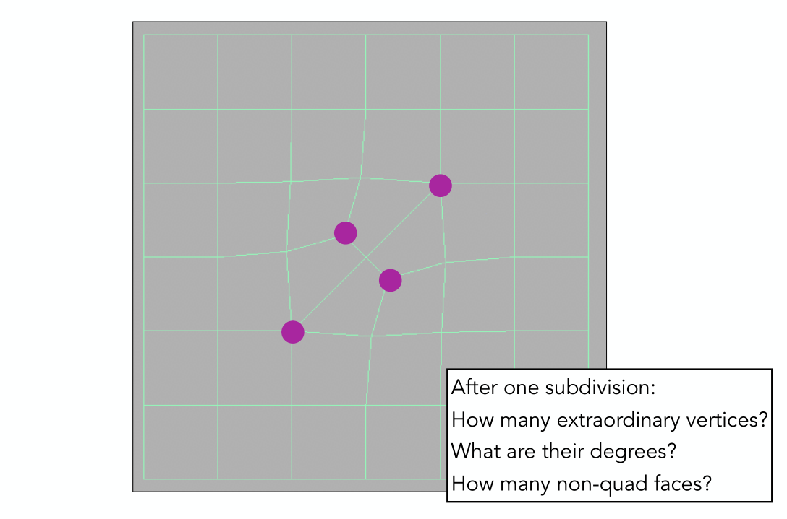

# 《计算机图形学》作业3

姓名: 贺思超
学号: 20301037
学院: 软件学院

# 1.

## 问题

**1.**  **计算以(30,0),(60,10),(80,30),(90,60),(90,90)为控制顶点的四次 Bezier 曲线在****t =** **处的值，并画出de Casteljau三角形。（25分）**

**（说明：de Casteljau三角形为如下格式）**


## 解答

使用python简单绘制

```python
import matplotlib.pyplot as plt
import numpy as np

# 对于给定的控制点和参数t, 计算贝塞尔曲线上的位置
def bezier_curve(points, t):
    n = len(points) - 1
    return sum(binomial_coeff(n, i) * ((1 - t) ** (n - i)) * (t ** i) * points[i] for i in range(n + 1))

# 计算二项式系数 "n choose k"
def binomial_coeff(n, k):
    return np.math.factorial(n) // (np.math.factorial(k) * np.math.factorial(n - k))

# 计算 de Casteljau 三角形
def de_casteljau(points, t):
    n = len(points)
    triangle = [points]
    for i in range(1, n):
        temp = []
        for j in range(n - i):
            temp.append((1 - t) * triangle[i - 1][j] + t * triangle[i - 1][j + 1])
        triangle.append(temp)
    return triangle

# 定义控制点
points = np.array([[30, 0], [60, 10], [80, 30], [90, 60], [90, 90]])

# 计算贝塞尔曲线上的点
t = 1/4
point_on_curve = bezier_curve(points, t)

# 计算 de Casteljau 三角形
triangle = de_casteljau(points, t)

# 画出控制点
plt.scatter(points[:,0], points[:,1], color='blue')

# 画出贝塞尔曲线
t_values = np.linspace(0, 1, 100)
bezier_points = np.array([bezier_curve(points, t) for t in t_values])
plt.plot(bezier_points[:,0], bezier_points[:,1], color='black')

# 画出 de Casteljau 三角形
colors = ['red', 'green', 'purple', 'orange']
for i, level in enumerate(triangle):
    if i == len(triangle) - 1:
        break
    level = np.array(level)
    plt.plot(level[:,0], level[:,1], color=colors[i % len(colors)])

    # 对每个点添加标签
    for j, point in enumerate(level):
        plt.annotate(f"{i}-{j}: {point}", (point[0], point[1]), textcoords="offset points", xytext=(-10,-10), ha='center')

# 画出曲线上的点
plt.scatter(point_on_curve[0], point_on_curve[1], color='green')
plt.annotate(f"Curve point: {point_on_curve}", (point_on_curve[0], point_on_curve[1]), textcoords="offset points", xytext=(-10,-10), ha='center')

plt.show()
```

值为(56.25, 13.711)


# 2.

## 问题

**请简述一种网格细分算法的工作原理.（25分）**

## 解答

**Catmull-Clark Subdivision**

Non-quad face: 不是四边形的面
Extraordinary: 奇异点, degree != 4

Each subdivision step每一步:

- Add vertex in each face 在每个面里添加新的顶点
- Add midpoint on each edge 在每个面的每条边选取中点
- Connect all new vertices 在每个面中连接新的顶点和这些重点




Catmull-Clark细分的特点

**1 有几个非四边形面，就会多出几个奇异点，所以现在一共有2+2 = 4个**

**2 新多出来的奇异点的度数与原来所在面的边数相等，如这里就是3度**

**3 第一次细分之后所有面都会变成四边形，且往后奇异点数目不再增加**

下面是再一次细分的结果


同样的，增加完成后我们需要调整各类顶点的位置，对于`face point, edge point, vertex point`这三类不同位置的顶点，以下为具体的公式来计算顶点的位置
$$
f(face\ point) = \frac{v_1 + v_2 + v_3 + v_4}{4}
\\
e(edge\ point) = \frac{v_1 + v_2 + f_1 + f_2}{4}
\\
v(vertex point) = \frac{f_1 + f_2 + f_3 + f_4 + 2(m_1 + m_2 + m_3 + m_4) + 4p}{16}
$$
m为每条边的中点
p为旧的顶点


# 3.

## 问题

**请简述基于二次误差度量的边坍缩算法原理。（25分）**

## 解答

**边坍缩Collapsing An Edge**

边坍缩算法（Edge Collapse）是一种用于3D模型简化（也称为网格简化或多边形简化）的方法。这种算法的目标是减少模型中的顶点数和边数，以减少模型的复杂度，同时尽可能保持模型的原始形状。


**二次误差度量Quadric Error Metrics**

使用二次误差度量来**确定哪些边**应该被折叠。

Quadric error: new vertex should minimize its sum of square distance (L2 distance) to previously related triangle planes 最小化二次误差，**选取点到这个面的平方和最小**
**l2距离: 欧氏距离**


**主要步骤**

1. 计算初始点的Q矩阵
2. 选择所有的有效点对，即可以坍缩的边
3. 计算每个有效对坍缩之后的代价，代价 = v_new^T * (Q1 +Q2) * v_new
4. 将所有有效对放置在一个以代价为键值的堆中，最小代价放在顶部
5. 迭代的从堆中删除代价最小的对，坍缩每个边，并更新涉及v1的所有有效对的代价

**从二次度量误差最小的边开始坍缩 iteratively collapse edge with smallest score**

**注意坍缩了一个边，应该更新全部边的二次度量误差**

# 4.

## 问题

**请简述shadow mapping算法原理。（25分）**

## 解答

中心思想: the points NOT in shadow must be seen both **by the light and by the camera** **光源和摄像机都能看到代表不在阴影中**

**基本思想是在渲染场景时，分别从光源的视角和观察者的视角进行两次渲染。**

**Render from Light**

**从光源出发**记录深度信息，生成深度图


**Render from Eye**

从人眼/相机看到的画面，生成深度图


**Project to light**

Project visible points in eye view back to light source
从人眼/相机看到的点投射到光源，**如果实际深度与刚才的深度图一样，那么就没有被遮挡**

**算法问题**

无法解决硬阴影问题，以及浮点数值问题，需要高分辨率才有好的效果
