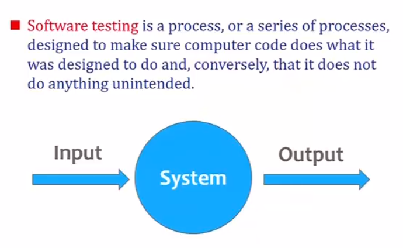
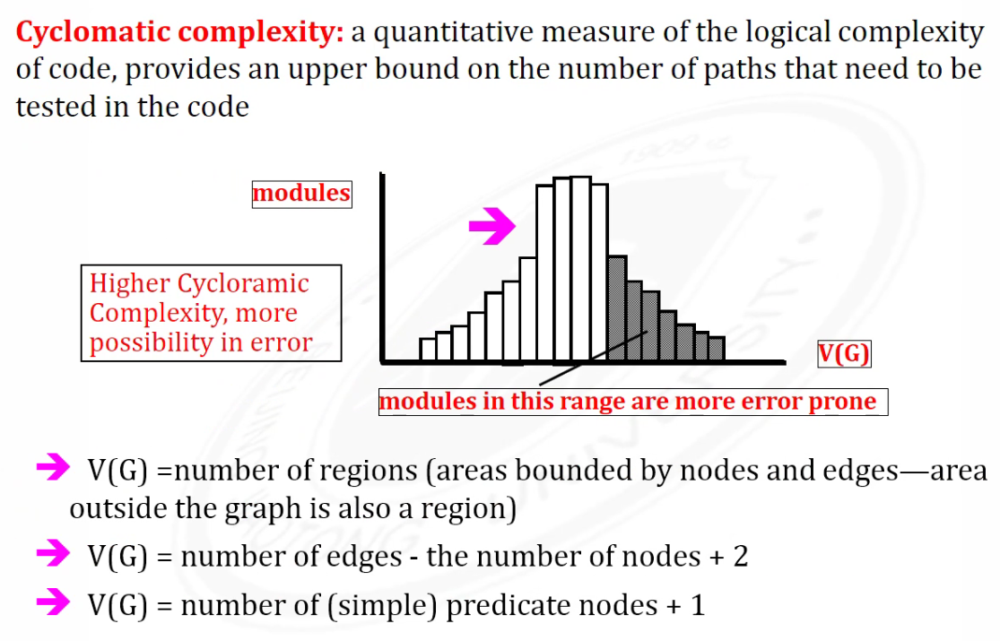
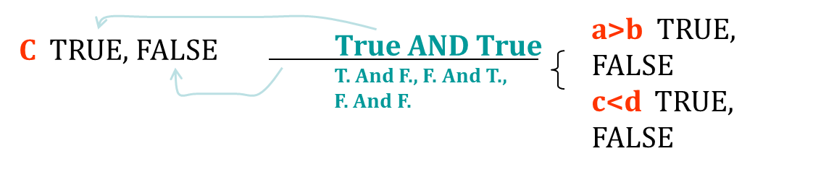

# 软件测试期末复习笔记

## Software testing

## Test Cycle

**测试用例不断更新**

## 测试分三个维度

**grey box** between black and white box

unit - white box
system - black box

## Fault, Error & Failure

Fault: in code, lead to error or failure
Error: in function
Failure: whole system

error 与 failure不能直接推但fault都能被其他两个推出来

Different test input lead to different phenomenon

## **Source of Problems:**

- **Requirements Definition:** Erroneous, incomplete, inconsistent requirements.
- **Design:** Fundamental design flaws in the software.
- **Implementation:** Mistakes in chip fabrication, wiring, programming faults, malicious code.
- **Support System:** Poor programming languages, faulty compilers and debuggers ,misleading development tools.
- **Inadequate Testing of Software**: Incomplete testing, poor verification, mistakes in debugging.
- **Evolution:** Sloppy redevelopment or maintenance, introduction of new flaws in attempts to fix old flaws, incremental escalation to inordinate complexity.
- **Communications:** Loss or corruption of communication media, non delivery of data.
- **Space Applications:** Lost lives, launch delays.
- **Defense and Warfare:** Misidentification of friend or foe.

## **测试流程**

**Testing - 找**
**Debugging - 修**
**Verification - 文档** meets its specification
**Validation - 是不是用户想要的** meets the user's requirements

## Software is

- Requirements specification documents
- Design documents
- Source code 
- Test suites and test plans
- Interfaces to hardware and software operating environment
- Internal and external documentation
- Executable programs and their persistent data

**SPEC:**

**BRD** - Business requirement document
**MRD** - Market requirement document
**PRD** - Program requirement document

- Customer requirements
  The software development team must determine what the customer wants.
- Specification
  - The specification takes the data from the customer requirements and other sources and defines:
    - **The features of the software** (functional requirements).
    - **The constraints on these features** (non-functional requirements).
  - Specifications can be:
    - **formal**, rigid
    - **informal**, on a cocktail napkin or a whiteboard

## 9 Axioms

1.1 is a natural number.

2.Every natural number is equal to itself  (equality is reflexive).

3.For all natural numbers **a** and **b**, **a** = **b** if and only if **b** = **a** (equality is symmetric).

4.For all natural numbers **a**, **b**, and **c**, if **a** = **b** and **b** = **c** then **a** = **c** (equality is transitive).

5.If **a** = **b** and **b** is a natural number then **a** is a natural number.

6.If **a** is a natural number then **successor(****a)** is a natural number.

7.If **a** and **b** are natural numbers then **a** = **b** if and only if **successor(****a)** = **successor(****b)***.*

8.If **a** is a natural number then **successor(****a)** is not equal to 1.

9.For every set *K*, if *1* is in *K*, and **successor(****x)** is in *K* for every natural number *x* in *K*, then every natural number is in *K*. 

## 白盒控制流

Example

### **Basic Path Testing**

cyclomatic complexity 圈复杂度->图越复杂->程序越复杂

- Decision
- Junction
- End

**圈复杂度计算**

- 区域
- 边-节点+2

V(G)= the number of Independent path 

**Not complete Testing:**

- Spec
- Testcases
- Not all bugs can be fixed

### Condition testing

**Logical conditions**

- Simple condition: (a rel-op b) where rel-op={<, ≤, =, ≠, ≥, >} (may be negated with NOT), e.g., a≤b; NOT(a≤b)
- Compound condition: two or more simple conditions connected with AND, OR, e.g., (a>b) AND (c<d)
- Relational expression: (E1 rel-op E2) where E1 and E2 are arithmetic expressions, e.g., ((a*b+c)>(a+b+c))

**Branch testing**

for a compound condition C, test true and false branches of C and every simple condition of C

​	e.g., for **C** = (**a>b**) AND (**c<d**)  test:  

**Domain testing**

for an expression **E1 rel-op E2**, test for E1 **≧ ≦ = < > ≠** E2

- guarantees detection of rel-op error if E1 and E2 are correct
- to detect errors in E1 / E2, the difference between E1 and E2 for the tests E1 **<** or **>** than E2 should be as small as possible
- for an expression with n variables, 2n tests are required

**Coverage**

- condition coverage
- preserves desicion coverage:
  decision/condition coverage

path coverage 最大

- Path Testing Pu

  - 100% path coverage.

  - Execute all possible control flow paths through the program. 

- Statement Testing P1

  - 100% statement coverage.
  - Execute all statements in a program at least once under some test.

- Branch Testing P2
  - 100% branch coverage.
  - Execute enough tests to assure that every branch alternative has been exercised at least once under some test.

P1 ≤ P2 ≤ Pu

## Classifying Tests

**Driver: component that calls component to be tested**

**Stub: component called by component to be tested**

## Black box

静态黑盒测界面，动态黑盒都能测

### Random Testing

Adaptive Random Testing 选点有规则且与前几个用例越来越远

### Equivalence Partitioning

Identify input equivalence classes注意边界值:

- Based on conditions on inputs/outputs in specification/description: Both valid and invalid input equivalence classes
- Based on heuristics and experience
  
  

### Boundary Value Analysis

**Example strategy as extension of equivalence partitioning:**

- choose one (n) **arbitrary** value(s) in each eq. class **每个class选个任意值**
- choose values **exactly** on **lower /upper boundaries** of eq. class **准确值**
- choose values **immediately** below /above each boundary ( if applicable ) **临界值** min和max也都要测 （min - 1可放在class中）

### Cause Effect Analysis

因果分析

RT
ART - Reduce test case
EP - Reduce test case & maintain test performance
BVA - Maintain test performance & Coverage
Cause Effect - Reduce Test case

Q1=Q2=Q3 先划分BVA给出Valid 和 invalid
然后设计对应的EP边界值
Q4 若不是single input可以合并case

## Integration Testing

测interface

- API
- SDK

Approaches

- Big bang
- Incremental

Test Function

- Top-down
- Mixed
- Bottom-up

## System Testing

Functional

Non-Functional

- Usability
- Performance
- Security
- Load

**Answer: 5, 4(2), 2(4), 1, 7, 3, 6**