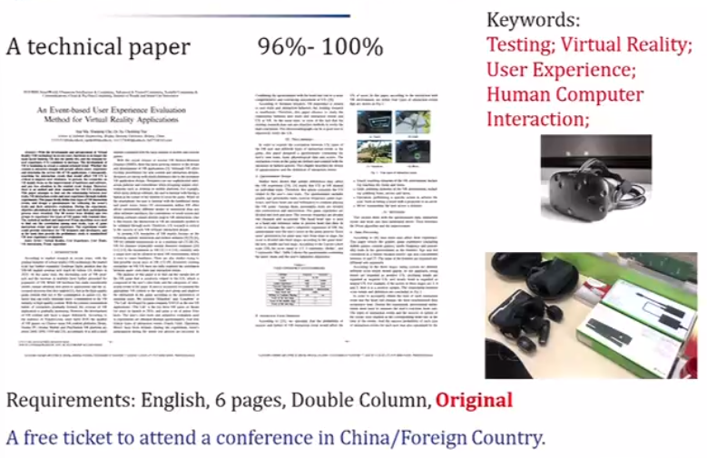
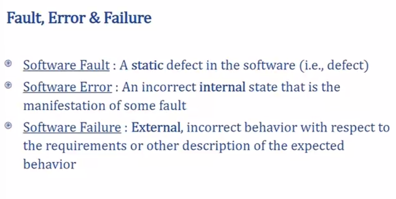
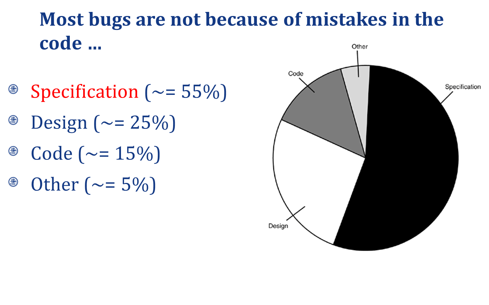

[TOC]

# 成绩构成

* 项目 20%
* 作业 40%
* 期末 40%

# 课程大纲

**第4-5周，6-7,重要，8非常重要**

# 参考文献

软件测试Ron Patton, Software Testing(2th Edition)

# 1. The basic concepts and theories of testing

## Software testing

## Test Cycle

**测试用例不断更新**

## 测试分三个维度

**grey box** between black and white box

unit - white box
system - black box

## Fault, Error & Failure

#  2. Principle of Testing

**Source of Problems:**

- **Requirements Definition:** Erroneous, incomplete, inconsistent requirements.
- **Design:** Fundamental design flaws in the software.
- **Implementation:** Mistakes in chip fabrication, wiring, programming faults, malicious code.
- **Support System:** Poor programming languages, faulty compilers and debuggers ,misleading development tools.
- **Inadequate Testing of Software**: Incomplete testing, poor verification, mistakes in debugging.
- **Evolution:** Sloppy redevelopment or maintenance, introduction of new flaws in attempts to fix old flaws, incremental escalation to inordinate complexity.
- **Communications:** Loss or corruption of communication media, non delivery of data.
- **Space Applications:** Lost lives, launch delays.
- **Defense and Warfare:** Misidentification of friend or foe.

**测试流程**

**Goal of a software tester：**

- ... to find bugs
- ... as early in the software development processes as possible
- ... and make sure they get fixed

**BRD** - Business requirement document
**MRD** - Market requirement document
**PRD** - Program requirement document

- Customer requirements
  The software development team must determine what the customer wants.
- Specification
  - The specification takes the data from the customer requirements and other sources and defines:
    - **The features of the software** (functional requirements).
    - **The constraints on these features** (non-functional requirements).
  - Specifications can be:
    - **formal**, rigid
    - **informal**, on a cocktail napkin or a whiteboard

Testing - 找
Debugging - 修
Verification - 文档
Validation - 是不是用户想要的

**axiom公理**

# 3. White Box

Examine the Design Document & Code **static**

**Control Flow**

控制流:

- Statement testing
- Branch testing
- Path testing

数据流:

- Definition-use path testing
- All uses testing

## 控制流

Example

### **Basic Path Testing**

cyclomatic complexity 圈复杂度->图越复杂->程序越复杂

- Decision
- Junction
- End

**圈复杂度计算**

- 区域
- 边-节点+2

V(G)= the number of Independent path 

**Not complete Testing:**

- Spec
- Testcases
- Not all bugs can be fixed

### Condition testing

**Logical conditions**

- Simple condition: (a rel-op b) where rel-op={<, ≤, =, ≠, ≥, >} (may be negated with NOT), e.g., a≤b; NOT(a≤b)
- Compound condition: two or more simple conditions connected with AND, OR, e.g., (a>b) AND (c<d)
- Relational expression: (E1 rel-op E2) where E1 and E2 are arithmetic expressions, e.g., ((a*b+c)>(a+b+c))

**Branch testing**

for a compound condition C, test true and false branches of C and every simple condition of C

​	e.g., for **C** = (**a>b**) AND (**c<d**)  test:  

**Domain testing**

for an expression **E1 rel-op E2**, test for E1 **≧ ≦ = < > ≠** E2

- guarantees detection of rel-op error if E1 and E2 are correct
- to detect errors in E1 / E2, the difference between E1 and E2 for the tests E1 **<** or **>** than E2 should be as small as possible
- for an expression with n variables, 2n tests are required

**Coverage**

- condition coverage
- preserves desicion coverage:
  decision/condition coverage

path coverage 最大

- Path Testing Pu

  - 100% path coverage.

  - Execute all possible control flow paths through the program. 

- Statement Testing P1

  - 100% statement coverage.
  - Execute all statements in a program at least once under some test.

- Branch Testing P2
  - 100% branch coverage.
  - Execute enough tests to assure that every branch alternative has been exercised at least once under some test.

P1 ≤ P2 ≤ Pu

## 数据流(考试无关)

**Definition**

A location where a value for a variable is stored into memory

**def and use**

**数据流必须全拆，控制流有些可不拆（并行判断要拆）**

# 4. Black Box

Test case:

1. Reduce Testcase
2. Maintain Test Performance
3. Test Coverage

## 4.1 Random Testing

Adaptive Random Testing 选点有规则且与前几个用例越来越远

## 4.2 Equivalence Partitioning

Identify input equivalence classes注意边界值:

- Based on conditions on inputs/outputs in specification/description: Both valid and invalid input equivalence classes
- Based on heuristics and experience
  
  

## 4.3 Boundary Value Analysis

**Example strategy as extension of equivalence partitioning:**

- choose one (n) **arbitrary** value(s) in each eq. class **每个class选个任意值**
- choose values **exactly** on **lower /upper boundaries** of eq. class **准确值**
- choose values **immediately** below /above each boundary ( if applicable ) **临界值** min和max也都要测 （min - 1可放在class中）

## 4.4 Cause Effect Analysis

因果分析

RT
ART - Reduce test case
EP - Reduce test case & maintain test performance
BVA - Maintain test performance & Coverage
Cause Effect - Reduce Test case

# 5. Integration Test

**driver - 用于集成测试**

## Important traits of a good UI

- Follows standards and guidelines
- Intuitive 直观
- Consistent 一致性
- Flexible
- Comfortable
- Correct
- Useful

**Accessibility Testing** for disabled

# 6. Mutation Testing

**变异测试**

## How good are my tests

**Coverage** = 有多少代码能够测到的
**Key idea** = 从早期和常见的错误中学习，防止它们再次发生，（如拼写错误）

## Mutation testing

**Mutation testing terms**

- Mutant
- Mutation operator
- Mutant killed
- Mutant score
  = killed mutants / (N - number of equivalent mutants)

## Finite automata

# 7. Mid-Review

Bug

> Requirement——black box
> Design
> Code——white box

## 7.1 测的部分分类

### 7.1.1 Input Domain Testing Techniques

- Random Testing
- ART
- EP
- BVA
- CE

### 7.1.2 Code-Base Testing Techniques

- Control-flow
- Data-flow

### 7.1.3 Fault-Based Testing Techniques

- Error Guesting
- Mutation

### 7.1.4 Model-Based Testing Techniques

- FSM
- Logic
- UML

## 7.2 测的区域分类

### 7.2.1 Unit Testing

White&Black box

Unit

- driver
- stub

### 7.2.2 Integration Testing

测interface

- API
- SDK

Approaches

- Big bang
- Incremental

Test Function

- Top-down
- Mixed
- Bottom-up

### 7.2.3 System Testing

Functional

Non-Functional

- Usability
- Performance
- Security
- Load

# 8. Maintain

# 考试相关

 

