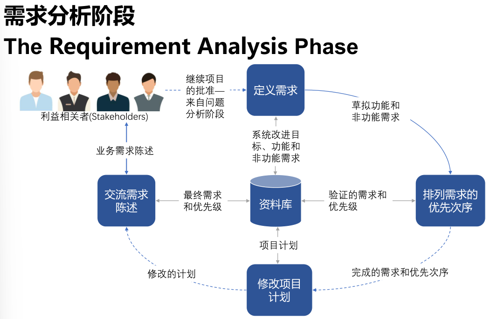

[TOC]

# 1.软件工程基础

软件=程序+文档

## 1.软件工程基础

### 1.软件的特性

1. 形态特性
2. 智能特性
3. 开发特性
4. 质量特性
5. 生产特性
6. 管理特性
7. 环境特性
8. 维护特性
9. 废弃特性
10. 应用特性

### 2.软件发展历史

### 3.软件危机

主要表现为：软件的发展速度远远滞后于硬件的发展速度，不能满足社会日益增长的软件需求。软件开发周期长、成本高、质量差、维护困难。

### 4.软件工程

概括地说，软件工程是指导计算机软件开发和维护的工程学科。采用工程的概念、原理、技术和方法来开发与维护软件，把经过时间考验而证明正确的管理技术和当前能够得到的最好的技术方法结合起来，以经济地开发出高质量的软件并有效地维护它，这就是**软件工程**。

## 2.软件生命周期

软件也有一个孕育、诞生、成长、成熟和衰亡的生存过程，我们称这个过程为软件生命周期或软件生存期。
软件生存期分为三个时期：

1. 软件定义
2. 软件开发
3. 运行维护

### 1.软件定义

### 2.软件开发时期

### 3.软件维护时期

## 3.软件工程方法

# 2.软件过程模型

## 1.软件开发过程模型

软件开发过程模型能清晰直观的表达开发全过程，明确规定的要完成的主要活动和任务，可以作为软件项目开发的基础

对于一个具体软件系统来说，应采用合适的开发方法，使用事宜的程序设计语言，组织具有相应技能的开发人员参与，并采用适合的管理方法和手段，对整个开发活动的全过程进行有效的控制

### 1.经典的软件开发过程模型

#### 1.瀑布模型

推迟实现的观点：
1. 瀑布模型在编码之前设置了系统分析和系统设计的各个阶段，分析与设计阶段的基本任务规定 ，在这两个阶段主要考虑目标系统的逻辑模型，不涉及软件的物理实现
2. 清楚地区分逻辑设计与物理设计，尽可能推迟程序的物理实现，是按照瀑布模型开发软件的一条重要的指导思想

优点：

1. 可强迫开发人员采用规范化的方法。
2. 严格地规定了每个阶段必须提交的文档。
3. 要求每个阶段交出的所有产品都必须是经过验证的

缺点：

1. 由于瀑布模型几乎完全依赖于书面的规格说明，很可能导致最终开发出的软件产品不能真正满足用户的需要。如果需求规格说明与用户需求之间有差异，就会发生这种情况
2. 瀑布模型只适用于项目开始时需求已确定的情况

可以使用瀑布模型的情况：

1. 系统的所有功能、性能要求客户可以一次性准确交付
2. 是首次开发的新的系统并且淘汰全部老系统

#### 2.快速原型模型

优点：

1. 有助于满足用户的真实需求
2. 原型系统已经通过与用户的交互而得到验证，据此产生的规格说明文档能够正确地描述用户需求
3. 软件产品的开发基本上是按线性顺序进行
4. 因为规格说明文档正确地描述了用户需求，因此，在开发过程的后续阶段不会因为发现规格说明文档的错误而进行较大的返工
5. 开发人员通过建立原型系统已经学到了许多东西，因此，在设计和编码阶段发生错误的可能性也比较小，这自然减少了在后续阶段需要改正前面阶段所犯错误的可能性
6. 快速原型的突出特点是“快速”。开发人员应该尽可能快地建造出原型系统，以
加速软件开发过程，节约软件开发成本

#### 3.增量模型

优点：

1. 能在较短时间内向用户提交可完成一些有用的工作产品，即从第1个构件交付之日起，用户就能做一些有用的工作
2. 逐步增加产品的功能可以使用户有较充裕的时间学习和适应新产品，从而减少一个全新的软件可能给用户组织带来的冲击
3. 项目失败的风险较低，虽然在某些增量构件中可能遇到一些问题，但其他增量构件将能够成功地交付给客户
4. 优先级最高的服务首先交付，然后再将其他增量构件逐次集成进来。因此，最重要的系统服务将接受最多的测试

可以使用增量模型的情况：

1. 需要尽短的时间内得到系统基本功能的演示或使用
2. 个版本都有中间阶段产品可提供使用
3. 系统可以被自然地分割成渐增模式
4. 开发人员与资金可以逐步增加

采用增量模型需注意的问题：

1. 在把每个新的增量构件集成到现有软件体系结构中时，必须不破坏原来已开发出的产品
2. 软件体系结构必须是开放的，即向现有产品中加入新构件的过程必须简单、方便

以下情况慎重使用增量模型：

1. 不能充分理解客户需求或客户需求有可能迅速发生变化
2. 事先拟采用的技术迅速发生变化
3. 客户突然提出一些新的功能需求
4. 长时期内仅有有限的资源保证（开发人员和资金）

#### 4.螺旋模型

缺点：

螺旋模型是风险驱动的，因此要求软件开发人员必须具有丰富的风险评估经验和这方面的专门知识，否则将出现真正的风险：**当项目实际上正在走向灾难时，开发人员可能还以为一切正常。**

#### 5.统一过程

统一过程尝试着从传统的软件过程中挖掘最好的特征和性质，但是以敏捷软件开发中许多最好的原则来实现。
统一过程认识到与客户沟通以及从用户的角度描述系统并保持改描述的一致性的重要性。
强调软件体系结构的重要作用，并帮助架构师专注与正确的目标，例如可理解性、对未来改变的可适应性及复用。
建立了迭代、增量的过程流，提供了演进的特征。
统一过程是用UML进行面向对象软件工程的框架。

有6个核心工作流

1.业务建模工作流：用商业用例为商业过程建立文档

2.需求工作流：目标是描述系统应该做什么，确保开发人员构建正确的系统。为此，需明确系统的功能需求和非功能需求（约束）

3.分析和设计工作流：其目标是说明如何做。结果是分析模型和设计模型

4.实现工作流：用分层的方式组织代码的结构，用构件的形式来实现类，对构件进行单元测试，将构件集成到可执行的系统中

5.测试工作流：验证对象之间的交互、是否所有的构件都集成了、是否正确实现了所有需求、查错并改正

6.部署工作流：制作软件的外部版本、软件打包、分发、为用户提供帮助和支持

#### 6.敏捷过程模型

2001年，Kent Beck等17名编程大师发表“敏捷软件开发”宣言：
我们正在通过亲身实践以及帮助他人实践的方式来揭示更好的软件开发之路，通过这项工作，我们认为：

1. **个体和交互**胜过过程和工具
2. **可工作软件**胜过宽泛的文档
3. **客户合作**胜过合同谈判
4. **响应变化**胜过遵循计划

任何一个敏捷过程都可以由所强调的3个关键假设识别出来，这3个假设可适用于大多数软件项目：
1. 提前预测哪些需求是稳定的、哪些需求会变化非常困难。同样的，预测项目进行中客户优先级的变化也很困难
2. 对很多软件，设计和构建是交错进行的。事实上，两种活动应当顺序开展以保证通过构建实施来验证设计模型，而在通过构建验证之前很难估计应该设计到什么程度
3. 从制订计划的角度来看，分析、设计、构建和测试并不像我们所设想的那么容易预测

**敏捷原则：**

1. 我们最优先要做的是通过尽早、持续交付有价值的软件来使客户满意
2. 即使在开发的后期，也欢迎需求变更。敏捷过程利用变更为客户创造竞争优势
3. 经常交付可运行软件，交付的间隔可以从几个星期到几个月，交付的时间间隔越短越好
4. 在整个项目开发期间，业务人员和开发人员必须天天都在一起工作
5. 围绕有积极性的个人构建项目。给他们提供所需的环境和支持，并且信任他们能够完成工作

7. 在团队内部，最富有效果和效率的信息传递方法是面对面交谈
8. 可运行软件是进度的首要度量标准
9. 敏捷过程提倡可持续的开发速度。责任人、开发者和用户应该能够保持一种长期、稳定的开发速度
10. 不断地关注优秀的技能和好的设计会增强敏捷能力
11. 简单是必要的
12. 好的架构、需求和设计出自于自组织团队
13. 每隔一定时间，团队会反省如何才能更有效地工作，并相应调整自己的行为

#### 7.极限编程

使用最广泛的敏捷过程，最初由Kent Beck提出
XP包含了策划、设计、编码和测试4个框架活动的规则和实践

### 2.软件开发模型选择的因素

1. 软件规模
2. 软件类型
3. 软件质量要求
4. 交付工期
5. 客户需求明确度
6. 投资
7. 可复用性
8. 开发者掌握的资源

# 3.软件项目管理

## 1.软件项目管理

### 1.软件项目管理目标

通常认为，项目成功的标志，也是项目管理人员争取的目标，应该包括以下几个方面
1. 达到项目预期的软件产品功能和性能要求
2. 时限要求，项目应在合同规定的期限内完成
3. 项目开销限制在预算之内

### 2.软件项目管理涉及的范围

软件项目管理涉及的几个主要方面是人员、产品、过程和项目，即所谓4P
1. 人员（People）
2. 产品（Product）
3. 过程（Process）
4. 项目（Project）

#### 1.人员

人员管理涉及：利益相关方；团队负责人；团队集体
**利益相关方**：

1. 项目的高级管理者
2. 项目经理
3. 开发人员
4. 客户
5. 最终用户

**团队负责人**：在小项目的情况下，项目经理就是团队负责人。而大型项目也许会有若干个设计、编程团队或是若干个测试团队。
**团队集体**：团队内部有分工是必要的，但必须很好地配合，做到步调一致

#### 2.产品

项目经理必须在项目开始时就明确项目的以下三个目标：
1. 产品的工作环境。
2. 产品的功能和性能。
3. 产品工作处理的是什么数据，经它处理后得到什么数据。

只有明确了项目的这些基本要求才能着手项目管理的各项工作，如项目估算、风险分析、项目计划的制定等

#### 3.过程

过程在软件工程项目中是重要的因素，它决定着项目中开展哪些活动以及对活动的要求和开展活动的顺序

#### 4.项目

项目管理的任务是如何利用已有的资源，组织实施既定的项目，提交给用户适用的产品
项目管理要开展的主要工作可分为3类。

1. 计划及计划管理。包括项目策划及计划制定、项目估算、风险分析及风险管理、
进度管理、计划跟踪与监督
2. 资源管理。包括人员管理（人员安排、使用）、成本管理、信息管理
3. 成果要求管理。包括需求管理、配置管理、质量管理

### 3.项目估算

通常在项目的目标确定和软件基本功能确定之后，就应该着手项目计划的制定工作。
**项目估算是制订计划的基础和依据**
项目策划是项目开展初期阶段的重要工作，其主要目标是得到项目计划，或者说计划（plan）是策划（planning）的结果

**几个重要属性**

1. **规模**：项目的规模指的是得到最终软件产品的大小。一般以编程阶段完成以后得到程序的代码行表示，如以1千行代码为单位，记为KLOC。当然，在项目的开始只是对代码行的估计值。另一表示方法是功能点，记为FP（function point），它是根据软件需求中的功能估算的
2. **工作量**：项目的工作量按项目将要投入的人工来考虑，以一个人工作一个月为单位，记为“人月”
3. **成本**：软件项目的成本通常只考虑投入的人工成本，如某项目投入的总人工费用为12万元

### 4.成本计算

一个软件组织在完成多个项目以后积累了一些数据，进行成本分析后便可得到自己的生产率数值和人工价格
**生产率**是平均每个人月完成的源程序行数，可记为KLOC/人月或FP/人月
**人工价格**则为每人月的价值
有了这两个数值，如果在估出项目规模以后就可以很容易得到项目的工作量和成本，即
**工作量=规模/生产率**
**成本=工作量×人工价**

### 5.风险监控

**随时监控的必要性**：由于风险是一些概率事件，它经常依赖于外部因素。在外部因素改变以后，风险构成的威胁可能和以前的评估有很大的差别。显然，对风险的理解也要随时间改变，进而所采取的风险化解措施可能影响着对风险的认识

**跟踪监控**：上述的风险动态特性表明，不应把项目的风险看成是静止不动的。必须定期对风险进行重新评估

### 6.进度管理

**值得重视的现象**
软件项目能否按计划的时间完成，及时提交产品是项目管理的一个重要课题。我们都希望按计划及时完成，但项目未能按预期的进度提交产品，延误工期的现象经常会出现。我们必须重视这一现象，分析其原因，并有针对性地采取措施
**制订项目进度安排的条件**
制订项目进度安排计划是为了实施，自然希望越准确，越符合实际越好，但是怎样才能做到这一点，需要在这以前做些工作，创造良好的条件，使得进度安排的确定是有根据的

### 7.配置管理

**软件配置管理的目的**是为某个过程或某个项目的软件项建立和保持完整性，以便相关方便于使用
软件配置管理要开展的活动包括：配置标识、配置控制、配置状态报告、配置评价以及发布管理、交付等
软件配置管理的对象称为软件配置项（software configuration item），包括：

1. 与合同、过程、计划和产品有关的文档及数据
2. 源代码、目标代码和可执行代码
3. 相关的产品，包括软件工具、库内的可复用软件、外购软件及顾客提供的软件

**软件配置管理的工作是要解决下列问题**

1. 采用什么方式去标识和管理数量众多的程序、文档等的各种版本？
2. 在软件产品交付用户之前和交付之后如何控制变更？实现有效的变更？
3. 谁有权批准变更以及安排变更的优先级？
4. 用什么方法估计变更可能引起的其他问题？

这些问题的解决正是软件配置管理应完成的任务：**配置标识、版本管理、变更管理、配置审核及配置报告**

# 4.系统分析方法与问题定义

## 1.系统分析方法

### 1.模型驱动分析法 Model-Driven Analysis

模型驱动分析：一种解决问题的方法，强调绘制图形系统模型以记录和验证现有和提议的系统。 最终，系统模型成为设计和构建改进系统的蓝图。

#### 1.传统方法

⚫ 数据流图(Data Flow Diagram) ：
 描述在一个 **系统** 中现有的和/ 或建议的 **过程** ，以及它们的输入、输出和数据。
 模型描述了 过程之间和通过过程的 数据流，并展示了数据存储在哪里。
 Focuses on the flow of data through processes

⚫ 实体关系图 (Entity Relationship Diagram) ：
 关注 **系统** 中存储的 **数据** 结构，以数据为中心，强调对 数据需求 的分
析。广泛用于设计关系数据库。
 Focuses on structure of stored data

#### 2.面向对象方法

⚫ 统一建模语言(Unified Modeling Language, UML) ：
 对象—— 封装了描述离散的人、对象、地点、事件或事物的数据（称为属性），以及所有使用或修改数据和属性的过程（称为方法）。
 访问或修改对象的数据的唯一方法是使用对象预定义的进程。
— 属性：对象的数据部分
— 行为：指对象可以做的事情，以及在对象数据上执行的功能。在面向对象环境中，对象的行为通常称为方法、操作 或者 服务。

### 2.加速系统分析法 Accelerated Systems Analysis

强调构建原型以更快地识别新系统的业务和用户需求

⚫ 原型 (Prototype)：
 以最低的成本实现一个可工作的系统，该系统只关注功能，不考虑开发工具、性能、容错、未来实际运行环境等。
 通过反复与客户交流和修改原型，使原型的功能能够充分体现业务需求。在 验证 了需求之后，原型会被 丢弃/ 反复修改 。

#### 1.获取原型

#### 2.快速架构分析

通过 逆向工程 技术从现有系统或原型中导出系统模型。这些模型作为模型驱动的需求分析的出发点。

#### 3.逆向工程

 通过 CASE 工具和编程语言等，建立等价的系统模型。
 相比已建立的原型，更易于分析用户需求的一致性、完整性、稳定性和灵活性

### 3. 需求获取法 Requirements Discovery

**调查研究技术：**

• 实地考察 Survey
• 调查表 Questionnaire
• 观察 Observation
• 访谈 Interview

联合需求计划 Joint Requirements Planning (JRP)

### 4. 业务过程重构法 Business Process Redesign

 将原有的业务过程，针对存在的问题进行重构，并应用信息技术 改进或重新设计 业务过程。
 过程中可能会产生新的信息系统和应用系统开发项目。

### 5. FAST 系统分析策略 FAST Systems Analysis Strategies

集成了前面介绍的所有方法，成为一套**敏捷方法** 。
• 范围定义阶段
	•项目值得关注吗？
• 问题分析阶段
	• 新系统值得建立吗？
• 需求分析阶段
	• 用户需要和希望从新系统中得到什么？
• 逻辑设计阶段
	• 新系统必须做什么？
• 决策分析阶段
	• 什么是最好的解决方案？

## 2.范围定义与问题分析

### 1.范围定义阶段

**本阶段任务**：
1.1列出问题和机会
1.2 协商项目的初步范围
1.3 评估项目价值
1.4 计划项目进度表和预算
1.5 沟通项目计划（与利益相关者）

### 2.问题分析阶段

问题分析阶段：
2.1 研究问题领域 (Problem Domain)
2.2 分析问题与机会
2.3 分析业务过程
2.4 制定系统改进目标
2.5 修改项目计划
2.6 沟通调查结果和建议

## 3.案例分析：学生信息管理系统

### 上下文图

上下文图的目的是分析系统如何同它周围的世界交互，并用通常的词汇说明系统的输入和输出

# 5.需求分析与需求获取

## 1.需求分析

**本阶段任务**：
3.1 定义需求
3.2 排列需求的优先次序
3.3 修改项目计划
3.4 交流需求陈述
3.5 持续不断的需求管理

⚫ 业务需求：业务需求通常来自项目投资人、购买产品的用户、实际用户的管
理者、市场营销部门或产品策划部门。描述了组织为什么要开发一个系统。
⚫ 用户需求：用户使用软件必须达到的要求和完成的任务。通常在用例(use
case)或方案脚本(scenario)中加以说明。
⚫ **功能性需求**：规定开发人员必须在产品中实现的软件功能，用户利用这些功
能来完成任务，满足业务需求。
⚫ **非功能性需求**：指依一些条件判断系统运作情形或其特性，而不是针对系统
特定行为的需求。包括安全性、可靠性、交互性、可维护性和可扩充性等。

## 2.逻辑设计阶段

**本阶段任务**：
4.1a 结构化功能需求
4.1b 建立功能需求的原型
4.2 验证功能需求
4.3 定义验收测试用例

## 3.决策分析阶段

**本阶段任务**：
5.1 确定候选方案
5.2 分析候选方案
5.3 比较候选方案
5.4 修改项目计划
5.5 推荐一种系统方案

### 需求定义准则

• 一致性 Consistent – 不互相冲突或具有二义性
• 完整性 Complete – 描述了所有可能的系统输入和响应
• 可行性 Feasible – 可以基于可得到的资源和约束条件得到满足 (Chap11)
• 需要性 Required – 是真正需要的并且实现了系统的目的
• 正确性 Accurate – 正确地陈述了需求
• 可跟踪的 Traceable – 可以直接映射到系统的功能和特征
• 可验证的 Verifiable – 定义需求使得它们可以在测试期间展示出来

### 件需求规格说明

## 4.需求获取的调查研究技术

**调查研究技术** (Fact-finding)
• 实地考察 Research and site visits
• 调查表 Questionnaire
• 观察 Observation
• 访谈 Interview
• 原型化 Prototyping
• 联合需求计划 Joint Requirements Planning (JRP)
• 等等… etc.…

### 1.非结构化

- 不受脚本引导
- 丰富但不可复制

### 2.结构化

- 严格按脚本编写，以调查表方式交付问卷
- 可复制但可能缺乏丰富性

### 3.半结构化

- 由脚本引导，但可以更深入地探索有趣的问题
- 可以在丰富性和可复制性之间提供良好的平衡

### 5.封闭式问题

### 6.开放式问题

# 6.用例建模与用例描述

## 1.用例建模

**以用户为中心的开发**：
− 基于理解关联人员的需求以及系统开发原因的开发过程。
**用例建模**：
− 使用业务事件、发起业务事件的人,以及系统如何响应这些事件来建模系统功能的过程。
− 促进并鼓励了用户参与，是确保项目成功的关键因素之一。

1. **提供了捕捉功能需求的工具**
2. 有助于将系统范围分解成更易于管理的小块
3. **提供了与用户以及关联人员进行交流的工具**
4. 提供了确定、分配、跟踪、控制和管理系统开发活动的手段
5. 辅助估计项目范围、投入和进度
6. 为定义测试计划和测试用例提供了一个基准
6. 为用户帮助系统和手册以及系统开发文档提供了一个基准
6. 提供了需求跟踪工具
9. 提供了确定数据对象或实体的起点
10. **提供了设计用户和系统借口的功能规格说明**
11. **提供了定义数据库访问需求（增删改查）的手段**
12. 提供了驱动系统开发项目的一个框架

### 用例图

### 用例描述

# 7.结构化系统分析与设计

## 1.过程建模

一种组织和记录数据的结构和流向的技术
记录系统的“过程”和/或有系统的“过程”实现的逻辑、策略和程序

### 1.**数据流图**

(Data Flow Diagram，DFD； 又 称泡式图、转换图和过程模型)：

- 一种描述通过系统的数据流以及系统实施的工作或
  处理过程的工具
- 优点：容易阅读，仅有三种符号和一种连接

- **命名高级过程**，以整个系统/子系统的名称命名
  例如：学生信息管理系统、库存管理子系统
- **命名一般过程**，使用“动词-形容词-名词”格式
  例如：验证账号沟的状态、添加订单的记录等
- **必须有唯一的标识号**，指出它在图中的层次

**数据流规则**

- 数据流名称应该是唯一的，并采用描述性单数名词和名词短语
  例如：一个过程的输入是“订单”，输出可以命名为“有效的订单”
- 数据流名称应该描述数据而不描述实现
- 数据流必须以一个过程开始和/或结束

## 2.逻辑过程建模的过程

**逻辑过程**，无论如何实现这个系统都必须实施的工作或行动。
每个逻辑过程，都由一个或多个物理过程实现。
逻辑过程的命名取决于过程在图中的位置，以及描述的过程类型。存在三类逻辑过程：
‣ 功能过程
‣ 事件过程
‣ 基本过程

**灰洞**是最常见的错误，数据流图交给程序员时，一个过程的输入数据流必须足以产生输出数据流

### 1.上下文数据流图

中间层图中至少有一个过程(也可以有多个)在下层图中分解成一张子图
顶层图中的过程经分解后的图称为0层图(只有1张),0层图中的过程编号分别为1，2，3，…
子图号：若父图中的过程编号x分解成某一子图，则该子图号记为“图x”
子图中过程的编号：若父图中的过程编号为x的过程分解成某一子图，则该子图中的过程编号分别为x.1、x.2、x.3…

### 2.分解图

### 3.事件图

### 4.事件驱动的过程建模策略

① 构造系统 **上下文数据流图**，建立初始的系统范围
② 绘制 **功能分解图**，将系统划分成逻辑子系统和/或功能
③ 列出 **事件响应**或 **用例清单**以确定系统必须提供响应的业务事件
④ 为每个事件构造一个 **事件图**
⑤ 通过合并事件图构造 **系统图**（对于较大的系统可以是子系统图）
⑥ 对需要进一步处理细节的事件过程构造 **基本图**，显示单个事件的所有基本过程、数据存储和数据流

### 5.数据字典

‣ 一组对数据流图中的数据过程、数据流、数据存储、数据结构及逻辑和物理元素进行定义描述的表格工具。
‣ 定义每个数据存储和数据流，以及所包含的元素的详细信息。

#### **创建数据字典词条**

##### 1.数据流

① ID，可选的标识号
② 数据流的唯一描述名，与数据流图中该图形元素的名字一致
③ 数据流的描述
④ 数据流的源，可以是外部代理、过程或某个数据存储输出的数据流
⑤ 数据流的目标（与来源处所列的项目相同）
⑥ 数据结构名，描述该数据流中包含的元素（一个或多个）
⑦ 单位时间的数据量，可以是每天的记录数，或任何其他时间的数据量

##### 2.数据结构

数据结构通常用代数表示法描述。
代数表示法使用如下符号：
① 等于号（=），表示“由......组成”
② 加号（+），表示“和”
③ 大括号{ }，表示重复元素，也称为重复组或重复表
④ 中括号[ ]，表示互斥的元素
⑤ 括号（ ），表示一个可选的元素，可以包含空格或 0

##### 3.数据元素

① 元素ID，可选的数据项
② 元素名，应当是描述性的、唯一的
③ 该元素的简短描述
④ 元素的长度，例如邮政编码、电话号、数值金额的长度
⑤ 数据类型：int、varchar、float；如果元素为日期，还应确定它的格式，如MMDDYYYY、数据流的目标（与来源处所列的项目相同）
⑥ 验收标准：元素可以是离散的（具有某些固定值），也可以是连续的（具有某个范围的值）

##### 4.数据存储

① 数据存储ID，例如：D1表示CUSTOMER MASTER
② 数据存储名，唯一的描述性名称
③ 数据存储的简短描述
④ 文件类型，可以是人工文件，也可以是计算机的数据库表文件
⑤ 数据结构名，提供指向此数据存储的元素的链接
⑥ 主键和辅键。主键和辅键必须是构成数据机构中的元素（或者元素组合）
⑦ 进一步说明和注释

##### 5.数据字典

### 6.过程规范

#### 1.结构化英语

#### 2.决策表

#### 3.决策树

#### 4.选择结构化决策分析技术

## 3.数据模型

### 1.数据建模

1.一种组织和记录系统数据的技术，有时也称为数据库建模
2.实体关系图(Entity Relationship Diagram, ERD) 是一种利用符号记法按照数据描述的实体和关系来刻画数据的数据模型

• **实体(Entity)**：是我们需要收集和存储数据的一类人、地点、对象、事件或概念。实体实例指实体的具体值。

• **属性(Attribute)**：实体的描述性性质或特征。 同义词包括要素、性质和域。

• **关系(Relationship)**：存在于一个或多个实体之间的业务联系。

解决非确定性关系：

- 通过关联实体解决，所有关联实体都是弱实体
- 通过识别基本业务实体来解决
- 通过引入独立的关系进行分解

### 2.如何构造数据模型

1.获取实体
2.构造上下文数据模型，确立项目范围
3.绘制基于键的数据模型
4.泛化层次体系
5.构造一个具有完整属性的数据模型

### 3.分析数据模型

**好的数据模型的标准**
• 简单的(simple)
• 无冗余的
• 灵活的，对未来的需求具有可适应性
**规范化（改进数据模型）**
• 第一范式(1NF)：实体的所有属性值都是原子值不可再分。
• 第二范式(2NF)：实体的所有非主键属性的值都依赖于主键。
• 第三范式(3NF)：实体的非主键属性的值不依赖于任何其他非主键属性

# 8.面向对象

## 1.建模用力活动

### 1.活动图

泳道 (Swimlane) — **按照特定类或角色执行的工作** 分割 活动图

### 2.顺序图

描述了用例执行或操作过程中对象如何通过消息相互交互。

## 2.面向对象设计

### 1.类的种类

• **实体类** (Entity Class) — 通常对应现实生活中的实体及业务相关信息，是系统的核心
• **接口类** (Interface Class) — 描述用户直接同系统交互的用例功能的类
• **控制类** (Control Class) — 实现系统的业务逻辑或业务规则的类
• 持久类 (Persistence Class) — 提供在数据库中读取和写入持久性属性的功能的类
• 系统类 (System Class) — 处理操作系统特定功能的类

### 2.类的关系

### 3.面向对象分析

• 建模系统功能
• 发现并确定业务对象
• 组织对象并确定其关系

### 4.面向对象设计

根据协作的对象、对象的属性和方法，确定软件解决方案

类图与顺序图

### 5.设计模式

高内聚，低耦合
