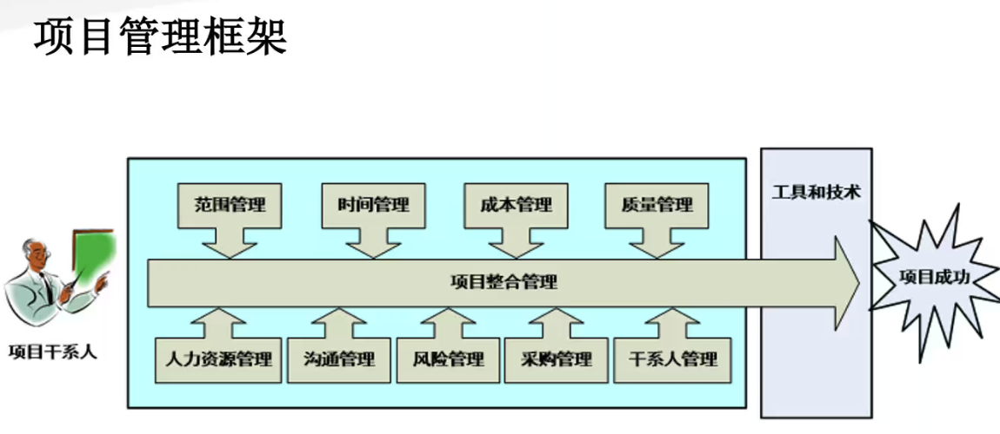

# 1 软件项目管理基本概念

## 1.1 软件是什么

程序 = 数据结构 + 算法
软件 = 程序 + 软件工程
软件企业 = 软件 + 商业模式

### 软件工程

把**系统的、有序的、可量化**的方法应用到软件的**开发、运营和维护**上的过程。
软件工程包括：软件需求分析、软件设计、软件构建、软件测试和软件维护。

### 软件的特殊性

1. 复杂性
2. 不可见性
3. 易变性/灵活性
4. 服从性/一致性
5. 非连续性

### 软件工程的目标

创造足够好的软件：

1. 用户满意度
2. 可靠性
3. 软件流程的质量
4. 可维护性

## 1.2 软件项目管理的基本概念及知识体系

### 项目

为**创造独特**的**产品、服务或成果**而进行的**临时性工作**
一项独特的努力，通常包括一组独特的可交付成果

* 有明确的目的/结果，为达到预期结果而需要完成的一系列任务
* 一段时间，项目是一次性或是临时的，有明确的开始和结尾
* 资源，包括人力资源和其他要素

项目可以创造：

* 一种产品
* 一种能力或提供某种服务的能力

### 项目管理

将知识、技能、工具与技术应用于项目活动，以满足项目的要求

项目管理三要素：

* Time 时间（进度、日程等）
* Scope 范围（产品范围、项目范围）
* Cost 成本（成本、预算等）

六个约束关系：

* Risk 风险
* Quality 质量
* Resources 资源
* +三要素

### 项目、项目集与项目组合管理

- 项目 Project
  项目是指为创造独特的产品、服务或成果而进行的临时性工作，项目是为了组织的经营需要与战略目标服务的。
- 项目集 Program
  **一组相互关联且被协调管理的项目 。**项目集里的项目是通过产生**共同的结果或整体能力**而形成的**相互联系** 。通常，放在一起管理比分开管理更有效、有益的，互相关联的项目叫做项目集。
- 项目组合 Portfolio
  项目组合指的是为了便于管理、能够实现 **战略业务目标** 而组合在一起的项目、项目集和其他工作项目组合中的项目 **不一定彼此依赖或有直接关系** 。对一个或多个项目组合进行的集中管理，包括识别、排序、授权、管理和控制项目、项目集和其他有关工作放一起管理的。可以是非相关的项目，不同的项目集，或子项目组合、运营等，以达成战略目标管理。重点是项目选择，优先级定义，特别重要的是资源分配。

### 项目管理框架

**四大知识领域是是范围管理、时间管理/进度管理、成本管理和质量管理**

其他五大知识领域包括资源管理、沟通管理、风险管理、采购管理、干系人管理/相关方管理(也称辅助知识领域)

# 2 软件团队模式、组织、项目生命周期、软件开发流程

## 2.1 软件团队模式

### 蜂窝模式

一群人开始写代码，希望能写出好软件。

### 主治医师模式

首 席 程 序 员 （ ChiefProgrammer)，他/她负责处理主要模块的设计和编码， 其他成员从各种角度支持他/她的工作（后备程序员、系统管理员、工具开发、编程语言专家、业务专家）

### 明星模式

主治医师模式运用到极点，可以蜕化为明星模式，在这里，明星的光芒盖过了团队其他人的总和。
面临两个主要问题：
–如何让团队的利益最大化，而不是明星的利益最大化？
–如何让团队的价值在明星陨落之后仍然能够保持？

### 社团模式

社区由很多志愿者参与，每个人参与自己感兴趣的项目贡献力量，大部分人不拿报酬。
好处：“众人拾柴火焰高”。
劣处：如果大家都只来烤火，不去拾柴；或者捡到的柴火质量太差，最后火也就熄灭了。

### 业余剧团模式

各人在团队中听从一个中央指挥（导演）的指导和安排
每个人可以尝试不同的角色，平等地交流
常见于学生实践项目或培训项目中

### 秘密团队

一些软件项目在秘密状态下进行，别人不知道他们具体在做什么,源于二战航空设计领域中设计飞机工程中的超级秘密技术。

好处：团队内部有极大的自由，较高的热情，没有外界的干扰（不用每周给别人介绍项目进展，听领导的最新指示等）。一个团队的成员如果有很大的自由度，又有独特的使命，这对于大家来说，是很大的驱动力。这样的团队往往能发挥超高的效率完成看似不可能的任务。

### 特工团队

软件行业的一些团队由一些有特殊技能的专业人士组成，负责解决一些辣手而有紧迫性的问题。

特工团队满足了人们对于“精通某一领域”这种内在驱动因素需求。能达到某个领域的“专家”或“高手”的地位，一出手就能解决难题，这也是对技术人员非常有吸引力。

### 交响乐团模式

交响乐团的演奏有下面的特点：
–家伙多，门类齐全。
–各司其职，各自有专门场地，
演奏期间没有聊天、走动等现象。
–演奏都靠谱，同时看指挥的。
–演奏的都是练习多次的曲目，重在执行。

### 爵士乐模式

从外行看热闹的角度看，和交响乐团相比，这种模式有以下特点：（Miles Davis）
–不靠谱，他们演奏时都没有谱子。
–没有现场指挥，平时有编曲者协调和指导乐队，和迈尔斯常年合作的编曲吉尔•伊文斯(Gil Evans）也是很有造诣的音乐家。
–也有模式，Miles(可以看作是架构师)先用小号吹出主题，然后他到一旁抽烟去了，其余人员根据这个主题各自即兴发挥；最后Miles加入，回应主题，像是对曲子的总结。
–人数较少。

### 功能团队模式

很多软件公司的团队最后都演变成功能团队，简而言之，就是具备不同能力的同事们平等协作，共同完成一个功能。在这个功能完成之后，这些人又重新组织，和别的角色一起去完成下一个功能。他们之间没有管理和被管理的关系。

### 官僚模式

该模式脱胎于大机构的组织架构。
成员间不光有技术方面的合作和领导，同时还混进了组织上的大领导和被领导关系。
各自顶头老板不同，跨组织合作困难。

## 2.2 组织对项目管理的影响

### 组织结构与项目特征对比

组织结构可能影响资源的可用性和项目的执行方式。类型包括**职能型、项目型**及位于这两者之间的三种**矩阵型**结构。

### 职能型组织

典型的职能型组织是一种层级结构。每名雇员都有一位明确的上级。人员按专业分组，各专业还可进一步分成更小职能部门。各部门相互独立开展各自的项目工作。

### 弱矩阵型组织

**矩阵型** 组织兼具职能型和项目型组织的特征。根据职能经理和项目经理之间的权力和影响力的相对程度,矩阵型组织可分为弱矩阵、平衡矩阵和强矩阵。
**弱矩阵型** 组织保留了职能型组织的大部分特征，其项目经理的角色更像是协调员或联络员，作为工作人员的助理和沟通协调员，不能亲自制定或推行决策。

### 强矩阵型组织

**强矩阵型**组织则具有项目型组织的许多特征，拥有较大职权的全职项目经理和全职项目行政人员。

### 平衡矩阵型组织

**平衡矩阵型**组织虽然承认全职项目经理的必要性,但并未授权其全权管理项目和项目资金。

### 项目型组织

在**项目型**组织中，团队成员通常集中办公，组织的大部分资源都用于项目工作，项目经理拥有很大的自主性和职权。这种组织中也经常采用由拟协同技术来获得集中办公的效果。项目型组织中经常有被称为“部门”的组织单元，但它们或者直接向项目经理报告，或者为各个项目提供支持服务。

### 复合型组织

很多组织在不同的组织层级上用到上述所有的结构,这种组织通常被称为**复合型**组织，如图所示是强矩阵型组织和项目型组织形成的复合型组织。该组织采用强矩阵结构管理其大多数项目，而小项目仍由职能部门管理。

## 2.3 项目生命周期

### 五个阶段

项目 生命周期通常包含五个阶段: 

1. 启动 Initiating
2. 计划 Planning
3. 执行 Executing
4. 监控 Monitoring and controlling
5. 收尾 Closing

### 生命周期

## 2.4 项目开发过程/流程

**定义** ： 软件开发过程/流程（software development process）或软件过程（software process）是软件开发的生命周期（softwaredevelopment life cycle）,为软件的开发定义了一个框架，将自动化工具、软件开发方法/模型和质量管理紧密结合在了一起，是在开发与构建系统时应遵循的步骤，是软件开发的路线图。

### 写了再改模式(Code-and-Fix)

史蒂夫·迈克康奈尔（Steve McConnell）提出的，和一窝蜂团队模式很像。
**好处**： 不需要太多其他准备或相关知识，大家上来就写代码，也许就能写出来，写不出来就改，也许能改好。当面临下面的任务时，也许这个方法是有用的：

1. “只用一次”的程序；
2. 看过了就扔”的原型；
3. 一些不实用的演示程序。

**劣势**： 要写一个有实际用户、解决实际需求的软件，这个方法的缺点就太大了。

### 瀑布模型

在设计大型系统时，要做相邻步骤的回溯，解决上一阶段末能解决的问题。要让产品成功，最好把这个模型走两遍，先有一个模拟版本，在此基础上收集反馈，改进各个步骤，并交付一个最终的版本。

- 在软件工程实践中的局限性在于：
  - 各步骤之间是分离的，但是软件生产过程中的各个步骤不能这样严格分高出来
  - 回溯修改很困难甚至不可能，但是软件生产的过程需要时时回溯
  - 最终产品直到最后才出现，但是软件的客户，甚至软件工程师本人都需要尽早知道产品的原型并试用
- 瀑布模型的适用范围：
  - 如果产品的定义非常稳定，但是产品的正确性非常重要，需要每一步的验证
  - 产品模块之间的接口、输人和输出能很好地用形式化的方法定义和验证
  - 使用的技术非常成熟，团队成员都很熟悉这些技术
  - 负责各个步骤的子团队分属不同的机构，或在不同的地理位置，不可能做到频繁的交流

**类似瀑布模型的还有生鱼片模型和子瀑布模型**

**生鱼片模型**
–各相邻模块像生鱼片那样部分重叠
–这个模型解决了各个步骤之间分离的缺点，但是难以确定上一阶段结束时间

**子瀑布模型**
– 为了解决不同子系统之间进度不一，技术要求迥异，需要区别对待的问题，引入子瀑布模型。

### 统一流程 (Rational Unified Process)

RUP把软件开发的各个阶段整合在一个统一的框架里,其工作流(workflow)如下：

- **业务建模** ： 用精确语言描述用户活动
- **通常使用UML**（统一建模语言），其实这种建模的思想应用很广泛；举例来说，“编码理论”或者是“数字电路基础”这种课程所用的状态图等都可以归属于UML
- **需求**： 从活动中感知并表达需求，从需求中抓出软件（至少）要实现的功能
- **分析和设计**： 将系统划分成子模块
- **实现** ： 紧接上一步，搭建可执行的系统
- **测试** ：验证已经交付的组件之间的正确性、组件之间交互的正确性以及所有的需求是否已经被正确地实现
- **部署**： 生成最终的版本并分发给所有用户
- **配置和变更管理** ：记录各个阶段产生的各种工作结果
- **项目管理** ：平衡各种因素，以便在各个阶段交付达到要求的产品
- **环境**： 向软件开发组织提供软件开发环境

RUP把软件开发分成几个阶段，一个大阶段的结束称为一个里程碑（Milestone），每个的阶段内可以有几个选代。RUP在大尺度上自瀑布模型，在每个阶段内像选代模型，其包含四个阶段：

- 初始阶段 ：目标是分析软件系统大概的构成、系统与外部系统的边界、成本和预算、系统的风险。成功度过初始阶段的项目会达到生命周期目标 (Lifecycle Objective)里程碑。
- 细化阶段 ：目标是分析问题领域，建立健全的体系结构基础，编制项目计划，按优先级处理项目中的风险。团队要确定项目的具体范围、主要功能、性能、安全性、可扩展性等非功能需求。同时为项目建立支持环境，包括创建开发案例、创建模板并准备工具。细化阶段结束时，项目到达了第二个重要的里程碑：生命周期结构 (Lifecycle Architecture)里程碑。
- 构造阶段 ：团队开发出所有的功能集，并有秩序地把功能集成为经过各种测试验证过的产品。构造阶段结束时是第三个重要的里程碑：初始功能( Initial Operational) 里程碑。此时的产品版本也常被称为“beta版”。
- 交付阶段： 团队工作的重点是确保软件能满足最终用户的实际需求。交付阶段可以有选代（betal，beta2等），基于用户的反锁，团以利用这些迭代对系统进行修改、调整。除对功能的调整，团队还要注意处理用户设置、安装和可用性等问题。在交付阶段的终点是第四个里程碑：产品发布（Product Release）里程碑。

### 渐进交付的流程 (Evolutionary Delivery)

**特点**：当系统的主要需求和框架明确后，团队进入一个不断演进的循环中

**MVP**：Minimum Viable Product，最小可行产品。尽快得到用户反馈，把最核心的功能点用最小的成本实现出来，快速征求用户意见。

**MBP**：Maximal Beautiful Product，最强最美产品。对用户的需求完全了解，或产品团队比用户更了解用户的需求，可以把产品的最美、最全的形态展现给大家，一举征服用户。这对产品团队要求非常高。

# 3 项目整合管理

## 3.1 项目整合管理概述

• 项目整合管理包括对隶属于项目管理过程组的各种过程和项目管理活动进行识别、定义、组合、统一和协调的各个过程。
• 在项目管理中，整合兼具统一、合并、沟通和建立联系的性质，这些行动应该贯穿项目始终。
• 项目整合管理包括进行以下选择:

- 资源分配
- 平衡竞争性需求
- 研究各种备选方法
- 为实现项目目标而裁剪过程
- 管理各个项目管理知识领域之间的依赖关系

### 项目整合管理过程

- 制定项目章程
- 制定项目管理计划
- 指导与管理项目工作
- 管理项目知识
- 监控项目工作
- 实施整体变更控制
- 结束项目或阶段

## 3.2 制定项目章程

编写一份正式批准项目并授权项目经理在项目活动中使用组织资源的文件的过程

### 制定项目章程：输入

1. 商业文件

   - 商业论证：商业需求和成本效益分析
   - 商业论证的编制考虑如下因素：
     - 市场需求
     - 组织需要
     - 客户要求
     - 技术进步
     - 法律要求
     - 生态影响
     - 社会需要

2. 协议

   协议用于定义启动项目的初衷。协议有多种形式，包括合同、谅解备忘录(MOUs)、 服务水平协议(SLA)、协议书、意向书、口头协议、电子邮件或其他书面协议。为外部客户做项目时，通常就以合同的形式出现。

3. 事业环境因素

   - 外部
   - 内部

4. 组织过程资产

   - 过程、政策和程序
   - 组织知识库

### 制定项目章程：工具与技术

1. 专家判断

   专家判断是指基于某应用领域、知识领域、学科和行业等的专业知识而做出的，关于当前活动的合理判断，这些专业知识可来自具有专业学历、知识、技能、经验或培训经历的任何小组或个人。
   主题：

   - 组织战略
   - 效益管理
   - 关于项目所在的行业以及项目关注的领域的技术知识
   - 持续时间和预算的估算
   - 风险识别

2. 数据收集

   - 头脑风暴
   - 焦点小组
   - 访谈

3. 人际关系与团队技能

   - 冲突管理
   - 引导
   - 会议管理

4. 会议

   与关键相关方举行会议的目的是识别项目目标、成功标准、主要可交付成果、高层级需求、总体里程碑和其他概述信息。

### 制定项目章程：输出

1. 项目章程

   项目章程确保相关方在总体上就主要可交付成果、里程碑以及每个项目参与者的角色和职责达成共识。包含如下信息:

   - 项目目的
   - 可测量的项目目标和相关的成功标准
   - 高层级需求
   - 高层级项目描述、边界定义以及主要可交付成果
   - 整体项目风险
   - 总体里程碑进度计划
   - 预先批准的财务资源
   - 关键相关方名单
   - 项目审批要求(例如，用什么标准评价项目成功，由谁对项目成功下结论，由谁来签署项目结束)
   - 项目退出标准(例如，在何种条件下才能关闭或取消项目或阶段)
   - 委派的项目经理及其职责和职权
   - 发起人或其他批准项目章程的人员的姓名和职权。

2. 假设日志
   假设日志用于记录整个项目生命周期中的所有假设条件和制约因素。

## 3.3 制定项目管理计划

项目管理计划确定项目的执行、监控和收尾方式，其内容会因项目所在的应用领域和复杂程度而异。项目管理计划可以是概括或详细的，而每个组成部分的详细程度取决于具体项目的要求。

## 3.4 指导与管理项目工作

指导与管理项目工作 为实现项目目标而领导和执行项目管理计划中所确定的工作，并实施已批准变更的过程。
本过程的主要作用是，对项目工作和可交付成果开展综合管理，以提高项目成功的可能性。
本过程需要在整个项目期间开展。

## 3.5 管理项目知识

管理项目知识 使用现有知识并生成新知识，以实现项目目标，并且帮助组织学习的过程。
过程的主要作用是，利用已有的组织知识来创造或改进项目成果，并且使当前项目创造的知识可用于支持组织运营和未来的项目或阶段。
本过程需要在整个项目期间开展。

## 3.6 监控项目工作

监控项目工作 跟踪、审查和报告整体项目进展，以实现项目管理计划中确定的绩效目标的过程。
本过程的主要作用：让相关方了解项目当前状态并认可为处理绩效问题而采取的行动，以及通过成本和进度预测让相关方了解未来项目状态。
本过程需要在整个项目期间开展。

## 3.7 实施整体变更控制

**实施整体变更控制** 审查所有变更请求，批准变更，管理对可交付成果、组织过程资产、 项目文件和项目管理计划的变更，并对变更处理结果进行沟通的过程。本过程审查对项目文件、可交付成果或项目管理计划的所有变更请求，并决定对变更请求的处置方案。本过程的主要作用是确保对项目中已记录在案的变更做综合评审。如果不考虑变更对整体项目目标或计划的影响就开展变更，往往会加剧整体项目风险。本过程需要在整个项目期间开展。

## 3.8 结束项目或阶段

结束项目或阶段 终结项目、阶段或合同的所有活动的过程。
本过程的主要作用：存档项目或阶段信息，完成计划的工作，释放组织团队资源以展开新的工作。它仅开展一次或仅在项目的预定义点开展。

# 4 项目范围管理

# 5 项目进度管理

# 6 项目成本管理

# 7 项目质量管理

# 8 项目资源管理

# 9 项目沟通管理

# 10 项目相关方/干系人管理

# 11 项目风险管理

# 12 项目采购管理

# 13 敏捷开发与项目管理过程