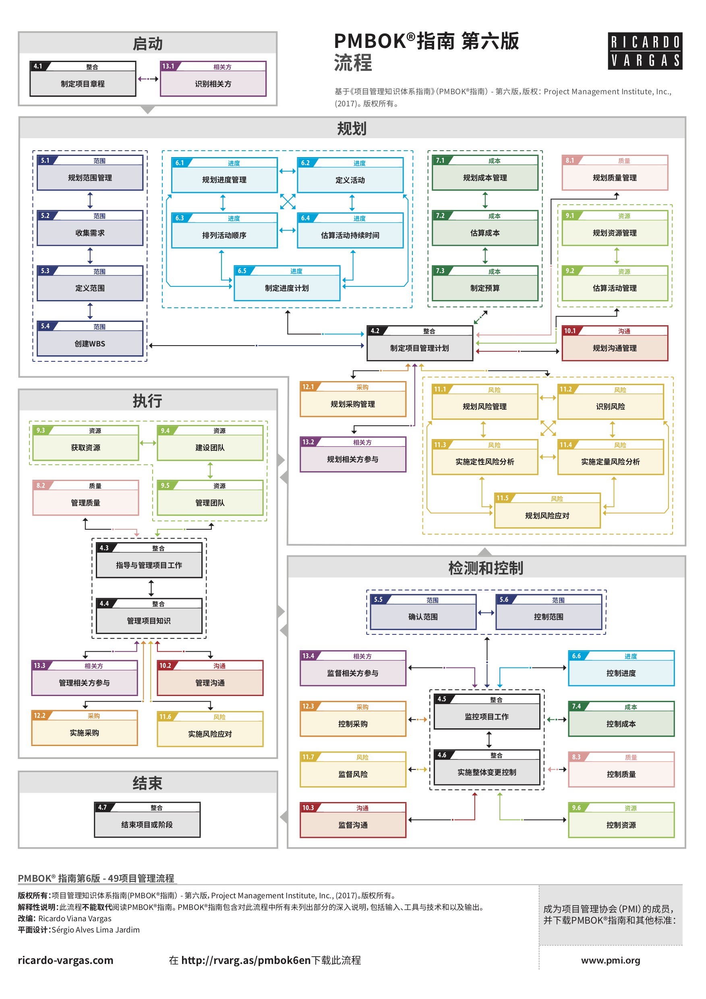

# 1 软件项目管理基本概念

## 1.1 软件是什么

程序 = 数据结构 + 算法
软件 = 程序 + 软件工程
软件企业 = 软件 + 商业模式

### 软件工程

把**系统的、有序的、可量化**的方法应用到软件的**开发、运营和维护**上的过程。
软件工程包括：软件需求分析、软件设计、软件构建、软件测试和软件维护。

### 软件的特殊性

1. 复杂性
2. 不可见性
3. 易变性/灵活性
4. 服从性/一致性
5. 非连续性

### 软件工程的目标

创造足够好的软件：

1. 用户满意度
2. 可靠性
3. 软件流程的质量
4. 可维护性

## 1.2 软件项目管理的基本概念及知识体系

### 项目

为**创造独特**的**产品、服务或成果**而进行的**临时性工作**
一项独特的努力，通常包括一组独特的可交付成果

* 有明确的目的/结果，为达到预期结果而需要完成的一系列任务
* 一段时间，项目是一次性或是临时的，有明确的开始和结尾
* 资源，包括人力资源和其他要素

项目可以创造：

* 一种产品
* 一种能力或提供某种服务的能力

### 项目管理

将知识、技能、工具与技术应用于项目活动，以满足项目的要求

项目管理三要素：

* Time 时间（进度、日程等）
* Scope 范围（产品范围、项目范围）
* Cost 成本（成本、预算等）

六个约束关系：

* Risk 风险
* Quality 质量
* Resources 资源
* +三要素

### 项目、项目集与项目组合管理

- 项目 Project
  项目是指为创造独特的产品、服务或成果而进行的临时性工作，项目是为了组织的经营需要与战略目标服务的。
- 项目集 Program
  **一组相互关联且被协调管理的项目 。**项目集里的项目是通过产生**共同的结果或整体能力**而形成的**相互联系** 。通常，放在一起管理比分开管理更有效、有益的，互相关联的项目叫做项目集。
- 项目组合 Portfolio
  项目组合指的是为了便于管理、能够实现 **战略业务目标** 而组合在一起的项目、项目集和其他工作项目组合中的项目 **不一定彼此依赖或有直接关系** 。对一个或多个项目组合进行的集中管理，包括识别、排序、授权、管理和控制项目、项目集和其他有关工作放一起管理的。可以是非相关的项目，不同的项目集，或子项目组合、运营等，以达成战略目标管理。重点是项目选择，优先级定义，特别重要的是资源分配。

### 项目管理框架

**四大知识领域是是范围管理、时间管理/进度管理、成本管理和质量管理**

其他五大知识领域包括资源管理、沟通管理、风险管理、采购管理、干系人管理/相关方管理(也称辅助知识领域)

# 2 软件团队模式、组织、项目生命周期、软件开发流程

## 2.1 软件团队模式

### 蜂窝模式

一群人开始写代码，希望能写出好软件。

### 主治医师模式

首 席 程 序 员 （ ChiefProgrammer)，他/她负责处理主要模块的设计和编码， 其他成员从各种角度支持他/她的工作（后备程序员、系统管理员、工具开发、编程语言专家、业务专家）

### 明星模式

主治医师模式运用到极点，可以蜕化为明星模式，在这里，明星的光芒盖过了团队其他人的总和。
面临两个主要问题：
–如何让团队的利益最大化，而不是明星的利益最大化？
–如何让团队的价值在明星陨落之后仍然能够保持？

### 社团模式

社区由很多志愿者参与，每个人参与自己感兴趣的项目贡献力量，大部分人不拿报酬。
好处：“众人拾柴火焰高”。
劣处：如果大家都只来烤火，不去拾柴；或者捡到的柴火质量太差，最后火也就熄灭了。

### 业余剧团模式

各人在团队中听从一个中央指挥（导演）的指导和安排
每个人可以尝试不同的角色，平等地交流
常见于学生实践项目或培训项目中

### 秘密团队

一些软件项目在秘密状态下进行，别人不知道他们具体在做什么,源于二战航空设计领域中设计飞机工程中的超级秘密技术。

好处：团队内部有极大的自由，较高的热情，没有外界的干扰（不用每周给别人介绍项目进展，听领导的最新指示等）。一个团队的成员如果有很大的自由度，又有独特的使命，这对于大家来说，是很大的驱动力。这样的团队往往能发挥超高的效率完成看似不可能的任务。

### 特工团队

软件行业的一些团队由一些有特殊技能的专业人士组成，负责解决一些辣手而有紧迫性的问题。

特工团队满足了人们对于“精通某一领域”这种内在驱动因素需求。能达到某个领域的“专家”或“高手”的地位，一出手就能解决难题，这也是对技术人员非常有吸引力。

### 交响乐团模式

交响乐团的演奏有下面的特点：
–家伙多，门类齐全。
–各司其职，各自有专门场地，
演奏期间没有聊天、走动等现象。
–演奏都靠谱，同时看指挥的。
–演奏的都是练习多次的曲目，重在执行。

### 爵士乐模式

从外行看热闹的角度看，和交响乐团相比，这种模式有以下特点：（Miles Davis）
–不靠谱，他们演奏时都没有谱子。
–没有现场指挥，平时有编曲者协调和指导乐队，和迈尔斯常年合作的编曲吉尔•伊文斯(Gil Evans）也是很有造诣的音乐家。
–也有模式，Miles(可以看作是架构师)先用小号吹出主题，然后他到一旁抽烟去了，其余人员根据这个主题各自即兴发挥；最后Miles加入，回应主题，像是对曲子的总结。
–人数较少。

### 功能团队模式

很多软件公司的团队最后都演变成功能团队，简而言之，就是具备不同能力的同事们平等协作，共同完成一个功能。在这个功能完成之后，这些人又重新组织，和别的角色一起去完成下一个功能。他们之间没有管理和被管理的关系。

### 官僚模式

该模式脱胎于大机构的组织架构。
成员间不光有技术方面的合作和领导，同时还混进了组织上的大领导和被领导关系。
各自顶头老板不同，跨组织合作困难。

## 2.2 组织对项目管理的影响

### 组织结构与项目特征对比

组织结构可能影响资源的可用性和项目的执行方式。类型包括**职能型、项目型**及位于这两者之间的三种**矩阵型**结构。

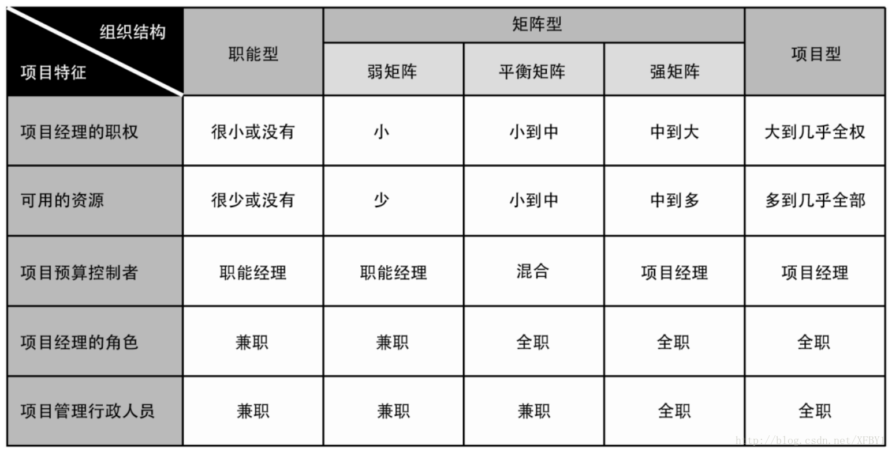

### 职能型组织

典型的职能型组织是一种层级结构。每名雇员都有一位明确的上级。人员按专业分组，各专业还可进一步分成更小职能部门。各部门相互独立开展各自的项目工作。

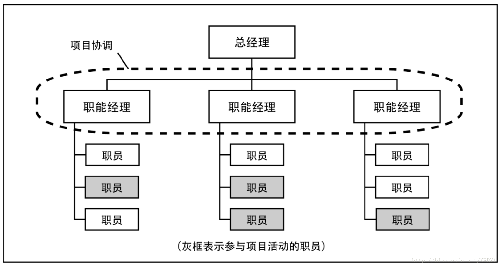

### 弱矩阵型组织

**矩阵型** 组织兼具职能型和项目型组织的特征。根据职能经理和项目经理之间的权力和影响力的相对程度,矩阵型组织可分为弱矩阵、平衡矩阵和强矩阵。
**弱矩阵型** 组织保留了职能型组织的大部分特征，其项目经理的角色更像是协调员或联络员，作为工作人员的助理和沟通协调员，不能亲自制定或推行决策。

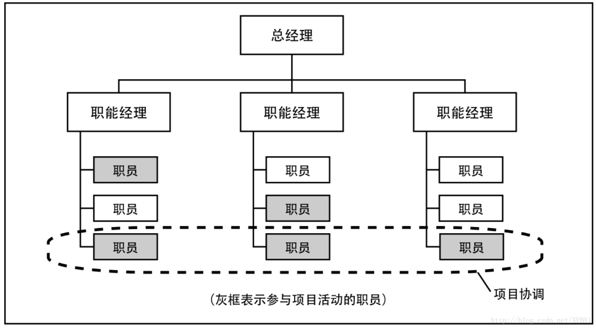

### 强矩阵型组织

**强矩阵型**组织则具有项目型组织的许多特征，拥有较大职权的全职项目经理和全职项目行政人员。

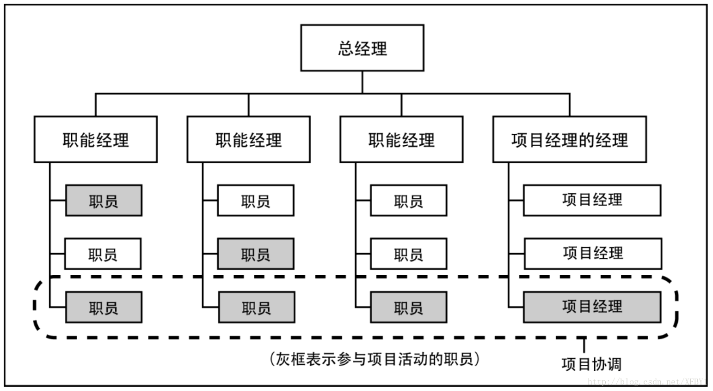

### 平衡矩阵型组织

**平衡矩阵型**组织虽然承认全职项目经理的必要性,但并未授权其全权管理项目和项目资金。

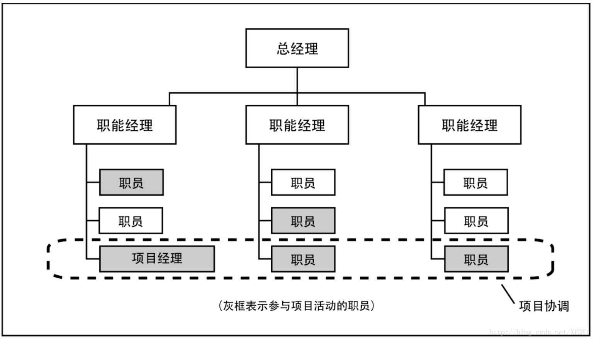

### 项目型组织

在**项目型**组织中，团队成员通常集中办公，组织的大部分资源都用于项目工作，项目经理拥有很大的自主性和职权。这种组织中也经常采用由拟协同技术来获得集中办公的效果。项目型组织中经常有被称为“部门”的组织单元，但它们或者直接向项目经理报告，或者为各个项目提供支持服务。

### 复合型组织

很多组织在不同的组织层级上用到上述所有的结构,这种组织通常被称为**复合型**组织，如图所示是强矩阵型组织和项目型组织形成的复合型组织。该组织采用强矩阵结构管理其大多数项目，而小项目仍由职能部门管理。

## 2.3 项目生命周期

### 五个阶段

项目 生命周期通常包含五个阶段: 

1. 启动 Initiating
2. 计划 Planning
3. 执行 Executing
4. 监控 Monitoring and controlling
5. 收尾 Closing

### 生命周期

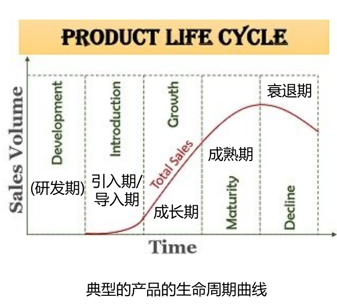

## 2.4 项目开发过程/流程

**定义** ： 软件开发过程/流程（software development process）或软件过程（software process）是软件开发的生命周期（softwaredevelopment life cycle）,为软件的开发定义了一个框架，将自动化工具、软件开发方法/模型和质量管理紧密结合在了一起，是在开发与构建系统时应遵循的步骤，是软件开发的路线图。

### 写了再改模式(Code-and-Fix)

史蒂夫·迈克康奈尔（Steve McConnell）提出的，和一窝蜂团队模式很像。
**好处**： 不需要太多其他准备或相关知识，大家上来就写代码，也许就能写出来，写不出来就改，也许能改好。当面临下面的任务时，也许这个方法是有用的：

1. “只用一次”的程序；
2. 看过了就扔”的原型；
3. 一些不实用的演示程序。

**劣势**： 要写一个有实际用户、解决实际需求的软件，这个方法的缺点就太大了。

### 瀑布模型

在设计大型系统时，要做相邻步骤的回溯，解决上一阶段末能解决的问题。要让产品成功，最好把这个模型走两遍，先有一个模拟版本，在此基础上收集反馈，改进各个步骤，并交付一个最终的版本。

- 在软件工程实践中的局限性在于：
  - 各步骤之间是分离的，但是软件生产过程中的各个步骤不能这样严格分高出来
  - 回溯修改很困难甚至不可能，但是软件生产的过程需要时时回溯
  - 最终产品直到最后才出现，但是软件的客户，甚至软件工程师本人都需要尽早知道产品的原型并试用
- 瀑布模型的适用范围：
  - 如果产品的定义非常稳定，但是产品的正确性非常重要，需要每一步的验证
  - 产品模块之间的接口、输人和输出能很好地用形式化的方法定义和验证
  - 使用的技术非常成熟，团队成员都很熟悉这些技术
  - 负责各个步骤的子团队分属不同的机构，或在不同的地理位置，不可能做到频繁的交流

**类似瀑布模型的还有生鱼片模型和子瀑布模型**

**生鱼片模型**
–各相邻模块像生鱼片那样部分重叠
–这个模型解决了各个步骤之间分离的缺点，但是难以确定上一阶段结束时间

**子瀑布模型**
– 为了解决不同子系统之间进度不一，技术要求迥异，需要区别对待的问题，引入子瀑布模型。

### 统一流程 (Rational Unified Process)

RUP把软件开发的各个阶段整合在一个统一的框架里,其工作流(workflow)如下：

- **业务建模** ： 用精确语言描述用户活动
- **通常使用UML**（统一建模语言），其实这种建模的思想应用很广泛；举例来说，“编码理论”或者是“数字电路基础”这种课程所用的状态图等都可以归属于UML
- **需求**： 从活动中感知并表达需求，从需求中抓出软件（至少）要实现的功能
- **分析和设计**： 将系统划分成子模块
- **实现** ： 紧接上一步，搭建可执行的系统
- **测试** ：验证已经交付的组件之间的正确性、组件之间交互的正确性以及所有的需求是否已经被正确地实现
- **部署**： 生成最终的版本并分发给所有用户
- **配置和变更管理** ：记录各个阶段产生的各种工作结果
- **项目管理** ：平衡各种因素，以便在各个阶段交付达到要求的产品
- **环境**： 向软件开发组织提供软件开发环境

RUP把软件开发分成几个阶段，一个大阶段的结束称为一个里程碑（Milestone），每个的阶段内可以有几个选代。RUP在大尺度上自瀑布模型，在每个阶段内像选代模型，其包含四个阶段：

- 初始阶段 ：目标是分析软件系统大概的构成、系统与外部系统的边界、成本和预算、系统的风险。成功度过初始阶段的项目会达到生命周期目标 (Lifecycle Objective)里程碑。
- 细化阶段 ：目标是分析问题领域，建立健全的体系结构基础，编制项目计划，按优先级处理项目中的风险。团队要确定项目的具体范围、主要功能、性能、安全性、可扩展性等非功能需求。同时为项目建立支持环境，包括创建开发案例、创建模板并准备工具。细化阶段结束时，项目到达了第二个重要的里程碑：生命周期结构 (Lifecycle Architecture)里程碑。
- 构造阶段 ：团队开发出所有的功能集，并有秩序地把功能集成为经过各种测试验证过的产品。构造阶段结束时是第三个重要的里程碑：初始功能( Initial Operational) 里程碑。此时的产品版本也常被称为“beta版”。
- 交付阶段： 团队工作的重点是确保软件能满足最终用户的实际需求。交付阶段可以有选代（betal，beta2等），基于用户的反锁，团以利用这些迭代对系统进行修改、调整。除对功能的调整，团队还要注意处理用户设置、安装和可用性等问题。在交付阶段的终点是第四个里程碑：产品发布（Product Release）里程碑。

### 渐进交付的流程 (Evolutionary Delivery)

**特点**：当系统的主要需求和框架明确后，团队进入一个不断演进的循环中

**MVP**：Minimum Viable Product，最小可行产品。尽快得到用户反馈，把最核心的功能点用最小的成本实现出来，快速征求用户意见。

**MBP**：Maximal Beautiful Product，最强最美产品。对用户的需求完全了解，或产品团队比用户更了解用户的需求，可以把产品的最美、最全的形态展现给大家，一举征服用户。这对产品团队要求非常高。

# 4 项目整合管理

## 项目整合管理概述

• 项目整合管理包括对隶属于项目管理过程组的各种过程和项目管理活动进行识别、定义、组合、统一和协调的各个过程。
• 在项目管理中，整合兼具统一、合并、沟通和建立联系的性质，这些行动应该贯穿项目始终。
• 项目整合管理包括进行以下选择:

- 资源分配
- 平衡竞争性需求
- 研究各种备选方法
- 为实现项目目标而裁剪过程
- 管理各个项目管理知识领域之间的依赖关系

### 项目整合管理过程

- 制定项目章程
- 制定项目管理计划
- 指导与管理项目工作
- 管理项目知识
- 监控项目工作
- 实施整体变更控制
- 结束项目或阶段

## 4.1 制定项目章程

编写一份正式批准项目并授权项目经理在项目活动中使用组织资源的文件的过程

### 制定项目章程：输入

1. 商业文件

   - 商业论证：商业需求和成本效益分析
   - 商业论证的编制考虑如下因素：
     - 市场需求
     - 组织需要
     - 客户要求
     - 技术进步
     - 法律要求
     - 生态影响
     - 社会需要

2. 协议

   协议用于定义启动项目的初衷。协议有多种形式，包括合同、谅解备忘录(MOUs)、 服务水平协议(SLA)、协议书、意向书、口头协议、电子邮件或其他书面协议。为外部客户做项目时，通常就以合同的形式出现。

3. 事业环境因素

   - 外部
   - 内部

4. 组织过程资产

   - 过程、政策和程序
   - 组织知识库

### 制定项目章程：工具与技术

1. 专家判断

   专家判断是指基于某应用领域、知识领域、学科和行业等的专业知识而做出的，关于当前活动的合理判断，这些专业知识可来自具有专业学历、知识、技能、经验或培训经历的任何小组或个人。
   主题：

   - 组织战略
   - 效益管理
   - 关于项目所在的行业以及项目关注的领域的技术知识
   - 持续时间和预算的估算
   - 风险识别

2. 数据收集

   - 头脑风暴
   - 焦点小组
   - 访谈

3. 人际关系与团队技能

   - 冲突管理
   - 引导
   - 会议管理

4. 会议

   与关键相关方举行会议的目的是识别项目目标、成功标准、主要可交付成果、高层级需求、总体里程碑和其他概述信息。

### 制定项目章程：输出

1. 项目章程

   项目章程确保相关方在总体上就主要可交付成果、里程碑以及每个项目参与者的角色和职责达成共识。包含如下信息:

   - 项目目的
   - 可测量的项目目标和相关的成功标准
   - 高层级需求
   - 高层级项目描述、边界定义以及主要可交付成果
   - 整体项目风险
   - 总体里程碑进度计划
   - 预先批准的财务资源
   - 关键相关方名单
   - 项目审批要求(例如，用什么标准评价项目成功，由谁对项目成功下结论，由谁来签署项目结束)
   - 项目退出标准(例如，在何种条件下才能关闭或取消项目或阶段)
   - 委派的项目经理及其职责和职权
   - 发起人或其他批准项目章程的人员的姓名和职权。

2. 假设日志
   假设日志用于记录整个项目生命周期中的所有假设条件和制约因素。

## 4.2 制定项目管理计划

项目管理计划确定项目的执行、监控和收尾方式，其内容会因项目所在的应用领域和复杂程度而异。项目管理计划可以是概括或详细的，而每个组成部分的详细程度取决于具体项目的要求。

## 4.3 指导与管理项目工作

指导与管理项目工作 为实现项目目标而领导和执行项目管理计划中所确定的工作，并实施已批准变更的过程。
本过程的主要作用是，对项目工作和可交付成果开展综合管理，以提高项目成功的可能性。
本过程需要在整个项目期间开展。

## 4.4 管理项目知识

管理项目知识 使用现有知识并生成新知识，以实现项目目标，并且帮助组织学习的过程。
过程的主要作用是，利用已有的组织知识来创造或改进项目成果，并且使当前项目创造的知识可用于支持组织运营和未来的项目或阶段。
本过程需要在整个项目期间开展。

## 4.5 监控项目工作

监控项目工作 跟踪、审查和报告整体项目进展，以实现项目管理计划中确定的绩效目标的过程。
本过程的主要作用：让相关方了解项目当前状态并认可为处理绩效问题而采取的行动，以及通过成本和进度预测让相关方了解未来项目状态。
本过程需要在整个项目期间开展。

## 4.6 实施整体变更控制

**实施整体变更控制** 审查所有变更请求，批准变更，管理对可交付成果、组织过程资产、 项目文件和项目管理计划的变更，并对变更处理结果进行沟通的过程。本过程审查对项目文件、可交付成果或项目管理计划的所有变更请求，并决定对变更请求的处置方案。本过程的主要作用是确保对项目中已记录在案的变更做综合评审。如果不考虑变更对整体项目目标或计划的影响就开展变更，往往会加剧整体项目风险。本过程需要在整个项目期间开展。

## 4.7 结束项目或阶段

结束项目或阶段 终结项目、阶段或合同的所有活动的过程。
本过程的主要作用：存档项目或阶段信息，完成计划的工作，释放组织团队资源以展开新的工作。它仅开展一次或仅在项目的预定义点开展。

# 5 项目范围管理

## 5.1 规划范围管理

规划范围管理是为记录如何定义、确认和控制项目范围及产品范围，而创建范围管理计划的过程。
本过程的主要作用是，在整个项目期间对如何管理范围提供指南和方向。本过程仅开展一次或仅在项目的预定义点开展。

## 5.2 收集需求

收集需求是为实现目标而确定、记录并管理相关方的需要和需求的过程。本过程的主要作用是，为定义产品范围和项目范围奠定基础，且仅开展一次或仅在项目的预定义点开展。

### 软件需求的类型

- 对产品功能的需求
- 对产品开发过程的需求
- 非功能性需求
- 综合需求

### 软件团队获取需求的主要步骤

- 获取和引导需求
- 分析和定义需求
- 验证需求
- 在软件产品的生命周期中管理需求

### 软件产品的利益相关者

- 用户
- 顾客
- 市场分析者
- 监管机构
- 系统/应用集成商
- 软件团队
- 软件工程师

### 收集用户需求

软件开发的过程，就是“用户最需要的东西”在下面这一链条中传送、转换、实现、扭曲或丢失的过程。

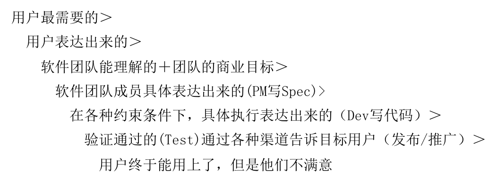

1. 焦点小组
   找到一群目标用户的代表，加上项目的利益相关者来讨论用户想要什么，
   用户对软件的评价等等。
2. 深度面谈
   通过详细的面谈，广泛而深入地了解用户的背景、心理、需求等。这通常是一对一的采访，这种方法费时费力，效果往往取决于主持面谈的成员的能力。
3. 卡片分类
   把团队收集的各类需求做成便于规整的卡片，然后反复进行下列活动：
   讨论→明晰定义→归类→排序。
   这类方法可以帮助我们更好地统一大家对软件需求的认识，量化各种特性，更好地定义一个软件的信息架构、用户的工作流程、软件菜单结构、网站的浏览路径、各种内容的层次关系等。
4. 用户日志研究
   这一调研方式要求用户记录自己日常工作或生活中与所用软件相关的行为，供软件团队分析。用户可以写类似日记体的文字描述，也可以每天填表（例如跟踪自己每天的饮食种类）也可以使用软件来跟踪。
5. 用户调查问卷
   这种方法是向用户提供事先设计好的问题，让用户回答。
6. 人类学调查
   可以理解为和目标用户“同吃同住同劳动”。走进真实世界中，理解目标用户的真实需求。
7. A/B测试
   当产品已经有一些用户时，可以采用该方式来更好地了解用户需求。
   - 决定试验哪两种不同的界面，衡量标准、数据收集流程、试验运行时间、人数；
   - 在技术上实现 A/B测试（通常在5%-10% 的用户上运行试验）；
   - 收集数据，分析数据，形成结论。
8. 系统交互图
   系统交互图是对产品范围的可视化描绘，显示业务系统(过程、设备、计算机系统等)及其与人和其他系统(行动者)之间的交互方式。系统交互图显示了业务系统的输入、输入提供者、业务系统的输出和输出接收者。

### 收集需求：输出

**需求追踪矩阵**

- 把每个**需求与业务目标**或项目名目标联系起来,有助于月报每个需求都有商业价值
- 提供了在**整个项目生命周期**中跟踪需求的一种方法
- 有助于确保修文件中被批准的每项需求在项目结束的时候能交付

## 5.3 定义范围

定义范围是制定项目和产品详细描述的过程。**明确项目、服务或成果的便捷**

1. 筛选 **哪些需求包含在项目内**
   **哪些将排除在项目范围外**
2. 可交付成果

### 定义范围输出：项目范围说明书

- 产品范围描述。逐步**细化**在**项目章程**和**需求文件**中所述的产品、服务或成果的特征。
- **可交付成果**。为完成某一过程、阶段或项目而必须产出的**任何独特并可核实**的产品、成果或服务能力，可交付成果**也包括各种辅助成果**，如项目管理报告和文件。对可交付成果的描述可略可详。
- 验收标准。可交付成果通过验收前必须满足的一系列条件。
- 项目的除外责任。识别排除在项目之外的内容。明确说明哪些内容**不属于项目范围**，有助于**管理相关方的期望及减少范围蔓延**。

## 5.4 创建WBS

创建工作分解结构(WBS)是把项目可交付成果和项目工作**分解**成较小、更易于管理的组件的过程。
本过程的主要作用是，为所要交付的内容提供架构，它仅开展一次或仅在项目的预定义点开展。

要把整个项目工作分解为工作包，通常需要开展以下活动:

- 识别和分析可交付成果及相关工作;
- 确定WBS的结构和编排方法;
- 自上而下逐层细化分解;
- 为WBS组成部分制定和分配标识编码;
- 核实可交付成果分解的程度是否恰当。

以项目生命周期的各阶段作为分解的第二层，把产品和项目可交付成果放在第三层
或以主要可交付成果作为分解的第二层。

**四个注意点**

- 如果采用敏捷方法，可以**将长篇故事分解成用户故事**
- 不同的可交付成果可以分解到**不同的层次**
- 并不是分解的越细越好，**过细**的分解会造成**管理努力的无效耗费、资源使用效率低下、工作实施效率数据汇总困难**
- 运期才完成的可交付成果或组建，当前可能无法解决

**四个主要原则**

- 100%原则 - 无遗漏无多余
- 80小时 - 工作包80小时
- 4-6层原则 - 不宜过细分解
- 责任明确原则 - 有明确责任人

范围基准

- 范围说明书
- 工作分解结构WBS（工作包、规划包、控制账户（第二层以下））
- **WBS词典** 对WBS提供支持，包含具体工作包的信息

## 5.5 确认范围

确认范围是**正式验收已完成的项目可交付成果**的过程

主要作用：

- 使验收过程具有客观性
- 同时通过**确认每个可交付成果**，来**提高最终产品、服务或成果获得验收（收尾）的可能性**。

## 5.6 控制范围

控制范围是**监督**项目和产品的范围**状态**，**管理**范围基准**变更**的过程

主要作用：在整个项目期间保持**对范围基准的维护** 避免范围蔓延

# 6 项目进度管理

## 6.1 规划进度管理

规划进度管理是为规划、编制、管理、执行和控制项目进度而制定政策、程序和文档的过程。
本过程的**主要作用**是：为如何在整个项目期间管理项目进度提供**指南和方向**。

### 规划进度管理输出：进度管理计划

- 项目进度模型制定（项目活动网络图、关键路径）
- 进度计划的发布和迭代长度
- 准确度（规定活动持续时间估算的可接受区间，允许的应急储备数量）
- 计量单位（例人时数、人天数或人周数）
- 组织程序链接
- 项目进度模型维护
- 控制临界值
- 绩效测量规则
- 报告格式

## 6.2 定义活动

定义活动是识别和记录为完成项目可交付成果而须采取的具体行动的过程。
本过程的主要作用是，将WBS工作包分解为进度活动，作为对项目工作进行进度估算、规划、执行、监督和控制的基础。

### 定义活动：工具与技术

- 分解：把项目范围和项目可交付成果逐步划分为更小、更便于管理的组成部分，每个工作包都需要分解成活动。**让团队成员参与分解过程**定义活动过程的最终输出是活动而不是可交付成果，可交付成果是创建WBS过程的输出。WBS、WBS词典和活动清单可依次或同时编制，其中WBS和WBS词典是制定最终活动清单的基础。WBS中的每个工作包都需分解成活动，以便通过这些活动来完成相应的可交付成果。让团队成员参与分解过程，有助于得到更好、更准确的结果。
- 滚动式规划：一种**渐进明细**的**迭代式**规划技术，适用于工作包、规划包的**敏捷开发**。

### 定义活动：输出

- 活动清单：包含所需的**进度活动、每个活动的标识及工作范围详述**。活动属性（活动描述，紧前活动，紧后活动...)使用**滚动式规划或敏捷技术**的项目，活动清单需要**定期更新**
- 活动属性：每项活动所具有的多重属性，扩充对活动的描述
- 里程碑清单：项目中的重要**时点**或**事件**。有**强制性的（如合同要求的）**和**选择性的（如根据历史信息确定的）**可以定义父里程碑和子里程碑

### 案例

甲公司委托A公司开发一个应用系统，需要实现数据移植、系统切换等功能，且需要在主机和全国各网点进行部署。
A公司刚提拔上来的项目经理，接到事业部经理给的项目资料后，得知项目刚刚签约，还没有正式启动。见到第一个客户就听到抱怨：客户的主要人员都已就位，而公司核心团队还没有组建好

PM 整理了 下自己 的工作 思路 ：

1) 建立组织和制度 。建立项目的组织结构，确定职责分工，确定基本规章制度和工作流程。
2) 明确工作思路 。 应该兵分两路：一路确认工作范围，制定工作计划；另一路确定开发方法，特别是马上要确定需求文档的格式和工作流程。
3) 申请专家 支 持 。为了弥补自己经验不足的问题，请领导派一个经验丰富的业务专家过来，对工作进行指导和把关。
4) 拜访客户 。尽快拜访客户的主要相关领导，了解他们对项目的期待。
5) 集中培训 。召开启动会，随后集中全体成员进行培训，介绍项目的规章制度、工作计划、工作方法、需求分析流程等。

## 6.3 排列活动顺序

排列活动顺序是识别和记录项目活动之间的**关系**的过程
本过程的主要作用是定义工作之间的**逻辑顺序**，以便在既定的所有项目制约因素下获得**最高的效率**。

### 软件项目排列活动顺序的特点

- 依赖因素复杂
- 软件架构在各个领域都对排列项目活动顺序有重大影响

### 紧前关系绘图法

**紧前关系绘图法**（Precedence Diagramming Method，简称PDM），又称前导图法、优先图法、节点法，用一种或多种逻辑关系连接活动，以展示活动的实施顺序

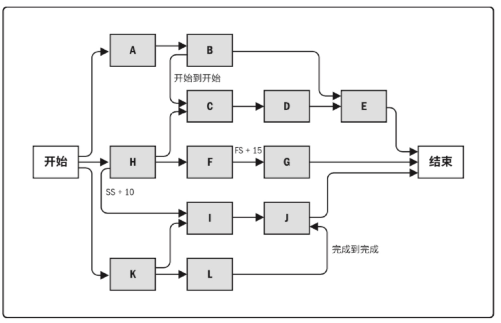

**PDM四种依赖关系或逻辑关系**

- 完成到开始 (FS) 。 只有紧前活动完成，紧后活动才能开始的逻辑关系。例如，只有完成装配 PC 硬件(紧前活动)，才能开始在 PC 上安装操作系统(紧后活动)。(最常见）
- 完成到完成 (FF) 。只有紧前活动完成，紧后活动才能完成的逻辑关系。
- 开始到开始 (SS) 。 只有紧前活动开始，紧后活动才能开始的逻辑关系。例如，开始地基浇灌 (紧后活动)之后，才能开始混凝土的找平(紧前活动)。
- 开始到完成 (SF) 。 只有紧前活动开始，紧后活动才能完成的逻辑关系。例如，只有启动新的应付账款系统(紧前活动)，才能关闭旧的应付账款系统(紧后活动)。（非常少见）

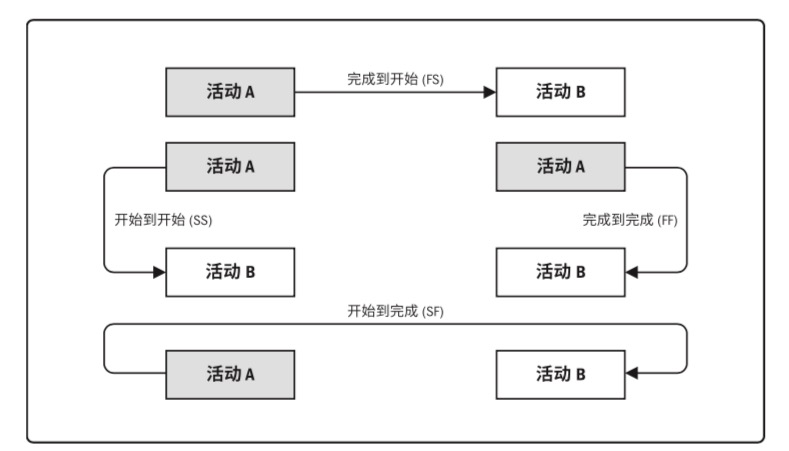

### 工具与技术：确定和整合依赖关系

- 强制性依赖
  强制性依赖关系是**法律或合同要求**的或**工作的内在性质决定**的依赖关系
  强制性依赖关系又称硬逻辑关系或硬依赖关系。强制性依赖关系是法律或合同要求的或工作的内在性质决定的依赖关系，强制性依赖关系往往与客观限制有关。例如：将数据写入表之前需要创建用户表的位置。
- 选择性依赖
  选择性依赖关系应基于具体应用领域的**最佳实践**或项目的**某些特殊性质**对活动顺序的要求来创建。
  选择性依赖关系有时又称首选逻辑关系、优先逻辑关系或软逻辑关系。选择性依赖关系应基于具体应用领域的最佳实践或项目的某些特殊性质对活动顺序的要求来创建。例如：先开发浏览器用户登录界面，还是先开发手机界面，顺序的选择是软件团队的偏好。
- 外部依赖
  外部依赖关系是**项目活动与非项目活动**之间的依赖关系。（项目团队**不能违反**）
  外部依赖关系是项目活动与非项目活动之间的依赖关系，这些依赖关系往往不在项目团队控制范围内。例如，软件项目的测试活动取决于外部硬件的到货；托管服务提供商必须先启动虚拟服务器，然后才能安装软件；有雪的地方才能滑雪。
- 内部依赖
  内部依赖关系是**项目活动之间**的紧前关系(项目团队**可自由选择**)
  内部依赖关系是项目活动之间的紧前关系，通常在项目团队的控制之中。例如，在开始用户验收测试之前，必须在QA服务器环境中安装版本发布。软件的安装由项目组成员完成，这是一个内部的强制性依赖关系。

### 工具与技术：提前量和滞后量

- 提前量(lead)是紧后活动**可以**提前的时间量。(FS - 3)
- 滞后量(lag)是紧后活动**必须**推迟的时间量。(FS + 2)
- 提前量和滞后量的使用**不能替代进度逻辑关系**，活动持续时间估算中不包括任何提前量或滞后量。

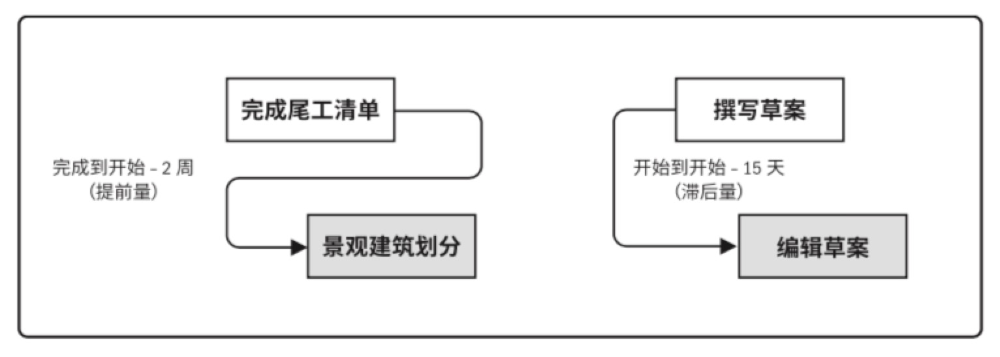

## 6.4 估计活动持续时间

估算活动持续时间是根据资源估算的结果，估算完成单项活动所需工作时段数的过程。本过程的主要作用是，确定完成每个活动所需花费的时间量。

### 影响活动持续时间的因素

活动时间=工作数量/生产效率

 可能会影响活动持续时间的因素是：

- 收益递减规律
- 资源数量
- 技术进步
- 员工激励
- 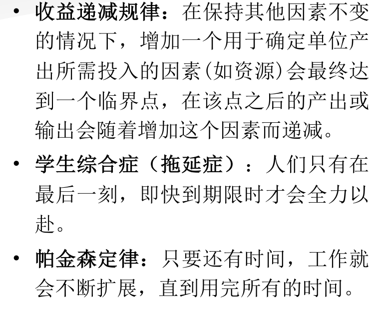

### 估算活动持续时间的特点

应该由项目团队中最熟悉具体活动的个人或小组提供持续时间估算所需的各种输入

### 工具与技术：类比估算

- **自上而下**的估算 整体估算
- 在**项目详细信息不足**时经常使用
- 针对 **整个项目或项目中的某个部分**
- **成本较低、耗时较少，准确性较低**
- 使用相似活动或项目的历史数据，来估算当前活动或项目的持续时间或成本

### 工具与技术：自下而上估算

- 通过从下到上逐层汇总WBS组成部分的估算而得到项目估算
- 将活动中的工作进一步细化，然后估算具体的持续时间，接着再汇总这些资源需求估算，得到每个活动的持续时间
- 是**最准确**的估算方法

### 工具与技术：参数估算

一种基于**历史数据和项目参数**，使用某种算法来计算成本或持续时间的估算技术

参数估算的准确性取决于**参数模型的成熟度和基础数据的可靠性**

适用于持续时间呈线性或是易于扩展的活动
不适用于没有执行过的活动

把需要实施的工作量乘以完成单位工作量所需的工时，即可计算出持续时间。例如：一个施工队一天修理1000米的道路，那么10个施工队一天可以修理10000米的道路。

### 工具与技术：三点估算

**PERT估算**

使用三点来界定活动持续时间：

- 最可能时间（Most likely) tM：基于最可能获得的资源，所估算出来的活动持续时间。
- 最乐观时间（Optimistic) tO：基于最好情况所估算的活动持续时间。
- 最悲观时间（Pessimistic）tP：基于最差情况所估算的活动持续时间。

三角分布：tE = (tO + tM + tP) / 3
Beta（贝塔）分布：tE = (tO + 4tM + tP) / 6 **默认使用**

### 工具与技术：数据分析

**备选方案分析** 。 备选方案分析用于**比较**不同的资源能力或技能水平、进度压缩技术、不同工具(手动和自动)，以及关于资源的创建、租赁和购买决策。

**储备分析** 。 储备分析用于确定项目所需的**应急储备量和管理储备**。

- 应急储备是用来应对已经接受的**已识别风险**。应急储备与**“已知—未知**”风险相关。
- 管理储备是用来应对项目范围中**不可预见**的工作。管理储备与“**未知—未知**”风险相关。

### 输出：持续时间估算

持续时间估算是对完成某项活动、阶段或项目所需的工作时段数的定量评估
并不包括任何滞后量
可指出一定的变动区间，例如：

- 2周±2天，表明活动至少需要8天，最多不超过12天(假定每周工作5天)
- 超过3周的概率为15%，表明该活动将在3周内(含 3 周)完工的概率为 85%。

### 输出：估算依据

持续时间估算所需的**支持信息的数量和种类**，因应用领域而异。**不论其详细程度如何，支持性文件都应该清晰、完整地说明持续时间估算是如何得出的。**

 持续时间估算的支持信息可包括:

- 关于估算依据的文件(如估算是如何编制的);
- 关于全部假设条件的文件;
- 关于各种已知制约因素的文件;
- 对估算区间的说明(如“±10%”)，以指出预期持续时间的所在区间;
- 对最终估算的置信水平的说明;
- 有关影响估算的单个项目风险的文件

## 6.5 制定进度计划

制定进度计划是分析活动顺序、持续时间、资源需求和进度制约因素，创建进度模型，从而落实项目执行和监控的过程。

**主要作用：**为完成项目活动而制定具有计划日期的进度模型。本过程需要在整个项目期间开展。

### 工具与技术：进度网络分析

进度网络分析是创建项目进度模型的一种综合技术，它采用了其他几种技术，例如关键路径法、资源优化技术和建模技术。进度网络分析是一个**反复进行**的过程

### 工具与技术：关键路径法

决定一条最短的日程路线，该路线就成为关键路径。
浮动： 是在不影响项目要求的截止日期的情况下可以延迟任务的时间量。

**计算方法**

- 最早开始时间取决于紧前活动的最早完成时间  + 1
- 最早结束时间 = 最早开始时间 + 持续时间 - 1
- 最晚结束时间取决于紧后活动的最晚开始时间 - 1
- 最晚开始时间 = 最晚结束时间 - 持续时间 + 1
- 总浮动时间= 最晚开始时间 - 最早开始时间 = 最晚结束时间 - 最早结束时间

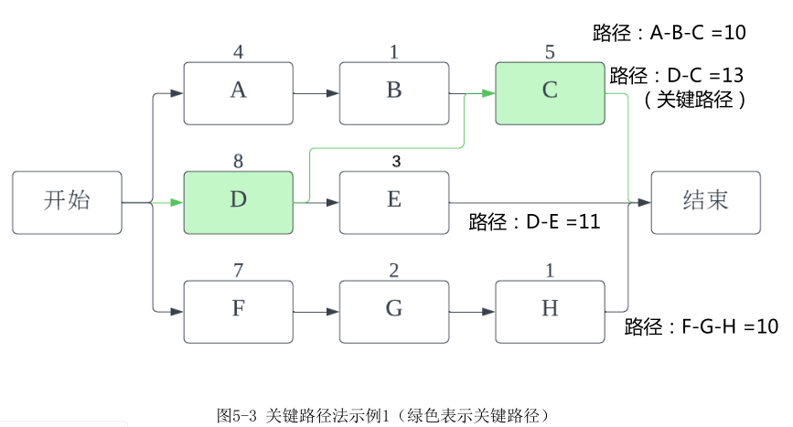

### 工具与技术：资源优化

- 资源平衡
  - 根据资源制约因素对**开始日期和完成日期**进行调整的一种技术
  - 资源平衡往往导致关键路径改变，通常是延长
- 资源平滑
  - 对活动自身进行调整，从而使项目资源需求不超过预定的资源限制的一种技术
  - 相对于资源平衡，资源平滑不会改变项目关键路径，完工日期不会延迟
  - 资源平滑无法实现所有资源的优化

### 工具与技术：数据分析

- 假设情景分析
- 模拟 e.g. 蒙特卡洛

### 工具与技术：进度压缩

- 赶工
  - 增加资源
  - 只适用于增加资源就能缩短持续时间
  - 并非切实可行，可能增加风险/成本
- 快速跟进
  - 将正常情况下按顺序进行的活动或阶段改为至少是部分并行开展
  - 快速跟进可能造成返工和风险增加，也可能增加项目成本
  - 只适用于并行活动来缩减关键路径上的项目工期的情况

优先级： 赶工>快速跟进

### 工具与技术：敏捷发布计划

敏捷发布规划基于项目路线图和产品发展愿景，提供了高度概括的发布进度时间轴(通常是3到6个月)。
敏捷发布规划确定了发布的迭代或冲刺次数，使产品负责人和团队能够决定需要开发的内容，并基于业务目标、依赖关系和障碍因素确定达到产品放行所需的时间。

### 输出：项目进度计划

项目进度计划是进度模型的输出，为各个相互关联的活动标注了计划日期、持续时间、里程碑和所需资源等。

虽然项目进度计划可用列表形式，但图形方式更常见。可以采用以下一种或多种图形来呈现：

- 横道图（也称“甘特图”）
- 里程碑图
- 项目进度网络图

## 6.6 控制进度

控制进度是监督项目状态，以更新项目进度和管理进度基准变更的过程。

主要作用：整个项目期间保持对进度基准的维护，且需要在整个项目期间开展。

关注如下内容：

- 判断项目进度的当前状态
- 对引起进度变更的因素施加影响
- 重新考虑必要的进度储备
- 判断项目进度是否已经发生变更
- 在变更实际发生时对其进行管理

### 工具与技术：数据分析

- 迭代燃尽图
  这类图用于追踪 **迭代未 完项中 尚待 完成的工作** 。它基于迭代规划中确定的工作 ， **分析 与理想燃尽 图的 偏差** 。可使用预测趋势线来预测迭代结束时可能出现的偏差，以及在迭代期间应该采取的合理行动。
- 挣值分析（后续介绍）
- 绩效审查
  根据进度基准，测量、对比和分析进度绩效，如实际开始和完成日期、已完成百分比，以及当前工作的剩余持续时间。
- 趋势分析
  趋势分析检查项目绩效随时间的变化情况，以确定绩效是在改善还是在恶化。
- 偏差分析
  偏差分析关注实际开始和完成日期与计划的偏离，实际持续时间与计划的差异， 以及浮动时间的偏差。它包括确定偏离进度基准的原因与程度，评估这些偏差对未来工作的影响，以及确定是否需要采取纠正或预防措施。
- 假设情景分析
  假设情景分析基于项目风险管理过程的输出，对各种不同的情景进行评估，促使进度模型符合项目管理计划和批准的基准。
- 关键路径法
- 项目管理信息系统
- 资源优化
- 提前量和滞后量
- 进度压缩
- 工作绩效信息
- 进度预测

### 输出

- 工作绩效信息
  针对WBS组件，特别是工作包与控制账户计算出进度偏差（SV）与进度绩效指数（SPI），并记录在案，传达给相关干系人。
- 进度预测
  是根据已有的信息和知识，对项目未来的情况和事件进行的估算或预计。随着项目执行，应该基于工作绩效信息，更新和重新发布预测。这些信息包括项目的过去绩效和期望的未来绩效，以及可能影响项目未来绩效的挣值绩效指数。
- 变更请求
  通过分析进度偏差，审查进展报告、绩效测量结果和项目范围或进度调整情况，可能会对进度基准、范围基准和/或项目管理计划的其他部分，向实施整体变更控制过程提交变更请求的审查和处理。预防措施可包括推荐的变更，以消除或降低不利进度偏差的发生概率。
- 项目管理计划（更新）
  - 进度基准。在项目范围、活动资源或活动持续时间等方面的变更获得批准后，可能需要对进度基准做相应变更。另外，因采用进度压缩技术造成变更时，也可能需要更新进度基准。
  - 进度管理计划。可能需要更新进度管理计划，以反映进度管理方法的变更。
  - 成本基准。更新以反映批准的变更请求或因进度压缩技术导致的成本变更。
- 项目文件（更新）
  - 进度数据。可能需要重新绘制项目进度网络图，以反映经批准的剩余持续时间和经批准的进度计划修改。有时，项目进度延误非常严重，以至于必须重新预测开始与完成日期，编制新的目标进度计划，才能为指导工作、测量绩效和度量进展提供现实的教据。
  - 项目进度计划。把更新后的进度数据代入进度模型，生成更新后的项目进度计划，以反映进度变更并有效管理项目。
  - 风险登记册。采用进度压缩技术可能导致风险，所以需更新风险登记册及风险应对计划。
- 变更请求
  通过分析进度偏差，审查进展报告、绩效测量结果和项目范围或进度调整情况，可能会对进度基准、范围基准和/或项目管理计划的其他部分，向实施整体变更控制过程提交变更请求的审查和处理。预防措施可包括推荐的变更，以消除或降低不利进度偏差的发生概率。
- 项目管理计划（更新）
  - 进度基准。在项目范围、活动资源或活动持续时间等方面的变更获得批准后，可能需要对进度基准做相应变更。另外，因采用进度压缩技术造成变更时，也可能需要更新进度基准。
  - 进度管理计划。可能需要更新进度管理计划，以反映进度管理方法的变更。
  - 成本基准。更新以反映批准的变更请求或因进度压缩技术导致的成本变更。

# 7 项目成本管理

## 成本的类型

- 直接成本： 直接可以归属于项目工作的成本。例如：项目团队专职人员的差旅费、工资。
- 间接成本： 来自一般管理费用科目、或多个项目分摊。例如：管理费用、水电费、房租。
- 固定成本： 不随生产量、工作量或时间的变化而变的非重复成本。如：打印机、扫描仪等固定资产采购费用。
- 可变成本： 随着生产量、工作量或时间而变的成本，又称为变动成本。例如：原材料、人工费、A4纸等耗材费用。
- 全生命周期成本： 在产品经济有效使用期间所发生的的与该产品有关的所有成本。例如：设计、生产、运维、处置。
- 沉没成本： 任何已经发生的成本，与是否合理无关。在决定是否继续某个出了问题的项目时，不应该考虑沉没成本。
  例如：项目A已花费100w，继续做可获利3w；项目B已花费15w,继续做可获利2w二选一，应该继续哪个？
- 机会成本： 因为选择一个项目而放弃另一个项目，另一个项目可能带来的利益。
  例如：项目A可获利10w，项目B可获利8w。二选一，选择项目A的机会成本是多少？

## 7.1 规划成本管理

规划成本管理 是确定如何估算、预算、管理、监督和控制项目成本的过程。
主要作用：在整个项目期间为如何管理项目成本提供**指南和方向** 。

### 输出：成本管理计划

描述将**如何**规划、安排和控制项目成本。 **（ 成本管理计划无成本）**

其中需要规定：

- 计量单位
  需要规定每种资源的计量单位，例如用于测量时间的人时数、人天数或周数，用于计量数量的米、升、吨、千米或立方码，或者用货币表示的总价。
- 精确度
  根据活动范围和项目规模，设定成本估算向上或向下取整的程度(例如995.59美元取整为1,000美元)。
- 准确度
  为活动成本估算规定一个可接受的区间(如±10%)，其中可能包括一定数量的应急储备。
- 组织程序链接
  工作分解结构为成本管理计划提供了框架，以便据此规范地开展成本估算、预算和控制。在项目成本核算中使用的WBS组成部分，称为控制账户(CA)，每个控制账户都有唯一的编码或账号，直接与执行组织的会计制度相联系。
- 控制临界值
  可能需要规定偏差临界值，用于监督成本绩效。它是在需要采取某种措施前，允许出现的最大差异，通常用偏离基准计划的百分数来表示。
- 绩效测量规则
  需要规定用于绩效测量的挣值管理(EVM)规则。例如，成本管理计划应该:
  - 定义WBS中用于绩效测量的控制账户;
  - 确定拟用的EVM技术(如加权里程碑法、固定公式法、完成百分比法等);
  - 规定跟踪方法，以及用于计算项目完工估算(EAC)的EVM公式，该公式计算出的结果可用于验证通过自下而上方法得出的完工估算
- 报告格式
  需要规定各种成本报告的格式和编制频率。
- 其他细节
  对战略筹资方案的说明;处理汇率波动的程序; 记录项目成本的程序等。

## 7.2 估算成本

估算成本是对**完成项目工作所需资源成本**进行 **近似估算** 的过程。
主要作用：确定项目所需的资金。

- 成本估算是在**某特定时点**，根据已知信息做出的**成本预测**
- 需要**识别和分析**可用于启动与完成项目的**备选成本方案**

成本估算单位：

- 通常用某种货币单位进行成本估算
- 有时可采用人时数或人天数，以消除**通货膨胀的影响**

在项目生命周期中，**项目估算的准确性**亦将随着项目的进展而逐步提高。

**粗略量级估算** -25%到+75%（启动阶段）
**确定性估算** -5%到+10%

进行成本估算，应该考虑将向项目收费的**全部资源**，包括(但不限于)人工、材料、设备、服务、设施，以及一些特殊的成本种类，如**通货膨胀补贴、融资成本或应急成本**。

### 输入：项目进度计划

进度计划包括项目可用的团队和实物资源的类型、数量和可用时间长短。

- 管理费
- 价格波动
- 利息

### 工具与技术

- 类比估算
  参照过去，估算当前。一种专家判断，整体估算，自上而下的。成**本低、耗时少、准确性低、详细信息不足、需要快速得到结果时、启动阶段时**
- 参数估算
  利用**历史数据**，**统计关系、参数模型**、基础数据，准确性取决于参数模型和输入数据的可靠性
- 自下而上估算
  估算个体，逐层汇总。自下而上估算的准确性及其本身所需的成本，通常取决于单个活动或工作报告的规模和复杂程度
- 三点估算
  - 最可能成本(cM)。对所需进行的工作和相关费用进行比较现实的估算，所得到的活动成本。
  - 最乐观成本(cO)。基于活动的最好情况所得到的成本。
  - 最悲观成本(cP)。基于活动的最差情况所得到的成本。
  - 三角分布。cE=(cO+cM+cP)/3
  - 贝塔分布。cE=(cO+4cM+cP)/6
  - **考虑不确定性与风险、提高估算准确性**
- 储备分析
  - **已知风险** 能识别出的风险。（事先想得到的）
    - 建立 应急储备 ,应对“已知-未知”风险
    - 应急储备在基准中
    - 项目经理可以直接使用，不需要走变更流程
  - **未知风险** 不能识别出的风险。（事先想不到）
    - 预留 管理储备 ,应对“未知-未知”风险
    - 管理储备不再基准中
    - 项目经理需要走变更流程
- 数据分析
  - 储备分析 项目的独特性、活动之间的依赖关系带来不确定性，因此产生**风险**。
    - 应急储备针对“已知-未知”风险，**包含在成本基准内**
    - 随项目信息越来越明确，可以**动用、减少或取消**应急储备。
    - **应急储备是成本基准的一部分**
  - 质量成本
    - 是为了达到要求而增加投入，还是承担不符合要求而造成的成本
    - 是寻求短期成本降低，还是承担产品生命周期后期频繁出现问题的后果。
    - 前期投入与后期维护的博弈

### 输出

- 成本估算
  成本估算包括对**完成项目工作**可能需要的**成本**、应对已识别风险的**应急储备**，以及应对计划外工作的管理储备的量化估算。
- 估算依据
  成本估算所需的支持信息的数量和种类，因应用领域而异，不论其详细程度如何，**支持性文件**都应该清晰、完整地说明成本估算是如何得出的。

## 7.3 指定预算

制定预算是汇总所有单个活动或工作包的**估算成本**，**建立**一个经批准的成本基准的过程。
主要作用：确定可据以监督和控制项目绩效的成本基准。

项目预算包括经**批准用于执行项目的全部资金**，而成本基准是经过批准且按时间段分配的项目预算，包括**应急储备，但不包括管理储备**。

### 输入

- 商业文件
  - 商业论证
    商业论证识别了项目**成功的关键因素**，包括财务成功因素。
  - 效益管理计划
    效益管理计划包括目标效益，例如净现值的计算、实现效益的时限，以及与效益有关的测量指标。
- 协议
  在制定预算时，需要考虑将要或已经采购的产品、服务或成果的成本，以及适用的协议信息。

### 工具与技术

- 成本汇总
  汇总路线：活动的成本估算→WBS工作包→控制账户（WBS的更高层次)→整个项目的总成本。**未识别的使用管理储备**
- 数据分析
  - 管理储备针对“未知—未知”风险，**管理储备不包含在基准中**，项目经理使用需要提出变更请求。
  - 管理储备**不包括在成本基准中**，但属于项目总预算和资金需求的一部分。
  - 当动用管理储备资助不可预见的工作时，就要把动用的管理储备**增加到成本基准**中，从而导致成本基准变更。
- 历史信息审核
  审核历史信息有助于进行**参数估算或类比估算**，进行微调。
- 资金限制平衡
  - 资金限制平衡是在既定的资金限制下，确保项目各阶段、各部位和整个项目都有足够的资金，可能会**导致进度计划的改变**。
  - 可以通过在项目计划中添加强制日期来实现。
  - 类比进度管理中的资源平衡

### 输出：成本基准

成本基准是经过批准、按时间分配的项目预算。**包括应急储备，但不包括管理储备**。

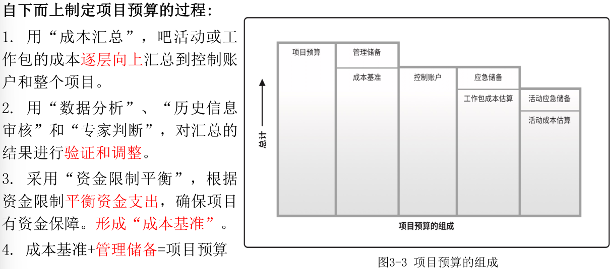

### 输出：项目资金需求

**成本基准+管理储备**。项目资金通常以阶梯状的形态，**增量而非连续**的方式投入。
成本基准中既包括**预计的支出**，也包括**预计的债务**。

## 7.4 控制成本

- 控制成本是监督项目状态，以**更新项目成本和管理成本基准变更的过程**。
- 主要作用：在整个项目期间保持对**成本基准的维护**。本过程需要在整个项目期间开展。
- 在成本控制中，应**重点分析项目资金支出与相应完成的工作之间的关系。**要更新预算，需要了解截至目前的实际成本。只有经过实施整体变更控制过程的批准，才可以增加预算。只监督资金的支出，而不考虑由这些支出所完成的工作的价值，只是跟踪资金流，对项目意义不大。
- 有效成本控制的关键在于**管理经批准的成本基准**。

### 输入

- 项目管理计划
  - 成本管理计划
  - 成本基准
  - 绩效测量基准
- 项目资金需求
  - 包括预计支出及预计债务
- 工作绩效数据
  - 包含关于项目状态的数据，例如哪些成本已批准、发生、支付和开具发票。

### 工具与技术：挣值分析EVA

将实际进度和成本绩效与绩效测量基准进行比较。EVM把范围基准、成本基准和进度基准整合起来，形成绩效测量基准。它针对每个工作包和控制账户，计算并监测以下关键指标：

- 完工预算BAC，Budget at Completion
  **全部计划工作的预算价值**，BAC = 总PV
- 计划价值PV， Planned Value
  截止到某个时间点，**计划完成工作的预算价值**。PV=计划工作量×预算单价
- 挣值EV Earned Value
  截止到某个时间点，**预计完成工作的预算价值**。EV=实际工作量×预算单价
- 实际成本AC Actual Cost
  截止到某个时间点，**实际花了多少钱**。AC=实际工作量×实际单价

**完工预算BAC**=成本基准
**计划价值PV**=计划工作量×预算单价
**挣值EV**=实际工作量×预算单价
**实际成本AC**=实际工作量×实际单价

### 工具与技术：偏差分析

偏差分析用以解释成本偏差、进度偏差和完工偏差的原因、影响和纠正措施

- 进度偏差 Schedule Variance 表示为挣值与计划价值之差
  SV = EV - PV
  SV>0 进度提前，SV=0 进度符合预期， SV<0 进度落后
- 成本偏差 Cost Variance 是在某个给定时点的预算亏空或盈余量，表示为挣值与实际成本之差
  CV = EV - AC
  CV>0 成本节约, CV=0 成本符合预算, CV<0 成本超支
- 进度绩效指数 SPI 表示为挣值与计划价值之比，反映了项目团队完成工作的**效率**
  SPI = EV/PV
  SPI>1 进度提前, SPI=1 进度符合预期, SPI<1 进度落后
- 成本绩效指数CPI  测量预算资源的成本 效率 的一种指标，表示为挣值与实际成本之比
  CPI = EV/AC
  CPI>1 成本节约, CPI=1 成本符合预期, CPI<1 成本超支

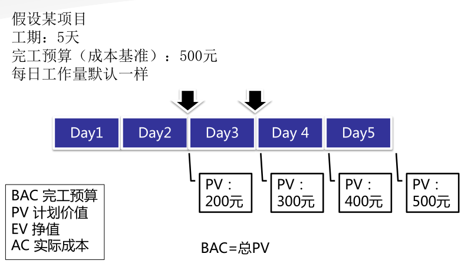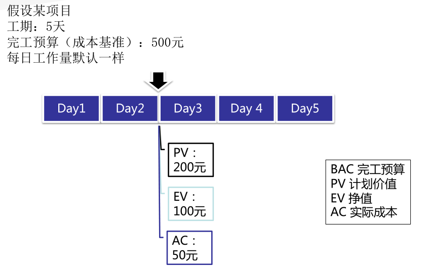

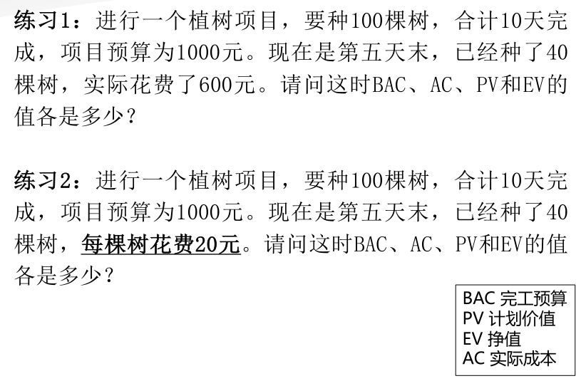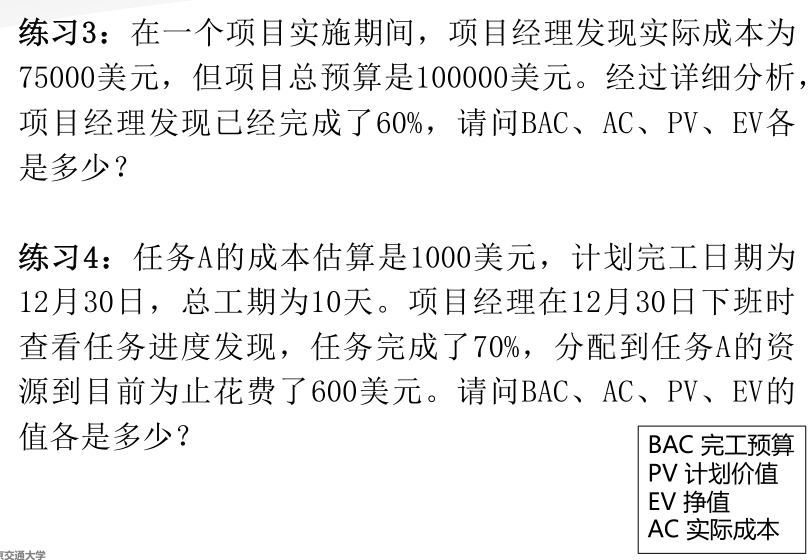

**这里有更多例题可以详细看下**

### 工具与技术：预测

随着项目进展，项目团队可根据项目绩效，对完工估算(EAC)进行预测，预测的结果可能与完工预算(BAC)存在差异。如果BAC已明显不再可行，则项目经理应考虑对EAC进行预测。

**完工尚需估算**：剩余工作预期的成本
**ETC = BAC - EV**
**完工预算**： 完工预期的总成本
**EAC = AC + ETC**

思路1：死不悔改
按照当前的绩效CPI执行后续工作，典型。
**ETC=(BAC-EV)/CPI**

思路2：及时改正
按照原计划执行后续工作，非典型。
**ETC=BAC-EV**

思路3：
按照同时考虑CPI和SPI绩效，执行后续工作。
**ETC=(BAC-EV)/(CPI x SPI)**

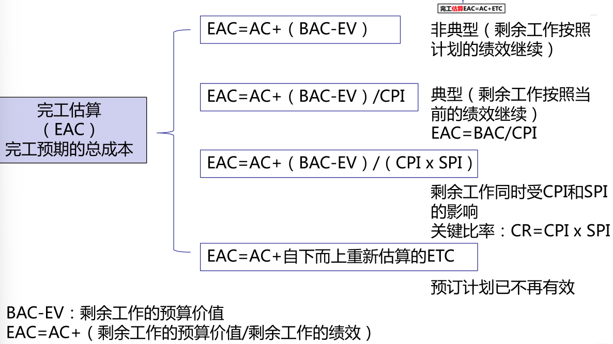

**此处也有例题还没有加**

### 工具与技术：完工尚需绩效指数TCPI

TCPI: 剩余工作的预算价值/剩余预算
TCPI = (BAC - EV) / (BAC - AC) 若BAC可行情况下
TCPI = (BAC - EV) / (EAC - AC) 若BAC不可行情况下，用EAC代替

TCPI>1：很难完成; TCPI=1：正好完成; TCPI<1：很容易完成

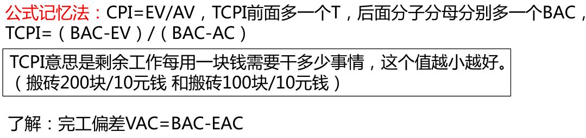

### 输出

- 工作绩效信息
  工作绩效信息包括有关项目工作实施情况的信息(对照成本基准)。对于使用挣值分析的项目，CV、CPI、EAC、VAC 和TCPI将记录在工作绩效报告中。
- 成本预测
  无论是计算得出的EAC值，还是自下而上估算的EAC值，都需要记录下来，并传达给相关方。
- 变更请求
  分析项目绩效后，可能会就成本基准和进度基准，或项目管理计划的其他组成部分提出变更请求。应该通过实施整体变更控制过程对变更请求进行审查和处理。
- 项目管理计划更新
- 项目文件更新

# 8 项目质量管理

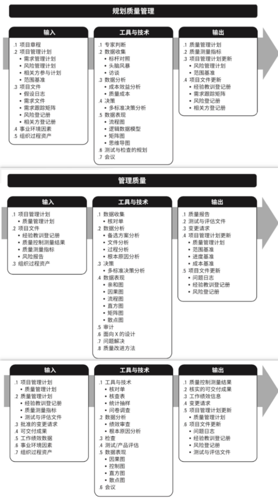

## 项目质量管理核心概念

### 质量与等级

质量： 质量作为**实现的性能或成果**，是一系列内在特性**满足要求的程度**。
等级： 等级作为**设计意图**，是对用途相同但技术特性不同的可交付成果的**级别分类**。

### 预防与检查

预防：保证**过程**中不出现错误。
检查：保证错误不落到客户手中。（结果）

### 属性抽样与变量抽样

–属性抽样：结果为合格或不合格（定性）。
–变量抽样：在连续的量表上标明结果所处的位置，表明合格的**程度**。

### 公差与控制界限

公差：结果的可接受范围。
控制界限：稳定过程的普遍偏差的边界。

### 五种质量管理水平

- 让客户发现缺陷
- QC通过**控制质量**过程先检测和纠正缺陷，再交付客户
- QA通过**质量保证**检查并纠正过程本身
- QP将**质量融入**项目和产品的**规划和设计**中
- 在**整个组织内创建**一种关注并致力于实现过程和产品**质量的文化**

## 8.1 规划质量管理

规划质量管理是识别项目及其可交付成果的**质量要求和(或)标准**，并书面描述项目**将如何证明符合质量要求和(或)标准的过程**。
主要作用：为在整个项目期间**如何管理**和**核实质量**提供指南和方向。

### 输入：组织过程资产

规划组织的质量政策是**高级管理层**所推崇的，规定了组织在质量管理方面的工作方向。
如果执行组织**没有正式的质量政策**，或**项目涉及多个执行组织**（如合资项目）。**项目经理或项目管理团队**就需要为项目**制定质量政策**。

### 工具与技术：数据收集

- 标杆对照
  将实际或计划的项目实践或项目的质量标准与**组织内部或外部、同一应用领域或不同应用领域**的可比项目进行比较，以便**识别最佳实践，形成改进意见，并为绩效考核提供依据**。
- 头脑风暴
- 访谈
  了解有经验的相关方和主题专家对项目和产品质量的**隐性和显性、正式和非正式**的需求和期望。应在**信任和保密的环境下**开展访谈，以获得真实可信、不带偏见的反馈。
- 成本效益分析
  达到质量要求的主要**效益**包括：**减少返工、提高生产率、降低成本、提升相关方满意度、提升赢利能力**。对每个质量活动进行成本效益分析，就是要比较其**可能成本**与**预期效益**。
- 质量成本COQ（不包含生产成本）
  在产品生命周期中为**预防**不符合要求，为**评价**产品或服务是否符合要求，以及因未达到要求（**返工**），而发生的**所有成本**。
- 决策
  - 排列备选方案的**优先顺序**（如优先矩阵）
    用于识别关键事项和合适的备选方案，并通过一系列决策排列出备选方案的优先顺序。
  - 有助于排定**质量测量指标**的优先顺序

### 工具与技术：数据表现

- 流程图（过程图）
  - 用来显示在一个或多个输入转化成一个或多个输出的过程中，所需要的**步骤顺序**和**可能分支**。它通过映射水平价值链的过程细节来显示活动、决策点、分支循环、并行路径及整体处理顺序。
  - 可以通过分析流程图来估算**质量成本**，通过展示过程步骤，可帮助**改进过程**并**识别可能出现质量缺陷**或可以纳入质量检查的地方。
- SIPOC（供应商、输入、过程、输出和客户）模型
  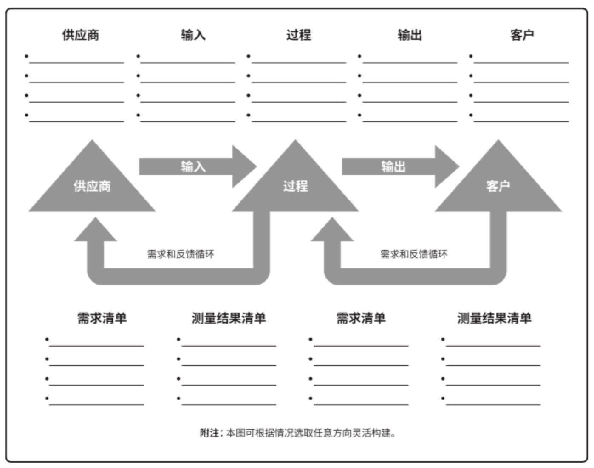
- 逻辑数据模型
  - 把组织数据可视化，以商业语言加以描述，不依赖任何特定的软件开发技术。
  - 逻辑数据模型可用于识别会出现数据完整性或其他质量问题的地方。
- 思维导图
  用于**可视化组织**信息的绘图方法，从一个质量概念开始，开展发散性思维，**快速收集**项目**质量要求、制约因素、依赖关系**和联系等信息。
- 矩阵图
  在行列交叉的位置展示因素、原因和目标之间的关系强弱
  有助于识别对项目成功至关重要的质量测量指标。
- 检查与测试的规划

### 输出：质量管理计划

描述**如何实施适**用的政策、程序和指南**以实现质量目标**。描述了项目管理团队为实现项目质量目标所需的**活动和资源**。

质量管理计划包括(但不限于)以下组成部分：

- 组织的**质量政策**
- 项目采用的**质量标准**（国家标准/行业标准）
- 项目的**质量目标**（可量化的目标）
- 质量角色与职责
- **需要质量审查的项目可交付成果和过程**
- 为项目**规划的质量控制和质量管理活动**                                     
- 项目使用的**质量工具**

### 输出：质量检测指标

描述项目或产品属性，以及控制质量过程将如何验证符合程度。
质量测量指标是对高层级的质量标准的具体化和可操作化。

## 8.2 质量管理

管理质量是把组织的**质量政策用于项目**，并将**质量管理计划转化为**可执行的**质量活动**的过程。
主要作用：**提高实现质量目标的可能性，以及识别无效过程和导致质量低劣的原因。**

管理质量的人员和角色：

- QA部门：**知行某些管理质量活动**
- 全员责任：所有人
- 质量管理在**敏捷**项目中**所有**团队成员执行

### 输入：项目文件

- 质量控制测量结果
  用**于分析和评估**项目过程和可交付成果的**质量是否符合**执行组织的**标准或特定要求**,以**确定**实际测量结果的**正确程度**。
- 质量测量指标“
  依据这些质量测量指标**设定**项目的**测试场景**和**可交付成果**，用作改进举措的依据
- 风险报告
  管理质量过程使用风险报告**识别整体项目风险的来源**以及整体**风险敞口的最重要的驱动因素**，这些因素能够影响项目的质量目标。
- 经验教训登记册
  项目早期与质量管理有关的经验教训，可以运用到项目后期阶段，以**提高质量管理的效率与效果**。

### 工具与技术：审计

质量审计：用来确认项目活动是否遵循了组织和项目的政策、过程与程序的一种结构化的独立过程。

质量审计目标可能包括(但不限于):

- 识别正在实施的良好及**最佳实践、违规做法、差距及不足**
- 分享所在组织和/或行业中**类似项目的良好实践**
- 协助**改进过程**的执行，从而帮助团队**提高生产效率**
- 积累**经验教训**
- 确认**已批准的变更请求的实施情况**

质量审计通常由**项目外部的团队开展**，如组织内部审计部门、项目管理办公室（PMO）或组织外部的审计师。（**内审或外审、事先安排或随机进行**）

### 工具与技术：数据收集

核对单 （ Checklist ）

- 核对单是一种结构化工具，通常列出特定组成部分。
- 用来核实所要求的一系列步骤（**质量活动**）是否已得到执行；检查需求列表是否已得到满足。
- 质量核对单应该涵盖在范围基准中定义的验收标准。

### 工具与技术：数据分析

- 备选方案分析
  该技术用于评估已识别的可选方案，以选择那些最合适的质量方案或方法。
- 文件分析
  分析项目控制过程所输出的不同文件，如质量报告、测试报告、绩效报告和偏差分析，找到失控的过程，或有问题的过程。
- **过程分析**
  **识别过程改进机会**，同时检查在过程期间遇到的问题、制约因素，以及非增值活动。
- **根本原因分析**（RCA）
  用于识别问题的**根本原因**并解决问题。消除所有根本原因可以杜绝问题再次发生。可以借助石川图、5WHY、鱼骨图等。
- 因果图（ 鱼骨图 、 石川图 、 Why-why 分析图 ）将问题陈述的**原因分解**为离散的分支，有助于识别问题的**主要原因或根本原因**。
  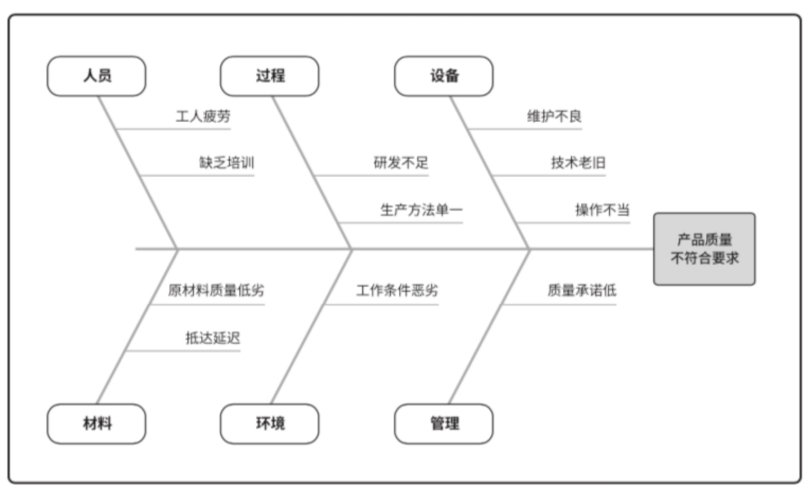
- 直方图
  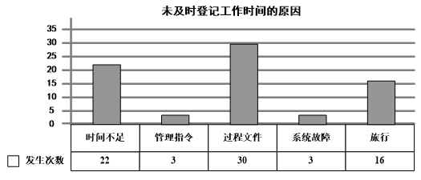
- 帕累托图
  一种特殊的垂直条形图，用于识别造成大多数问题的少数重要原因。
  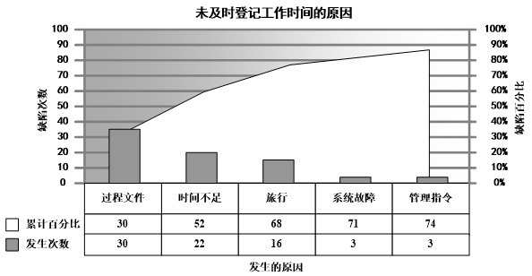
- 散点图
  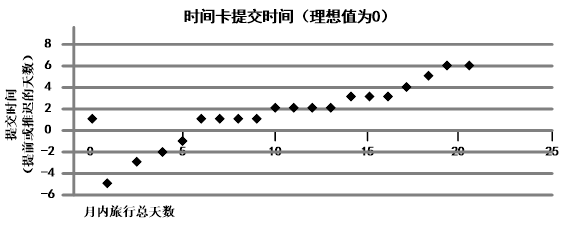

### 工具与技术：面向X的设计

面向X的设计(DfX)是产品设计期间可采用的一系列**技术指南**，旨在优化设计的特定方面，**可以控制或提高产品最终特性**。

### 工具与技术：问题解决

问题解决**发现**解决问题或应对挑战的**解决方案**。
问题解决方法有助于**消除问题**和**制定长久有效的解决方案**。

通常包括以下要素：

- **定义**问题
- **识别**根本原因
- 生成可能的解决**方案**
- **选择**最佳解决方案
- **执行**解决方案
- **验证**解决方案的有效性

### 工具与技术：质量改进方法

质量改进的开展，可基于质量控制过程的发现和建议、质量审计的发现，或管理质量过程的问题解决。

- PDCA：计划—实施—检查—行动
- 六西格玛：质量缺陷低于百万之分之三点四

### 输出：质量报告

质量报告可能是图形、数据或定性文件，其中包含的信息可帮助其他过程和部门**采取纠正措施**，以实现项目质量期望。

质量报告内容：

- 团队上报的**质量问题**
- 针对项目、产品、过程的**改善建议**
- **纠正措施建议**（包括返工、缺陷/漏洞补救、100%检查等）
- 在控制质量过程中发现的**情况的概述**

### 输出

- 测试与评估文件
  测试与评估分拣是一份项目文件，也被称为测试与评估指导方案。可基于行业需求和组织模板创建测试与评估文件。**它们是控制质量过程的输入，用于评估质量目标实现情况。**如质量核对单、需求跟踪矩阵。
- 变更请求

## 8.3 控制质量

**针对可交付成果**

评估绩效，确保项目输出完整、正确且满足客户期望。
主要作用：**核实项目可交付成果**和工作已经达到主要相关方的质量要求，可供最终验收

### 输入：项目文件

- 项目文件

  - 质量测量指标
    用于**描述项目或产品属性**，以及控制过程将**如何验证符合程度**（来自规划）。

  - 测试与评估文件

    用于**评估质量目标的实现程度**（来自管理）。

  - 经验教训登记册

- 可交付成果

  - 可交付成果指的是在某一过程、阶段或项目完成时，必须产出的**任何独特并可核实**的产品、成果或服务能力。
  - 作为指导与管理项目工作过程的输出的可交付成果将得到检查，并与项目范围说明书定义的验收标准作比较。

- 批准的变更请求
  完成局部变更时，如果步骤不完整或不正确，可能会导致不一致和延迟。批准的变更请求的实施需要核实，并需要确认完整性、正确性，以及是否重新测试。

### 工具与技术

- 核对单
- 检查表
  用于合理排列各种事项，以便有效地收集关于**潜在质量问题**的有用数据。在开展检查以识别缺陷时，用核查表收集**属性数据**就特别方便，例如关于缺陷数量或后果的数据，经常使用帕累托图来显示。
- 数据收集
  - **统计抽样** 从目标总体中选取部分样本用于检查，抽样的**频率**和**规模**应在**规划质量管理过程**中确定。
    - 属性抽样  结果为合格或是不合格（需要较多的样本）
    - 变量抽样  在连续的量表上标明结果所处的位置，表明合格的程度（需要专门人员进行）
  - 问卷调查
- 数据分析
  - **绩效审查** 针对实际结果，**测量、比较和分析**规划质量管理过程中定义的**质量测量指标**。
- 根本原因分析（RCA） 用于**识别缺陷成因**。
- 检查 （ 审查 、 同行审查 、 审计 、 巡检 ）
- 测试/产品评估
  - 测试是有组织的、结构化的调查，旨在根据项目需求提供有关被测产品或服务质量的客观信息。
  - 测试可以贯穿于整个项目，可以可用时进行，也可以在项目结束时进行，但建议尽早测试。

### 工具与技术：控制图

- 用于确定一个 **过程是否稳定**，或者是否具有可预测的绩效
- **规格上限和下限**
  反映了可允许的最大值和最小值。超出规格界限就可能受处罚（次品）
- **控制上限和下限**
  代表了一个稳定的过程的自然波动范围（失控，无需停产但必须查原因）
- **失控的判断**
  1.某个数据点超出控制界线；2.连续7个点落在均值上方；3.连续7个点落在均值下方

**控制界限通常设在离均值(0西格玛)±3西格纳的位置**

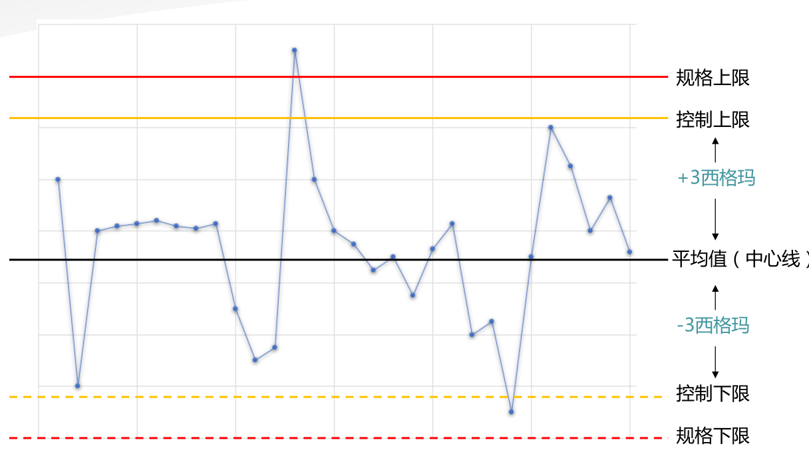

### 输出

- 变更请求
- 项目文件更新
  - 问题日志
  - 经验教训登记册
  - 风险登记册
  - 测试与评估文件

## 注意点

- 质量管理 三 个过程的 区 分
  - 规划质量“定标准”
  - 管理质量“管过程”（所有项目管理过程）QA
  - 控制质量“查结果”QC
- 关 于 “ 如 何避免 ” 的选 择
  - 客户发现了缺陷，事先应该做好“控制质量”QC
  - 控制质量发现了缺陷，实现应该做好“管理质量”QA
- 控制质量 时发现缺陷 的 处 理方 法
  - 如果是少数，部分可交付成果有缺陷，需要走变更流程做缺陷补救。
  - 如果是大量可交付成果有缺陷，需要反思过程做好QA。

# 9 项目资源管理

## 9.1 规划资源管理

定义如何估算、获取、管理和利用团队以及实物资源的过程
**主要作用**：根据项目类型和复杂程度确定适用于项目资源的管理方法和管理程度

### 输入

- 相关进度计划
   提供了**所需资源的时间轴**。
- 需求文件
  指出了项目所需的**资源的类型和数量**，并可能影响管理资源的方式。
- 风险等级册
  包含可能影响资源规划的各种威胁和机会的信息。
- 相关方登记册
  有助于**识别**对项目所需资源有特别兴趣或影响的那些相关方，以及会**影响资源使用偏好的相关方**。

### 工具与技术：数据表现

表现格式分为：层级型 、 矩阵型 、 文本型

目的： 确保**每个工作包**都有**明确的责任人**，确保**全体团队成员**都清楚地**理解其角色和职责**。

层级型 可用于表示高层及角色。
文本型 更适用于记录详细职责，如职位描述、角色—职责—职权表。

### 工具与技术：责任分配矩阵

RACI矩阵
责任分配矩阵 展示项目资源在各个工作包中的任务分配
R: Responsible A: Accountable C: Consult I: Inform

在大型项目中，**可以制定多个层次的RAM**，**高层次RAM**可定义**项目团队、小组或部门**负责WBS中的哪些部分工作。低层次RAM则可在**各小组内为具体活动**分配角色、职责和职权。
矩阵图：反应与每个人相关的**所有活动**；反应与每项活动相关的**所有人员**；**确保任何一项任务都只有一个人负责，从而避免职责不清。**

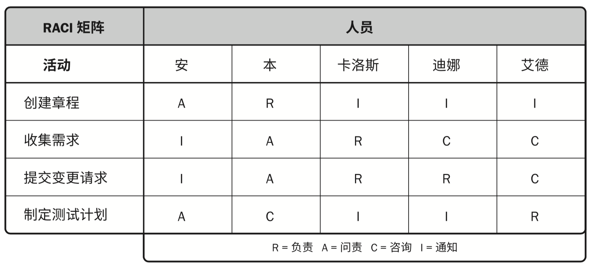 

### 输出：资源管理计划

资源管理计划提供了关于**如何分类、分配、管理和释放项目资源**的指南

资源管理计划的内容：

- 识别资源  用于**识别和量化**项目所需的团队和实物**资源的方法**。
- 获取资源 关于如何**获取**项目所需的团队和实物**资源的指南**。
- 角色与职责
  - 角色 （职务）
  - 职权 （权利）
  - 职责 （职责和工作）
  - 能力 （技能和才干）
- 项目组织图 以图形方式展示项目团队成员及其**报告关系**（正式/非正式，详细/概括)。
- 项目团队资源管理 关于如何**定义、配备、管理和最终遣散**项目团队资源的指南。
- 培训 
- 团队建设
- 资源控制 依据需要确保实物资源充足可用、并为项目需求优化实物资源采购，而采用的方法。包括有关整个项目生命周期期间的库存、设备和用品管理的信息。
- 认可计划  将给予团队成员哪些**认可和奖励**，以及何时给予。

### 输出：团队章程

团队章程是为团队创建团队价值观、共识和工作指南的文件。

## 9.2 估算活动资源

估算活动资源是估算执行项目所需的团队资源，以及材料、设备和用品的类型和数量的过程。
**主要作用**：明确完成项目所需的资源种类、数量和特性。

### 输入：项目文件

- 活动属性
  为估算活动清单中每项活动所需的团队和实物资源提供了主要数据来源，这些属性的例子包括资源需求、强制日期、活动地点、假设条件和制约因素。
- 活动清单
  识别了需要资源的活动。
- 假设日志
  有关生产力因素、可用性、成本估算以及工作方法的信息，会影响团队和实物资源的性质和数量。
- 成本估算
  资源成本从数量和技能水平方面会影响资源选择。
- 资源日历
  具体资源可用时的工作日、班次、正常营业的上下班时间、 周末和公共假期。在规划活动期间，潜在的可用资源信息(如团队资源、设备和材料)用于估算资源可用性。
- 风险登记册

### 输出

- 资源需求

- 估算依据

- 资源分解结构（RBS）

  - 资源依 **类别和类型的层级表现**
  - 资源类别：人力、材料、设备和用品
  - 资源类型：技能水平、要求整数、等级水平等
  - RBS有助于对资源进行获取、管理和报告

  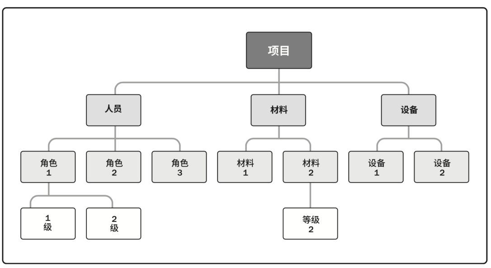

## 9.3 获取资源

获取资源是获取项目所需的团队成员、设施、设备、材料、用品和其他资源的过程。
**主要作用**：概述和指导资源的选择，并将其分配给相应的活动。

- **内部资源**： 从职能经理或资源经理处获得
- **外部资源**： 通过采购/租赁等途径获得。

### 工具与技术：人际关系与团队技能

很多项目需要针对所需资源进行谈判（协商）

- 职能经理
  确保项目在要求的时限内获得**最佳资源**
- 组织中其他项目管理团队
  **稀缺或特殊资源**
- 外部组织
  合适的、稀缺的、特殊的、合格的、经认证的或其他诸如此类的特殊人力资源

### 工具与技术

- 预分派
  事先确定项目的实物或团队资源。
- 虚拟团队
  **具有共同目标**、在完成角色任务的过程中**很少或没有时间面对面**工作的一群人。

### 工具与技术：决策-多标准决策分析

### 输出

- 实物资源分配单
  - 记录了项目将使用的材料、设备、用品、地点和其他实物资源。
- 项目团队派工单
  - 记录了团队成员及其在项目中的**角色和职责**，可包括**项目团队名录**。
- 资源日历
  - 识别了每种具体资源**可用时**的工作日、班次、正常营业的上下班时间、周末和公共假期。规定了在项目期间确定的团队和实物资源**何时可用、可用多久**。

## 9.4 建设团队

建设团队是提高工作能力，促进团队成员互动，改善团队整体氛围，以**提高项目绩效**的过程。
**主要作用**：改进团队协作、增强人际关系技能、激励员工、减少摩擦以及**提升整体项目绩效**。

### 工具与技术

- 集中办公
- 沟通技术
- 人际关系与团队技能
- 认可与奖励
- 培训
- 个人的团队评估
  - 能让项目经理和项目团队**洞察**成员的**优势和劣势**，**评估**他们的**偏好和愿望**。
  - 有利于**增进**团队成员间的**理解、信任、承诺和沟通**，在整个项目期间**不断提高团队成效**。

### 输出

**团队绩效评价**

- 基于**项目技术成功度、项目进度绩效和成本绩效**来评价团队绩效。
- 评价团队有效性的指标可包括：
  - 个人技能的改进，从而使成员更有效地完成工作任务
  - 团队能力的改进，从而使团队成员更好地开展工作
  - 团队成员离职率的降低
  - 团队凝聚力的加强，从而使团队成员公开分享信息和经验，并互相帮助来提高项目绩效

## 9.5 管理团队

管理团队是跟踪团队成员工作表现，提供反馈，解决问题并管理团队变更，以优化项目绩效的过程。
**主要作用：**影响团队行为、管理冲突以及解决问题。

### 输入

项目文件

- 问题日志
- 经验教训登记册
- 项目团队派工单
- **团队章程**：为团队应**如何决策、举行会议**和**解决冲突提供指南**。

### 工具与技术：人际关系与团队技能

**冲突管理**

## 9.6 控制资源

控制资源是确保按计划为项目分配实物资源，以及根据资源使用计划监督资源实际使用情况，并采取必要纠正措施的过程。
主要作用：确保所分配的资源适时适地可用于项目，且在不再需要时被释放

**控制资源过程关注实物资源；管理团队过程关注团队成员**

# 10 项目沟通管理

**沟通三要素**

> 跟谁沟通——项目相关方
> 沟通什么——信息
> 怎么沟通——沟通的方式、方法

## 10.1 规划沟通管理

规划沟通管理是基于每个相关方或相关方群体的信息需求、可用的组织资产，以及具体项目的需求，为项目沟通活动制定恰当的方法和计划的过程。
**主要作用**：根据**相关方需求、组织实际条件、项目的情况**，制定合适的项目沟通计划，使得项目沟通**效率高、效果好**。

### 输入

**相关方登记册**：相关方登记册用于规划与相关方的沟通活动

### 工具与技术

- 沟通需求分析
  分析沟通需求，确定项目相关方的信息需求，包括所需信息的**类型和格式**，以及信息度相关方的价值。
- 沟通渠道
  计算公式 n(n-1)/2
- 沟通技术
  用于项目相关方之间交换信息和协作的特定工具、系统或计算机程序等。

**可能影响沟通技术选择的因素包括：**

> **紧迫性**
> 可用性和可靠性
> 易用性
> 项目环境
> **信息敏感性和保密性**

### 工具与技术：沟通模型（基本沟通模型）

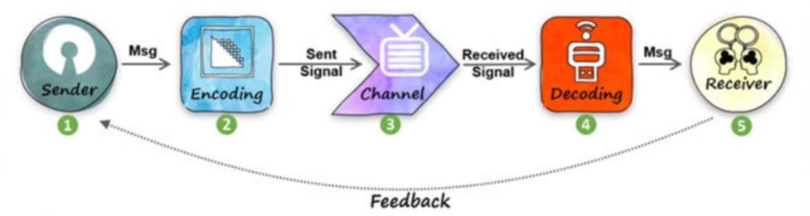

**基本沟通模型的要素**

> 发送方
> 信息
> 编码
> 信号
> 沟通渠道
> 噪音
> 解码
> 接收方

基本沟通模型的特点：

> 线性
> **编码>传递>解码**
> **确保信息送达**

**沟通渠道计算公式**
n(n-1)/2

### 工具与技术：简单互动沟通模型

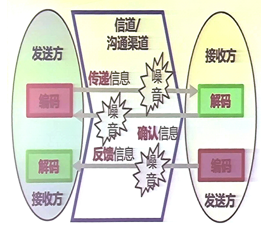

**简单互动沟通模型的特点**：

> **非线性**
> 步骤有反馈
> **强调信息理解**

### 工具与技术：复杂跨文化沟通模型

**复杂跨文化沟通模型：**

> 非线性
> **考虑人性因素**

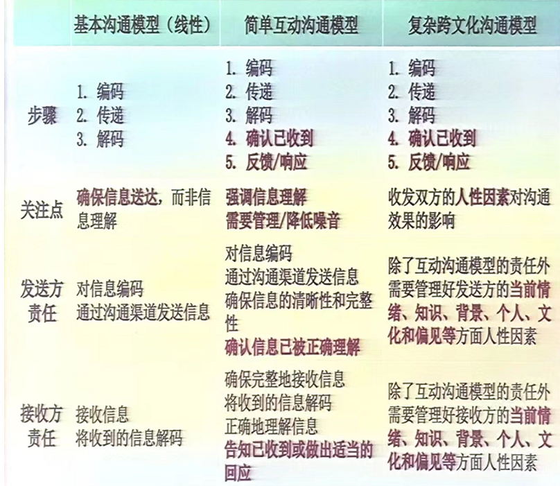

### 工具与技术：沟通方法

- 互动沟通
  在两方或多方之间进行的实时多向信息交换。例如：会议、电话、即时信息、社交媒体和视频会议等。
- 推式沟通 **确保发送**
  向需要接收信息的特定接收方发送或发布信息。这种方法可以确保信息的发送，但不能确保信息送达目标受众或被目标受众理解。例如：信件、备忘录、报告、电子邮件、传真、语音邮件、博客、新闻稿。
- 拉式沟通 **要求接受**
  适用于大量复杂信息或大量信息受众的情况，要求接收方在遵守有关安全规定的前提之下自行访问相关内容。例如：门户网站、企业内网、电子在线课程、经验教训数据库等。

### 输出：沟通管理计划

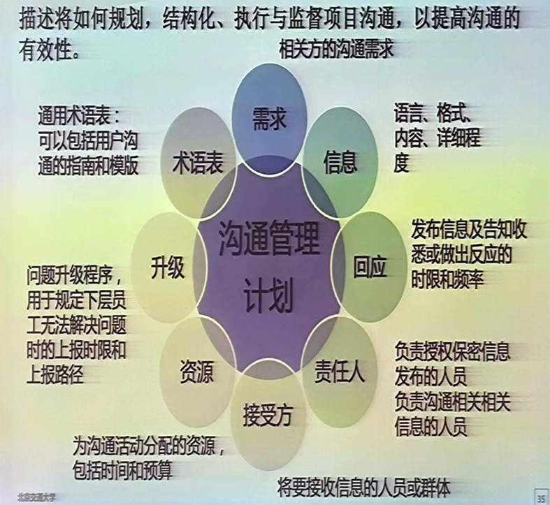

## 10.2 管理沟通

管理沟通是确保项目信息及时且恰当地收集、生成、发布、存储、检索、管理、监督和最终处置的过程
主要作用：**促成**项目团队与相关方之间的**有效信息流动**。

### 输入：工作绩效报告

典型示例包括**状态报告**和**进展报告**。

工作绩效报告可以包含挣值图表和信息、趋势线和预测、储备燃尽图、缺陷直方图、合同绩效信息以及风险概述信息。

### 工具与技术：项目报告发布

项目报告发布是收集和发布项目信息的行为。项目信息应发布给众多相关方群体。
**应针对每种相关方**来调整项目信息发布的适当层次、形式和细节。

### 输出

**项目沟通记录：**
绩效报告、可交付成果的状态、进度进展、产生的成本、 演示，以及相关方需要的其他信息。

## 10.3 监督沟通

监督沟通是确保满足项目及其相关方的信息需求的过程
主要作用：**优化信息传递流程**

通过监督沟通过程，来确定沟通确实提高或保持了相关方对项目的支持度。

**对沟通结果应该认真评估，确保在正确的时间、正确的渠道、把正确的内容发给正确的人，并产生正确的影响。**

监督沟通过程可能**触发**规划沟通管理和管理沟通过程的**迭代**，以便修改沟通计划并开展额外的沟通活动，来**提升沟通的效果**。

### 工具与技术：人际关系与团队技能

适用于本过程的人际关系与团队技能包括：**观察和交谈**

通过观察和交谈，项目经理能够发现团队内的问题、人员间的冲突，或个人绩效问题。

### 输出

- 工作绩效信息
- 变更请求
  此类变更请求可能导致:
  - 修正相关方的沟通要求，包括相关方对信息发布、内容或形式，以及发布方式的要求;
  - 建立消除瓶颈的新程序。

# 13 项目相关方/干系人管理

相关方： 会**受项目**的**积极**或**消极**影响，或者能**对项目**施加**积极**或**消极**的影响的任何人。

## 13.1 识别相关方

识别相关方是**定期识别**项目相关方，**分析和记录**他们的利益、参与度、相互依赖性、影响力和对项目成功的潜在影响的过程。
主要作用：使项目团队能够建立对每个相关方或相关方群体的适度关注。

### 输入

- 项目章程
- 商业文件
  - 商业论证
    确定项目目标，以及**受项目影响的相关方**的最初清单。
  - 收益管理计划
    描述了如何实现商业论证中所述收益，它可能指出将从项目成果交付中**获益**并因此被视为**相关方**的个人及群体

### 工具与技术

- 问题和调查
- 头脑风暴和头脑写作
- 相关方分析
- 文件分析

### 工具与技术：权利/利益方格

权利： 职权
利益： 对项目结果的关注程度
影响： 主动参与项目的程序
作用： 改变项目计划或执行的能力

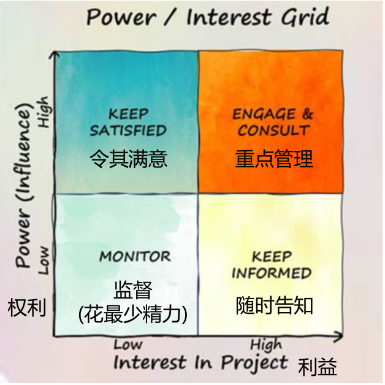

### 工具与技术：凸显模型

- 权利 ： 职位权力、对项目成果的影响能力。
- 紧迫性： 是否需要立即关注，由于时间约束、重大利益诉求而导致。
- 合法性： 有权参与，参与的适当性。

适用于复杂的相关方大型社区、相关方社区内部存在复杂的关系网络 。

### 输出

- 相关方登记册
  - 身份信息
  - 评估信息
  - 相关方分类
- 变更请求
  - **首次开展**识别相关方过程，**不会提出任何变更请求**
  - 随后 **继续识别**相关方

## 13.2 规划相关方参与

规划相关方参与是根据相关方的需求、期望、利益和对项目的潜在影响，**制定项目相关方参与项目的方法**的过程
主要作用：提供与相关方进行**有效互动的可行计划**。

### 输入

- 项目管理计划
  - 资源管理计划： 包含关于团队成员及其他相关方的角色和职责的信息。
  - 沟通管理计划： 用于相关方管理的沟通策略以及用于实施策略的计划，既是项目相关方管理中的各个过程的输入，又会收录来自这些过程的相关信息
  - 风险管理计划： 包含风险临界值或风险态度，有助于选择最 佳的相关方参与策略组合。
- 项目文件
  - **相关方登记册**

### 工具与技术

- 标杆对照
- 假设条件和制约因素分析
  分析当前的假设条件和制约因素，**以合理裁剪相关方参与策略**
- 根本原因分析
  识别是什么根本原因导致了相关方对项目的某种支持水平，以便**选择适当策略来改进其参与水平**
- 优先级排序或分级
  具有**最大利益和最高影响**的相关方，通常应该排在优先级清单的最前面。
- 思维导图
  **可视化**整理

### 工具与技术：相关方参与度评估矩阵

可在相关方参与度评估矩阵中**记录**相关方的当前**参与程度**。
通过分析，**识别**当前参与程度与所需参与程度之间的**差距**。
项目团队可以使用**专家判断**来制定行动和沟通方案，以**消除**上述**差距**。

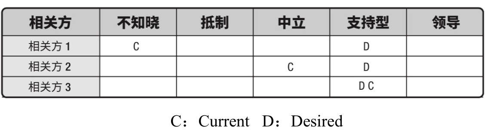

### 工具与技术：相关方参与计划

除了相关方登记册中的资料，相关方参与计划通常还包括：

- 关键相关方的所需参与程度和当前参与程度
- 相关方变更的范围和影响
- 相关方之间的相互关系和潜在交叉
- 项目经理应该意识到相关方参与计划的敏感性，并采取恰当的预防措施。

## 13.3 管理相关方参与

管理相关方参与是与相关方进行**沟通和协作**以**满足其需求与期望、处理问题**，并促进相关方合理参与的过程。
主要作用：让项目经理能够**提高**相关方的**支持**，并尽可能**降低**相关方的**抵制**。

管理相关方参与包括以下活动：

1. 调动相关方**适时参与**项目（引导）
2. 通过**谈判和沟通**管理相关方的期望
3. 处理与相关方管理有关的**任何风险或潜在关注点**
4. **澄清和解决已识别出的问题**

## 13.4 监督相关方参与

监督相关方参与是监督项目相关方**关系**，并通过修订参与策略和计划来**引导相关方合理参与项目的过程**。
主要作用：随着项目进展和环境变化，维持或提升相关方**参与**活动的**效率和效果**。

# 11 项目风险管理

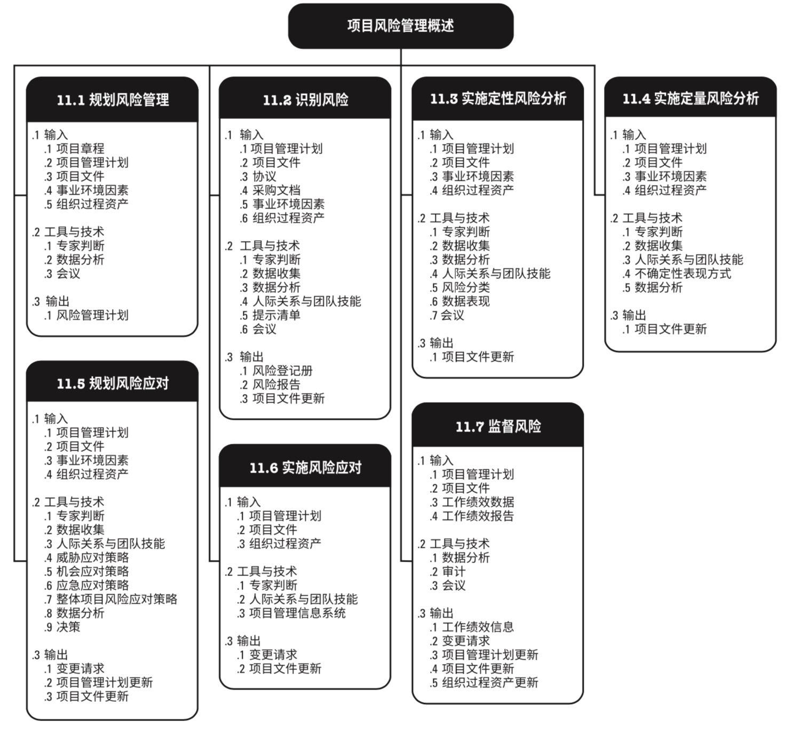

**项目风险**：是一种**不确定**的事件或条件，一旦发生，就会对一个或多个项目目标造成积极或消极的影响。

> 问题是 **现在客观存在的**
> 风险是 **将来可能发生，也可能不发生的**

**风险的三要素：**风险事件、概率、影响

积极和消极的风险通常被称为 **机会** 和 **威胁**

**两个层面的风险**

> **单个项目风险：**会对一个或多个**项目目标**产生**正面或负面**影响的不确定事件或条件
>
> **整体项目风险：** 不确定性对**项目整体的影响**
>
> **整体项目风险大于项目中单个风险之和**

**三种性质的风险**

> - 已知-已知风险：已识别并分析过的风险，可对这些风险规划应对措施。（**计入时间/成本**）
> - 已知-未知风险：已识别，但又无法主动管理的风险，要分配一定的应急储备。（**应急储备**）
> - 未知-未知风险：无法进行主动管理，因此需要分配一定的管理储备。（**管理储备**）

**影响风险态度的因素**

> – 风险偏好： 为了预期的回报，一个实体愿意承受不确定性的程度。（**愿不愿意承受**）
> – 风险承受力： 组织或个人能承受的风险程度、数量或容量。（**能不能承受**）
> – 风险临界值： 反映了组织与项目相关方的风险偏好程度，是项目目标可接受的变异程度。（**要不要管理**）
> –较为合适且正确的做法是如下排列：风险承受力＞风险偏好＞风险临界值

## 11.1 规划风险管理

规划风险管理是定义如何实施项目风险管理活动的过程
主要作用：**确保风险管理**的水平、方法和可见度与项目**风险程度，以及项目对组织和其他相关方的重要程度相匹配**

### 输入：项目章程和项目文件

项目章程：有高层级的风险
相关方登记册：可用于**确定项目风险管理的角色和职责**，以及为项目**设定风险临界值**

### 工具与技术

**数据分析**

- 相关方分析 通过相关方分析确定项目相关方的风险偏好。

### 输出：风险管理计划

- **风险管理计划**：描述如何安排与实施风险管理活动。管理计划的内容如下：
  - 风险管理战略：描述用于管理本项目的风险的一般方法。
  - 方法论：确定用于开展本项目的风险管理的具体方法、工具及数据来源。
  - 角色与职责：确定每项风险管理活动的领导者、支持者和团队成员，并明确他们的职责。
  - 资金：确定开展项目风险管理活动所需的资金，并制定应急储备和管理储备的使用方案。
  - 时间安排：确定在项目生命周期中实施项目风险管理过程的时间和频率，确定风险管理活动并 将其纳入项目进度计划。
  - **风险类别**：确定对单个项目风险进行分类的方式。通常借助风险分解结构 (RBS)来构建风险类别

- **风险分解结构（RBS）**
  潜在风险来源的**层级**展现。风险分解结构有助于项目团队考虑**单个项目风险的全部可能来源**，对**识别风险或归类已识别风险**特别有用。
  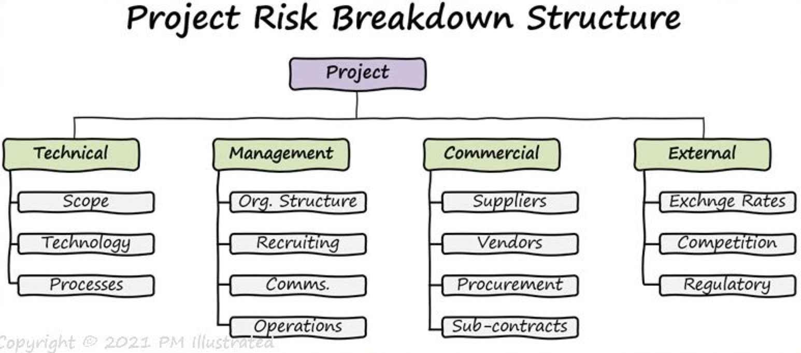

**概率和影响矩阵**
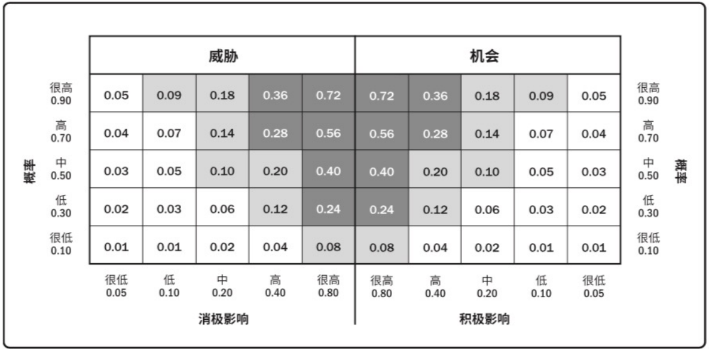

- 相关方风险偏好： 应在风险管理计划中记录项目关键相关方的风险偏好，把相关方的风险偏好表述成可测量的风险临界值。这些临界值不仅将联合决定可接受的整体项目风险敞口水平，而且也用于制定概率和影响定义。以后将根据概率和影响定义，对单个项目风险进行评估和排序。
- 风险概率和影响定义： 根据具体的项目环境、组织和关键相关方的风险偏好和临界值，来制定风险概率和影响定义。项目可能自行制定关于概率和影响级别的具体定义，或者用组织提供的通用定义作为出发点。
  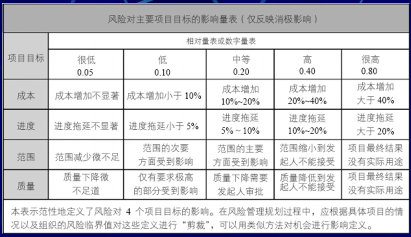

## 11.2 识别风险

识别单个项目风险以及整体项目风险的来源，并记录风险特征的过程
主要作用：**记录**现有的单个项目风险，以及整体项目**风险的来源**；同时，**汇集相关信息**，以便项目团队能够恰当应对已识别的风险

应鼓励**所有项目相关方**参与单个项目风险的识别工作。

识别风险是一个**迭代的过程**。迭代的频率和每次迭代所需的参与程度因情况而异，应在风险管理计划中做出相应规定。

### 工具与技术：数据收集

- 头脑风暴
  可以用**风险类别(如风险分解结构)**作为识别风险的框架。
- 核对单
  是包括需要考虑的项目、行动或要点的清单，常被**用作提醒**。基于从类似项目和其他信息来源积累的**历史信息和知识**来编制核对单。编制核对单，因不能穷尽所有风险，所以必须确保**不要用核对单来取代**所需的**风险识别工作**；另外也应注意**考察未在核对单中列出的事项**。
- 访谈
- 根本原因分析
- 假设条件和制约因素分析
- 文件分析
- **SWOT分析**
  优 势 (Strength) 、 劣 势 (Weakness) 、 机 会 (Opportunity)、威胁(Threat)进行逐个检查。
- 人际关系与团队技能
- **提示清单**
  关于可能引发单个项目风险以及可作为整体项目风险来源的风险类别的预设清单。可以用风险分解结构底层的**风险类别**作为提示清单，来识别单个项目风险。
- 识别对单个项目风险的框架：提示清单
- 识别整个项目风险的框架：
  - PESTLE(政治、经济、社会、技术、法律、环境)
  - TECOP(技术、环境、商业、运营、政治)
  - VUCA(易变性、不确定性、复杂性、模糊性)

### 输出：风险报告

风险登记册 ： 记录**已识别**单个项目风险的详细信息。

## 11.3 实施定性风险分析

实施定性风险分析 是通过**评估**单个项目风险发生的概率和影响以及其他特征，**对风险进行优先级排序**，从而为后续分析或行动提供基础的过程。本过程的主要作用是**重点关注高优先级的风险**。

### 工具与技术：数据分析

- 风险数据质量评估 ：旨在评价关于单个项目风险的数据的准确性和可靠
  性。
  - 可以开展问卷调查，了解项目相关方对数据质量各方面的评价。
  - 可以计算数据的完整性、客观性、相关性和及时性方面的加权平均数，将其作为数据质量的总体分数。
- 风险概率和影响评估 ：风险概率考虑的是特定风险发生的可能性，而风险影响评估考虑的是风险对项目目标（如进度、成本、质量或绩效）的潜在影响（消极和积极）。
- 对已识别的单个项目风险进行概率和影响评估。
- **低概率和影响的风险将被列入风险登记册中的观察清单，供未来监控。**
- 其他风险参 数 评估： 紧迫性、邻近性、潜伏期、可管理性、可控性、可监测性。连通性、战略影响力、密切度等。考虑这些特征有助于进行**更稳健**的风险优先级排序。

### 工具与技术：风险分类

可按照不同的分类标准对项目风险分类，以确定哪些项目领域最容易被不确定性影响。

**风险分类标准：**风险来源(如采用风险分解结构 [RBS])、受影响的项目领域(如采用工作分解结构 [WBS])，以及其他实用类别(如项目阶段、项目预算、角色和职责)来分类

对风险进行分类，有助于：

1. 把注意力和精力集中到风险敞口最大的领域。
2. 针对一组相关的风险制定通用的风险应对措施。

### 工具与技术：数据表现

- 概率和影响矩阵
- 层级图
  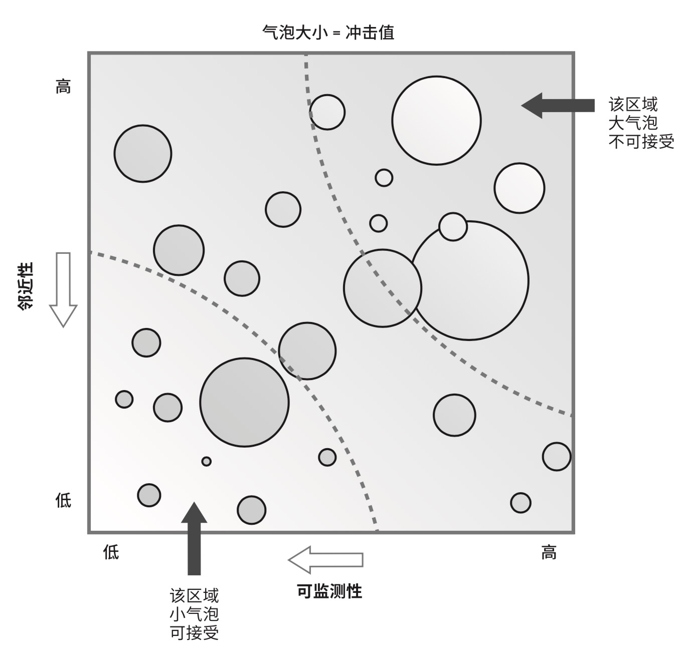

### 输出：项目文件更新

- 风险登记册
- 风险报告 

## 11.4 实施定量风险分析

就已识别的单个项目风险和不确定性的其他来源对整体项目目标的影响进行定量分析的过程。
主要作用：**量化**整体项目风险敞口，并提供额外的定量风险信息，以**支持风险应对规划**。

### 工具与技术

- 数据收集
  - 访谈
- 不确定性表现方式

### 工具与技术：数据分析

- 模拟
  - 蒙特卡洛
    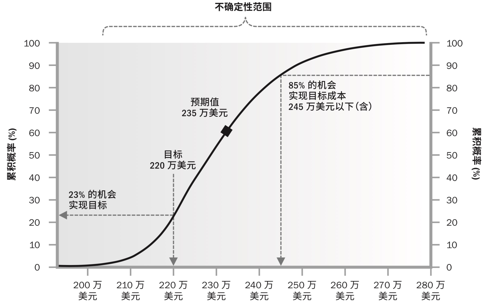
- 敏感性分析
  - 龙卷风图
    
- 决策树分析
  每个决策或事件都有相关的成本和单个项目风险(包括威胁和机会)。决策树分支的终点表示沿特定路径发展的最后结果，可以是负面或正面的结果。
  

### 输出：项目文件更新

**更新风险报告，反映定量风险分析的结果。**

- 对整体项目风险敞口的评估结果。两种主要的测量方式: **项目成功的可能性**。基于已识别的单个项目风险和其他不确定性来源，项目实现其主要目标(例如，既定的结束日期或中间里程碑、既定的成本目标)的概率。**项目固有的变异性。**在开展定量分析之时，可能的项目结果的分布区间。
- 项目详细概率分析的结果
- 单个项目风险优先级清单
- 定量风险分析结果的趋势
- 风险应对建议

## 11.5 规划风险应对

规划风险应对 ：为处理整体项目风险敞口，以及应对单个项目风险，而制定可选方案、选择应对策略并商定应对行动的过程。
**主要作用**：制定应对整体项目风险和单个项目风险的适当方法。分配资源，并根据需要将相关活动添加进项目文件和项目管理计划。

**风险应对方案必须** ： 1. 与风险的重要性相匹配； 2. 能经济有效地应对挑战；3. 在当前项目背景下现实可行； 4. 能获得全体相关方的同意； 5.由一名责任人具体负责。
如果选定的策略并不完全有效，或者发生了已接受的风险，就需要制定应急计划(或弹回计划)。
**次生风险**： 实施风险应对措施而直接导致的风险。往往需要为风险分配时间或成本应急储备，并可能需要说明动用应急储备的条件。

### 工具与技术：机会应对策略

- 上报
- 开拓
- 分享
- 提高
- 接受

### 工具与技术：威胁应对策略

### 工具与技术：应急应对策略

可以设计一些仅在特定事件发生时才采用的应对措施。对于某些风险，如果项目团队相信其发生会有充分的 预 警信号 ，那么就应该制定仅在某些预定条件出现时才执行的应对计划。

### 输出：项目文件更新

假设日志
成本预算
经验教训登记册
项目进度计划
项目团队派工单
风险登记册
**风险报告**

> 商定的应对策略
> 实施所选应对策略所需要的具体行动;
> 风险发生的触发条件、征兆和预警信号;
> 实施所选应对策略所需要的预算和进度活动;
> 应急计划，以及启动该计划所需的风险触发条件;
> 弹回计划，供风险发生且主要应对措施不足以应对时使用;
> 在采取预定应对措施之后仍然存在的残余风险，以及被有意接受的风险;
> 由实施风险应对措施而直接导致的次生风险。

## 11.6 实施风险应对

实施风险应对是执行商定的风险应对计划的过程。
**主要作用：**确保按计划执行商定的风险应对措施，来管理整体项目风险敞口、最小化单个项目威胁，以及最大化单个项目机会。

## 11.7 监督风险

监督风险是在整个项目期间，监督商定的风险应对计划的实施、跟踪已识别风险、识别和分析新风险，以及评估风险管理有效性的过程。
**主要作用**：使项目决策都基于关于整体项目风险敞口和单个项目风险的当前信息。

### 输入：风险登记册

风险登记册的主要内容包括：已识别单个项目风险、风险责任人、商定的风险应对策略，以及具体的应对措施。

### 工具与技术：数据分析

- 技术绩效分析
  把项目执行期间所取得的技术成果与取得相关技术成果的计划进行比较。它要求定义关于技术绩效的客观的、量化的测量指标，以便据此比较实际结果与计划要求。技术绩效测量指标可能包括:重量、处理时间、缺陷数量、储存容量等。实际结果偏离计划的程度可以代表威胁或机会的潜在影响。
- 储备分析
  在整个项目执行期间，可能发生某些单个项目风险，对预算和进度应急储备产生正面或负面的影响。储备分析是指在项目的任一时点**比较剩余应急储备与剩余风险量**，从而确定剩余储备是否仍然合理。可以用各种图形(如燃尽图)来显示应急储备的消耗情况。
- 风险审计
  可用于评估风险管理过程的有效性。项目经理负责确保按项目风险管理计划所规定的频率开展风险审计。
- 会议
  适用于本过程的会议包括**风险审查会**。定期安排风险审查，来检查和记录风险应对在处理整体项目风险和已识别单个项目风险方面的有效性。

### 输出：项目文件更新

- 假设日志
- 问题日志
- 经验教训登记册
- **风险登记册**
  更新风险登记册，记录在监督风险过程中产生的关于单个项目风险的信息，可能包括添加新风险、更新已过时风险或已发生风险，以及更新风险应对措施等。
- 风险报告

# 12 项目采购管理

虽然项目经理**不必成为**采购管理法律法规领域的专家，但应该对采购过程有**足够了解**，以便做出与合同及合同关系 相关的明智决定。

合同应明确说明预期的**可交付成果和结果**，包括从卖方到卖方的任何知识转移。

## 12.1 规划采购管理

规划采购管理是记录项目采购决策、明确采购方法，及**识别潜在卖方**的过程。
**主要作用**:确定是否从项目外部获取货物和服务，如果是，则还要确定将在什么时间、以什么方式获取什么货物和服务。货物和服务可从执行组织的其他部门采购，或者从外部渠道采购。

### 输入

- 项目章程 包括目标、项目描述、总体里程碑，以及**预先批准的财务资源**。
- 商业文件
  - 商业论证：**采购策略需要和商业论证保持一致。**
  - 收益管理计划：描述应在何时产出具体的项目收益，这将影响采购日期和合同条款的确定。
- 项目管理计划
  - 范围管理计划：说明**如何**在项目的实施阶段**管理承包商的工作范围**。
  - 质量管理计划：包含**项目需要遵循的行业标准与准则**。这些标准与准则应**写入招标文件**，如建议邀请书，并将最终在**合同中引用**。这些标准与准则也可用于**供应商资格预审**，或作为**供应商甄选标准**的一部分。
  - 资源管理计划：包括关于**哪些资源需要采购**或租赁的信息，以及任何可能影响采购的**假设条件或制约因素**。
  - 范围基准：范围基准包含范围说明书、WBS和WBS词典。应该针对项目范围中已知的工作，编制**工作说明书 (SOW) 和工作大纲 (TOR)。**
- 项目文件
  - 里程碑清单 ：说明卖方需要在何时交付成果。
  - 项目团队派工单 ：包含关于项目团队技能和能力的信息，以及他们**可用于支持采购活动的时间**。如团队不具备采购能力，则需**外聘或培训**。
  - 需求文件 ：卖方需要满足的**技术要求**；具有**合同和法律意义的需求**，如健康、安全、安保、绩效、环境、保险、知识产权、同等就业机会、执照、许可证，以及其他非技术要求。
  - 需求跟踪矩阵 ：将产品需求从其来源连接到能满足需求的可交付成果。
  - 资源需求 ：包含关于某些特定需求的信息
  - 风险登记册 ：列明风险清单，以及风险分析和风险应对规划的结果。**有些风险应通过采购协议转移给第三方**。
  - 相关方登记册 ：提供有关项目参与者及其项目利益的详细信息，包括**监管机构、合同签署人员和法务人员。**
- 组织过程资产
  - 预先批准的卖方清单 ：经过适当审查的卖方清单可以简化招标所需的步骤，并缩短卖方甄选过程的时间。
  - 正式的采购政策 、 程序和指南 ：大多数组织都有正式的采购政策和采购机构。如果没有，项目 团队就应该配备相关的资源和专业技能，来实施采购活动。
  - 合同类型 ：**总价、成本补偿、混合类型（工料合同）**。单次采购可合并使用两种或者多种合同类型。

### 总价合同

此类合同为既定产品、服务或成果的采购设定一个总价。这种合同应在**已明确定义需求，且不会出现重大范围变更**的情况下使用。

- 固定总价FFP
  **大多数买方都喜欢这种合同**，因为货物采购的价格在一开始就已确定，并且**不允许改变**(除非工作范围发生变更)。
- 总价加激励费用FPIP
  这种总价合同为买方和卖方提供了一定的灵活性，**允许一定的绩效偏离**，并对实现既定目标给予相关的**财务奖励**(通常取决于卖方的成本、进度或技术绩效)。FPIF 合同中会设置价格上限，高于此价格上限的全部成本将由卖方承担。
- 总价加经济价格调整FPEPA
  这种合同适用于两种情况:**卖方履约期将跨越几年时间，或将以不同货币支付价款**。它是总价合同**通货膨胀、某些特殊商品的成本增加(或降低)**的一种类型，但合同中包含了特殊条款，允许根据条件变化

**总价加激励费用**

- 目标成本（估算成本）
- 目标利润（目标费用）
- 实际成本
- 分摊比例（买方/卖方，如80/20即买方承担80，卖方承担20）
- 最高限价(天花板)

总价=实际成本+目标利润+(目标成本-实际成本)*卖方应承担比例
**先算总价和最高限价比较，计算最终总价。**
实际利润=**最终总价(若超过最高限价按最高限价算)**-实际成本

### 成本补偿合同

此类合同向卖方支付为完成工作而发生的**全部合法实际成本**(可报销成本)，**外加一笔费**用作为卖方的利润。这种合同适用于:工作**范围**预计会在合同执行期间**发生重大变更。**

- 成本加固定费用 (CPFF) 
  为卖方**报销**履行合同工作所发生的**一切可列支成本**，并向卖方**支付一笔固定费用**。该费用以项目**初始估算成本**的某一百分比计列。除非项目范围发生变更，否则费用金额维持不变。
- 成本加激励费用 (CPIF) 
  为卖方**报销**履行合同工作所发生的**一切可列支成本**，并在卖方**达到**合同规定的**绩效目标**时，向卖方支付预先确定的**激励费用**。在CPIF合同中，如果最成本低于或高于原始估算成本，则买方和卖方需要根据事先商定的成本分摊比例来分享节约部分或分担超支部分。例如，基于卖方的实际成本，按照80/20的比例分担(分享)超过(低于)目标成本的部分。
- 成本加奖励费用 (CPAF)
  为卖方**报销一切合法成本**，但只有在卖方满足合同规定的、某些**笼统主观**的绩效标准的情况下，才向卖方支付大部分费用。奖励费用完全由买方根据自己对卖方绩效的**主观判断来决定**，并且**通常不允许申诉**。

**成本加激励费用CPIF**

- 目标成本（估算成本）
- 目标利润（目标费用）
- 实际成本
- 分摊比例（买方/卖方，如80/20即买方承担80，卖方承担20）

利润=目标利润+(目标成本-实际成本)*卖方应承担比例
**先算利润，和利润上下限比，计算最终利润。**
实际总价=**最终利润**+实际成本

### 工料合同

工料合同(又称时间和手段合同)，是兼具成本补偿合同和总价合同特点的混合型合同。这种合同往往适用于:在无法快速编制出准确的工作说明书的情况下扩充人员、聘用专家或寻求外部支持。

开口合同，合同价因成本增加而变化。

 在授予合同时，买方可能并未确定合同的总价值和采购的准确数量。因此，如同成本补偿合同，工料合同的合同价值可以增加。很多组织要求在工料合同中规定**最高价值和时间限制**，**以防止成本无限增加**。

### 合同的选择标准

• 范围角度

- 范围明确、设计详细——总价合同
- 范围不清——成本补偿合同或工料合同

• 风险承担角度

- 甲方承担——成本补偿合同
- 双方承担——工料合同
- 乙方承担——总价合同

时间紧、任务重，需要专家以及其他外部支持的短期项目，工料合同比较灵活。

### 工具与技术

- 自制或外购分析
  用于确定某项工作最好由项目团队自行完成，还是应该从外部采购**（谁划算用谁）**自制或外购分析应考虑全部相关成本，包括直接成本或间接成本。
- 市场调研
  包括考察**行业情况和具体卖方的能力**。采购团队可运用会议、在线评论和各种其他渠道得到的信息，来了解市场情况。
- 供方选择分析
  在确定选择方法前，有必要审查项目竞争性需求的优先级。由于竞争性选择方法可能要求卖方在事前投入大量时间和资源，因此，应该在采购文件中写明评估方法，让投标人了解将会被如何评估。

### 输出：采购管理计划

采购管理计划包含要在采购过程中开展的各种活动。它应该记录是否要开展国际竞争性招标、国内竞争性招标、当地招标等。如果项目由外部资助，资金的来源和可用性应符合采购管理计划和项目进度计划的规定。采购管理计划可包括以下内容:

- **如何协调采购与项目的其他工作**，例如，项目进度计划制定和控制;
- 开展重要采购活动的**时间表**;
- 用于管理合同的**采购测量指标**;
- 与采购有关的相关方**角色和职责**;如果执行组织有采购部，项目团队拥有的职权和受到的限制;
- 可能影响采购工作的**制约因素和假设条件**;
- **司法管辖权和付款货币**;
- 是否需要编制独立估算，以及是否应将其作为评价标准;
- **风险管理事项**，包括对履约保函或保险合同的要求，以减轻某些项目风险;
- **拟使用的预审合格的卖方**(如果有)。根据每个项目的需要，采购管理计划可以是正式或非正式的，非常详细或高度概括的。

### 输出：采购策略

如果决定从项目外部渠道采购，就应制定一套采购策略。应该在采购策略中规定项目交付方法、具有法律约束力的协议类型，以及如何在采购阶段推动采购进展。

- 交付方法
- 合同支付类型
- 采购阶段

### 输出：招标文件

招标文件用于向潜在卖方征求建议书（可以是：**信息邀请书、报价邀请书、建议邀请书等**）。

- 如果**主要依据价格**来选择卖方(如购买商业或标准产品时)，通常就使用**标书、投标或报价**等术语。
- 如果其他考虑因素(如**技术能力或技术方法**)至关重要，则通常使用**建议书**之类的术语。
- **信息邀请书 (RFI)** 。如果需要卖方**提供**关于拟采购货物和服务的**更多信息**，就使用信息邀请书。随后一般还会使用报价邀请书或建议邀请书。
- **报价邀请书 (RFQ)** 。如果需要供应商**提供**关于将**如何满足需求**和(或)将**需要多少成本**的更多信息，就使用报价邀请书。
- **建议邀请书 (RFP)** 。如果项目中**出现问题且解决办法难以确定**，就使用建议邀请书。这是**最正式的“邀请书”文件**，需要遵守与内容、时间表，以及卖方应答有关的严格的采购规则。
- 采购文件中应包括：1. 应答格式要求；2.相关的采购工作说明书；3.所需的合同条款

### 输出：采购工作说明书

依据项目范围基准，为每次采购编制工作说明书(SOW)，仅对将要包含在相关合同中的那一部分项目范围进行义。
SOW应该详细描述拟采购的产品、服务和成果，以便潜在卖方确定是否有能力提供。

### 输出

- 自制或外购决策

- 独立成本估算对于大型采购
  采购组织可以**自行准备独立估算**，或**聘用外部专业估算师**做出成本估算，并将其作为评价卖方报价的对照基准。

- 供方选择标准
  供方选择标准可包括（但不限于）：

  > **产品成本和生命周期成本;**
  > 交付日期;
  > 技术专长和方法;
  > **具体的相关经验;**
  > 用于响应工作说明书的工作方法和工作计划;
  > 关键员工的资质、可用性和胜任力;
  > **公司的财务稳定性;**
  > 管理经验;
  > 知识转移计划，包括培训计划。

## 12.2 实施采购

实施采购是**获取卖方应答、选择卖方并授予合同**的过程。本过程的主要作用是，**选定合格卖方**并**签署**关于货物或服务交付的法律协议。本过程的最后成果是签订的协议，包括正式合同。

### 输入：采购文档

采购文档是用于达成法律协议的各种书面文件，其中可能包括当前项目启动之前的较旧文件。

- 招标文件 ： 包括发给卖方的信息邀请书、建议邀请书、报价邀请书，或其他文件，**以便卖方编制应答文件**。
- 采购工 作说 明书 书 (SO W) ：向卖方清晰地说明目标、需求及成果，**以便卖方据此做出量化应答**。
- 独立成本估算 ：可由内部或外部人员编制，**用于评价投标人提交的建议书的合理性**。
- 供方选择标准 ：描述如何评估投标人的建议书，包括评估标准和权重。为了**减轻风险**，买方可能决定与多个卖方签署协议，以便在单个卖方出问题并影响整体项目时，降低由此导致的损失。

### 工具与技术

- 广告
- 投标人会议（承包商会议、供应商会议或投标前会议）
- 人际关系与团队技能——采购谈判
  采购谈判是指在**合同签署之前**，对合同的结构、各方的权利和义务，以及其他条款加以澄清，以便双方达成共识。

### 输出

- 选定的卖方
- 协议

## 12.3 控制采购

控制采购是**管理采购关系，监督合同绩效，实施**必要的**变更和纠偏**，以及**关闭合同**的过程。
**主要作用**：确保买卖双方履行法律协议，满足项目需求。

# 敏捷开发与项目管理过程

## 软件项目声明周期

### 预测型生命周期

在生命周期的**早期阶段确定项目范围、时间和成本**。对任何范围的变更都要进行仔细管理。

适用： **充分了解产品 、 有明确的需求定义** 、 熟悉的问题领域 、 稳定的技术 、 熟悉的客户的软件项目 。

**按计划执行 ， 一次交付。**仍可使用滚动式规划的概念：先编制一份高层级的概要计划，在随着新工作的临近、资源得到分配，针对某个合理的时间段编制更详细的计划（渐进明细）。

### 迭代型生命周期

**项目范围通常于项目生命周期的早期确定**，但**时间及成本**估算将随着项目团队对产品理解的不断深入而**定期修改**（重复的循环）

**迭代方法**： 通过一系列重复的循环活动来开发产品。一次迭代中将执行所有项目管理过程组中的活动，每次迭代结束时将完成一个或一组可交付成果。

### 增量型生命周期

在预定的时间区间内渐进增加产品功能的一系列迭代来产出可交付成果。

**渐进地增加**产品的功能。
只有在**最后一次迭代之后**，可交付成果具有了必要和足够的能力，**才能被视为完整的**。

### 适应型生命周期

也称为**敏捷型生命周期**，详细范围在迭代开始之前就得到了定义和批准。

**较小的增量 ， 快速迭代 ， 每次交付最有价值的东西 。**
**频繁交付**

**适用：**需应对快速变化的环境；需求和范围难以事先确定 。

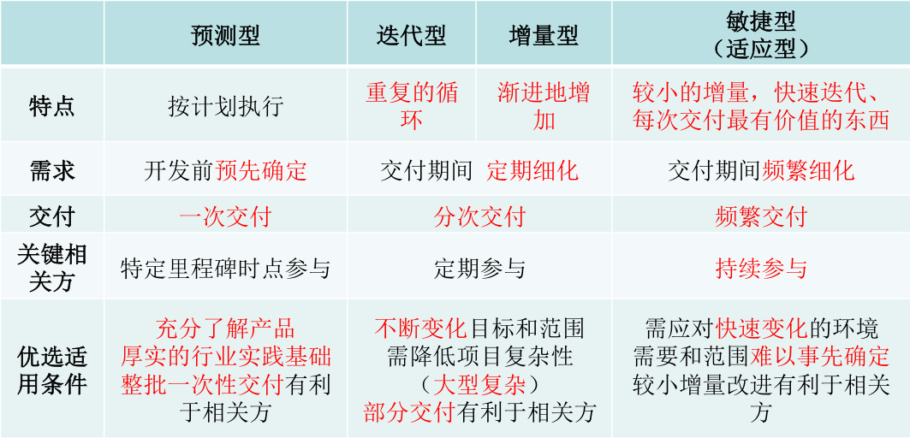

## 敏捷项目管理

敏捷开发特点：

- 迭代、渐进和进化
- 高效率的面对面沟通
- 非常短的反馈回路和适应周期
- 质量焦点

### 用户故事

**优先级**
关于某个特性的优先级取决于该特性的商业价值及实现它所需要的工作量。商业价值由产品负责人决定，所需工作量由DevOps团队决定。
**故事点**
故事点是 DevOps 团队认为要实现特性所需工作量的计量单位。通常我们会使用斐波那契数列来预估。另一种选择是理想时长。重要的是将故事点建立在包含在特性中的故事点的总和上，这比对抽象特征的估计更可靠

### Scrum方法论

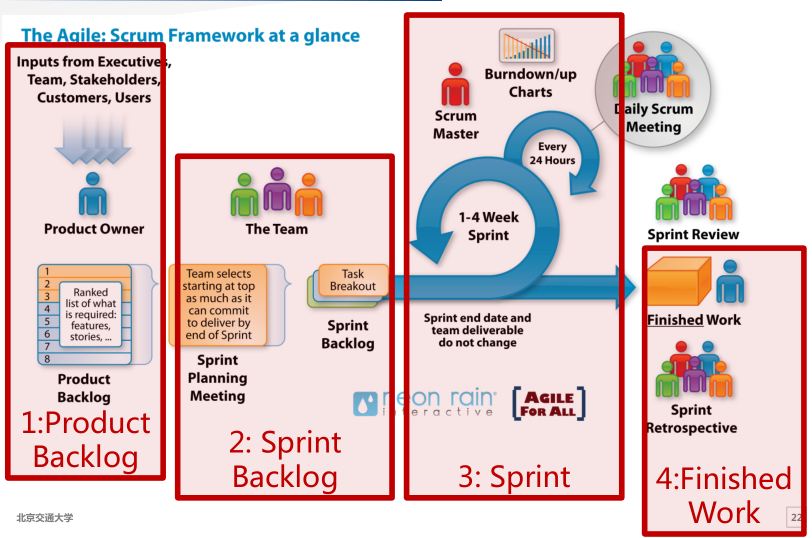

第一步：找到完成产品需要做的事情——Product Backlog

第二步：决定当前的冲刺（Sprint）需要解决的事情——Sprint Backlog

第三步：冲刺

第四步：得到软件的一个增量版本

### 冲刺方法

- 例会
- 燃尽图
- 看版图

