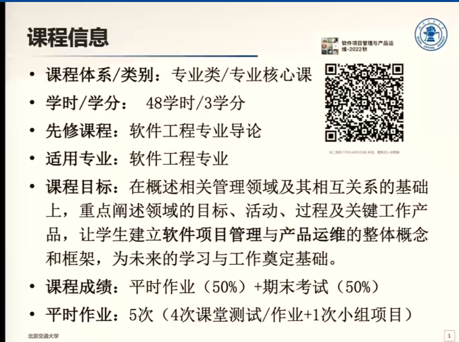
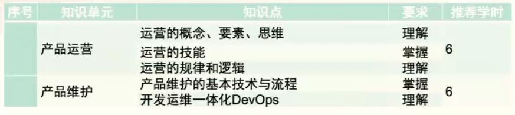
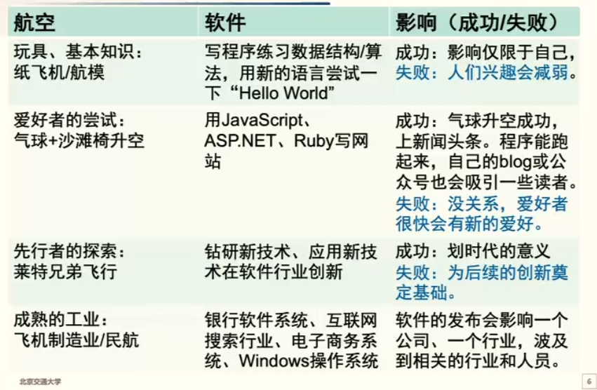
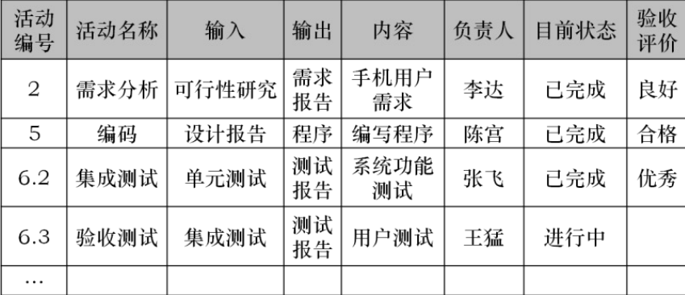
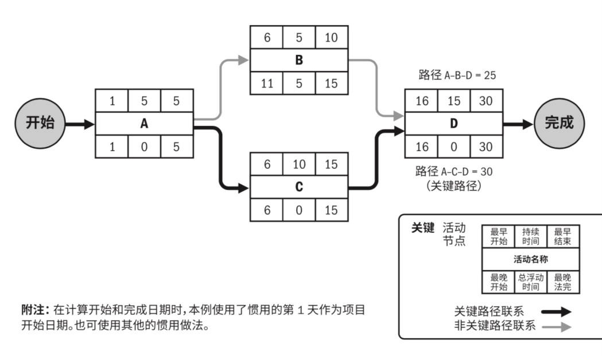
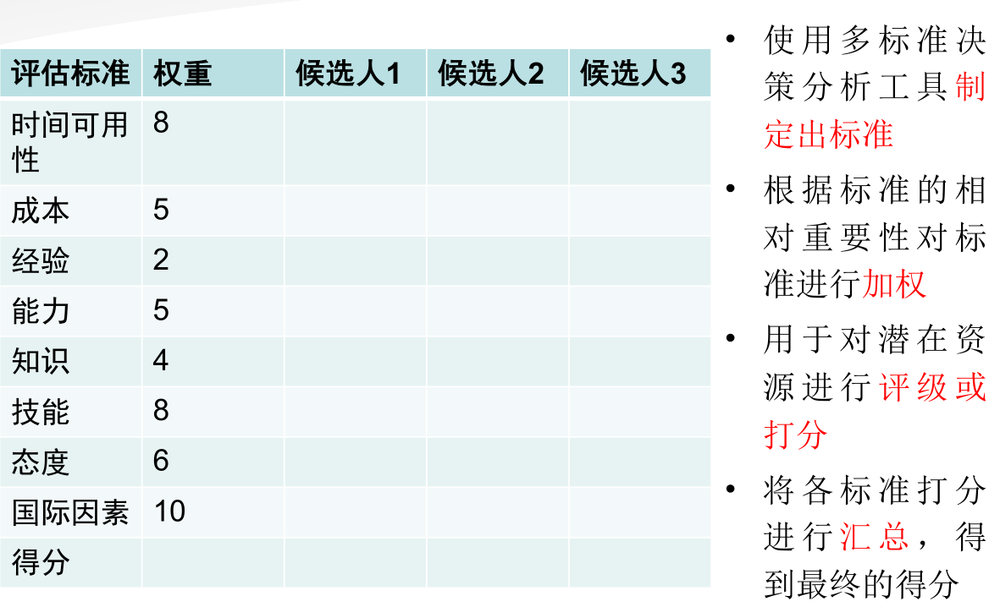
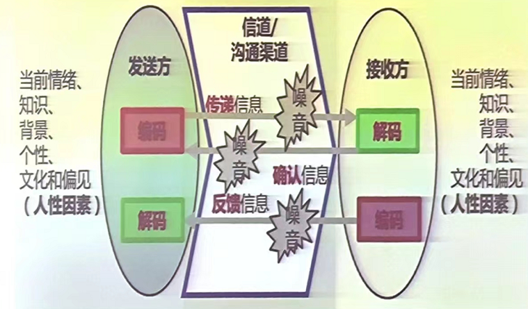

[TOC]

# 课程信息

项目管理：管理项目范围、成本、进度、质量等
产品运营：商业变现
产品维护：产品高效平稳、安全运行

# 课程大纲

# 参考资料

# 1. 软件项目管理基本概念

## 1.1 软件

### 1.1.1 程序

程序=数据结构+算法
软件=程序+软件工程
软件企业=软件+商业模式

### 1.1.2 软件开发的不同阶段

### 1.1.3 软件工程

把**系统的、有序的、可量化**的方法应用到软件的**开发、运营和维护**上的过程。

### 1.1.4 软件的特殊性

1. 复杂性
2. 不可见性
3. 易变性/灵活性
4. 服从性/一致性
5. 非连续性

### 1.1.5 软件工程与计算机科学的关系

### 1.1.6 软件工程的知识领域

### 1.1.7 软件工程的目标

创造足够好的软件：

1. 用户满意度
2. 可靠性
3. 软件流程的质量
4. 可维护性

## 1.2 软件项目管理的基本概念及知识体系

### 1.2.1 项目

为**创造独特**的**产品、服务或成果**而进行的**临时性工作**
一项独特的努力，通常包括一组独特的可交付成果

* 有明确的目的/结果，为达到预期结果而需要完成的一系列任务
* 一段时间，项目是一次性或是临时的，有明确的开始和结尾
* 资源，包括人力资源和其他要素

项目可以创造：

* 一种产品
* 一种能力或提供某种服务的能力

### 1.2.2 项目管理

将知识、技能、工具与技术应用于项目活动，以满足项目的要求

项目管理三要素：

* Time 时间（进度、日程等）
* Scope 范围（产品范围、项目范围）
* Cost 成本（成本、预算等）

六个约束关系：

* Risk 风险
* Quality 质量
* Resources 资源
* +三要素

### 1.2.3 项目、项目集与项目组合管理

### 1.2.4 软件项目管理的特性及挑战

### 1.2.5 软件项目管理知识体系

**四大知识领域是是范围管理、时间管理/进度管理、成本管理和质量管理**

其他五大知识领域包括资源管理、沟通管理、风险管理、采购管理、干系人管理/相关方管理(也称辅助知识领域)

**整合管理**发挥项目管理整体上的支撑作用，它与其他项目管理知识领域互相影响

## 1.3 个人技术和流程

### 1.3.1单元测试

• 定义：将程序的功能分为可作为单个单元测试，通过创建和运行单元独立测试，检查代码是否按预期工作的独立可测试行为。
• 目的：让自己负责的模块功能定义尽可能明确， 模块内部的改变不会影响其他模块，而且模块的质量能得到稳定的、量化的保证。

**好的单元测试的标准**

• 单元测试应该在最基本的功能/参数上验证程序的正确性
• 单元测试必须由最熟悉代码的人（程序的作者）来写
• 单元测试过后，机器状态保持不变
• 单元测试要快（一个测试的运行时间是几秒钟，而不是几分钟）
• 单元测试应该产生可重复、一致的结果
• 独立性——单元测试的运行/通过/失败不依赖于别的测试，可以人为构造数据，以保持单元测试的独立性
• 单元测试应该覆盖所有代码路径
• 单元测试应该集成到自动测试的框架中
• 单元测试必须和产品代码一起保存和维护

### 1.3.2回归测试

* 在单元测试的基础上，我们就能建立关于这一模块的回归测试
* 目的： 检验软件原有功能在修改后是否保持完整 。
* 针对一个Bug Fix，我们也要做Regression Test 。目的是：
  – 验证新的代码的确改正了缺陷
  – 同时要验证新的代码有没有破坏模块的现有功能，有没有 Regression

### 1.3.3个人软件开发流程

卡内基梅隆（ CMU ）针对软件工程师有一套模型，叫 **Personal Software Process**

## 1.4 软件工程师的成长

### 1.4.1 个人能力的衡量和发展

1. 项目/任务有多大
   - 代码行数
   - 功能点
2. 花了有多少时间
3. 质量如何
4. 是否按时交付

在团队工作中，**稳定、一致**的交付时间是衡量员工能力的重要方面

**团队对个人的期望**

1. 交流
2. 说到做到
3. 接收团队赋予的角色并按角色要求工作
4. 全力投入团队的工作
5. 按照团队流程的要求工作
6. 准备
7. 理性地工作

### 1.4.2 软件工程师的思维误区

1.  分析麻痹Analysis Paralysis
2.  不分主次，想解决所有依赖问题
3.  过早优化
4.  过早扩大化/泛化

### 1.4.3 软件工程师的职业发展

* 临时的寄托或工作(Temporary Work)
* 工作(Job)
* 职业(Profession)
* 投身的事业(Commitment/vocation)
* 理想的呼唤(Calling)

# 2. 软件团队模式、组织、项目生命周期、软件开发流程及PM

## 2.1 软件团队的模式

* 蜂窝模式

### 2.1.1 主治医师模式

### 2.1.2 明星模式(Super-star Model)

### 2.1.3 社团模式(Community Model)

### 2.1.4 业余剧团模式(Amateur Theater Team)

### 2.1.5 秘密团队(Skunk Work Team)

### 2.1.6 特工团队(SWAT)

### 2.1.7 交响乐团队(Orchestra)

### 2.1.8 爵士乐模式(Jazz Band)

### 2.1.9 功能团队模式(Feature Team)

### 2.1.10 官僚模式(Bureaucratic Model)

## 2.2 组织对项目管理的影响

组织文化、结构和领导风格对如何进行软件项目的管理具有很重大的影响，因为软件工程师
是靠密切的团队合作来开发和修改软件的知识工作者。
组织的项目管理成熟度及其项目管理系统也会影响项目。
涉及外部企业（如作为合资方或合伙方）的项目，会受到不止一个组织的影响。

### 2.2.1 组织结构与项目特征对比

组织结构可能影响资源的可用性和项目的执行方式。类型包括**职能型、项目型**及位于这两者之间的三种**矩阵型**结构。

### 2.2.2 职能型组织

典型的职能型组织是一种层级结构。每名雇员都有一位明确的上级。人员按专业分组，各专业还可进一步分成更小职能部门。各部门相互独立开展各自的项目工作。

### 2.2.3弱矩阵型组织

**矩阵型** 组织兼具职能型和项目型组织的特征。根据职能经理和项目经理之间的权力和影响力的相对程度,矩阵型组织可分为弱矩阵、平衡矩阵和强矩阵。
**弱矩阵型** 组织保留了职能型组织的大部分特征，其项目经理的角色更像是协调员或联络员，作为工作人员的助理和沟通协调员，不能亲自制定或推行决策。

### 2.2.4 强矩阵型组织

**强矩阵型**组织则具有项目型组织的许多特征，拥有较大职权的全职项目经理和全职项目行政人员。

### 2.2.5 平衡矩阵型组织

**平衡矩阵型**组织虽然承认全职项目经理的必要性,但并未授权其全权管理项目和项目资金。

### 2.2.6 项目性组织

在**项目型**组织中，团队成员通常集中办公，组织的大部分资源都用于项目工作，项目经理拥有很大的自主性和职权。这种组织中也经常采用由拟协同技术来获得集中办公的效果。项目型组织中经常有被称为“部门”的组织单元，但它们或者直接向项目经理报告，或者为各个项目提供支持服务。

### 2.2.7 复合型组织

很多组织在不同的组织层级上用到上述所有的结构,这种组织通常被称为**复合型**组织，如图所示是强矩阵型组织和项目型组织形成的复合型组织。该组织采用强矩阵结构管理其大多数项目，而小项目仍由职能部门管理。

## 2.3 项目生命周期

项目 生命周期通常包含五个阶段: 

1. 启动 Initiating
2. 计划 Planning
3. 执行 Executing
4. 监 控 Monitoring and controlling
5. 收尾 Closing

### 2.3.1 项目生命周期的具体阶段

#### 2.3.1.1 启动阶段 Initiating

在该阶段要定义项目、理清项目的项目目标、范围和资源，以及团队需要哪些角色 。

**具体步骤包括：**

- 与利益相关者沟通以了解项目的目的和期望的结果
- 确定项目范围
- 确定SMART目标（具体的、可衡量的、可实现的、相关的和有时限的）
- 澄清预算和时间限制等资源
- 确认所需的团队规模和角色
- 确定在整个项目中参与的频率和利益相关者
- 编制项目建议书和项目章程

**启动阶段使用的工具和文件可以包括：**

- **项目提案**：定义一个项目并概述了关键日期、要求和目标
- **项目章程**： 明确描述项目和实现其目标所需的主要细节，包括潜在的风险、收益、约束和项目干系人
- **RACI图表**： 描绘了项目团队成员的角色和职责

#### 2.3.1.2 计划阶段 Planning

该阶段将确定实际实现项目目标的步骤，也就是完成项目的“方式”。如果启动阶段是集结你的部队，那么计划阶段是决定和他们一起干什么。

**计划阶段可以包括以下步骤：**

- 决定实现目标(goal)的里程碑(milestones)
- 制定任务(task)和里程碑的时间表，包括时间估计和潜在的时间缓冲
- 建立变革流程
- 确定与团队成员和利益相关者沟通的方式和频率
- 创建和签署文件，例如保密协议(NDA)或征求建议书(RFP)
- 通过创建风险登记册来评估和管理风险
- 召开启动会议（kick-off meeting）启动项目

**该阶段使用的工具包括：**

- 甘特图： 水平条形图，成员可以在其中看到哪些任务必须以什么顺序完成，以及每个任务预计需要多长时间
- 风险登记表： 列出与项目相关的风险及其概率、潜在影响、风险级别和缓解计划的图表

#### 2.3.1.3 执行阶段 Executing

执行项目意味着将计划付诸行动并使团队保持正轨。通常这意味着跟踪和衡量进度、管理质量、降低风险、管理预算以及使用数据为您的决策提供信息。

**具体步骤可能包括：**

- 使用甘特图或燃尽图等工具跟踪任务进度
- 风险显现时应对
- 记录成本
- 保持团队成员的积极性和任务
- 让利益相关者了解进展情况
- 通过变更请求合并变更

**可能会使用的一些工具包括：**

- 变更请求：这些是用于提议对项目范围或目标进行变更的文件
- 燃尽图：此图表在粒度级别上分解任务并可视化剩余时间量

#### 2.3.1.4 完成（收尾）阶段 Closing

该阶段将结束项目活动，将完成的产品或服务移交给它的新所有者，并评估进展顺利和进展不顺利的事情。是时候庆祝你的辛勤工作了。

释放资源，解散团队  

**收尾阶段的步骤可以包括：**

- 进行回顾并记下您可以在未来实施的更改
- 与项目结束的利益相关者进行沟通并提供影响报告
- 与项目的新所有者沟通
- 创建项目收尾报告
- 庆祝项目的结束和您的成功

收尾阶段使用的工具包括：

- 影响报告：该报告汇编了一系列指标，展示了您的项目如何产生影响并呈现给您的利益相关者。
- 项目收尾报告：项目收尾报告提供了您项目成就的总结，并为未来的项目经理提供了重要的学习经验以供参考。

### 2.3.2 项目生命周期与产品生命周期

## 2.4 软件开发过程/流程

**定义** ： 软件开发过程/流程（software development process）或软件过程（software process）是软件开发的生命周期（softwaredevelopment life cycle）,为软件的开发定义了一个框架，将自动化工具、软件开发方法/模型和质量管理紧密结合在了一起，是在开发与构建系统时应遵循的步骤，是软件开发的路线图。

### 2.4.1 写了再改模式(Code-and-Fix)

史蒂夫·迈克康奈尔（Steve McConnell）提出的，和一窝蜂团队模式很像。
**好处**： 不需要太多其他准备或相关知识，大家上来就写代码，也许就能写出来，写不出来就改，也许能改好。当面临下面的任务时，也许这个方法是有用的：

1. “只用一次”的程序；
2. 看过了就扔”的原型；
3. 一些不实用的演示程序。

**劣势**： 要写一个有实际用户、解决实际需求的软件，这个方法的缺点就太大了。

### 2.4.2 瀑布模型

温斯顿•罗伊斯(Winston Royce）在1970年的论文“Managingthe Development of Large Software Systems”中第一次明确地描述了这个模型（虽然他没有用Waterfall这个词）。

在设计大型系统时，要做相邻步骤的回溯，解决上一阶段末能解决的问题。要让产品成功，最好把这个模型走两遍，先有一个模拟版本，在此基础上收集反馈，改进各个步骤，并交付一个最终的版本。

- 在软件工程实践中的局限性在于：
  - 各步骤之间是分离的，但是软件生产过程中的各个步骤不能这样严格分高出来
  - 回溯修改很困难甚至不可能，但是软件生产的过程需要时时回溯
  - 最终产品直到最后才出现，但是软件的客户，甚至软件工程师本人都需要尽早知道产品的原型并试用
- 瀑布模型的适用范围：
  - 如果产品的定义非常稳定，但是产品的正确性非常重要，需要每一步的验证
  - 产品模块之间的接口、输人和输出能很好地用形式化的方法定义和验证
  - 使用的技术非常成熟，团队成员都很熟悉这些技术
  - 负责各个步骤的子团队分属不同的机构，或在不同的地理位置，不可能做到频繁的交流

**生鱼片模型**

**子瀑布模型**

### 2.4.3 统一流程Rational Unified Process(RUP）

RUP把软件开发的各个阶段整合在一个统一的框架里,其工作流(workflow)如下：

- **业务建模** ： 用精确语言描述用户活动
- **通常使用UML**（统一建模语言），其实这种建模的思想应用很广泛；举例来说，“编码理论”或者是“数字电路基础”这种课程所用的状态图等都可以归属于UML
- **需求**： 从活动中感知并表达需求，从需求中抓出软件（至少）要实现的功能
- **分析和设计**： 将系统划分成子模块
- **实现** ： 紧接上一步，搭建可执行的系统
- **测试** ：验证已经交付的组件之间的正确性、组件之间交互的正确性以及所有的需求是否已经被正确地实现
- **部署**： 生成最终的版本并分发给所有用户
- **配置和变更管理** ：记录各个阶段产生的各种工作结果
- **项目管理** ：平衡各种因素，以便在各个阶段交付达到要求的产品
- **环境**： 向软件开发组织提供软件开发环境

RUP把软件开发分成几个阶段，一个大阶段的结束称为一个里程碑（Milestone），每个的阶段内可以有几个选代。RUP在大尺度上自瀑布模型，在每个阶段内像选代模型，其包含四个阶段：

- 初始阶段 ：目标是分析软件系统大概的构成、系统与外部系统的边界、成本和预算、系统的风险。成功度过初始阶段的项目会达到生命周期目标 (Lifecycle Objective)里程碑。
- 细化阶段 ：目标是分析问题领域，建立健全的体系结构基础，编制项目计划，按优先级处理项目中的风险。团队要确定项目的具体范围、主要功能、性能、安全性、可扩展性等非功能需求。同时为项目建立支持环境，包括创建开发案例、创建模板并准备工具。细化阶段结束时，项目到达了第二个重要的里程碑：生命周期结构 (Lifecycle Architecture)里程碑。
- 构造阶段 ：团队开发出所有的功能集，并有秩序地把功能集成为经过各种测试验证过的产品。构造阶段结束时是第三个重要的里程碑：初始功能( Initial Operational) 里程碑。此时的产品版本也常被称为“beta版”。
- 交付阶段： 团队工作的重点是确保软件能满足最终用户的实际需求。交付阶段可以有选代（betal，beta2等），基于用户的反锁，团以利用这些迭代对系统进行修改、调整。除对功能的调整，团队还要注意处理用户设置、安装和可用性等问题。在交付阶段的终点是第四个里程碑：产品发布（Product Release）里程碑。

### 2.4.4 渐进交付的流程 Evolutionary Delivery

**特点**：当系统的主要需求和框架明确后，团队进入一个不断演进的循环中

**MVP**：Minimum Viable Product，最小可行产品。尽快得到用户反馈，把最核心的功能点用最小的成本实现出来，快速征求用户意见。

**MBP**：Maximal Beautiful Product，最强最美产品。对用户的需求完全了解，或产品团队比用户更了解用户的需求，可以把产品的最美、最全的形态展现给大家，一举征服用户。这对产品团队要求非常高。

## 2.5 项目经理的由来和要求

项目经理是指为项目的成功策划和执行负总责的人

### 2.5.1 项目经理的由来

1950年代 贝曲尔特

### 2.5.2 项目经理的价值

- 以客户为中心
- 建立团队
- 促进关系和沟通
- 管理项目
- 打破壁垒

### 2.5.3 项目经理的主要工作

- 沟通
- 列任务优先级，进行工作分解
- 赋能
- 相关方管理

# 3. 项目整合管理

## 3.1 项目整合管理概述

• 项目整合管理包括对隶属于项目管理过程组的各种过程和项目管理活动进行识别、定义、组合、统一和协调的各个过程。
• 在项目管理中，整合兼具统一、合并、沟通和建立联系的性质，这些行动应该贯穿项目始终。
• 项目整合管理包括进行以下选择:

- 资源分配
- 平衡竞争性需求
- 研究各种备选方法
- 为实现项目目标而裁剪过程
- 管理各个项目管理知识领域之间的依赖关系

### 3.1.1 项目管理过程

- 制定项目章程
- 制定项目管理计划
- 指导与管理项目工作
- 管理项目知识
- 监控项目工作
- 实施整体变更控制
- 结束项目或阶段

### 3.1.2 项目整合管理的核心概念

- 项目中的相关方
  - 招标：买方、甲方、建设方
  - 投标：卖方、乙方、承建方
- 十大知识领域学习的重点
  - what：每个子过程的定义
  - why：每个子过程的作用
  - how：每个子过程的ITTO
- ITTO
  - Input输入：依据、考察
  - Tool&Technology
  - Output输出

项目整合管理由项目经理负责

项目与项目管理本质上具有整合性质

项目管理过程组的各个过程之间经常反复发生联系

### 3.1.3 项目管理的发展趋势和新兴实践

项目整合管理知识领域要求整合所有其他知识领域的成果。与整合管理过程相关的发展趋势包括(但不限于)：

- 使用自动化工具
- 使用可视化管理工具
- 项目知识管理
- 增加项目经理的职责
- 混合性方法

## 3.2 制定项目章程

编写一份正式批准项目并授权项目经理在项目活动中使用组织资源的文件的过程

- 输入
  - 商业文件
    - 商业论证
    - 效益管理计划
  - 协议
  - 事业环境因素
  - 组织过程和资产
- 工具与技术
  - 专家判断
  - 数据收集
    - 头脑风暴
    - 焦点小组
    - 访谈
  - 人际关系与团队技能
    - 冲突管理
    - 引导
    - 会议管理
  - 会议
- 输出
  - 项目章程
  - 假设日志

### 3.2.1 制定项目章程：输入

1. 商业文件

   - 商业论证：商业需求和成本效益分析
   - 商业论证的编制考虑如下因素：
     - 市场需求
     - 组织需要
     - 客户要求
     - 技术进步
     - 法律要求
     - 生态影响
     - 社会需要

2. 协议

   协议用于定义启动项目的初衷。协议有多种形式，包括合同、谅解备忘录(MOUs)、 服务水平协议(SLA)、协议书、意向书、口头协议、电子邮件或其他书面协议。为外部客户做项目时，通常就以合同的形式出现。

3. 事业环境因素

   - 外部
   - 内部

4. 组织过程资产

   - 过程、政策和程序
   - 组织知识库

### 3.2.2 制定项目章程：工具与技术

1. 专家判断

   专家判断是指基于某应用领域、知识领域、学科和行业等的专业知识而做出的，关于当前活动的合理判断，这些专业知识可来自具有专业学历、知识、技能、经验或培训经历的任何小组或个人。
   主题：

   - 组织战略
   - 效益管理
   - 关于项目所在的行业以及项目关注的领域的技术知识
   - 持续时间和预算的估算
   - 风险识别

2. 数据收集

   - 头脑风暴
   - 焦点小组
   - 访谈

3. 人际关系与团队技能

   - 冲突管理
   - 引导
   - 会议管理

4. 会议

   与关键相关方举行会议的目的是识别项目目标、成功标准、主要可交付成果、高层级需求、总体里程碑和其他概述信息。

### 3.2.3 制定项目章程：输出

1. 项目章程

   项目章程确保相关方在总体上就主要可交付成果、里程碑以及每个项目参与者的角色和职责达成共识。包含如下信息:

   - 项目目的
   - 可测量的项目目标和相关的成功标准
   - 高层级需求
   - 高层级项目描述、边界定义以及主要可交付成果
   - 整体项目风险
   - 总体里程碑进度计划
   - 预先批准的财务资源
   - 关键相关方名单
   - 项目审批要求(例如，用什么标准评价项目成功，由谁对项目成功下结论，由谁来签署项目结束)
   - 项目退出标准(例如，在何种条件下才能关闭或取消项目或阶段)
   - 委派的项目经理及其职责和职权
   - 发起人或其他批准项目章程的人员的姓名和职权。

2. 假设日志
   假设日志用于记录整个项目生命周期中的所有假设条件和制约因素。

## 3.3 制定项目管理计划

定义、准备和协调项目计划的所有组成部分，并把它们整合为一份综合项目管理计划的过程。

## 3.4 指导与管理项目工作

指导与管理项目工作 为实现项目目标而领导和执行项目管理计划中所确定的工作，并实施已批准变更的过程。

## 3.5 管理项目知识

管理项目知识 使用现有知识并生成新知识，以实现项目目标，并且帮助组织学习的过程。

## 3.6 监控项目工作

- 监控项目工作 跟踪、审查和报告整体项目进展，以实现项目管理计划中确定的绩效目标的过程。
- 本过程的主要作用：让相关方了解项目当前状态并认可为处理绩效问题而采取的行动，以及通过成本和进度预测让相关方了解未来项目状态。
- 本过程需要在整个项目期间开展。

## 3.7 实施整体变更控制

**实施整体变更控制** 审查所有变更请求，批准变更，管理对可交付成果、组织过程资产、 项目文件和项目管理计划的变更，并对变更处理结果进行沟通的过程。本过程审查对项目文件、可交付成果或项目管理计划的所有变更请求，并决定对变更请求的处置方案。本过程的主要作用是确保对项目中已记录在案的变更做综合评审。如果不考虑变更对整体项目目标或计划的影响就开展变更，往往会加剧整体项目风险。本过程需要在整个项目期间开展。

## 3.8 结束项目或阶段

- 结束项目或阶段 终结项目、阶段或合同的所有活动的过程。
- 本过程的主要作用：存档项目或阶段信息，完成计划的工作，释放组织团队资源以展开新的工作。它仅开展一次或仅在项目的预定义点开展。

# 4. 项目范围管理

## 4.1 项目范围管理概述

项目范围管理包括确保项目做且只做所需的全部工作，以成功完成项目的各个过程。管理项目范围主要在于定义和控制哪些工作应该包括在项目内，哪些不应该包括在项目内。

**过程包括：**

- **规划范围管理**：为记录如何定义、确认和控制项目范围及产品范围，而创建范围管理计划 的过程。
- **收集需求**：为实现项目目标而确定、记录并管理相关方的需要和需求的过程。
- **定义范围**：制定项目和产品详细描述的过程。
- **创建WBS**：将项目可交付成果和项目工作分解为较小的、更易于管理的组件的过程。
- **确认范围**：正式验收已完成的项目可交付成果的过程。
- **控制范围**：监督项目和产品的范围状态，管理范围基准变更的过程。

## 4.2 规划范围管理

规划范围管理是为记录**如何定义、确认和控制**项目范围及产品范围，而**创建范围管理计划**的过程。提供指南和方向

**范围管理计划中无范围**

## 4.3 收集需求

规划范围管理是为记录**如何定义、确认和控制**项目范围及产品范围，而创建范围管理计划的过程。

### 4.3.1 软件需求的类型

- 对产品功能的需求
- 对产品开发过程的需求
- 非功能性需求
- 综合需求

### 4.3.2 软件团队获取需求的主要步骤

- 获取和引导需求
- 分析和定义需求
- 验证需求
- 在软件产品的生命周期中管理需求

### 4.3.3 软件产品的利益相关者

- 用户
- 顾客
- 市场分析者
- 监管机构
- 系统/应用集成商
- 软件团队
- 软件工程师

### 4.3.4 收集用户需求

软件开发的过程，就是“用户最需要的东西”在下面这一链条中传送、转换、实现、扭曲或丢失的过程。

1. 焦点小组
2. 深度面谈
3. 卡片分类
4. 用户日志研究
5. 用户调查问卷
6. 人类学调查
7. A/B测试
8. 系统交互图

### 4.3.5 收集需求:输出

**需求追踪矩阵**

- 把每个**需求与业务目标**或项目名目标联系起来,有助于月报每个需求都有商业价值
- 提供了在**整个项目生命周期**中跟踪需求的一种方法
- 有助于确保修文件中被批准的每项需求在项目结束的时候能交付

## 4.4 定义范围

定义范围是制定项目和产品详细描述的过程。**明确项目、服务或成果的便捷**

1. 筛选 **哪些需求包含在项目内**
   **哪些将排除在项目范围外**
2. 可交付成果

### 项目范围说明书

- 产品范围描述。逐步**细化**在**项目章程**和**需求文件**中所述的产品、服务或成果的特征。
- **可交付成果**。为完成某一过程、阶段或项目而必须产出的**任何独特并可核实**的产品、成果或服务能力，可交付成果**也包括各种辅助成果**，如项目管理报告和文件。对可交付成果的描述可略可详。
- 验收标准。可交付成果通过验收前必须满足的一系列条件。
- 项目的除外责任。识别排除在项目之外的内容。明确说明哪些内容**不属于项目范围**，有助于**管理相关方的期望及减少范围蔓延**。

## 4.5 创建WBS

创建工作分解结构(WBS)是把项目可交付成果和项目工作**分解**成较小、更易于管理的组件的过程。
本过程的主要作用是，为所要交付的内容提供架构，它仅开展一次或仅在项目的预定义点开展。

要把整个项目工作分解为工作包，通常需要开展以下活动:

- 识别和分析可交付成果及相关工作;
- 确定WBS的结构和编排方法;
- 自上而下逐层细化分解;
- 为WBS组成部分制定和分配标识编码;
- 核实可交付成果分解的程度是否恰当。

以项目生命周期的各阶段作为分解的第二层，把产品和项目可交付成果放在第三层
或以主要可交付成果作为分解的第二层。

**四个注意点**

- 如果采用敏捷方法，可以**将长篇故事分解成用户故事**
- 不同的可交付成果可以分解到**不同的层次**
- 并不是分解的越细越好，**过细**的分解会造成**管理努力的无效耗费、资源使用效率低下、工作实施效率数据汇总困难**
- 运期才完成的可交付成果或组建，当前可能无法解决

**四个主要原则**

- 100%原则 - 无遗漏无多余
- 80小时 - 工作包80小时
- 4-6层原则 - 不宜过细分解
- 责任明确原则 - 有明确责任人

范围基准

- 范围说明书
- 工作分解结构WBS（工作包、规划包、控制账户（第二层以下））
- **WBS词典** 对WBS提供支持，包含具体工作包的信息

## 4.6 确认范围

确认范围是**正式验收已完成的项目可交付成果**的过程

主要作用：

- 使验收过程具有客观性
- 同时通过**确认每个可交付成果**，来**提高最终产品、服务或成果获得验收（收尾）的可能性**。

## 4.7 控制范围

控制范围是**监督**项目和产品的范围**状态**，**管理**范围基准**变更**的过程

主要作用：在整个项目期间保持**对范围基准的维护** 避免范围蔓延

# 5. 项目进度管理

时间性质特殊
项目进度管理 - 时间

项目进度管理的过程包括: :

- 规划进度管理 ：为规划、编制、管理、执行和控制项目进度而制定政策、程序和文档的过程。
- 定义活动 ：识别和记录为完成项目可交付成果而需采取的具体行动的过程。
- 排列活动顺序 ：识别和记录项目活动之间的关系的过程。
- 估算活动持续时间 ：根据资源估算的结果，估算完成单项活动所需工作时段数的过程。
- 制定进度计划 ：分析活动顺序、持续时间、资源需求和进度制约因素，创建项目进度模型， 从而落实项目执行和监控的过程。
- 控制进度 ：监督项目状态，以更新项目进度和管理进度基准变更的过程。

## 5.1 规划进度管理

规划进度管理是为规划、编制、管理、执行和控制项目进度而制定政策、程序和文档的过程。
本过程的主要作用是：为如何在整个项目期间管理项目进度提供**指南和方向**。

### 输出：进度管理计划

- 项目进度模型制定（项目活动网络图、关键路径）
- 进度计划的发布和迭代长度
- 准确度（规定活动持续时间估算的可接受区间，允许的应急储备数量）
- 计量单位（例人时数、人天数或人周数）
- 组织程序链接
- 项目进度模型维护
- 控制临界值
- 绩效测量规则
- 报告格式

## 5.2 定义活动

定义活动是识别和记录为完成项目可交付成果而须采取的具体行动的过程。
本过程的主要作用是，将WBS工作包分解为进度活动，作为对项目工作进行进度估算、规划、执行、监督和控制的基础。

### 定义活动 - 工具与技术

- 分解：把项目范围和项目可交付成果逐步划分为更小、更便于管理的组成部分，每个工作包都需要分解成活动。**让团队成员参与分解过程**
- 滚动式规划：一种**渐进明细**的**迭代式**规划技术，适用于工作包、规划包的**敏捷开发**。

### 定义活动 - 输出

- 活动清单：包含所需的**进度活动、每个活动的标识及工作范围详述**。活动属性（活动描述，紧前活动，紧后活动...)使用**滚动式规划或敏捷技术**的项目，活动清单需要**定期更新**
  
- 活动属性：每项活动所具有的多重属性，扩充对活动的描述
- 里程碑清单：项目中的重要**时点**或**事件**。有**强制性的（如合同要求的）**和**选择性的（如根据历史信息确定的）**可以定义父里程碑和子里程碑

## 5.3 排列活动顺序

排列活动顺序是识别和记录项目活动之间的**关系**的过程
本过程的主要作用是定义工作之间的**逻辑顺序**，以便在既定的所有项目制约因素下获得**最高的效率**。

### 5.3.1  软件项目排列活动顺序的特点

- 依赖因素复杂
- 软件架构在各个领域都对排列项目活动顺序有重大影响

### 5.3.2 工具与技术：紧前关系绘图法

**紧前关系绘图法**（Precedence Diagramming Method，简称PDM），又称前导图法、优先图法、节点法，用一种或多种逻辑关系连接活动，以展示活动的实施顺序

**PDM四种依赖关系或逻辑关系**

- 完成到开始 (FS) 。 只有紧前活动完成，紧后活动才能开始的逻辑关系。例如，只有完成装配 PC 硬件(紧前活动)，才能开始在 PC 上安装操作系统(紧后活动)。(最常见）
- 完成到完成 (FF) 。只有紧前活动完成，紧后活动才能完成的逻辑关系。
- 开始到开始 (SS) 。 只有紧前活动开始，紧后活动才能开始的逻辑关系。例如，开始地基浇灌 (紧后活动)之后，才能开始混凝土的找平(紧前活动)。
- 开始到完成 (SF) 。 只有紧前活动开始，紧后活动才能完成的逻辑关系。例如，只有启动新的应付账款系统(紧前活动)，才能关闭旧的应付账款系统(紧后活动)。（非常少见）

### 5.3.3 工具与技术：确定和整合依赖关系

- 强制性依赖
  强制性依赖关系是**法律或合同要求**的或**工作的内在性质决定**的依赖关系
- 选择性依赖
  选择性依赖关系应基于具体应用领域的**最佳实践**或项目的**某些特殊性质**对活动顺序的要求来创建。
- 外部依赖
  外部依赖关系是**项目活动与非项目活动**之间的依赖关系。（项目团队**不能违反**）
- 内部依赖
  内部依赖关系是**项目活动之间**的紧前关系(项目团队**可自由选择**)

### 5.3.4 工具与技术：提前量和滞后量

- 提前量(lead)是紧后活动**可以**提前的时间量。(FS - 3)
- 滞后量(lag)是紧后活动**必须**推迟的时间量。(FS + 2)
- 提前量和滞后量的使用**不能替代进度逻辑关系**，活动持续时间估算中不包括任何提前量或滞后量。

## 5.4 估计活动持续时间

估算活动持续时间是根据资源估算的结果，估算完成单项活动所需工作时段数的过程。本过程的主要作用是，确定完成每个活动所需花费的时间量。

### 5.4.1 影响活动持续时间的因素

活动时间=工作数量/生产效率

 可能会影响活动持续时间的因素是：

- 收益递减规律
- 资源数量
- 技术进步
- 员工激励
- 

### 5.4.2 估算活动持续时间的特点

应该由项目团队中最熟悉具体活动的个人或小组提供持续时间估算所需的各种输入

### 5.4.3 工具与技术：类比估算

- **自上而下**的估算 整体估算
- 在**项目详细信息不足**时经常使用
- 针对 **整个项目或项目中的某个部分**
- **成本较低、耗时较少，准确性较低**
- 使用相似活动或项目的历史数据，来估算当前活动或项目的持续时间或成本

### 5.4.4 工具与技术： 自下而上估算

最准确

### 5.4.5 工具与技术：参数估算

一种基于**历史数据和项目参数**，使用某种算法来计算成本或持续时间的估算技术

参数估算的准确性取决于**参数模型的成熟度和基础数据的可靠性**

### 5.4.6 工具与技术：三点估算

**PERT估算**

使用三点来界定活动持续时间：

- 最可能时间（Most likely) tM：基于最可能获得的资源，所估算出来的活动持续时间。
- 最乐观时间（Optimistic) tO：基于最好情况所估算的活动持续时间。
- 最悲观时间（Pessimistic）tP：基于最差情况所估算的活动持续时间。

三角分布：tE = (tO + tM + tP) / 3
Beta（贝塔）分布：tE = (tO + 4tM + tP) / 6 **默认使用**

18 + 88 + 22

### 5.4.7 数据分析

**备选方案分析** 。 备选方案分析用于**比较**不同的资源能力或技能水平、进度压缩技术、不同工具(手动和自动)，以及关于资源的创建、租赁和购买决策。

**储备分析** 。 储备分析用于确定项目所需的**应急储备量和管理储备**。

- 应急储备是用来应对已经接受的**已识别风险**。应急储备与**“已知—未知**”风险相关。
- 管理储备是用来应对项目范围中**不可预见**的工作。管理储备与“**未知—未知**”风险相关。

### 5.4.8 输出：持续时间估算

持续时间估算是对完成某项活动、阶段或项目所需的工作时段数的定量评估
并不包括任何滞后量
可指出一定的变动区间，例如：

- 2周±2天，表明活动至少需要8天，最多不超过12天(假定每周工作5天)
- 超过3周的概率为15%，表明该活动将在3周内(含 3 周)完工的概率为 85%。

### 5.4.9 输出：估算依据

持续时间估算所需的**支持信息的数量和种类**，因应用领域而异。**不论其详细程度如何，支持性文件都应该清晰、完整地说明持续时间估算是如何得出的。**

 持续时间估算的支持信息可包括:

- 关于估算依据的文件(如估算是如何编制的);
- 关于全部假设条件的文件;
- 关于各种已知制约因素的文件;
- 对估算区间的说明(如“±10%”)，以指出预期持续时间的所在区间;
- 对最终估算的置信水平的说明;
- 有关影响估算的单个项目风险的文件

## 5.5 制定进度计划

制定进度计划是分析活动顺序、持续时间、资源需求和进度制约因素，创建进度模型，从而落实项目执行和监控的过程。

**主要作用：**为完成项目活动而制定具有计划日期的进度模型。本过程需要在整个项目期间开展。

### 5.5.1 工具与技术：进度网络分析

进度网络分析是创建项目进度模型的一种综合技术，它采用了其他几种技术，例如关键路径法、资源优化技术和建模技术。进度网络分析是一个**反复进行**的过程

### 5.5.2 工具与技术：关键路径法

决定一条最短的日程路线，该路线就成为关键路径。

浮动： 是在不影响项目要求的截止日期的情况下可以延迟任务的时间量。

#### 关键路径中的计算方法

- 最早开始时间取决于紧前活动的最早完成时间  + 1
- 最早结束时间 = 最早开始时间 + 持续时间 - 1
- 最晚结束时间取决于紧后活动的最晚开始时间 - 1
- 最晚开始时间 = 最晚结束时间 - 持续时间 + 1
- 总浮动时间= 最晚开始时间 - 最早开始时间 = 最晚结束时间 - 最早结束时间

### 5.5.3 工具与技术：资源优化

- 资源平衡
  - 根据资源制约因素对**开始日期和完成日期**进行调整的一种技术
  - 资源平衡往往导致关键路径改变，通常是延长
- 资源平滑
  - 对活动自身进行调整，从而使项目资源需求不超过预定的资源限制的一种技术
  - 相对于资源平衡，资源平滑不会改变项目关键路径，完工日期不会延迟
  - 资源平滑无法实现所有资源的优化

### 5.5.4 工具与技术：数据分析

- 假设情景分析
- 模拟 e.g. 蒙特卡洛

### 5.5.5 工具与技术：进度压缩

- 赶工
  - 增加资源
  - 只适用于增加资源就能缩短持续时间
  - 并非切实可行，可能增加风险/成本
- 快速跟进
  - 将正常情况下按顺序进行的活动或阶段改为至少是部分并行开展
  - 快速跟进可能造成返工和风险增加，也可能增加项目成本
  - 只适用于并行活动来缩减关键路径上的项目工期的情况

优先级： 赶工>快速跟进

### 5.5.6 输出：项目进度计划

项目进度计划是进度模型的输出，为各个相互关联的活动标注了计划日期、持续时间、里程碑和所需资源等。

虽然项目进度计划可用列表形式，但图形方式更常见。可以采用以下一种或多种图形来呈现：

- 横道图（也称“甘特图”）
- 里程碑图
- 项目进度网络图

## 5.6 控制进度

控制进度是监督项目状态，以更新项目进度和管理进度基准变更的过程。

主要作用：整个项目期间保持对进度基准的维护，且需要在整个项目期间开展。

关注如下内容：

- 判断项目进度的当前状态
- 对引起进度变更的因素施加影响
- 重新考虑必要的进度储备
- 判断项目进度是否已经发生变更
- 在变更实际发生时对其进行管理

### 5.7.1 工具与技术：数据分析

- 迭代燃尽图
- 挣值分析
- 绩效审查
- 趋势分析
- 偏差分析
- 假设情景分析

# 6. 项目成本管理

## 成本的类型

- 直接成本： 直接可以归属于项目工作的成本。例如：项目团队专职人员的差旅费、工资。
- 间接成本： 来自一般管理费用科目、或多个项目分摊。例如：管理费用、水电费、房租。
- 固定成本： 不随生产量、工作量或时间的变化而变的非重复成本。如：打印机、扫描仪等固定资产采购费用。
- 可变成本： 随着生产量、工作量或时间而变的成本，又称为变动成本。例如：原材料、人工费、A4纸等耗材费用。
- 全生命周期成本： 在产品经济有效使用期间所发生的的与该产品有关的所有成本。例如：设计、生产、运维、处置。
- 沉没成本： 任何已经发生的成本，与是否合理无关。在决定是否继续某个出了问题的项目时，不应该考虑沉没成本。
  例如：项目A已花费100w，继续做可获利3w；项目B已花费15w,继续做可获利2w二选一，应该继续哪个？
- 机会成本： 因为选择一个项目而放弃另一个项目，另一个项目可能带来的利益。
  例如：项目A可获利10w，项目B可获利8w。二选一，选择项目A的机会成本是多少？

## 6.1 规划成本管理

规划成本管理 是确定如何估算、预算、管理、监督和控制项目成本的过程。
主要作用：在整个项目期间为如何管理项目成本提供**指南和方向** 。

### 6.1.1 输出：成本管理计划

描述将 如何 规划、安排和控制项目成本。 （ 成本管理计划无成本）

其中需要规定：

- 计量单位
- 精确度
- 准确度
- 组织程序链接
- 控制临界值
- 绩效测量规则
- 报告格式
- 其他细节

## 6.2 估算成本

估算成本是对**完成项目工作所需资源成本**进行 **近似估算** 的过程。
主要作用：确定项目所需的资金。

- 成本估算是在**某特定时点**，根据已知信息做出的**成本预测**
- 需要**识别和分析**可用于启动与完成项目的**备选成本方案**

成本估算单位：

- 通常用某种货币单位进行成本估算
- 有时可采用人时数或人天数，以消除**通货膨胀的影响**

在项目生命周期中，**项目估算的准确性**亦将随着项目的进展而逐步提高。

**粗略量级估算** -25%到+75%（启动阶段）
**确定性估算** -5%到+10%

### 6.2.1 输入：项目进度计划

进度计划包括项目可用的团队和实物资源的类型、数量和可用时间长短。

- 管理费
- 价格波动
- 利息

### 6.2.2 工具与技术

- 类比估算
  成本低、耗时少、准确性低、详细信息不足、需要快速得到结果时、启动阶段时
- 参数估算
  利用历史数据，统计关系、参数模型、基础数据
- 自下而上估算
- 三点估算
  考虑不确定性与风险、提高估算准确性
- 储备分析
  已知风险、未知风险
- 数据分析
  - 储备分析
    - 应急储备针对“已知-未知”风险，包含在成本基准内
    - 随项目信息越来越明确，可以动用、减少或取消应急储备。
    - 应急储备是成本基准的一部分
  - 质量成本
    - 是为了达到要求而增加投入，还是承担不符合要求而造成的成本？？？？

### 6.2.3 输出

- 成本估算
  成本估算包括对**完成项目工作**可能需要的**成本**、应对已识别风险的**应急储备**，以及应对计划外工作的管理储备的量化估算。
- 估算依据
  成本估算所需的支持信息的数量和种类，因应用领域而异，不论其详细程度如何，**支持性文件**都应该清晰、完整地说明成本估算是如何得出的。

## 6.3 制定预算

制定预算是汇总所有单个活动或工作包的**估算成本**，**建立**一个经批准的成本基准的过程。
主要作用：确定可据以监督和控制项目绩效的成本基准。

项目预算包括经**批准用于执行项目的全部资金**，而成本基准是经过批准且按时间段分配的项目预算，包括**应急储备，但不包括管理储备**。

### 6.3.1 输入

- 商业文件
  - 商业论证
    商业论证识别了项目**成功的关键因素**，包括财务成功因素。
  - 效益管理计划
    效益管理计划包括目标效益，例如净现值的计算、实现效益的时限，以及与效益有关的测量指标。
- 协议

### 6.3.2 工具与技术

- 成本汇总
  –汇总路线：活动的成本估算→WBS工作包→控制账户（WBS的更高层次)→整个项目的总成本。**未识别的使用管理储备**
- 数据分析
  - 管理储备针对“未知—未知”风险，**管理储备不包含在基准中**，项目经理使用需要提出变更请求。
  - 管理储备**不包括在成本基准中**，但属于项目总预算和资金需求的一部分。
  - 当动用管理储备资助不可预见的工作时，就要把动用的管理储备**增加到成本基准**中，从而导致成本基准变更。
- 历史信息审核
  审核历史信息有助于进行**参数估算或类比估算**，进行微调。
- 资金限制平衡
  - 资金限制平衡是在既定的资金限制下，确保项目各阶段、各部位和整个项目都有足够的资金，可能会**导致进度计划的改变**。
  - 可以通过在项目计划中添加强制日期来实现。
  - 类比进度管理中的资源平衡

### 6.3.3 输出：成本基准

成本基准是经过批准、按时间分配的项目预算。**包括应急储备，但不包括管理储备**。

### 6.3.4 输出：项目资金需求

**成本基准+管理储备**。项目资金通常以阶梯状的形态，**增量而非连续**的方式投入。
成本基准中既包括**预计的支出**，也包括**预计的债务**。

## 6.4 控制成本

- 控制成本是监督项目状态，以**更新项目成本和管理成本基准变更的过程**。
- 主要作用：在整个项目期间保持对**成本基准的维护**。本过程需要在整个项目期间开展。
- 在成本控制中，应**重点分析项目资金支出与相应完成的工作之间的关系。**要更新预算，需要了解截至目前的实际成本。只有经过实施整体变更控制过程的批准，才可以增加预算。只监督资金的支出，而不考虑由这些支出所完成的工作的价值，只是跟踪资金流，对项目意义不大。
- 有效成本控制的关键在于**管理经批准的成本基准**。

### 6.4.1 输入

- 项目管理计划
- 项目资金需求
- 工作绩效数据

### 6.4.2 工具与技术：挣值分析EVA

将实际进度和成本绩效与绩效测量基准进行比较。EVM把范围基准、成本基准和进度基准整合起来，形成绩效测量基准。它针对每个工作包和控制账户，计算并监测以下关键指标：

- 完工预算BAC，Budget at Completion
  **全部计划工作的预算价值**，BAC = 总PV
- 计划价值PV， Planned Value
  截止到某个时间点，**计划完成工作的预算价值**。PV=计划工作量×预算单价
- 挣值EV Earned Value
  截止到某个时间点，**预计完成工作的预算价值**。EV=实际工作量×预算单价
- 实际成本AC Actual Cost
  截止到某个时间点，**实际花了多少钱**。AC=实际工作量×实际单价

### 6.4.3 工具与技术：偏差分析

偏差分析用以解释成本偏差、进度偏差和完工偏差的原因、影响和纠正措施

- 进度偏差 Schedule Variance 表示为挣值与计划价值之差
  SV = EV - PV
  SV>0 进度提前，SV=0 进度符合预期， SV<0 进度落后
- 成本偏差 Cost Variance 是在某个给定时点的预算亏空或盈余量，表示为挣值与实际成本之差
  CV = EV - AC
  CV>0 成本节约, CV=0 成本符合预算, CV<0 成本超支
- 进度绩效指数 SPI 表示为挣值与计划价值之比，反映了项目团队完成工作的**效率**
  SPI = EV/PV
  SPI>1 进度提前, SPI=1 进度符合预期, SPI<1 进度落后
- 成本绩效指数CPI  测量预算资源的成本 效率 的一种指标，表示为挣值与实际成本之比
  CPI = EV/AC
  CPI>1 成本节约, CPI=1 成本符合预期, CPI<1 成本超支

### 6.4.4 工具与技术：预测

**完工尚需估算**：剩余工作预期的成本
**ETC = BAC - EV**
**完工预算**： 完工预期的总成本
**EAC = AC + ETC**

思路1：死不悔改
按照当前的绩效CPI执行后续工作，典型。
**ETC=(BAC-EV)/CPI**

思路2：及时改正
按照原计划执行后续工作，非典型。
**ETC=BAC-EV**

思路3：
按照同时考虑CPI和SPI绩效，执行后续工作。
**ETC=(BAC-EV)/(CPI x SPI)**

### 6.4.5 工具与技术：完工尚需绩效指数TCPI

TCPI: 剩余工作的预算价值/剩余预算
TCPI = (BAC - EV) / (BAC - AC) 若BAC可行情况下
TCPI = (BAC - EV) / (EAC - AC) 若BAC不可行情况下，用EAC代替

TCPI>1：很难完成; TCPI=1：正好完成; TCPI<1：很容易完成

# 7. 项目质量管理

**质量管理更注重过程**

## 项目质量管理的核心概念

项目质量管理要兼顾**项目管理**与**项目可交付成果**两个方面

### 质量与等级

质量： 质量作为**实现的性能或成果**，是一系列内在特性**满足要求的程度**。
等级： 等级作为**设计意图**，是对用途相同但技术特性不同的可交付成果的**级别分类**。

### 预防与检查

预防：保证**过程**中不出现错误。
检查：保证错误不落到客户手中。（结果）

### 属性抽样与变量抽样

–属性抽样：结果为合格或不合格（定性）。
–变量抽样：在连续的量表上标明结果所处的位置，表明合格的**程度**。

### 公差与控制界限

公差：结果的可接受范围。
控制界限：稳定过程的普遍偏差的边界。

### 五种质量管理水平

- 让客户发现缺陷
- QC通过**控制质量**过程先检测和纠正缺陷，再交付客户
- QA通过**质量保证**检查并纠正过程本身
- QP将**质量融入**项目和产品的**规划和设计**中
- 在**整个组织内创建**一种关注并致力于实现过程和产品**质量的文化**

## 7.1 规划质量管理

规划质量管理是识别项目及其可交付成果的**质量要求和(或)标准**，并书面描述项目**将如何证明符合质量要求和(或)标准的过程**。
主要作用：为在整个项目期间**如何管理**和**核实质量**提供指南和方向。

### 7.1.1 输入：组织过程资产

规划组织的质量政策是**高级管理层**所推崇的，规定了组织在质量管理方面的工作方向。
如果执行组织**没有正式的质量政策**，或**项目涉及多个执行组织**（如合资项目）。**项目经理或项目管理团队**就需要为项目**制定质量政策**。

### 7.1.2 工具与技术：数据收集

- 标杆对照
- 头脑风暴
- 访谈
- 成本效益分析
  对每个质量活动进行成本效益分析，就是要比较其**可能成本**与**预期效益**。
- 质量成本COQ（不包含生产成本）
  在产品生命周期中为**预防**不符合要求，为**评价**产品或服务是否符合要求，以及因未达到要求（**返工**），而发生的**所有成本**。
- 决策
  排列备选方案的**优先顺序**
  有助于排定**质量测量指标**的优先顺序
- 流程图（过程图）
- SIPOC（供应商、输入、过程、输出和客户）模型

### 7.1.3 工具与技术：数据表现

- 逻辑数据模型
- 思维导图
- 矩阵图
- 检查与测试的规划

### 7.1.4 输出：质量管理计划

描述**如何实施适**用的政策、程序和指南**以实现质量目标**。描述了项目管理团队为实现项目质量目标所需的**活动和资源**。

质量管理计划包括(但不限于)以下组成部分：

- 组织的**质量政策**
- 项目采用的**质量标准**（国家标准/行业标准）
- 项目的**质量目标**（可量化的目标）
- 质量角色与职责
- **需要质量审查的项目可交付成果和过程**
- 为项目**规划的质量控制和质量管理活动**                                     
- 项目使用的**质量工具**

### 7.1.5 输出：质量检测指标

描述项目或产品属性，以及控制质量过程将如何验证符合程度。
 质量测量指标是对高层级的质量标准的具体化和可操作化。

## 7.2 质量管理

管理质量是把组织的**质量政策用于项目**，并将**质量管理计划转化为**可执行的**质量活动**的过程。
主要作用：**提高实现质量目标的可能性，以及识别无效过程和导致质量低劣的原因。**

管理质量的人员和角色：

- QA部门：**知行某些管理质量活动**
- 全员责任：所有人
- 质量管理在**敏捷**项目中**所有**团队成员执行

### 7.2.1 输入：项目文件

- 质量控制测量结果
  用**于分析和评估**项目过程和可交付成果的**质量是否符合**执行组织的**标准或特定要求**,以**确定**实际测量结果的**正确程度**。
- 质量测量指标
- 风险报告
- 经验教训登记册

### 7.2.2 工具与技术：审计

质量审计：用来确认项目活动是否遵循了组织和项目的政策、过程与程序的一种结构化的独立过程。

### 7.2.3 工具与技术：数据收集

- 核对单

### 7.2.4 工具与技术：数据分析

- 备选方案分析
- 文件分析
- **过程分析**
  识别过程改进机会
- **根本原因分析**（RCA）
  用于识别问题的**根本原因**并解决问题。消除所有根本原因可以杜绝问题再次发生。可以借助石川图、5WHY、鱼骨图等。
  
- 直方图
- 帕累托图
  一种特殊的垂直条形图，用于识别造成大多数问题的少数重要原因。
- 散点图

### 7.2.5 工具与技术：面向X的设计

面向X的设计(DfX)是产品设计期间可采用的一系列**技术指南**，旨在优化设计的特定方面，**可以控制或提高产品最终特性**。

### 7.2.6 工具与技术：问题解决

问题解决**发现**解决问题或应对挑战的**解决方案**。

### 7.2.7 工具与技术：质量改进方法

质量改进的开展，可基于质量控制过程的发现和建议、质量审计的发现，或管理质量过程的问题解决。

- PDCA：计划—实施—检查—行动
- 六西格玛：质量缺陷低于百万之分之三点四

### 7.2.8 输出：质量报告

质量报告可能是图形、数据或定性文件，其中包含的信息可帮助其他过程和部门**采取纠正措施**，以实现项目质量期望。

### 7.2.9 输出

- 测试与评估文件
  它们是控制质量过程的输入，用于评估质量目标实现情况。
- 变更请求

## 7.3 控制质量

**针对可交付成果**

评估绩效，确保项目输出完整、正确且满足客户期望。
主要作用：**核实项目可交付成果**和工作已经达到主要相关方的质量要求，可供最终验收

### 7.3.1 输入：项目文件

- 项目文件
  - 质量测量指标
  - 测试与评估文件
  - 经验教训登记册
- 可交付成果
- 批准的变更请求

### 7.3.2 工具与技术

- 核对单
- 检查表
- 数据收集
  - 统计抽样
  - 问卷调查
- 数据分析
  - 绩效审查
- 根本原因分析（RCA）
- 检查
- 测试/产品评估

### 7.3.3 工具与技术：控制图

- 用于确定一个 **过程是否稳定**，或者是否具有可预测的绩效
- **规格上限和下限**
  反映了可允许的最大值和最小值。超出规格界限就可能受处罚（次品）
- **控制上限和下限**
  代表了一个稳定的过程的自然波动范围（失控，无需停产但必须查原因）
- **失控的判断**
  1.某个数据点超出控制界线；2.连续7个点落在均值上方；3.连续7个点落在均值下方

**控制界限通常设在离均值(0西格玛)±3西格纳的位置**

# 8. 项目资源管理

## 核心概念

**两大类资源**：

- 人力资源
- 实物资源

**项目经理的定位**：

- 管理者
- 领导者
- 职业道德

## 8.1 规划资源管理

定义如何估算、获取、管理和利用团队以及实物资源的过程
主要作用：根据项目类型和复杂程度确定适用于项目资源的管理方法和管理程度

### 8.1.1 输入

- 相关进度计划
- 需求文件
- 风险等级册
- 相关方登记册

### 8.1.2 工具与技术：数据表现

表现格式分为：层级型 、 矩阵型 、 文本型

目的： 确保**每个工作包**都有**明确的责任人**，确保**全体团队成员**都清楚地**理解其角色和职责**。

### 8.1.3 工具与技术：责任分配矩阵

RACI矩阵
责任分配矩阵 展示项目资源在各个工作包中的任务分配
R: Responsible A: Accountable C: Consult I: Inform

### 8.1.4 输出：资源管理计划

资源管理计划提供了关于如何分类、分配、管理和释放项目资源的指南

资源管理计划的内容：

- 识别资源
- 获取资源
- 角色与职责
  - 角色
  - 职权
  - 职责
  - 能力
- 项目组织图
- 项目团队资源管理
- 培训
- 团队建设
- 资源控制
- 认可计划

### 8.1.5 输出：团队章程

团队章程是为团队创建团队价值观、共识和工作指南的文件。

## 8.2 估算活动资源

估算活动资源是估算执行项目所需的团队资源，以及材料、设备和用品的类型和数量的过程。
主要作用：明确完成项目所需的资源种类、数量和特性。

### 8.2.1 输入：项目文件

- 活动属性
- 活动清单
- 假设日志
- 成本估算
- 资源日历
- 风险登记册

### 8.2.2 输出

- 资源需求
- 估算依据
- 资源分解结构（RBS）
  - 资源依 **类别和类型的层级表现**
  - 资源类别：人力、材料、设备和用品
  - 资源类型：技能水平、要求整数、等级水平等
  - RBS有助于对资源进行获取、管理和报告
    

## 8.3 获取资源

获取资源是获取项目所需的团队成员、设施、设备、材料、用品和其他资源的过程。
主要作用：概述和指导资源的选择，并将其分配给相应的活动。

- **内部资源**： 从职能经理或资源经理处获得
- **外部资源**： 通过采购/租赁等途径获得。

### 8.3.1 工具与技术：人际关系与团队技能

很多项目需要针对所需资源进行谈判（协商）

- 职能经理
  确保项目在要求的时限内获得**最佳资源**
- 组织中其他项目管理团队
  **稀缺或特殊资源**
- 外部组织
  合适的、稀缺的、特殊的、合格的、经认证的或其他诸如此类的特殊人力资源

### 8.3.2 工具与技术

- 预分派
- 虚拟团队

### 8.3.3 工具与技术：决策-多标准决策分析

### 8.3.4 输出

- 实物资源分配单
- 项目团队派工单
- 资源日历

## 8.4 建设团队

建设团队是提高工作能力，促进团队成员互动，改善团队整体氛围，以**提高项目绩效**的过程。
主要作用：改进团队协作、增强人际关系技能、激励员工、减少摩擦以及**提升整体项目绩效**。

### 塔克曼阶梯理论

### 8.4.1 工具与技术

- 集中办公
- 沟通技术
- 人际关系与团队技能
- 认可与奖励
- 培训
- 个人的团队评估

### 8.4.2 输出

- 团队绩效评价
  基于项目**技术成功度、项目进度绩效**和**成本绩效**来评价团队绩效

## 8.5 管理团队

管理团队是跟踪团队成员工作表现，提供反馈，解决问题并管理团队变更，以优化项目绩效的过程。
主要作用：影响团队行为、管理冲突以及解决问题。

### 8.5.1 输入

- 项目文件
  - 问题日志
  - 经验教训登记册
  - 项目团队派工单
  - 团队章程：为团队应**如何决策、举行会议**和**解决冲突提供指南**。

### 8.5.2 工具与技术：人际关系与团队技能

- 冲突管理
  

## 8.6 控制资源

控制资源是确保按计划为项目分配实物资源，以及根据资源使用计划监督资源实际使用情况，并采取必要纠正措施的过程。
主要作用：确保所分配的资源适时适地可用于项目，且在不再需要时被释放

**控制资源过程关注实物资源；管理团队过程关注团队成员**

# 9. 项目沟通管理

## 项目沟通管理概述

**沟通三要素**

> 跟谁沟通——项目相关方
> 沟通什么——信息
> 怎么沟通——沟通的方式、方法

## 9.1 规划沟通管理

规划沟通管理是基于每个相关方或相关方群体的信息需求、可用的组织资产，以及具体项目的需求，为项目沟通活动制定恰当的方法和计划的过程。
主要作用：根据**相关方需求、组织实际条件、项目的情况**，制定合适的项目沟通计划，使得项目沟通**效率高、效果好**。

### 9.1.1 输入

**相关方登记册**：相关方登记册用于规划与相关方的沟通活动

### 9.1.2 工具与技术

- 沟通需求分析
  分析沟通需求，确定项目相关方的信息需求，包括所需信息的类型和格式，以及信息度相关方的价值。
- 沟通渠道
  计算公式 n(n-1)/2
- 沟通技术
  用于项目相关方之间交换信息和协作的特定工具、系统或计算机程序等。

**可能影响沟通技术选择的因素包括：**

> **紧迫性**
> 可用性和可靠性
> 易用性
> 项目环境
> **信息敏感性和保密性**

### 9.1.3 工具与技术：沟通模型（基本沟通模型）

**基本沟通模型的要素**

> 发送方
> 信息
> 编码
> 信号
> 沟通渠道
> 噪音
> 解码
> 接收方

基本沟通模型的特点：

> 线性
> **编码>传递>解码**
> **确保信息送达**

**沟通渠道计算公式**
n(n-1)/2

### 9.1.4 工具与技术：简单互动沟通模型

**简单互动沟通模型的特点**：

> **非线性**
> 步骤有反馈
> **强调信息理解**

### 9.1.5 工具与技术：复杂跨文化沟通模型

**复杂跨文化沟通模型：**

> 非线性
> **考虑人性因素**

### 9.1.6 工具与技术：沟通方法

- 互动沟通
- 推式沟通
  确保发送
- 拉式沟通
  要求接受

### 9.1.7 输出：沟通管理计划

## 9.2 管理沟通

管理沟通是确保项目信息及时且恰当地收集、生成、发布、存储、检索、管理、监督和最终处置的过程
主要作用：**促成**项目团队与相关方之间的**有效信息流动**。

### 9.2.1 输入：工作绩效报告

 典型示例包括**状态报告**和**进展报告**。

### 9.2.2 工具与技术：项目报告发布

项目报告发布是收集和发布项目信息的行为。项目信息应发布给众多相关方群体。
**针对每种相关方**来调整、

### 9.2.3 输出

项目沟通记录：
绩效报告、可交付成果的状态、进度进展、产生的成本、 演示，以及相关方需要的其他信息。

## 9.3 监督沟通

监督沟通是确保满足项目及其相关方的信息需求的过程
主要作用：**优化信息传递流程**

**对沟通结果应该认真评估，确保在正确的时间、正确的渠道、把正确的内容发给正确的人，并产生正确的影响。**

### 9.3.1 输入

- 项目管理计划
- 项目文件
- 工作绩效数据
- 事业环境因素
- 组织过程资产

### 9.3.2 工具与技术：人际关系与团队技能

 适用于本过程的人际关系与团队技能包括：**观察和交谈**

### 9.3.3 输出

- 工作绩效信息
- 变更请求

# 10. 项目相关方管理

相关方： 会**受项目**的**积极**或**消极**影响，或者能**对项目**施加**积极**或**消极**的影响的任何人。

## 10.1 识别相关方（启动过程组）

识别相关方是**定期识别**项目相关方，**分析和记录**他们的利益、参与度、相互依赖性、影响力和对项目成功的潜在影响的过程。
主要作用：使项目团队能够建立对每个相关方或相关方群体的适度关注。

### 10.1.1 输入

- 项目章程
- 商业文件
  - 商业论证
    确定项目目标，以及**受项目影响的相关方**的最初清单。
  - 收益管理计划

### 10.1.2 工具与技术

- 问题和调查
- 头脑风暴和头脑写作
- 相关方分析
- 文件分析

### 10.1.3 工具与技术：权利/利益方格

### 10.1.4 工具与技术：凸显模型

### 10.1.5 输出

- 相关方登记册
  - 身份信息
  - 评估信息
  - 相关方分类
- 变更请求
  - **首次开展**识别相关方过程，**不会提出任何变更请求**
  - 随后 **继续识别**相关方

## 10.2 规划相关方参与

规划相关方参与是根据相关方的需求、期望、利益和对项目的潜在影响，**制定项目相关方参与项目的方法**的过程
主要作用：提供与相关方进行**有效互动的可行计划**。

### 10.2.1 输入

- 项目管理计划
- 项目文件
  - **相关方登记册**

### 10.2.2 工具与技术

- 标杆对照
- 假设条件和制约因素分析
  分析当前的假设条件和制约因素，**以合理裁剪相关方参与策略**
- 根本原因分析
  识别是什么根本原因导致了相关方对项目的某种支持水平，以便**选择适当策略来改进其参与水平**
- 优先级排序或分级
- 思维导图
  **可视化**整理

### 10.2.3 工具与技术：相关方参与度评估矩阵

### 10.2.4 输出：相关方参与计划

除了相关方登记册中的资料，相关方参与计划通常还包括：

- 关键相关方的所需参与程度和当前参与程度
- 相关方变更的范围和影响
- 相关方之间的相互关系和潜在交叉
- 项目经理应该意识到相关方参与计划的敏感性，并采取恰当的预防措施。

## 10.3 管理相关方参与

管理相关方参与是与相关方进行**沟通和协作**以**满足其需求与期望、处理问题**，并促进相关方合理参与的过程。
主要作用：让项目经理能够**提高**相关方的**支持**，并尽可能**降低**相关方的**抵制**。

管理相关方参与包括以下活动：
1. 调动相关方**适时参与**项目（引导）
2. 通过**谈判和沟通**管理相关方的期望
3. 处理与相关方管理有关的**任何风险或潜在关注点**
4. **澄清和解决已识别出的问题**

## 10.4 监督相关方参与

监督相关方参与是监督项目相关方**关系**，并通过修订参与策略和计划来**引导相关方合理参与项目的过程**。
主要作用：随着项目进展和环境变化，维持或提升相关方**参与**活动的**效率和效果**。

# 11. 项目风险管理

**项目风险**：是一种**不确定**的事件或条件，一旦发生，就会对一个或多个项目目标造成积极或消极的影响。

> 问题是 **现在客观存在的**
> 风险是 **将来可能发生，也可能不发生的**

**风险的三要素：**风险事件、概率、影响

积极和消极的风险通常被称为 **机会** 和 **威胁**

**两个层面的风险**

> **单个项目风险：**会对一个或多个**项目目标**产生**正面或负面**影响的不确定事件或条件
>
> **整体项目风险：** 不确定性对**项目整体的影响**
>
> **整体项目风险大于项目中单个风险之和**

**三种性质的风险**

> - 已知-已知风险：已识别并分析过的风险，可对这些风险规划应对措施。（**计入时间/成本**）
> - 已知-未知风险：已识别，但又无法主动管理的风险，要分配一定的应急储备。（**应急储备**）
> - 未知-未知风险：无法进行主动管理，因此需要分配一定的管理储备。（**管理储备**）

**影响风险态度的因素**

> – 风险偏好： 为了预期的回报，一个实体愿意承受不确定性的程度。（**愿不愿意承受**）
> – 风险承受力： 组织或个人能承受的风险程度、数量或容量。（**能不能承受**）
> – 风险临界值： 反映了组织与项目相关方的风险偏好程度，是项目目标可接受的变异程度。（**要不要管理**）
> –较为合适且正确的做法是如下排列：风险承受力＞风险偏好＞风险临界值

## 11.1 规划风险管理

规划风险管理是定义如何实施项目风险管理活动的过程
主要作用：**确保风险管理**的水平、方法和可见度与项目**风险程度，以及项目对组织和其他相关方的重要程度相匹配**

### 11.1.1 输入：项目章程和项目文件

项目章程：有高层级的风险
相关方登记册：可用于**确定项目风险管理的角色和职责**，以及为项目**设定风险临界值**

### 11.1.2 工具与技术

- 数据分析
  - 相关方分析

### 11.1.3 输出：风险管理计划

- 风险分解结构（RBS）
  潜在风险来源的**层级**展现。风险分解结构有助于项目团队考虑**单个项目风险的全部可能来源**，对**识别风险或归类已识别风险**特别有用。
- 概率和影响矩阵
  
- 相关方风险偏好
- 风险概率和影响定义 

## 11.2 识别风险

识别单个项目风险以及整体项目风险的来源，并记录风险特征的过程
主要作用：**记录**现有的单个项目风险，以及整体项目**风险的来源**；同时，**汇集相关信息**，以便项目团队能够恰当应对已识别的风险

### 11.2.2 工具与几首：数据收集

- 头脑风暴
- 核对单
- 访谈
- 根本原因分析
- 假设条件和制约因素分析
- 文件分析
- **SWOT分析**
  优 势 (Strength) 、 劣 势 (Weakness) 、 机 会 (Opportunity)、威胁(Threat)进行逐个检查。
- 人际关系与团队技能
- **提示清单**
- 识别对单个项目风险的框架：提示清单
- 识别整个项目风险的框架：
  - PESTLE(政治、经济、社会、技术、法律、环境)
  - TECOP(技术、环境、商业、运营、政治)
  - VUCA(易变性、不确定性、复杂性、模糊性)

### 11.2.3 输出：风险登记册

风险登记册 ： 记录**已识别**单个项目风险的详细信息。

## 11.3 实施定性风险分析

实施定性风险分析 是通过**评估**单个项目风险发生的概率和影响以及其他特征，**对风险进行优先级排序**，从而为后续分析或行动提供基础的过程。本过程的主要作用是重点关注高优先级的风险。

### 11.3.2 工具与技术：风险分类

可按照不同的分类标准对项目风险分类，以确定哪些项目领域最容易被不确定性影响。

**风险分类标准：**风险来源(如采用风险分解结构 [RBS])、受影响的项目领域(如采用工作分解结构 [WBS])，以及其他实用类别(如项目阶段、项目预算、角色和职责)来分类

对风险进行分类，有助于：
1. 把注意力和精力集中到风险敞口最大的领域。
2. 针对一组相关的风险制定通用的风险应对措施。

### 11.3.3 工具与技术：数据表现

- 概率和影响矩阵
- 层级图

### 11.3.4 输出：项目文件更新

- 风险登记册
- 风险报告 

## 11.4 实施定量风险分析

就已识别的单个项目风险和不确定性的其他来源对整体项目目标的影响进行定量分析的过程。
主要作用：**量化**整体项目风险敞口，并提供额外的定量风险信息，以**支持风险应对规划**。

### 11.4.2 工具与技术

- 数据收集
  - 访谈
- 不确定性表现方式
- 模拟
  - 蒙特卡洛
- 敏感性分析
  - 龙卷风图
    

### 11.4.3 工具与技术：数据分析

- 决策树分析
  每个决策或事件都有相关的成本和单个项目风险(包括威胁和机会)。决策树分支的终点表示沿特定路径发展的最后结果，可以是负面或正面的结果。
  

### 11.4.4 输出：项目文件更新

更新风险报告，反映定量风险分析的结果。

对整体项目风险敞口的评估结果。
两种主要的测量方式: 
项目成功的可能性。基于已识别的单个项目风险和其他不确定性来源，项目实现其主要目标(例如，既定的结束日期或中间里程碑、既定的成本目标)的概率。
项目固有的变异性。在开展定量分析之时，可能的项目结果的分布区间。

## 11.5 规划风险应对

规划风险应对 ：为处理整体项目风险敞口，以及应对单个项目风险，而制定可选方案、选择应对策略并商定应对行动的过程。
主要作用：
制定应对整体项目风险和单个项目风险的适当方法。
分配资源，并根据需要将相关活动添加进项目文件和项目管理计划。

### 11.5.2 工具与技术：机会应对策略

- 上报
- 开拓
- 分享
- 提高
- 接受

### 11.5.3 工具与技术：威胁应对策略

### 11.5.4 输出：项目文件更新

## 11.6 实施风险应对

实施风险应对是执行商定的风险应对计划的过程。
主要作用：确保按计划执行商定的风险应对措施，来管理整体项目风险敞口、最小化单个项目威胁，以及最大化单个项目机会。

## 11.7 监督风险

监督风险是在整个项目期间，监督商定的风险应对计划的实施、跟踪已识别风险、识别和分析新风险，以及评估风险管理有效性的过程。
主要作用：使项目决策都基于关于整体项目风险敞口和单个项目风险的当前信息。

### 11.7.1 输入：风险登记册

风险登记册的主要内容包括：已识别单个项目风险、风险责任 人、商定的风险应对策略，以及具体的应对措施。

### 11.7.2 工具与技术：数据分析

- 技术绩效分析
- 储备分析
- 风险审计
- 会议

### 11.7.3 输出：项目文件更新

- 假设日志
- 问题日志
- 经验教训登记册
- **风险登记册**
- 风险报告

# 12. 项目采购管理

虽然项目经理**不必成为**采购管理法律法规领域的专家，但应该对采购过程有**足够了解**，以便做出与合同及合同关系 相关的明智决定。

合同应明确说明预期的**可交付成果和结果**，包括从卖方到卖方的任何知识转移。

## 12.1 规划采购管理

规划采购管理是记录项目采购决策、明确采购方法，及识别潜在卖方的过程。
主要作用:确定是否从项目外部获取货物和服务，如果是，则还要确定将在什么时间、以什么方式获取什么货物和服务。货物和服务可从执行组织的其他部门采购，或者从外部渠道采购。

### 12.1.1 输入

- 项目章程
- 商业文件
- 项目管理计划
- 项目文件
- 项目过程资产

### 12.1.2 总价合同

此类合同为既定产品、服务或成果的采购设定一个总价。这种合同应在**已明确定义需求，且不会出现重大范围变更**的情况下使用。

- 固定总价FFP
  **大多数买方都喜欢这种合同**，因为货物采购的价格在一开始就已确定，并且**不允许改变**(除非工作范围发生变更)。
- 总价加激励费用FPIP
  这种总价合同为买方和卖方提供了一定的灵活性，**允许一定的绩效偏离**，并对实现既定目标给予相关的**财务奖励**(通常取决于卖方的成本、进度或技术绩效)。FPIF 合同中会设置价格上限，高于此价格上限的全部成本将由卖方承担。
- 总价加经济价格调整FPEPA
  这种合同适用于两种情况:**卖方履约期将跨越几年时间，或将以不同货币支付价款**。它是总价合同**通货膨胀、某些特殊商品的成本增加(或降低)**的一种类型，但合同中包含了特殊条款，允许根据条件变化

#### 总价加激励费用

- 目标成本（估算成本）
- 目标利润（目标费用）
- 实际成本
- 分摊比例（买方/卖方，如80/20即买方承担80，卖方承担20）
- 最高限价(天花板)

总价=实际成本+目标利润+(目标成本-实际成本)*卖方应承担比例
**先算总价和最高限价比较，计算最终总价。**
实际利润=**最终总价(若超过最高限价按最高限价算)**-实际成本

17w+1w+(10w-12.8w)*0.2

20w+3w*0.3

### 12.1.3 成本补偿合同

此类合同向卖方支付为完成工作而发生的**全部合法实际成本**(可报销成本)，**外加一笔费**用作为卖方的利润。这种合同适用于:工作**范围**预计会在合同执行期间**发生重大变更。**

- 成本加固定费用 (CPFF) 
  为卖方**报销**履行合同工作所发生的**一切可列支成本**，并向卖方**支付一笔固定费用**。该费用以项目**初始估算成本**的某一百分比计列。除非项目范围发生变更，否则费用金额维持不变。
- 成本加激励费用 (CPIF) 
  为卖方**报销**履行合同工作所发生的**一切可列支成本**，并在卖方**达到**合同规定的**绩效目标**时，向卖方支付预先确定的**激励费用**。在CPIF合同中，如果最成本低于或高于原始估算成本，则买方和卖方需要根据事先商定的成本分摊比例来分享节约部分或分担超支部分。例如，基于卖方的实际成本，按照80/20的比例分担(分享)超过(低于)目标成本的部分。
- 成本加奖励费用 (CPAF)
  为卖方**报销一切合法成本**，但只有在卖方满足合同规定的、某些**笼统主观**的绩效标准的情况下，才向卖方支付大部分费用。奖励费用完全由买方根据自己对卖方绩效的**主观判断来决定**，并且**通常不允许申诉**。

#### 成本加激励费用CPIF

- 目标成本（估算成本）
- 目标利润（目标费用）
- 实际成本
- 分摊比例（买方/卖方，如80/20即买方承担80，卖方承担20）

利润=目标利润+(目标成本-实际成本)*卖方应承担比例
**先算利润，和利润上下限比，计算最终利润。**
实际总价=**最终利润**+实际成本

2+(10-15)*0/2 + 14w

### 12.1.4 工料合同

工料合同(又称时间和手段合同)，是兼具成本补偿合同和总价合同特点的混合型合同。这种合同往往适用于:在无法快速编制出准确的工作说明书的情况下扩充人员、聘用专家或寻求外部支持。

开口合同

### 12.1.5 合同的选择标准

• 范围角度

- 范围明确、设计详细——总价合同
- 范围不清——成本补偿合同或工料合同

• 风险承担角度

- 甲方承担——成本补偿合同
- 双方承担——工料合同
- 乙方承担——总价合同

时间紧、任务重，需要专家以及其他外部支持的短期项目，工料合同比较灵活。

# 13. 敏捷软件开发和项目管理过程

## 13.1. 软件项目生命周期

### 13.1.1 预测型生命周期

在生命周期的**早期阶段确定项目范围、时间和成本**。对任何范围的变更都要进行仔细管理。

适用： **充分了解产品 、 有明确的需求定义** 、 熟悉的问题领域 、 稳定的技术 、 熟悉的客户的软件项目 。

**按计划执行 ， 一次交付。**仍可使用滚动式规划的概念：先编制一份高层级的概要计划，在随着新工作的临近、资源得到分配，针对某个合理的时间段编制更详细的计划（渐进明细）。

### 13.1.2 迭代型生命周期

**项目范围通常于项目生命周期的早期确定**，但**时间及成本**估算将随着项目团队对产品理解的不断深入而**定期修改**（重复的循环）

**迭代方法**： 通过一系列重复的循环活动来开发产品。一次迭代中将执行所有项目管理过程组中的活动，每次迭代结束时将完成一个或一组可交付成果。

### 13.1.3 增量型生命周期

在预定的时间区间内渐进增加产品功能的一系列迭代来产出可交付成果。

**渐进地增加**产品的功能。
只有在**最后一次迭代之后**，可交付成果具有了必要和足够的能力，**才能被视为完整的**。

### 13.1.4 适应型生命周期

也称为**敏捷型生命周期**，详细范围在迭代开始之前就得到了定义和批准。

**较小的增量 ， 快速迭代 ， 每次交付最有价值的东西 。**
**频繁交付**

**适用：**需应对快速变化的环境；需求和范围难以事先确定 。

### 13.1.5 几种生命周期的比较

## 13.2 敏捷项目管理

敏捷开发特点：

- 迭代、渐进和进化
- 高效率的面对面沟通
- 非常短的反馈回路和适应周期
- 质量焦点

### 13.2.1 用户故事

**优先级**
关于某个特性的优先级取决于该特性的商业价值及实现它所需要的工作量。商业价值由产品负责人决定，所需工作量由DevOps团队决定。
**故事点**
故事点是 DevOps 团队认为要实现特性所需工作量的计量单位。通常我们会使用斐波那契数列来预估。另一种选择是理想时长。重要的是将故事点建立在包含在特性中的故事点的总和上，这比对抽象特征的估计更可靠

## 13.3 Scrum方法论

### 13.3.1 冲刺方法

- 例会
- 燃尽图
- 看版图

