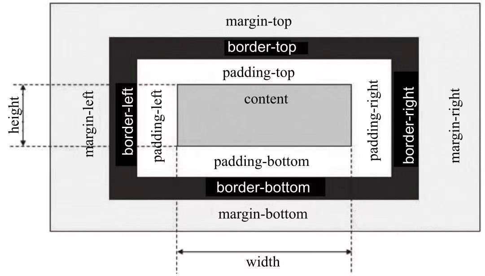

# 1. 请简单介绍盒子模型

盒子模型是CSS布局的基础；
CSS将页面汇总所有的元素的都设置为一个个矩形的盒子。元素设置为矩形的盒子后，对页面的布局就变成了将不同的盒子摆放到不同的位置；

- Content：内容区域
- Padding：内边距
- Border：边框
- Margin：外边距

**微信小程序wxss完全遵守W3C盒子模型规范**

> W3C width = `content width`
> IE width = `content width + padding + border`

# 2. Css定位的类型有？区别是

- `static`： static是position的默认值。块级元素生成一个矩形框，作为文档流的一部分，行内元素则会创建一个或多个行框，置于其父元素中。
- `relative`：元素框偏移某个距离。元素仍保持其未定位前的形状，它原本所占的空间仍保留。
- `absolute`：元素框从文档流中完全删除，并相对于其包含块定位，包含块可能是文档中的另一个元素或者是初始包含块。对于absolute来说，包含块是离当前元素最近的position为absolute或relative的父元素，如果父元素中没有任何absolute或relative布局的元素，那么包含块就是根元素。使用position布局后，元素原先在正常文档流中所占用的空间会关闭，就好像该元素原来不存在一样。元素定位后生成一个块级框，不论原来它在正常流中生成何种类型的框。
- `fixed`：元素框的表现类似于将position设置为absolute，不过其包含块是视窗本身。
- `sticky`：可以被认为是相对定位和固定定位的混合。元素在跨越特定阈值前为相对定位，之后为固定定位。#one { position: sticky; top: 10px; } 在 viewport 视口滚动到元素 top 距离小于 10px之前，元素为相对定位。之后，元素将固定在与顶部距离 10px 的位置，直到 viewport 视口回滚到阈值以下。

## static 定位

HTML 元素的默认值，即没有定位，遵循正常的文档流对象。

静态定位的元素不会受到 top, bottom, left, right影响。

## fixed 定位

元素的位置相对于浏览器窗口是固定位置。

即使窗口是滚动的它也不会移动：

## relative 定位

相对定位元素的定位是相对其正常位置。

移动相对定位元素，但它原本所占的空间不会改变。相对定位元素经常被用来作为绝对定位元素的容器块。

## absolute 定位

绝对定位的元素的位置相对于最近的已定位父元素，如果元素没有已定位的父元素，那么它的位置相对于`<html>`

absolute 定位使元素的位置与文档流无关，因此不占据空间。

absolute 定位的元素和其他元素重叠。

## sticky 定位

sticky 英文字面意思是粘，粘贴，所以可以把它称之为粘性定位。

`position: sticky` 基于用户的滚动位置来定位。

粘性定位的元素是依赖于用户的滚动，在 `position:relative`与 `position:fixed` 定位之间切换。

它的行为就像 `position:relative` 而当页面滚动超出目标区域时，它的表现就像 `position:fixed`，它会固定在目标位置。

元素定位表现为在跨越特定阈值前为相对定位，之后为固定定位。

这个特定阈值指的是 top, right, bottom 或 left 之一，换言之，指定 top, right, bottom 或 left 四个阈值其中之一，才可使粘性定位生效。否则其行为与相对定位相同。

## 3. 小程序的组件主要分为几类?分别包括哪些组件?

## 视图容器

没有任何语义和功能，仅作为容器元素存在

**\<view/\>,\<scroll-view\>, \<swiper/\>**

>在HTML中大部分标签内部能嵌套任何标签，如`
`、``、`<section/>`、`
`等，但是在小程序中，大部分组件都有它自己特殊的功能和意义，内部也只能嵌套指定的组件，而**容器组件内部能嵌套任何标签，容器组件是构建布局的基础组件**。

### view/

`<view/>`是一个块级容器组件，没有特殊功能，主要用于布局展示

> hover：是否启动点击态，默认值为false。
> hover-class：指定按下去的样式。当hover-class="none"时，没有点击态效果，默认值为none。
> hover-start-time：按住后多久出现点击态，单位毫秒，默认值为50。
> hover-stay-time：手指松开后点击态保留时间，单位毫秒，默认值为400。

### scroll-view

`<scroll-view/>`在`<view/>`基础上增加了滚动相关属性，通过设置这些属性，我们能响应滚动相关事件。目前，有些组件不能在`<scroll-view/>`中使用：`<textarea/>`、`<video/>`、`<map/>`、`<convas/>`。

> scroll-x：允许横向滚动，默认为false。
> scroll-y：允许纵向滚动，默认为false。
> upper-threshold：距顶部/左边多远时（单位px），触发scrolltoupper事件，默认值为50。
> lower-threshold：距底部/右边多远时（单位px），触发scrolltolower事件，默认值为50。
> scroll-top：设置竖向滚动条位置。
> scroll-left：设置横向滚动条位置。
> scroll-into-view：值应为某子元素id，滚动到该元素时，元素顶部对齐滚动区域顶部。
> bindscrolltoupper：滚动到顶部/左边，会触发scrolltoupper事件。
> bindscrolltolower：滚动到底部/右边，会触发scrolltolower事件。
> bindscroll：滚动时触发，event.detail = {scrollLeft, scrollTop, scrollHeight, scrollWidth, deltaX, deltaY}。

### swpier

`<swiper/>` ，利用它我们可以实现轮播图、滑动页面、图片预览等效果。滑块视图组件由\<swiper/\>和`<swiper-item/>`两个标签组成，一个`<swiper/>`中只能放置一个或多个`<swiper-item/>`，**放置其他节点会被删除**，`<swiper-item/>`内部能放置任何组件，默认宽高自动设置为100%。

> <swiper-item/>组件作为容器没有任何特殊属性， 
> <swiper/>组件属性如下：
> indicator-dots：是否显示面板指示点，默认为false。
> autoplay：是否自动切换，默认为false。
> current：当前所在页面的index，默认为0。
> interval：自动切换时间间隔，默认为5000。
> duration：滑动动画时长，默认为1000。
> circular：是否采用衔接滑动，默认值为false。
> bindchange:current改变时会触发change事件，event.detail = {current: current}。

## 基础组件

### ICON

`<icon/>`是页面中非常常用的组件，它通常用于表示状态，起到引导作用。
在`<icon/>`中，官方为大家提供了一套符合微信设计规范的样式类型

> type:icon的类型。有效值包括：success、success_no_circle、info、warn、waiting、cancel、download、search、clear。
> size:icon的大小，单位px。默认值为23px。
> color:icon的颜色，同CSS的color。

### TEXT

`<text/>`组件主要用于文本内容的展示，只有`<text/>`节点内部的内容能被长按选中，文本中的内容支持转义字符“\”，常用的转义字符可以参考网络资料。可以嵌套`<text/>`.

### PROCESS

`<progress/>`用于显示进度状态，比如资源加载、用户资料完成度、媒体资源播放进度等。

> percent：当前进度占所有进度的百分比，取值区间为0到100。
> show-info：是否在进度条右侧显示百分比，默认为false。
> stroke-width：进度条线的宽度，单位px，默认值为6。
> color：进度条颜色，默认值为#09BB07。
> active：渲染时是否开启进度条从左到右的动画，默认值为false。开启后每次修改percent触发进度条重新渲染，都会从左到右显示动画。

## 表单组件

### RADIO

小程序中单选框是由`<radio-group/>`和`<radio/>`两个组件组合而成。
在同一组单选项中的`<radio/>`是互斥的，当一个按钮被选中，之前选中的按钮就变为非选中。
小程序中`<radio/>`不能单独使用，同一组`<radio/>`需要包含在一个`<radio-group/>`中，这样才能形成一组单项选择按钮，`<radio/>`的选中态不能直接获取，需要通过`<radio-group/>`的change事件进行获取。
`<radio/>`是`<radio-group/>`中的一个单选按钮，具有以下属性：

> value： \<radio/\>标识。当该\<radio/\>选中时，\<radio-group/\>的change事件会携带\<radio/\>的value。
> checked：当前\<radio/\>是否选中，一个\<radio-group/\>中只能有一个\<radio/\>的checked为true，如果设置多个，将默认选中最后一个为true的单选项，默认为false。
> disabled：是否禁用，禁用后不能点击，默认为false。
> color： radio的颜色，同CSS的color。

### CHECKBOX

小程序中的复选是由`<checkbox-group/>`和`<checkbox/>`两个组件组合而成。一个包含多个`<checkbox/>`的`<checkbox-group/>`表示一组多选项，一组多选项允许在待选项中选中一项以上的选项。
`<checkbox-group/>`用于包裹`<checkbox/>`，仅有一个属性bindchange：绑定`<checkbox-group/>`change事件，`<checkbox-group/>`中的选中项发生变化时触发change事件。
`<checkbox/>`是`<checkbox-group/>`中的一个多选项目，它的属性有：

> value:`<checkbox/>`标识，选中时触发`<checkbox-group/>`的change事件，并携带`<checkbox/>`的value。
> checked：当前`<checkbox/>`是否选中，可用来设置默认值，一个`<checkbox-group/>`允许一个或多个`<checkbox/>`的checked为true，默认为false。
> disabled：是否禁用，禁用后不能点击，默认为false。

### SWITCH

switch组件`<switch/>`是一个可以在两种状态切换的开关选择器:

> checked：是否选中，默认为false。
> type:<switch/>的UI样式，有效值为switch、checkbox，默认为switch。
> bindchange:checked改变时触发change事件

### LABEL

`<radio/>`和`<checkbox/>`案例中，点击文案时不能选中对应的单选框或复选框，这时我们可以利用`<label/>`改进表单组件的可用性，通过绑定for属性让用户点击`<label/>`时触发对应的控件；
小程序中<label/>的触发规则有两种：

- 将控件放在标签内。当用户点击时触发`<label/>`中第一个控件。
- 设置`<label/>`的for属性。当用户点击时触发for属性对应的控件。for属性优先级高于内部控件。

### SLIDER

`<slider/>`组件滑动选择器是一种在移动端常用的交互组件，滑动选择器一般有水平和垂直两种，小程序中只提供了水平的形式，滑动到最左边是最小值，滑动到右边是最大值。

> min：最小值，默认值为0。
> max：最大值，默认值为100。
> step：步长，取值必须大于0，并且可被（max-min）整除，默认值为1。
> disabled：是否禁用，默认值为false。
> value：当前取值，默认值为0。value值应该在max和min的区间范围内，设置后滑块会滚动到对应位置。
> color：背景条的颜色，默认值为#e9e9e9。
> selected-color：已选择的颜色，默认值为#laad19。
> show-value：是否在右侧显示当前value。
> bindchange：完成一次拖动后触发的事件，event.detail = { value: value }。

### PICKER

`<picker/>`可以在**屏幕底部**弹出一个窗口，供用户在所提供的选择项中选择一个。`<picker/>`本身不会向用户呈现任何特殊效果，像`<checkbox-group/>`一样用于包裹其他组件，点击`<picker/>`包裹内的元素时会从底部弹出相应选项。
`<picker/>`分为3种类型：普通选择器、时间选择器和日期选择器，默认是普通选择器，这三种选择器在细节上略有不同，我们可以通过设置`<picker/>`组件mode属性值切换不同选择器。

> 普通选择器普通选择器是默认的滚动选择器，我们只需要绑定数组类型的数据就能直接使用，对应的mode属性值为selector：
>
> range：底部弹出选项的数组，默认值为一个空数组[]。只有当<picker/>的mode为selector时，range属性才有效。
> rang-key：当range是一个Object Array时，通过rang-key来指定Object中key的值作为选择器显示内容。
> value:mode为selector时，value值是数字，表示选择了range中的第几个，从0开始。
> bindchange:value改变时触发change事件，event.detail={value:value}。
> disabled：是否禁用，默认值为false。

### TIME PICKER

时间选择器在普通选择器基础上，`<picker/>`提供了时间选择器，对应的mode属性值为time：

> value：表示选中的时间，字符串格式为“hh:mm”，默认为空。
> start：表示有效时间范围的开始，字符串格式为“hh:mm”，默认值为空。
> end：表示有效时间范围的结束，字符串格式事为“hh:mm”，默认值为空。
> bindchange:value改变时触发change事件，event.detail={value:value}。
> disabled：是否禁用，默认值为false。

### DATA PICKER

期选择器对应的mode属性为date，属性如下：

> value：表示选中的日期，字符串格式为“yyyy-MM-dd”，默认值为0。
> start：表示有效日期范围的开始，字符串格式为“yyyy-MM-dd”。
> end：表示有效日期范围的结束，字符串格式为“yyyy-MM-dd”。
> fields：表示选择器的粒度，有效值为year、month、day，默认值为day。
> bindchange:value改变时触发change事件，event.detail={value:value}。
> disabled：是否禁用，默认值为false。

### PICKER-VIEW

`<picker/>`一共提供了3类选择器，这3类选中器在模式、交互上都比较固定，而在业务场景中我们可能会涉及多种形态选择器，针对这种情况，小程序提供了`<picker-view/>`用于实现自定义滚动选择器;
一个完整的`<picker-view/>`包含两个标签：`<picker-view/>`和`<picker-view-column/>`, `<picker-view-column/>`用于创建列，列中孩子节点高度会自动设置为`<picker-view/>`的选中框高度，`<picker-view/>`中仅可放置`<picker-view-column/>`，放置其他节点不会显示。

> `<picker-view/>`属性如下：
> value：数组类型，数组中的数字依次表示`<picker-view/>`内的`<picker-view-colume/>`选择的第几项（下标从0开始），数字大于`<picker-view-column/>`可选项长度时，选择最后一项。
> indicator-style：设置选择器中间选中框的样式。
> bingchange：当滚动选择，value改变时触发change事件，event.detail = {value:value}; value为数组，表示picker-view内的picker-view-column当前选择的是第几项（下标从0开始）。

### INPUT

`<input/>`是单行输入框，用于收集用户信息。根据不同的type属性值，输入字段拥有很多形式，与HTML不同的是小程序中的`<input/>`类型没有按钮类型，都是与输入相关的类型：

> value：输入框的初始内容。
> type:input的类型，有效值为：text、number、idcard、digit、time、date。
> password：是否显示密码类型，默认为false。
> placeholder：输入框为空时的占位符。
> placeholder-style：指定placeholder的样式。
> placeholder-class：指定placeholder的样式类，默认值为input-placeholder。
> disabled：是否禁用，默认为false。
> maxlength：最大输入长度，设置为0的时候不限制最大长度，默认值为140。
> cursor-spacing：指定光标与键盘的距离，单位px。取input距离底部的距离和cursor-spacing指定的距离的最小值作为光标与键盘的距离。
> auto-focus：自动聚焦，拉起键盘（开发工具暂不支持）。页面中只能有一个<input/>或<textarea/>设置auto-focus属性。
> focus：获取焦点（开发工具暂不支持），默认为false。
> bindinput：当键盘输入时，触发input事件，event.detail = {value: value}，处理函数可以直接return一个字符串，将替换输入框的内容。
> bindfocus：输入框聚焦时触发，event.detail={value:value}。
> bindblur：输入框失去焦点时触发，event.detail={value:value}。
> bindconfirm：点击完成按钮时触发，event.detail={value: value}。

### TEXTAREA

`<textarea/>`是多行输入框，与HTML中多行输入框不一样的是，小程序中`<textarea/>`是一个自闭合标签，它的值需要赋值给value属性，而不是被标签包裹。

> value：输入框的初始内容。
> placeholder：输入框为空时的占位符。
> placeholder-style：指定placeholder的样式。
> placeholder-class：指定placeholder的样式类，默认值为textarea-placeholder。
> disabled：是否禁用，默认为false。
> maxlength：最大输入长度，设置为0的时候不限制最大长度，默认值为140。
> auto-focus：自动聚焦，拉起键盘（开发工具暂不支持）。页面中只能有一个<input/>或<textarea/>设置auto-focus属性。
> focus：获取焦点（开发工具暂不支持），默认为false。
> auto-height：是否自动增高，设置auto-height时，style.height不生效，初始状态默认为一行高度。
> fixed：如果textarea是在一个position:fixed的区域，需要显示指定属性fixed为true，默认值为false。
> cursor-spacing：指定光标与键盘的距离，单位px。取textarea距离底部的距离和cursor-spacing指定的距离的最小值作为光标与键盘的距离。默认值为0.
> bindinput：当键盘输入时，触发input事件，event.detail = {value: value}, bindinput处理函数的返回值并不会反映到textarea上。
> bindinput：除了date/time类型外的输入框，当键盘输入时，触发input事件，event.detail={value:value, cursor：光标位置}，处理函数可以直接return一个字符串，替换输入框的内容。□bindfocus：输入框聚焦时触发，event.detail={value:value}。□bindblur：输入框失去焦点时触发，event.detail={value:value}。
> bindlinechange：输入框行数变化时调用，首次渲染时也会触发，event.detail = {height:0, heightRpx:0, lineCount:0 };
> bindconfirm：点击完成时，触发confirm事件，event.detail={value: value}。

### BUTTON

`<button/>`组件按钮除了在应用中提供交互功能，按钮的颜色也承载了应用的引导作用，通常在一个程序中一个按钮至少有3种状态：默认点击（default）、建议点击（primary）、谨慎点击（warn）。

> 当`<button/>`被`<form/>`包裹时，可以通过设置form-type属性触发表单对应的事件:
> size：表示按钮的大小，有效值为default、mini，默认值为default。
> type：按钮的样式类型，有效值为primary、default、warn，默认值为default。
> plain：按钮是否镂空，背景色透明，默认值为false。
> disabled：是否禁用，默认值是false。
> loading：名称前是否带loading图标，默认值为false。通常在表单提交过程中或者按钮点击后等待反馈时，就需要打开loading让户有感知。
> form-type：用于`<form/>`组件，有效值为submit、reset，点击一个位于`<form/>`中且设置了form-type的`<button/>`时，会触发`<form/>`的submit事件或reset事件。
> hover-class：指定按钮按下去的样式类。当hover-class="none"时，没有点击态效果，默认值为button-hover。button-hover的默认样式为{ background-color: rgba(0, 0, 0, 0.1); opacity: 0.7 }，如果想进行系统级修改可以直接覆盖这个样式。
> hover-start-time：按住后多久出现点击态，单位毫秒，默认值50。
> hover-stay-time：手指松开后点击态保留时间，单位毫秒，默认值400。button大部分属性都和样式有关，一些属性外的特殊样式大家也可以通过设置wxss来实现。

### FORM

<form/>是本章最后一个也是本章最关键的一个组件，它用于嵌套本章其他组件，使之形成表单。

> 当触发`<form/>`submit方法时，`<form/>`能将组件内用户输入的`<switch/>`、`<input/>`、`<checkbox/>`、`<slider/>`、`<radio/>`、`<picker/>`数据按组件name属性进行组装，作为参数传递给submit方法。通过这种方式，我们可以利用`<form/>`很方便地获取表单数据同后台进行交互。
> report-submit：是否返回formId, formId用于发送模板消息，默认值为false。
> bindsubmit：携带form中的数据触发的submit事件，与`<button/>`的form-type属性配合使用，event.detail={value: {'name': 'value'}, formId : ‘’}。
> bindreset：表单重置时触发reset事件，与`<button/>`的form-type属性配合使用。

## 导航组件

### NAVIGATOR

`<navigator/>`是小程序中的页面链接，其作用和HTML中超链接标签一样，主要控制页面的跳转。

> url：应用内跳转链接。链接地址为需要跳转页面的相对地址。
> redirect：跳转行为是否为重定向，如果为true，则跳转时会关闭当前页面。默认值为false。
> open-type：可选值‘navigate'、'redirect'、'switchTab'，对应于wx.navigateTo、wx.redirect-To、wx.switchTab的功能，默认值为navigate。
> hover-class：点击时的样式类，当hover-class="none"时，没有点击效果。默认值为navigator-hover。navigator-hover默认为{background-color:rgba(0, 0, 0, 0.1); opacity: 0.7; }

## 媒体组件

### IMAGE

image一个应用中图片是必不可少的。小程序中的`<image/>`除了可以显示图片外，还提供了图片的裁剪、缩放模式属性，这大大丰富了`<image/>`的显示能力。`<image/>`默认宽度为300px，默认高度为225px：

> src：图片资源地址。可以是网络地址，也可以是本地图片的相对地址。
> mode：图片的裁剪、缩放模式。默认值为“scaleToFill”。
> binderror：当错误发生时，发布到App Service的事件名，事件对象event.detail={errMsg : 'something wrong’ }。
> bindload：当图片载入完毕时，发布到App Service的事件名，事件对象event. detail={height:’图片高度px', width:’图片宽度px’}。
> **mode属性有一共有13种裁剪模式，其中4种是缩放模式，9种是裁剪模式。**
> **缩放模式：**
> scaleToFill：不保持纵横比缩放图片，使图片的宽高完全拉伸至填满image元素。
> aspectFit：保持纵横比缩放图片，使图片的长边能完全显示出来。也就是说，可以完整地将图片显示出来。
> aspectFill：保持纵横比缩放图片，只保证图片的短边能完全显示出来。也就是说，图片通常只在水平或垂直方向是完整的，另一个方向将会发生截取。
> widthFix：宽度不变，高度自动变化，保持原图宽高不变，这时图片原有高度样式会失效。
> **裁剪模式：**
> top：不缩放图片，只显示图片的顶部区域。
> bottom：不缩放图片，只显示图片的底部区域。
> center：不缩放图片，只显示图片的中间区域。
> left：不缩放图片，只显示图片的左边区域。
> right：不缩放图片，只显示图片的右边区域。
> top left：不缩放图片，只显示图片的左上边区域。
> top right：不缩放图片，只显示图片的右上边区域。
> bottom left：不缩放图片，只显示图片的左下边区域。
> bottom right：不缩放图片，只显示图片的右下边区域。

### AUDIO

小程序运行在页面中直接嵌入的音频组件，官方系统为其提供了一套默认的组件样式，我们也可以通过修改属性或调用API封装自己的音频UI组件，`<audio/>`属性如下：

> src：要播放音频的资源地址。可以是网络音频地址或本地音频文件相对路径。
> loop：是否循环播放，默认值为false。
> controls：是否显示默认控件，默认值为true。
> poster：默认控件上的音频封面的图片资源地址，如果controls属性值为false则poster无效。
> name：默认控件上的音频名字，如果controls属性值为false则name无效。默认值为“未知音频”。
> author：默认控件上的作者名字，如果controls属性值为false则author无效。默认值为“未知作者”。
> binderror：当发生错误时触发error事件，detail = {errMsg: MediaError.code}。MediaError.code有以下类型：
> 	MEDIA_ERR_ABORTED：获取资源被用户禁止。
> 	MEDIA_ERR_NETWORD：网络错误。
> 	MEDIA_ERR_DECODE：解码错误。
> 	MEDIA_ERR_SRC_NOT_SUPPOERTED：不合适资源。
> bindplay：当开始/继续播放时触发play事件。
> bindpause：当暂停播放时触发pause事件。
> bindtimeupdate：当播放进度改变时触发timeupdate事件，detail = {currentTime, duration}。
> bindended：当播放到末尾时触发ended事件。

### VIDEO

小程序中允许我们简单嵌入视频，和audio组件相比，它能提供的属性少了很多，只能设置视频源，监听加载错误。`<video/>`默认宽度为300px，高度为225px：

> src：要播放视频的资源地址。
> controls：是否显示默认播放控件（播放/暂停按钮、播放进度、时间），默认为true。
> danmu-list：弹幕列表。
> danmu-btn：是否显示弹幕按钮，只在初始化时有效，不能动态变更，默认为false。
> enable-danmu：是否展示弹幕，只在初始化时有效，不能动态变更，默认为false。
> autoplay：是否自动播放，默认为false。
> bindplay：当开始/继续播放时触发play事件。
> bindpuase：当暂停播放时触发pause事件。
> bindended：当播放到末尾时触发ended事件。
> bindtimeupdate：播放进度变化时触发，event.detail = {currentTime: ’当前播放时间’}。触发频率应该在250ms一次。
> objectFit：当视频大小与video容器大小不一致时，视频的表现形式。contain：包含，fill：填充，cover：覆盖，默认值为contain。

## 地图组件

### MAP

移动应用中地图是必不可。由于需要适配三端，在小程序中我们不能使用<map/>组件以外的地图插，通过地图我们可以很直观地表现出地理信息：

> latitude：中心纬度。
> longitude：中心经度。
> scale：缩放级别，默认为16。
> markers：标记点，用于在地图上显示标记的位置，不能自定义图标和样式，每个标记点属性如下：
> 	●id：标记点id, marker点击事件回调会返回此id。
> 	●latitude：纬度，浮点数，范围-90～90，必填项。
> 	●longitude：经度，浮点数，范围-180～180，必填项。
> 	●title：标注点名。
> 	●iconPath：显示的图标，项目目录下的图片路径，支持相对路径写法，必填项。
> 	●rotate：旋转角度，顺时针旋转的角度，范围0～360，默认为0.
> 	●alpha：标注的透明度，默认1，无透明。
> 	●width：标注图标宽度，默认为图片实际宽度。
> 	●height：标注图标高度，默认为图片实际高度。
> polyline：路线，指定一系列坐标点，从数组第一项连线至最后一项，数组元素属性如下：
> 	●points：经纬度数组，如：[{latitude:0, longitude:0}]，必填项。
> 	●color：线的颜色，8位十六进制表示，后两位表示alpha值，如：#000000AA。
> 	●width：线的宽度。
> 	●dottedLine：是否为虚线，默认为false。
> circles：圆，数组类型，在地图上显示圆，数组元素属性如下：
> 	●latitude：纬度，浮点数，范围-90～90，必填项。
> 	●longitude：经度，浮点数，范围-180～180必填项。
> 	●color：描边的颜色，8位十六进制表示，后两位表示alpha值，如：#000000AA。
> 	●fillColor：填充颜色，8位十六进制表示，后两位表示alpha值，如：#000000AA。
> 	●radius：半径，必填项。
> 	●strokeWidth：描边的宽度。
> controls：控件。
> 	●id：控件id，在控件点击事件回调会返回此id。
> 	●position：控件在地图的位置，控件相对地图位置，必填项，position元素属性如下：○left：距离地图的左边界多远，默认为0。○top：距离地图的上边界多远，默认为0。○width：控件宽度，默认为图片宽度。○height：控件高度，默认为图片高度。
> 	●iconPath：显示的图标，相对应用根目录路径的图片，必填项。
> 	●clickable：是否可点击，默认不可点击。
> include-points：缩放视野以包含所有给定的坐标点。
> show-location：显示带有方向的当前定位点。
> bindmarkertap：点击标记点时触发。
> bindcontroltap：点击控件时触发。
> bindregionchange：视野发生变化时触发。
> bindtap：点击地图时触发。

## 画布组件

### CANVAS

`<canvas/>`主要用于绘制图形，相当于在页面放置了一块“画布”，可以在其中进行图形绘制。<canvas/>组件是一块无色透明区域，本身并没有绘制能力，它仅仅是图形容器，需要调用相关API来完成实际的绘图任务。<canvas/>组件默认宽度300px，高度225px，同一页面中的canvas-id不能重复。

> canvas-id:canvas组件的唯一标识符。
> disable-scroll：当在canvas中移动时，禁止屏幕滚动以及下拉刷新，默认为false。
> bindtouchstart：手指触摸动作开始。
> bindtouchmove：手指触摸后移动。
> bindtouchend：手指触摸动作结束。
> bindtouchcancel：手指触摸动作被打断，如来电提醒、弹窗。
> bindlongtaop：手指长按500ms之后触发，触发了长按事件后进行移动不会触发屏幕的滚动。
> binderror：当发生错误时触发error事件，detail={errMsg: 'something wrong’}。

