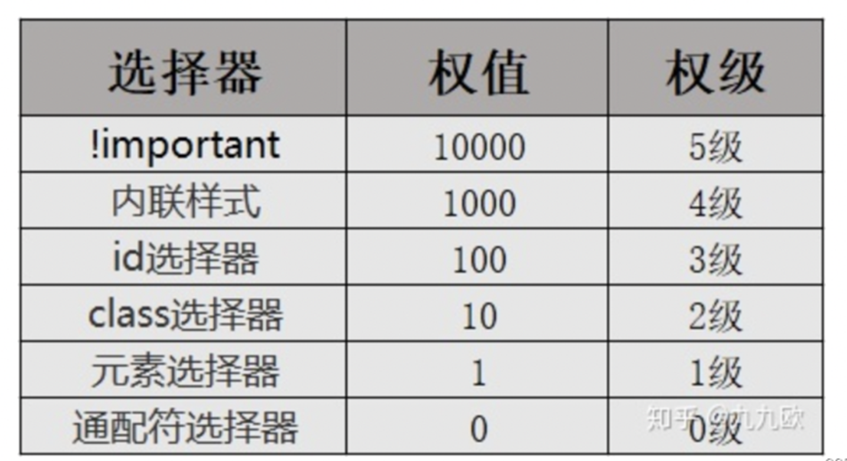

# Introduction

鲍亚运

小程序

平时作业 50%
大作业 50% (每组4-5人, 最后两节课展示)

# 第一个小程序

## 开发工具

[微信开发者工具（稳定版 Stable Build）下载地址与更新日志 | 微信开放文档 (qq.com)](https://developers.weixin.qq.com/miniprogram/dev/devtools/stable.html)

## 主界面

**小程序开发工具主界面**包括菜单栏、工具栏、模拟器、目录树、编辑区、调试器六大部分。

### **菜单栏**:

> 可以访问微信开发者工具的大部分功能：
>
> - 项目：用于新建项目或打开一个现有的项目。
> - 文件：用于新建文件、保存文件或关闭文件。
> - 编辑：用于编辑代码，对代码进行格式化。
> - 工具：用于访问一些辅助工具。
> - 界面：用于控制界面中各部分的显示和隐藏。
> - 设置：用于对外观、快捷键、编辑器等进行设置。
> - 微信开发者工具：可以进行切换账号、更换开发模式、调试等操作

### **工具栏**:

> 提供了一些常用功能的快捷按钮：
>
> - 个人中心：位于工具栏最左侧第1个按钮，显示当前登录用户头像。
> - 模拟器、编辑器和调试器：用于控制相应工具的显示和隐藏。
> - 云开发：开发者可以使用云开发来开发小程序、小游戏。云开发能力从基础库2.2.3开始支持。
> - 模式切换下拉菜单：用于在小程序模式搜索动态页和插件模式之间切换。
> - 编译下拉菜单：用于切换编译模式，默认为普通编译。
> - 编译：编写小程序的代码后，需要编译才能运行。
> - 预览：单击预览按钮会生成一个二维码，使用手机中的微信扫描二维码。
> - 真机调试：通过网络连接对手机上运行的小程序进行调试。
> - 切后台：用于模拟小程序在手机中切后台的效果。
> - 清缓存：用于清除数据缓存、文件缓存等。
> - 上传：用于将代码上传到小程序管理后台。
> - 版本管理：用于通过Git对小程序进行版本管理。

### **模拟器**:

> 模拟器用于模拟手机环境，查看不同型号手机的运行效果

### **目录树**:

> 可以查看文件目录结构

### **编辑区**:

> 可以编辑文件代码

### **调试器**:

> 调试器类似于Google Chrome浏览器中的开发者工具：
>
> - Console：控制台面板，用于输出调试信息，也可以直接编写代码执行。
> - Sources：源代码面板，可以查看或编辑源代码，并支持代码调试。
> - Network：网络面板，记录网络请求信息，根据它可进行网络性能优化。
> - Security：安全面板，用于调试页面的安全和认证等信息，如HTTpS。
> - AppData：App数据面板，可以查看或编辑当前小程序运行时的数据。
> - Audits：审计面板，用于对小程序进行体验评分。
> - Sensor：传感器面板，用于模拟地理位置、重力感应。 
> - Storage：存储面板，用于查看和管理本地数据缓存。
> - Trace：跟踪面板，用于真机调试时跟踪调试信息。
> - Wxml：Wxml面板，用于查看和调试WXML和WXSS。

## 小程序文件类型

文件类型主要有: 
 **\*.json**：配置文件 

> 主要用于配置小程序的全局配置和页面配置等，如小程序的窗口背景色、页面路径等。

 **\*.wxml**: 模板文件 

> 用于描述小程序的界面结构，包括布局、组件、数据绑定等。

**\*.wxss**：样式文件 

> 用于描述小程序的样式，包括字体、颜色、布局等。

**\*.ts/\*.js**：逻辑文件 

> 用于处理小程序的业务逻辑、事件处理等，包括数据处理、网络请求等。

| **路径**               | **说明**                       |
| ---------------------- | ------------------------------ |
| project.config.json    | 项目配置文件                   |
| app.js                 | 应用程序的逻辑文件             |
| app.json               | 应用程序的配置文件             |
| app.wxss               | 应用程序公共样式文件           |
| pages/                 | 存放页面文件目录               |
| pages/index/           | 存放index页面的目录            |
| pages/index/index.ts   | Index页面的逻辑文件            |
| pages/index/index.json | Index页面的配置文件            |
| pages/index/index.wxml | Index页面的结构文件            |
| pages/index/index.wxss | Index页面的样式文件            |
| pages/logs/            | 存放logs页面的目录             |
| pages/logs/logs.ts     | logs页面的逻辑文件             |
| pages/logs/logs.json   | logs页面的配置文件             |
| pages/logs/logs.wxml   | logs页面的结构文件             |
| pages/logs/logs.wxss   | logs页面的样式文件             |
| utils/                 | 存放公共脚本文件的目录         |
| utils/utils.js         | 公共脚本文件，保存一些工具代码 |

# 开发基础

## 页面组件

| **标签** | **功能** | **标签**   | **功能** |
| -------- | -------- | ---------- | -------- |
| <view>   | 视图容器 | <icon>     | 图标文件 |
| <text>   | 文本域   | <checkbox> | 复选框   |
| <button> | 按钮     | <radio>    | 单选框   |
| <image>  | 图片     | <input>    | 输入框   |
| <form>   | 表单     | <progress> | 进度条   |

## 页面样式

### 选择器

| **选择器**        | **示例**     | **说明**                        |
| ----------------- | ------------ | ------------------------------- |
| .class            | .container   | 选择所有class="container"的组件 |
| #id               | #id          | 选择id="#id"的组件              |
| element           | view         | 选择所有view组件                |
| element,  element | view,  text  | 选择所有view组件和所有text组件  |
| ::after           | view::after  | 在view组件内的后面插入内容      |
| ::before          | view::before | 在view组件内的前面插入内容      |

### px和rpx

px-物理像素：指屏幕上实际有多少个像素。

rpx-逻辑像素：是指CSS中使用的像素单位。