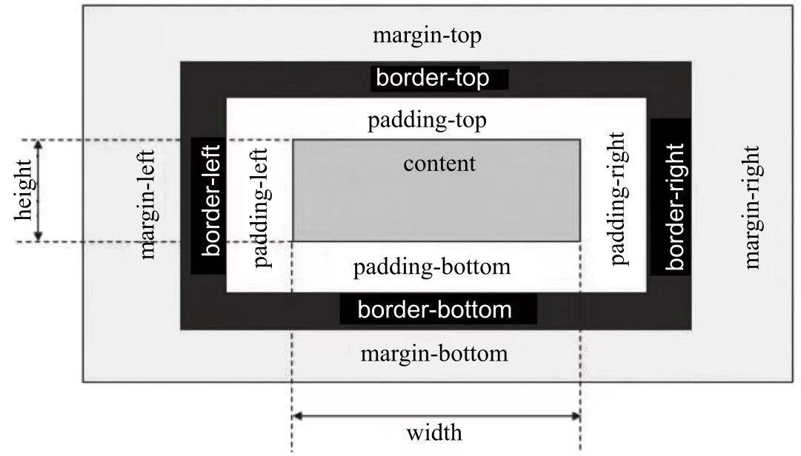
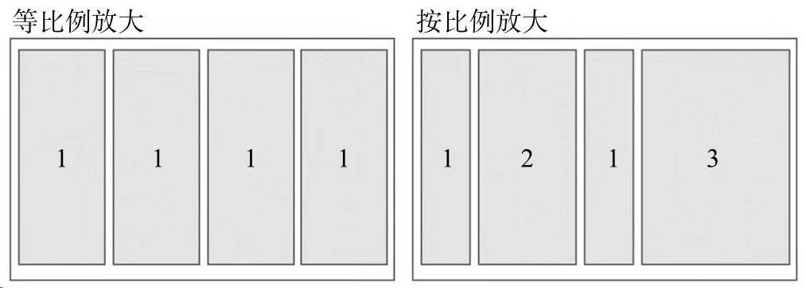

[TOC]

# Introduction

鲍亚运

小程序

平时作业 50%
大作业 50% (每组4-5人, 最后两节课展示)

# 第一个小程序

## 开发工具

[微信开发者工具（稳定版 Stable Build）下载地址与更新日志 | 微信开放文档 (qq.com)](https://developers.weixin.qq.com/miniprogram/dev/devtools/stable.html)

## 主界面

**小程序开发工具主界面**包括菜单栏、工具栏、模拟器、目录树、编辑区、调试器六大部分。

### **菜单栏**:

> 可以访问微信开发者工具的大部分功能：
>
> - 项目：用于新建项目或打开一个现有的项目。
> - 文件：用于新建文件、保存文件或关闭文件。
> - 编辑：用于编辑代码，对代码进行格式化。
> - 工具：用于访问一些辅助工具。
> - 界面：用于控制界面中各部分的显示和隐藏。
> - 设置：用于对外观、快捷键、编辑器等进行设置。
> - 微信开发者工具：可以进行切换账号、更换开发模式、调试等操作

### **工具栏**:

> 提供了一些常用功能的快捷按钮：
>
> - 个人中心：位于工具栏最左侧第1个按钮，显示当前登录用户头像。
> - 模拟器、编辑器和调试器：用于控制相应工具的显示和隐藏。
> - 云开发：开发者可以使用云开发来开发小程序、小游戏。云开发能力从基础库2.2.3开始支持。
> - 模式切换下拉菜单：用于在小程序模式搜索动态页和插件模式之间切换。
> - 编译下拉菜单：用于切换编译模式，默认为普通编译。
> - 编译：编写小程序的代码后，需要编译才能运行。
> - 预览：单击预览按钮会生成一个二维码，使用手机中的微信扫描二维码。
> - 真机调试：通过网络连接对手机上运行的小程序进行调试。
> - 切后台：用于模拟小程序在手机中切后台的效果。
> - 清缓存：用于清除数据缓存、文件缓存等。
> - 上传：用于将代码上传到小程序管理后台。
> - 版本管理：用于通过Git对小程序进行版本管理。

### **模拟器**:

> 模拟器用于模拟手机环境，查看不同型号手机的运行效果

### **目录树**:

> 可以查看文件目录结构

### **编辑区**:

> 可以编辑文件代码

### **调试器**:

> 调试器类似于Google Chrome浏览器中的开发者工具：
>
> - Console：控制台面板，用于输出调试信息，也可以直接编写代码执行。
> - Sources：源代码面板，可以查看或编辑源代码，并支持代码调试。
> - Network：网络面板，记录网络请求信息，根据它可进行网络性能优化。
> - Security：安全面板，用于调试页面的安全和认证等信息，如HTTpS。
> - AppData：App数据面板，可以查看或编辑当前小程序运行时的数据。
> - Audits：审计面板，用于对小程序进行体验评分。
> - Sensor：传感器面板，用于模拟地理位置、重力感应。 
> - Storage：存储面板，用于查看和管理本地数据缓存。
> - Trace：跟踪面板，用于真机调试时跟踪调试信息。
> - Wxml：Wxml面板，用于查看和调试WXML和WXSS。

## 小程序文件类型

文件类型主要有: 
 **\*.json**：配置文件 

> 主要用于配置小程序的全局配置和页面配置等，如小程序的窗口背景色、页面路径等。

 **\*.wxml**: 模板文件 

> 用于描述小程序的界面结构，包括布局、组件、数据绑定等。

**\*.wxss**：样式文件 

> 用于描述小程序的样式，包括字体、颜色、布局等。

**\*.ts/\*.js**：逻辑文件 

> 用于处理小程序的业务逻辑、事件处理等，包括数据处理、网络请求等。


| **路径**               | **说明**                       |
| ---------------------- | ------------------------------ |
| project.config.json    | 项目配置文件                   |
| app.js                 | 应用程序的逻辑文件             |
| app.json               | 应用程序的配置文件             |
| app.wxss               | 应用程序公共样式文件           |
| pages/                 | 存放页面文件目录               |
| pages/index/           | 存放index页面的目录            |
| pages/index/index.ts   | Index页面的逻辑文件            |
| pages/index/index.json | Index页面的配置文件            |
| pages/index/index.wxml | Index页面的结构文件            |
| pages/index/index.wxss | Index页面的样式文件            |
| pages/logs/            | 存放logs页面的目录             |
| pages/logs/logs.ts     | logs页面的逻辑文件             |
| pages/logs/logs.json   | logs页面的配置文件             |
| pages/logs/logs.wxml   | logs页面的结构文件             |
| pages/logs/logs.wxss   | logs页面的样式文件             |
| utils/                 | 存放公共脚本文件的目录         |
| utils/utils.js         | 公共脚本文件，保存一些工具代码 |

# 开发基础

## 页面组件

| **标签** | **功能** | **标签**   | **功能** |
| -------- | -------- | ---------- | -------- |
| <view>   | 视图容器 | <icon>     | 图标文件 |
| <text>   | 文本域   | <checkbox> | 复选框   |
| <button> | 按钮     | <radio>    | 单选框   |
| <image>  | 图片     | <input>    | 输入框   |
| <form>   | 表单     | <progress> | 进度条   |

## 页面样式

### 选择器

| **选择器**        | **示例**     | **说明**                        |
| ----------------- | ------------ | ------------------------------- |
| .class            | .container   | 选择所有class="container"的组件 |
| #id               | #id          | 选择id="#id"的组件              |
| element           | view         | 选择所有view组件                |
| element,  element | view,  text  | 选择所有view组件和所有text组件  |
| ::after           | view::after  | 在view组件内的后面插入内容      |
| ::before          | view::before | 在view组件内的前面插入内容      |


### px和rpx

px-物理像素：指屏幕上实际有多少个像素。

rpx-逻辑像素：是指CSS中使用的像素单位。

## 配置文件

**页面级配置文件 - index.json**

| **属性**                     | **说明**                                                   |
| ---------------------------- | ---------------------------------------------------------- |
| navigationBarBackgroundColor | 导航栏背景颜色，默认为“#000000”                            |
| navigationBarTextStyle       | 导航栏标题颜色，仅支持black、white（默认）                 |
| navigationBarTitleText       | 导航栏的标题文字内容                                       |
| backgroundColor              | 窗口的背景色，默认为“#ffffff”                              |
| backgroundTextStyle          | 下拉loading的样式，仅支持dark（默认）、light               |
| enablePullDownRefresh        | 是否全局开启下拉刷新，默认为false                          |
| onReachBottomDistance        | 页面上拉触底事件触发时距页面底部距离（单位为px），默认为50 |
| disableScroll                | 默认为false。设为true时，页面整体不能上下滚动              |

**应用级配置文件 – app.json**

| **属性**                | **说明**                                       |
| ----------------------- | ---------------------------------------------- |
| pages                   | 页面路径列表                                   |
| window                  | 全局的默认窗口表现，可以一次设置多个页面级配置 |
| tabBar                  | 底部 tab 栏的表现                              |
| networkTimeout          | 网络超时时间                                   |
| debug                   | 是否开启调试模式，默认为false                  |
| requiredBackgroundModes | 需要在后台使用的能力，如“音乐播放”             |
| plugins                 | 使用到的插件                                   |

| **属性**      | **类型** | **说明**                                          |
| ------------- | -------- | ------------------------------------------------- |
| request       | Number   | wx.request()的超时时间（毫秒），默认为60000       |
| connectSocket | Number   | wx.connectSocket()的超时时间（毫秒），默认为60000 |
| uploadFile    | Number   | wx.uploadFile()的超时时间（毫秒），默认为60000    |
| downloadFile  | Number   | wx.downloadFile()的超时时间（毫秒），默认为60000  |

## 页面逻辑

### 生命周期

微信小程序的生命周期分为两个部分：应用生命周期和页面生命周期。

1. 应用生命周期：

- onLaunch(options)：小程序初始化时触发，只执行一次，可以在此获取小程序启动时的参数。
- onShow(options)：小程序启动或从后台进入前台时触发。
- onHide()：小程序从前台进入后台时触发。
- onError(error)：小程序发生脚本错误或 API 调用失败时触发。

1. 页面生命周期：

- onLoad(options)：页面加载时触发，可以在此获取页面参数。
- onShow()：页面显示时触发。
- onReady()：页面初次渲染完成时触发。
- onHide()：页面从前台进入后台时触发。
- onUnload()：页面卸载时触发。

除了上述生命周期函数，还有一些特殊的生命周期函数，例如：

- onPullDownRefresh()：页面下拉刷新时触发。
- onReachBottom()：页面上拉触底时触发。
- onPageScroll(Object)：页面滚动时触发。

**状态模式-单向数据流。**
状态模式定义一个对象，改对象可以通过管理其状态的变化，从而实现应用程序做出相应的变化。


| **属性**      | **说明**                       |
| ------------- | ------------------------------ |
| type          | 事件类型                       |
| timeStamp     | 事件生成时间戳                 |
| target        | 触发事件的组件的一些属性值集合 |
| currentTarget | 当前组件的一些属性集合         |
| detail        | 额外的信息                     |

## 冒泡

冒泡事件是指当一个组件上的事件被触发后，事件会向父节点传递，而非冒泡事件不会向父节点传递。

生命周期回调函数的区别分析如下：
点击outer => outer – outer
点击inner => inner - outer

```html
<view bindtap="viewtap" id="outer">
  outer
  <view id="inner">inner</view>
</view>
viewtap: function(e) {
  console.log(e.target.id + '-' + e.currentTarget.id)
}
```

| **属性**    | **类型**                                                     |
| ----------- | ------------------------------------------------------------ |
| touchstart  | 手指触摸动作开始                                             |
| touchmove   | 手指触摸后移动                                               |
| touchcancel | 手指触摸动作被打断，如来电提醒，弹窗                         |
| touchend    | 手指触摸动作结束                                             |
| tap         | 手指触摸后马上离开                                           |
| longpress   | 手指触摸后，超过350ms再离开。如果指定了事件回调函数并触发了这个事件，tap事件将不被触发 |

# 布局

## 基本知识

### 盒子模型

盒子模型是CSS布局的基础；
CSS将页面汇总所有的元素的都设置为一个个矩形的盒子。元素设置为矩形的盒子后，对页面的布局就变成了将不同的盒子摆放到不同的位置；

- Content：内容区域
- Padding：内边距
- Border：边框
- Margin：外边距



**微信小程序wxss完全遵守W3C盒子模型规范**

> W3C width = `content width`
> IE width = `content width + padding + border`

### 块级元素

`display:block`
默认占一行，一般一行一个块级元素，添加新的会自动换行
一般作为容器出现，用于组织结构
宽度默认`width+marginLeft+marginRight+paddingLeft+paddingRight`刚好等于父级元素内容区宽度除非设定一个新宽度，这里需要注意，当设置块级元素宽度为100%时，如果当前块级元素存在padding、margin会导致块级元素溢出父元素。
盒子模型高度默认由内容决定。
盒子模型中高度、宽度及外边距和内边距都可控制。
可以容纳行内元素和其他块级元素。
`<view/>`是一个块级元素


### 行内元素

`display:inline`
和其他非块级元素都在一行上。
盒子模型中高度、宽度、上下margin、上下padding设置均无效，只能设置左右margin和左右padding。
宽度就是文字或图片的宽度，不可改变。
行内元素宽度、高度都不能直接设
行内元素只能容纳文本或其他行内元素，在行内元素中放置块级元素会引起不必要的混乱。
`<text/>`是一个行内元素

### 行内块元素

`display:inline-block`
行内块元素是块级元素和行内元素的混合物
行内块元素可以设置宽、高、内边距和外边距，可以简单认为行内块元素是把块级元素以行的形式展现，保留了块级元素对宽、高、内边距、外边距的设置，它就像一张图一样放在一个文本行中。


## 浮动和定位

定位的基本思想很简单，它允许你定义元素框**相对于其正常位置应该出现在哪，或者相对于父元素、另一个元素甚至浏览器窗口本身的位置**。

### 浮动(FLOAT)

`float: left/right`
通过设置float属性，浮动的框可以向左或者向右移动，直到其外边缘碰到包含框或另一个浮动框的边框为止;
floar不完全是定位，它不是正常流布局（不在文档的普通流中）。文档的普通流中的会表现的浮动框不存在一样，其他内容会环绕过去。


下图中父级元素的边框并没有包裹浮动框，这是浮动的一个特性，父级元素不计算浮动元素高度。


`float: left/right => clear`
但在某些情况下我们仍然希望在使用浮动的同时，父级元素的高度能包裹浮动元素，可以设置属性clear（清除）。确保当前元素的左边、右边或左右两边同时不能出现浮动的元素。


### 定位

`Position: static/relative/absolute/fixed/sticky`

- `static`： static是position的默认值。块级元素生成一个矩形框，作为文档流的一部分，行内元素则会创建一个或多个行框，置于其父元素中。
- `relative`：元素框偏移某个距离。元素仍保持其未定位前的形状，它原本所占的空间仍保留。
- `absolute`：元素框从文档流中完全删除，并相对于其包含块定位，包含块可能是文档中的另一个元素或者是初始包含块。对于absolute来说，包含块是离当前元素最近的position为absolute或relative的父元素，如果父元素中没有任何absolute或relative布局的元素，那么包含块就是根元素。使用position布局后，元素原先在正常文档流中所占用的空间会关闭，就好像该元素原来不存在一样。元素定位后生成一个块级框，不论原来它在正常流中生成何种类型的框。
- `fixed`：元素框的表现类似于将position设置为absolute，不过其包含块是视窗本身。
- `sticky`：可以被认为是相对定位和固定定位的混合。元素在跨越特定阈值前为相对定位，之后为固定定位。#one { position: sticky; top: 10px; } 在 viewport 视口滚动到元素 top 距离小于 10px之前，元素为相对定位。之后，元素将固定在与顶部距离 10px 的位置，直到 viewport 视口回滚到阈值以下。


## Flex布局

### 基本概念

`display:flex /inline-flex`
浮动和定位是传统布局解决方案，在一些情况中非常不方便
Flex布局主要由容器和项目构成，采用Flex布局的元素，称为Flex容器（flex container），它的直接子元素为容器成员，称为Flex项目（flex item）

### 容器属性

`flex-direction`用于指定水项目排列的方向：

- row：主轴为水平方向，起点在左端，默认值。
- row-reverse：主轴为水平方向，起点在右端。
- column：主轴为垂直方向，起点在上沿
- column-reverse：主轴为垂直方向，起点在下沿。


`flex-warp`用来指定如果一列排不下，该如何换行，默认情况下，项目都排在一条线上：

- nowrap：不换行，默认值。
- wrap：换行，第一行在上方。
- wrap-reverse：换行，第一行在下方。

当设置换行时，还需要设置`align-item`属性配合实现自动换行，并且`align-item`的值不能为“`stretch`”


`align-items`指定项目在垂直方向上如何对齐：

- flex-start：垂直方向top对齐。
- flex-end：垂直方向bottom对齐。
- center：垂直方向middle对齐。
- baseline：项目根据它们第一行文字的基线对齐。
- stretch：如果项目未设置高度或设置为auto，项目将在交叉轴方向拉伸填充整个容器，默认值。


`align-content`用来定义项目多根轴线（出现换行后）在交叉轴上的对齐方式，如果项目只有一根轴线，该属性不起作用：

- flex-start：与垂直方向的起点对齐。
- flex-end：与垂直方向的终点对齐。
- center：与垂直方向的中点对齐。
- space-between：与垂直方向两端对齐，轴线之间的间隔平均分布。
- space-around：每根轴线两侧的间隔都相等，轴线之间的间隔比轴线与边框间隔大一倍。
- stretch：轴线占满整个交叉轴，每个项目会被拉伸直至填满交叉轴，默认值


`justify-content`属性定义了项目在水平轴上的对齐方式：

- flex-start：左对齐，默认值。
- flex-end：右对齐。
- center：居中。
- space-between：两端对齐，项目之间的间隔都相等。
- space-around：每个项目两侧的间隔相等。所以，项目之间的间隔比项目与边框的间隔大一倍。


### 项目属性

`order: <integer>`项目的排列顺序，数值越小，排列越靠前，默认为0

`flex-grow: <number>`项目的放大比例，默认为0，即如果存在剩余空间，也不放大：

- 如果所有项目的flex-grow值都为1，则它们将等分剩余空间（如果有的话）。
- 如果一个项目的flex-grow属性为2，其他项目都为1，则前者占据的剩余空间将比其他项多一倍，整体按比例填充剩余空间。



`flex-shrink: <number>`项目的缩小比例

- 如果所有项目的flex-shrink属性都为1，当空间不足时，都将等比缩小。
- 如果一个项目的flex-shrink属性为0，其他项目都为1，则空间不足时，前者不缩小，负值对该属性无效


> 如一个容器宽200px，里面有4个项目，它们的宽度都为60px，那么整体宽度就是
> 4×60=240px，比容器多了40px：如果这4个项目的flex-shrink值分别为1、2、1、3，那么它们的宽度分别按比例减少
>
> - 40px × 1 / (1+2+1+4) = 5px
> - 40px × 2 / (1+2+1+4) = 10px
> - 40px × 1 /(1+2+1+4) = 5px
> - 40px × 4 / (1+2+1+4) = 20px
>
> 缩小后它们的宽度分别为：55px、50px、55px、40px。

`flex-basis: <length> | auto`用来定义伸缩项目的基准值，剩余的空间将按比例进行缩放。
它的默认值为auto，即项目的本来大小。可以设为跟width或height属性一样的固定值，如320px，这样项目将占据固定空间。

`align-self`设置单独的伸缩项目在垂直方向上的对齐方式，该属性会复写默认的对齐方式：

- auto：表示继承容器align-items属性，如果没有父元素，则等同于stretch，默认值；
- flex-start：垂直方向top对齐，
- flex-end：垂直方向bottom对齐。
- center：垂直方向middle对齐。
- baseline：项目根据它们第一行文字的基线对齐。
- stretch：如果项目未设置高度或设置为auto，项目将在交叉轴方向拉伸填充整个容器，默认值


# 组件

## 组件定义和属性

在框架基础上官方提供了一系列基础组件，开发者可通过这些基础组件进行任意组合快速开发。

组件可以通过**属性**进行配置， 属性只能用在开始标签或单个自闭合标签上，不能用于结束标签。一个组件可以对应多个属性，属性具有名称和值两部分，**组件的属性名称都是小写，以连字符“-”连接**。

组件的共同属性组件的共同属性指每个组件都有的属性，在每个组件中它们代表的意义和作用都一样，

> id：组件的唯一表示，保持整个页面唯一。
> class：组件里的样式类，在对应的WXSS中定义的样式类。
> style：组件的内联样式，可以动态设置的内联样式。使用方式同HTML标签style属性。
> hidden：组件是否显示，所有组件默认显示。
> data-\*：自定义属性，组件上触发事件时，会发送给事件处理函数。事件处理函数可以通过datascl获取。
> bind\*/catch：组件的事件，绑定逻辑层相关事件处理函数。bind为冒泡事件，catch为非冒泡事件。
>
> 除上述属性以外几乎所有组件都有自定义属性，可以对该组件的功能或样式进行修饰。

## 视图容器

没有任何语义和功能，仅作为容器元素存在

**\<view/\>,\<scroll-view\>, \<swiper/\>**

>在HTML中大部分标签内部能嵌套任何标签，如`<div/>`、`<span/>`、`<section/>`、`<p/>`等，但是在小程序中，大部分组件都有它自己特殊的功能和意义，内部也只能嵌套指定的组件，而**容器组件内部能嵌套任何标签，容器组件是构建布局的基础组件**。

### view/

`<view/>`是一个块级容器组件，没有特殊功能，主要用于布局展示

> hover：是否启动点击态，默认值为false。
> hover-class：指定按下去的样式。当hover-class="none"时，没有点击态效果，默认值为none。
> hover-start-time：按住后多久出现点击态，单位毫秒，默认值为50。
> hover-stay-time：手指松开后点击态保留时间，单位毫秒，默认值为400。

### scroll-view

`<scroll-view/>`在`<view/>`基础上增加了滚动相关属性，通过设置这些属性，我们能响应滚动相关事件。目前，有些组件不能在`<scroll-view/>`中使用：`<textarea/>`、`<video/>`、`<map/>`、`<convas/>`。

> scroll-x：允许横向滚动，默认为false。
> scroll-y：允许纵向滚动，默认为false。
> upper-threshold：距顶部/左边多远时（单位px），触发scrolltoupper事件，默认值为50。
> lower-threshold：距底部/右边多远时（单位px），触发scrolltolower事件，默认值为50。
> scroll-top：设置竖向滚动条位置。
> scroll-left：设置横向滚动条位置。
> scroll-into-view：值应为某子元素id，滚动到该元素时，元素顶部对齐滚动区域顶部。
> bindscrolltoupper：滚动到顶部/左边，会触发scrolltoupper事件。
> bindscrolltolower：滚动到底部/右边，会触发scrolltolower事件。
> bindscroll：滚动时触发，event.detail = {scrollLeft, scrollTop, scrollHeight, scrollWidth, deltaX, deltaY}。

### swpier

`<swiper/>` ，利用它我们可以实现轮播图、滑动页面、图片预览等效果。滑块视图组件由\<swiper/\>和`<swiper-item/>`两个标签组成，一个`<swiper/>`中只能放置一个或多个`<swiper-item/>`，**放置其他节点会被删除**，`<swiper-item/>`内部能放置任何组件，默认宽高自动设置为100%。

> <swiper-item/>组件作为容器没有任何特殊属性， 
> <swiper/>组件属性如下：
> indicator-dots：是否显示面板指示点，默认为false。
> autoplay：是否自动切换，默认为false。
> current：当前所在页面的index，默认为0。
> interval：自动切换时间间隔，默认为5000。
> duration：滑动动画时长，默认为1000。
> circular：是否采用衔接滑动，默认值为false。
> bindchange:current改变时会触发change事件，event.detail = {current: current}。

## 基础组件

### ICON

`<icon/>`是页面中非常常用的组件，它通常用于表示状态，起到引导作用。
在`<icon/>`中，官方为大家提供了一套符合微信设计规范的样式类型

> type:icon的类型。有效值包括：success、success_no_circle、info、warn、waiting、cancel、download、search、clear。
> size:icon的大小，单位px。默认值为23px。
> color:icon的颜色，同CSS的color。

### TEXT

`<text/>`组件主要用于文本内容的展示，只有`<text/>`节点内部的内容能被长按选中，文本中的内容支持转义字符“\”，常用的转义字符可以参考网络资料。可以嵌套`<text/>`.

### PROCESS

`<progress/>`用于显示进度状态，比如资源加载、用户资料完成度、媒体资源播放进度等。

> percent：当前进度占所有进度的百分比，取值区间为0到100。
> show-info：是否在进度条右侧显示百分比，默认为false。
> stroke-width：进度条线的宽度，单位px，默认值为6。
> color：进度条颜色，默认值为#09BB07。
> active：渲染时是否开启进度条从左到右的动画，默认值为false。开启后每次修改percent触发进度条重新渲染，都会从左到右显示动画。

## 表单组件

### RADIO

小程序中单选框是由`<radio-group/>`和`<radio/>`两个组件组合而成。
在同一组单选项中的`<radio/>`是互斥的，当一个按钮被选中，之前选中的按钮就变为非选中。
小程序中`<radio/>`不能单独使用，同一组`<radio/>`需要包含在一个`<radio-group/>`中，这样才能形成一组单项选择按钮，`<radio/>`的选中态不能直接获取，需要通过`<radio-group/>`的change事件进行获取。
`<radio/>`是`<radio-group/>`中的一个单选按钮，具有以下属性：

> value： \<radio/\>标识。当该\<radio/\>选中时，\<radio-group/\>的change事件会携带\<radio/\>的value。
> checked：当前\<radio/\>是否选中，一个\<radio-group/\>中只能有一个\<radio/\>的checked为true，如果设置多个，将默认选中最后一个为true的单选项，默认为false。
> disabled：是否禁用，禁用后不能点击，默认为false。
> color： radio的颜色，同CSS的color。

### CHECKBOX

小程序中的复选是由`<checkbox-group/>`和`<checkbox/>`两个组件组合而成。一个包含多个`<checkbox/>`的`<checkbox-group/>`表示一组多选项，一组多选项允许在待选项中选中一项以上的选项。
`<checkbox-group/>`用于包裹`<checkbox/>`，仅有一个属性bindchange：绑定`<checkbox-group/>`change事件，`<checkbox-group/>`中的选中项发生变化时触发change事件。
`<checkbox/>`是`<checkbox-group/>`中的一个多选项目，它的属性有：

> value:`<checkbox/>`标识，选中时触发`<checkbox-group/>`的change事件，并携带`<checkbox/>`的value。
> checked：当前`<checkbox/>`是否选中，可用来设置默认值，一个`<checkbox-group/>`允许一个或多个`<checkbox/>`的checked为true，默认为false。
> disabled：是否禁用，禁用后不能点击，默认为false。

### SWITCH

switch组件`<switch/>`是一个可以在两种状态切换的开关选择器:

> checked：是否选中，默认为false。
> type:<switch/>的UI样式，有效值为switch、checkbox，默认为switch。
> bindchange:checked改变时触发change事件

### LABEL

`<radio/>`和`<checkbox/>`案例中，点击文案时不能选中对应的单选框或复选框，这时我们可以利用`<label/>`改进表单组件的可用性，通过绑定for属性让用户点击`<label/>`时触发对应的控件；
小程序中<label/>的触发规则有两种：

- 将控件放在标签内。当用户点击时触发`<label/>`中第一个控件。
- 设置`<label/>`的for属性。当用户点击时触发for属性对应的控件。for属性优先级高于内部控件。

### SLIDER

`<slider/>`组件滑动选择器是一种在移动端常用的交互组件，滑动选择器一般有水平和垂直两种，小程序中只提供了水平的形式，滑动到最左边是最小值，滑动到右边是最大值。

> min：最小值，默认值为0。
> max：最大值，默认值为100。
> step：步长，取值必须大于0，并且可被（max-min）整除，默认值为1。
> disabled：是否禁用，默认值为false。
> value：当前取值，默认值为0。value值应该在max和min的区间范围内，设置后滑块会滚动到对应位置。
> color：背景条的颜色，默认值为#e9e9e9。
> selected-color：已选择的颜色，默认值为#laad19。
> show-value：是否在右侧显示当前value。
> bindchange：完成一次拖动后触发的事件，event.detail = { value: value }。

### PICKER

`<picker/>`可以在**屏幕底部**弹出一个窗口，供用户在所提供的选择项中选择一个。`<picker/>`本身不会向用户呈现任何特殊效果，像`<checkbox-group/>`一样用于包裹其他组件，点击`<picker/>`包裹内的元素时会从底部弹出相应选项。
`<picker/>`分为3种类型：普通选择器、时间选择器和日期选择器，默认是普通选择器，这三种选择器在细节上略有不同，我们可以通过设置`<picker/>`组件mode属性值切换不同选择器。

> 普通选择器普通选择器是默认的滚动选择器，我们只需要绑定数组类型的数据就能直接使用，对应的mode属性值为selector：
>
> range：底部弹出选项的数组，默认值为一个空数组[]。只有当<picker/>的mode为selector时，range属性才有效。
> rang-key：当range是一个Object Array时，通过rang-key来指定Object中key的值作为选择器显示内容。
> value:mode为selector时，value值是数字，表示选择了range中的第几个，从0开始。
> bindchange:value改变时触发change事件，event.detail={value:value}。
> disabled：是否禁用，默认值为false。

### TIME PICKER

时间选择器在普通选择器基础上，`<picker/>`提供了时间选择器，对应的mode属性值为time：

> value：表示选中的时间，字符串格式为“hh:mm”，默认为空。
> start：表示有效时间范围的开始，字符串格式为“hh:mm”，默认值为空。
> end：表示有效时间范围的结束，字符串格式事为“hh:mm”，默认值为空。
> bindchange:value改变时触发change事件，event.detail={value:value}。
> disabled：是否禁用，默认值为false。

### DATA PICKER

期选择器对应的mode属性为date，属性如下：

> value：表示选中的日期，字符串格式为“yyyy-MM-dd”，默认值为0。
> start：表示有效日期范围的开始，字符串格式为“yyyy-MM-dd”。
> end：表示有效日期范围的结束，字符串格式为“yyyy-MM-dd”。
> fields：表示选择器的粒度，有效值为year、month、day，默认值为day。
> bindchange:value改变时触发change事件，event.detail={value:value}。
> disabled：是否禁用，默认值为false。

### PICKER-VIEW

`<picker/>`一共提供了3类选择器，这3类选中器在模式、交互上都比较固定，而在业务场景中我们可能会涉及多种形态选择器，针对这种情况，小程序提供了`<picker-view/>`用于实现自定义滚动选择器;
一个完整的`<picker-view/>`包含两个标签：`<picker-view/>`和`<picker-view-column/>`, `<picker-view-column/>`用于创建列，列中孩子节点高度会自动设置为`<picker-view/>`的选中框高度，`<picker-view/>`中仅可放置`<picker-view-column/>`，放置其他节点不会显示。

> `<picker-view/>`属性如下：
> value：数组类型，数组中的数字依次表示`<picker-view/>`内的`<picker-view-colume/>`选择的第几项（下标从0开始），数字大于`<picker-view-column/>`可选项长度时，选择最后一项。
> indicator-style：设置选择器中间选中框的样式。
> bingchange：当滚动选择，value改变时触发change事件，event.detail = {value:value}; value为数组，表示picker-view内的picker-view-column当前选择的是第几项（下标从0开始）。

### INPUT

`<input/>`是单行输入框，用于收集用户信息。根据不同的type属性值，输入字段拥有很多形式，与HTML不同的是小程序中的`<input/>`类型没有按钮类型，都是与输入相关的类型：

> value：输入框的初始内容。
> type:input的类型，有效值为：text、number、idcard、digit、time、date。
> password：是否显示密码类型，默认为false。
> placeholder：输入框为空时的占位符。
> placeholder-style：指定placeholder的样式。
> placeholder-class：指定placeholder的样式类，默认值为input-placeholder。
> disabled：是否禁用，默认为false。
> maxlength：最大输入长度，设置为0的时候不限制最大长度，默认值为140。
> cursor-spacing：指定光标与键盘的距离，单位px。取input距离底部的距离和cursor-spacing指定的距离的最小值作为光标与键盘的距离。
> auto-focus：自动聚焦，拉起键盘（开发工具暂不支持）。页面中只能有一个<input/>或<textarea/>设置auto-focus属性。
> focus：获取焦点（开发工具暂不支持），默认为false。
> bindinput：当键盘输入时，触发input事件，event.detail = {value: value}，处理函数可以直接return一个字符串，将替换输入框的内容。
> bindfocus：输入框聚焦时触发，event.detail={value:value}。
> bindblur：输入框失去焦点时触发，event.detail={value:value}。
> bindconfirm：点击完成按钮时触发，event.detail={value: value}。

### TEXTAREA

`<textarea/>`是多行输入框，与HTML中多行输入框不一样的是，小程序中`<textarea/>`是一个自闭合标签，它的值需要赋值给value属性，而不是被标签包裹。

> value：输入框的初始内容。
> placeholder：输入框为空时的占位符。
> placeholder-style：指定placeholder的样式。
> placeholder-class：指定placeholder的样式类，默认值为textarea-placeholder。
> disabled：是否禁用，默认为false。
> maxlength：最大输入长度，设置为0的时候不限制最大长度，默认值为140。
> auto-focus：自动聚焦，拉起键盘（开发工具暂不支持）。页面中只能有一个<input/>或<textarea/>设置auto-focus属性。
> focus：获取焦点（开发工具暂不支持），默认为false。
> auto-height：是否自动增高，设置auto-height时，style.height不生效，初始状态默认为一行高度。
> fixed：如果textarea是在一个position:fixed的区域，需要显示指定属性fixed为true，默认值为false。
> cursor-spacing：指定光标与键盘的距离，单位px。取textarea距离底部的距离和cursor-spacing指定的距离的最小值作为光标与键盘的距离。默认值为0.
> bindinput：当键盘输入时，触发input事件，event.detail = {value: value}, bindinput处理函数的返回值并不会反映到textarea上。
> bindinput：除了date/time类型外的输入框，当键盘输入时，触发input事件，event.detail={value:value, cursor：光标位置}，处理函数可以直接return一个字符串，替换输入框的内容。□bindfocus：输入框聚焦时触发，event.detail={value:value}。□bindblur：输入框失去焦点时触发，event.detail={value:value}。
> bindlinechange：输入框行数变化时调用，首次渲染时也会触发，event.detail = {height:0, heightRpx:0, lineCount:0 };
> bindconfirm：点击完成时，触发confirm事件，event.detail={value: value}。

### BUTTON

`<button/>`组件按钮除了在应用中提供交互功能，按钮的颜色也承载了应用的引导作用，通常在一个程序中一个按钮至少有3种状态：默认点击（default）、建议点击（primary）、谨慎点击（warn）。

> 当`<button/>`被`<form/>`包裹时，可以通过设置form-type属性触发表单对应的事件:
> size：表示按钮的大小，有效值为default、mini，默认值为default。
> type：按钮的样式类型，有效值为primary、default、warn，默认值为default。
> plain：按钮是否镂空，背景色透明，默认值为false。
> disabled：是否禁用，默认值是false。
> loading：名称前是否带loading图标，默认值为false。通常在表单提交过程中或者按钮点击后等待反馈时，就需要打开loading让户有感知。
> form-type：用于`<form/>`组件，有效值为submit、reset，点击一个位于`<form/>`中且设置了form-type的`<button/>`时，会触发`<form/>`的submit事件或reset事件。
> hover-class：指定按钮按下去的样式类。当hover-class="none"时，没有点击态效果，默认值为button-hover。button-hover的默认样式为{ background-color: rgba(0, 0, 0, 0.1); opacity: 0.7 }，如果想进行系统级修改可以直接覆盖这个样式。
> hover-start-time：按住后多久出现点击态，单位毫秒，默认值50。
> hover-stay-time：手指松开后点击态保留时间，单位毫秒，默认值400。button大部分属性都和样式有关，一些属性外的特殊样式大家也可以通过设置wxss来实现。

### FORM

<form/>是本章最后一个也是本章最关键的一个组件，它用于嵌套本章其他组件，使之形成表单。
> 当触发`<form/>`submit方法时，`<form/>`能将组件内用户输入的`<switch/>`、`<input/>`、`<checkbox/>`、`<slider/>`、`<radio/>`、`<picker/>`数据按组件name属性进行组装，作为参数传递给submit方法。通过这种方式，我们可以利用`<form/>`很方便地获取表单数据同后台进行交互。
> report-submit：是否返回formId, formId用于发送模板消息，默认值为false。
> bindsubmit：携带form中的数据触发的submit事件，与`<button/>`的form-type属性配合使用，event.detail={value: {'name': 'value'}, formId : ‘’}。
> bindreset：表单重置时触发reset事件，与`<button/>`的form-type属性配合使用。

## 导航组件

### NAVIGATOR

`<navigator/>`是小程序中的页面链接，其作用和HTML中超链接标签一样，主要控制页面的跳转。

> url：应用内跳转链接。链接地址为需要跳转页面的相对地址。
> redirect：跳转行为是否为重定向，如果为true，则跳转时会关闭当前页面。默认值为false。
> open-type：可选值‘navigate'、'redirect'、'switchTab'，对应于wx.navigateTo、wx.redirect-To、wx.switchTab的功能，默认值为navigate。
> hover-class：点击时的样式类，当hover-class="none"时，没有点击效果。默认值为navigator-hover。navigator-hover默认为{background-color:rgba(0, 0, 0, 0.1); opacity: 0.7; }

## 媒体组件

### IMAGE

image一个应用中图片是必不可少的。小程序中的`<image/>`除了可以显示图片外，还提供了图片的裁剪、缩放模式属性，这大大丰富了`<image/>`的显示能力。`<image/>`默认宽度为300px，默认高度为225px：

> src：图片资源地址。可以是网络地址，也可以是本地图片的相对地址。
> mode：图片的裁剪、缩放模式。默认值为“scaleToFill”。
> binderror：当错误发生时，发布到App Service的事件名，事件对象event.detail={errMsg : 'something wrong’ }。
> bindload：当图片载入完毕时，发布到App Service的事件名，事件对象event. detail={height:’图片高度px', width:’图片宽度px’}。
> **mode属性有一共有13种裁剪模式，其中4种是缩放模式，9种是裁剪模式。**
> **缩放模式：**
> scaleToFill：不保持纵横比缩放图片，使图片的宽高完全拉伸至填满image元素。
> aspectFit：保持纵横比缩放图片，使图片的长边能完全显示出来。也就是说，可以完整地将图片显示出来。
> aspectFill：保持纵横比缩放图片，只保证图片的短边能完全显示出来。也就是说，图片通常只在水平或垂直方向是完整的，另一个方向将会发生截取。
> widthFix：宽度不变，高度自动变化，保持原图宽高不变，这时图片原有高度样式会失效。
> **裁剪模式：**
> top：不缩放图片，只显示图片的顶部区域。
> bottom：不缩放图片，只显示图片的底部区域。
> center：不缩放图片，只显示图片的中间区域。
> left：不缩放图片，只显示图片的左边区域。
> right：不缩放图片，只显示图片的右边区域。
> top left：不缩放图片，只显示图片的左上边区域。
> top right：不缩放图片，只显示图片的右上边区域。
> bottom left：不缩放图片，只显示图片的左下边区域。
> bottom right：不缩放图片，只显示图片的右下边区域。

### AUDIO

小程序运行在页面中直接嵌入的音频组件，官方系统为其提供了一套默认的组件样式，我们也可以通过修改属性或调用API封装自己的音频UI组件，`<audio/>`属性如下：

> src：要播放音频的资源地址。可以是网络音频地址或本地音频文件相对路径。
> loop：是否循环播放，默认值为false。
> controls：是否显示默认控件，默认值为true。
> poster：默认控件上的音频封面的图片资源地址，如果controls属性值为false则poster无效。
> name：默认控件上的音频名字，如果controls属性值为false则name无效。默认值为“未知音频”。
> author：默认控件上的作者名字，如果controls属性值为false则author无效。默认值为“未知作者”。
> binderror：当发生错误时触发error事件，detail = {errMsg: MediaError.code}。MediaError.code有以下类型：
> 	MEDIA_ERR_ABORTED：获取资源被用户禁止。
> 	MEDIA_ERR_NETWORD：网络错误。
> 	MEDIA_ERR_DECODE：解码错误。
> 	MEDIA_ERR_SRC_NOT_SUPPOERTED：不合适资源。
> bindplay：当开始/继续播放时触发play事件。
> bindpause：当暂停播放时触发pause事件。
> bindtimeupdate：当播放进度改变时触发timeupdate事件，detail = {currentTime, duration}。
> bindended：当播放到末尾时触发ended事件。

### VIDEO

小程序中允许我们简单嵌入视频，和audio组件相比，它能提供的属性少了很多，只能设置视频源，监听加载错误。`<video/>`默认宽度为300px，高度为225px：

> src：要播放视频的资源地址。
> controls：是否显示默认播放控件（播放/暂停按钮、播放进度、时间），默认为true。
> danmu-list：弹幕列表。
> danmu-btn：是否显示弹幕按钮，只在初始化时有效，不能动态变更，默认为false。
> enable-danmu：是否展示弹幕，只在初始化时有效，不能动态变更，默认为false。
> autoplay：是否自动播放，默认为false。
> bindplay：当开始/继续播放时触发play事件。
> bindpuase：当暂停播放时触发pause事件。
> bindended：当播放到末尾时触发ended事件。
> bindtimeupdate：播放进度变化时触发，event.detail = {currentTime: ’当前播放时间’}。触发频率应该在250ms一次。
> objectFit：当视频大小与video容器大小不一致时，视频的表现形式。contain：包含，fill：填充，cover：覆盖，默认值为contain。

## 地图组件

### MAP

移动应用中地图是必不可。由于需要适配三端，在小程序中我们不能使用<map/>组件以外的地图插，通过地图我们可以很直观地表现出地理信息：

> latitude：中心纬度。
> longitude：中心经度。
> scale：缩放级别，默认为16。
> markers：标记点，用于在地图上显示标记的位置，不能自定义图标和样式，每个标记点属性如下：
> 	●id：标记点id, marker点击事件回调会返回此id。
> 	●latitude：纬度，浮点数，范围-90～90，必填项。
> 	●longitude：经度，浮点数，范围-180～180，必填项。
> 	●title：标注点名。
> 	●iconPath：显示的图标，项目目录下的图片路径，支持相对路径写法，必填项。
> 	●rotate：旋转角度，顺时针旋转的角度，范围0～360，默认为0.
> 	●alpha：标注的透明度，默认1，无透明。
> 	●width：标注图标宽度，默认为图片实际宽度。
> 	●height：标注图标高度，默认为图片实际高度。
> polyline：路线，指定一系列坐标点，从数组第一项连线至最后一项，数组元素属性如下：
> 	●points：经纬度数组，如：[{latitude:0, longitude:0}]，必填项。
> 	●color：线的颜色，8位十六进制表示，后两位表示alpha值，如：#000000AA。
> 	●width：线的宽度。
> 	●dottedLine：是否为虚线，默认为false。
> circles：圆，数组类型，在地图上显示圆，数组元素属性如下：
> 	●latitude：纬度，浮点数，范围-90～90，必填项。
> 	●longitude：经度，浮点数，范围-180～180必填项。
> 	●color：描边的颜色，8位十六进制表示，后两位表示alpha值，如：#000000AA。
> 	●fillColor：填充颜色，8位十六进制表示，后两位表示alpha值，如：#000000AA。
> 	●radius：半径，必填项。
> 	●strokeWidth：描边的宽度。
> controls：控件。
> 	●id：控件id，在控件点击事件回调会返回此id。
> 	●position：控件在地图的位置，控件相对地图位置，必填项，position元素属性如下：○left：距离地图的左边界多远，默认为0。○top：距离地图的上边界多远，默认为0。○width：控件宽度，默认为图片宽度。○height：控件高度，默认为图片高度。
> 	●iconPath：显示的图标，相对应用根目录路径的图片，必填项。
> 	●clickable：是否可点击，默认不可点击。
> include-points：缩放视野以包含所有给定的坐标点。
> show-location：显示带有方向的当前定位点。
> bindmarkertap：点击标记点时触发。
> bindcontroltap：点击控件时触发。
> bindregionchange：视野发生变化时触发。
> bindtap：点击地图时触发。

## 画布组件

### CANVAS

`<canvas/>`主要用于绘制图形，相当于在页面放置了一块“画布”，可以在其中进行图形绘制。<canvas/>组件是一块无色透明区域，本身并没有绘制能力，它仅仅是图形容器，需要调用相关API来完成实际的绘图任务。<canvas/>组件默认宽度300px，高度225px，同一页面中的canvas-id不能重复。

> canvas-id:canvas组件的唯一标识符。
> disable-scroll：当在canvas中移动时，禁止屏幕滚动以及下拉刷新，默认为false。
> bindtouchstart：手指触摸动作开始。
> bindtouchmove：手指触摸后移动。
> bindtouchend：手指触摸动作结束。
> bindtouchcancel：手指触摸动作被打断，如来电提醒、弹窗。
> bindlongtaop：手指长按500ms之后触发，触发了长按事件后进行移动不会触发屏幕的滚动。
> binderror：当发生错误时触发error事件，detail={errMsg: 'something wrong’}。
