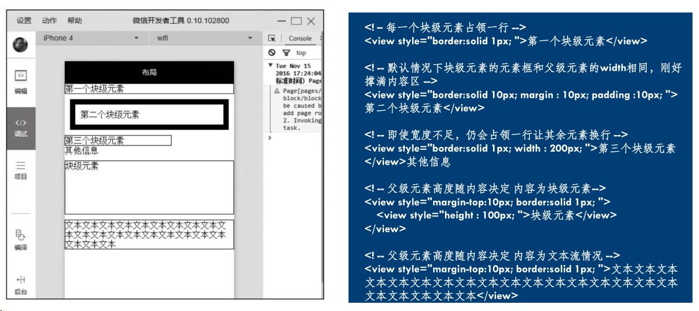
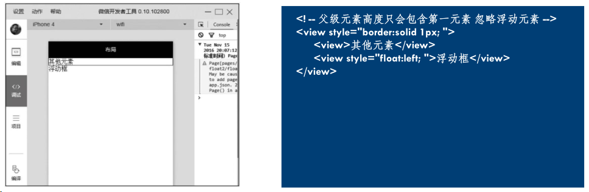

# Introduction

鲍亚运

小程序

平时作业 50%
大作业 50% (每组4-5人, 最后两节课展示)

# 第一个小程序

## 开发工具

[微信开发者工具（稳定版 Stable Build）下载地址与更新日志 | 微信开放文档 (qq.com)](https://developers.weixin.qq.com/miniprogram/dev/devtools/stable.html)

## 主界面

**小程序开发工具主界面**包括菜单栏、工具栏、模拟器、目录树、编辑区、调试器六大部分。

### **菜单栏**:

> 可以访问微信开发者工具的大部分功能：
>
> - 项目：用于新建项目或打开一个现有的项目。
> - 文件：用于新建文件、保存文件或关闭文件。
> - 编辑：用于编辑代码，对代码进行格式化。
> - 工具：用于访问一些辅助工具。
> - 界面：用于控制界面中各部分的显示和隐藏。
> - 设置：用于对外观、快捷键、编辑器等进行设置。
> - 微信开发者工具：可以进行切换账号、更换开发模式、调试等操作

### **工具栏**:

> 提供了一些常用功能的快捷按钮：
>
> - 个人中心：位于工具栏最左侧第1个按钮，显示当前登录用户头像。
> - 模拟器、编辑器和调试器：用于控制相应工具的显示和隐藏。
> - 云开发：开发者可以使用云开发来开发小程序、小游戏。云开发能力从基础库2.2.3开始支持。
> - 模式切换下拉菜单：用于在小程序模式搜索动态页和插件模式之间切换。
> - 编译下拉菜单：用于切换编译模式，默认为普通编译。
> - 编译：编写小程序的代码后，需要编译才能运行。
> - 预览：单击预览按钮会生成一个二维码，使用手机中的微信扫描二维码。
> - 真机调试：通过网络连接对手机上运行的小程序进行调试。
> - 切后台：用于模拟小程序在手机中切后台的效果。
> - 清缓存：用于清除数据缓存、文件缓存等。
> - 上传：用于将代码上传到小程序管理后台。
> - 版本管理：用于通过Git对小程序进行版本管理。

### **模拟器**:

> 模拟器用于模拟手机环境，查看不同型号手机的运行效果

### **目录树**:

> 可以查看文件目录结构

### **编辑区**:

> 可以编辑文件代码

### **调试器**:

> 调试器类似于Google Chrome浏览器中的开发者工具：
>
> - Console：控制台面板，用于输出调试信息，也可以直接编写代码执行。
> - Sources：源代码面板，可以查看或编辑源代码，并支持代码调试。
> - Network：网络面板，记录网络请求信息，根据它可进行网络性能优化。
> - Security：安全面板，用于调试页面的安全和认证等信息，如HTTpS。
> - AppData：App数据面板，可以查看或编辑当前小程序运行时的数据。
> - Audits：审计面板，用于对小程序进行体验评分。
> - Sensor：传感器面板，用于模拟地理位置、重力感应。 
> - Storage：存储面板，用于查看和管理本地数据缓存。
> - Trace：跟踪面板，用于真机调试时跟踪调试信息。
> - Wxml：Wxml面板，用于查看和调试WXML和WXSS。

## 小程序文件类型

文件类型主要有: 
 **\*.json**：配置文件 

> 主要用于配置小程序的全局配置和页面配置等，如小程序的窗口背景色、页面路径等。

 **\*.wxml**: 模板文件 

> 用于描述小程序的界面结构，包括布局、组件、数据绑定等。

**\*.wxss**：样式文件 

> 用于描述小程序的样式，包括字体、颜色、布局等。

**\*.ts/\*.js**：逻辑文件 

> 用于处理小程序的业务逻辑、事件处理等，包括数据处理、网络请求等。


| **路径**               | **说明**                       |
| ---------------------- | ------------------------------ |
| project.config.json    | 项目配置文件                   |
| app.js                 | 应用程序的逻辑文件             |
| app.json               | 应用程序的配置文件             |
| app.wxss               | 应用程序公共样式文件           |
| pages/                 | 存放页面文件目录               |
| pages/index/           | 存放index页面的目录            |
| pages/index/index.ts   | Index页面的逻辑文件            |
| pages/index/index.json | Index页面的配置文件            |
| pages/index/index.wxml | Index页面的结构文件            |
| pages/index/index.wxss | Index页面的样式文件            |
| pages/logs/            | 存放logs页面的目录             |
| pages/logs/logs.ts     | logs页面的逻辑文件             |
| pages/logs/logs.json   | logs页面的配置文件             |
| pages/logs/logs.wxml   | logs页面的结构文件             |
| pages/logs/logs.wxss   | logs页面的样式文件             |
| utils/                 | 存放公共脚本文件的目录         |
| utils/utils.js         | 公共脚本文件，保存一些工具代码 |

# 开发基础

## 页面组件

| **标签** | **功能** | **标签**   | **功能** |
| -------- | -------- | ---------- | -------- |
| <view>   | 视图容器 | <icon>     | 图标文件 |
| <text>   | 文本域   | <checkbox> | 复选框   |
| <button> | 按钮     | <radio>    | 单选框   |
| <image>  | 图片     | <input>    | 输入框   |
| <form>   | 表单     | <progress> | 进度条   |

## 页面样式

### 选择器

| **选择器**        | **示例**     | **说明**                        |
| ----------------- | ------------ | ------------------------------- |
| .class            | .container   | 选择所有class="container"的组件 |
| #id               | #id          | 选择id="#id"的组件              |
| element           | view         | 选择所有view组件                |
| element,  element | view,  text  | 选择所有view组件和所有text组件  |
| ::after           | view::after  | 在view组件内的后面插入内容      |
| ::before          | view::before | 在view组件内的前面插入内容      |


### px和rpx

px-物理像素：指屏幕上实际有多少个像素。

rpx-逻辑像素：是指CSS中使用的像素单位。

## 配置文件

**页面级配置文件 - index.json**

| **属性**                     | **说明**                                                   |
| ---------------------------- | ---------------------------------------------------------- |
| navigationBarBackgroundColor | 导航栏背景颜色，默认为“#000000”                            |
| navigationBarTextStyle       | 导航栏标题颜色，仅支持black、white（默认）                 |
| navigationBarTitleText       | 导航栏的标题文字内容                                       |
| backgroundColor              | 窗口的背景色，默认为“#ffffff”                              |
| backgroundTextStyle          | 下拉loading的样式，仅支持dark（默认）、light               |
| enablePullDownRefresh        | 是否全局开启下拉刷新，默认为false                          |
| onReachBottomDistance        | 页面上拉触底事件触发时距页面底部距离（单位为px），默认为50 |
| disableScroll                | 默认为false。设为true时，页面整体不能上下滚动              |

**应用级配置文件 – app.json**

| **属性**                | **说明**                                       |
| ----------------------- | ---------------------------------------------- |
| pages                   | 页面路径列表                                   |
| window                  | 全局的默认窗口表现，可以一次设置多个页面级配置 |
| tabBar                  | 底部 tab 栏的表现                              |
| networkTimeout          | 网络超时时间                                   |
| debug                   | 是否开启调试模式，默认为false                  |
| requiredBackgroundModes | 需要在后台使用的能力，如“音乐播放”             |
| plugins                 | 使用到的插件                                   |

| **属性**      | **类型** | **说明**                                          |
| ------------- | -------- | ------------------------------------------------- |
| request       | Number   | wx.request()的超时时间（毫秒），默认为60000       |
| connectSocket | Number   | wx.connectSocket()的超时时间（毫秒），默认为60000 |
| uploadFile    | Number   | wx.uploadFile()的超时时间（毫秒），默认为60000    |
| downloadFile  | Number   | wx.downloadFile()的超时时间（毫秒），默认为60000  |

## 页面逻辑

### 生命周期

微信小程序的生命周期分为两个部分：应用生命周期和页面生命周期。

1. 应用生命周期：

- onLaunch(options)：小程序初始化时触发，只执行一次，可以在此获取小程序启动时的参数。
- onShow(options)：小程序启动或从后台进入前台时触发。
- onHide()：小程序从前台进入后台时触发。
- onError(error)：小程序发生脚本错误或 API 调用失败时触发。

1. 页面生命周期：

- onLoad(options)：页面加载时触发，可以在此获取页面参数。
- onShow()：页面显示时触发。
- onReady()：页面初次渲染完成时触发。
- onHide()：页面从前台进入后台时触发。
- onUnload()：页面卸载时触发。

除了上述生命周期函数，还有一些特殊的生命周期函数，例如：

- onPullDownRefresh()：页面下拉刷新时触发。
- onReachBottom()：页面上拉触底时触发。
- onPageScroll(Object)：页面滚动时触发。

**状态模式-单向数据流。**
状态模式定义一个对象，改对象可以通过管理其状态的变化，从而实现应用程序做出相应的变化。


| **属性**      | **说明**                       |
| ------------- | ------------------------------ |
| type          | 事件类型                       |
| timeStamp     | 事件生成时间戳                 |
| target        | 触发事件的组件的一些属性值集合 |
| currentTarget | 当前组件的一些属性集合         |
| detail        | 额外的信息                     |

## 冒泡

冒泡事件是指当一个组件上的事件被触发后，事件会向父节点传递，而非冒泡事件不会向父节点传递。

生命周期回调函数的区别分析如下：
点击outer => outer – outer
点击inner => inner - outer

```html
<view bindtap="viewtap" id="outer">
  outer
  <view id="inner">inner</view>
</view>
viewtap: function(e) {
  console.log(e.target.id + '-' + e.currentTarget.id)
}
```

| **属性**    | **类型**                                                     |
| ----------- | ------------------------------------------------------------ |
| touchstart  | 手指触摸动作开始                                             |
| touchmove   | 手指触摸后移动                                               |
| touchcancel | 手指触摸动作被打断，如来电提醒，弹窗                         |
| touchend    | 手指触摸动作结束                                             |
| tap         | 手指触摸后马上离开                                           |
| longpress   | 手指触摸后，超过350ms再离开。如果指定了事件回调函数并触发了这个事件，tap事件将不被触发 |

# 布局

## 基本知识

### 盒子模型

盒子模型是CSS布局的基础；
CSS将页面汇总所有的元素的都设置为一个个矩形的盒子。元素设置为矩形的盒子后，对页面的布局就变成了将不同的盒子摆放到不同的位置；

- Content：内容区域
- Padding：内边距
- Border：边框
- Margin：外边距


**微信小程序wxss完全遵守W3C盒子模型规范**

> W3C width = `content width`
> IE width = `content width + padding + border`

### 块级元素

`display:block`
默认占一行，一般一行一个块级元素，添加新的会自动换行
一般作为容器出现，用于组织结构
宽度默认`width+marginLeft+marginRight+paddingLeft+paddingRight`刚好等于父级元素内容区宽度除非设定一个新宽度，这里需要注意，当设置块级元素宽度为100%时，如果当前块级元素存在padding、margin会导致块级元素溢出父元素。
盒子模型高度默认由内容决定。
盒子模型中高度、宽度及外边距和内边距都可控制。
可以容纳行内元素和其他块级元素。
`<view/>`是一个块级元素



### 行内元素

`display:inline`
和其他非块级元素都在一行上。
盒子模型中高度、宽度、上下margin、上下padding设置均无效，只能设置左右margin和左右padding。
宽度就是文字或图片的宽度，不可改变。
行内元素宽度、高度都不能直接设
行内元素只能容纳文本或其他行内元素，在行内元素中放置块级元素会引起不必要的混乱。
`<text/>`是一个行内元素

### 行内块元素

`display:inline-block`
行内块元素是块级元素和行内元素的混合物
行内块元素可以设置宽、高、内边距和外边距，可以简单认为行内块元素是把块级元素以行的形式展现，保留了块级元素对宽、高、内边距、外边距的设置，它就像一张图一样放在一个文本行中。


## 浮动和定位

定位的基本思想很简单，它允许你定义元素框**相对于其正常位置应该出现在哪，或者相对于父元素、另一个元素甚至浏览器窗口本身的位置**。

### 浮动(FLOAT)

`float: left/right`
通过设置float属性，浮动的框可以向左或者向右移动，直到其外边缘碰到包含框或另一个浮动框的边框为止;
floar不完全是定位，它不是正常流布局（不在文档的普通流中）。文档的普通流中的会表现的浮动框不存在一样，其他内容会环绕过去。


下图中父级元素的边框并没有包裹浮动框，这是浮动的一个特性，父级元素不计算浮动元素高度。



`float: left/right => clear`
但在某些情况下我们仍然希望在使用浮动的同时，父级元素的高度能包裹浮动元素，可以设置属性clear（清除）。确保当前元素的左边、右边或左右两边同时不能出现浮动的元素。


### 定位

`Position: static/relative/absolute/fixed/sticky`

- `static`： static是position的默认值。块级元素生成一个矩形框，作为文档流的一部分，行内元素则会创建一个或多个行框，置于其父元素中。
- `relative`：元素框偏移某个距离。元素仍保持其未定位前的形状，它原本所占的空间仍保留。
- `absolute`：元素框从文档流中完全删除，并相对于其包含块定位，包含块可能是文档中的另一个元素或者是初始包含块。对于absolute来说，包含块是离当前元素最近的position为absolute或relative的父元素，如果父元素中没有任何absolute或relative布局的元素，那么包含块就是根元素。使用position布局后，元素原先在正常文档流中所占用的空间会关闭，就好像该元素原来不存在一样。元素定位后生成一个块级框，不论原来它在正常流中生成何种类型的框。
- `fixed`：元素框的表现类似于将position设置为absolute，不过其包含块是视窗本身。
- `sticky`：可以被认为是相对定位和固定定位的混合。元素在跨越特定阈值前为相对定位，之后为固定定位。#one { position: sticky; top: 10px; } 在 viewport 视口滚动到元素 top 距离小于 10px之前，元素为相对定位。之后，元素将固定在与顶部距离 10px 的位置，直到 viewport 视口回滚到阈值以下。


## Flex布局

### 基本概念

`display:flex /inline-flex`
浮动和定位是传统布局解决方案，在一些情况中非常不方便
Flex布局主要由容器和项目构成，采用Flex布局的元素，称为Flex容器（flex container），它的直接子元素为容器成员，称为Flex项目（flex item）

### 容器属性

`flex-direction`用于指定水项目排列的方向：

- row：主轴为水平方向，起点在左端，默认值。
- row-reverse：主轴为水平方向，起点在右端。
- column：主轴为垂直方向，起点在上沿
- column-reverse：主轴为垂直方向，起点在下沿。


`flex-warp`用来指定如果一列排不下，该如何换行，默认情况下，项目都排在一条线上：

- nowrap：不换行，默认值。
- wrap：换行，第一行在上方。
- wrap-reverse：换行，第一行在下方。

当设置换行时，还需要设置`align-item`属性配合实现自动换行，并且`align-item`的值不能为“`stretch`”


`align-items`指定项目在垂直方向上如何对齐：

- flex-start：垂直方向top对齐。
- flex-end：垂直方向bottom对齐。
- center：垂直方向middle对齐。
- baseline：项目根据它们第一行文字的基线对齐。
- stretch：如果项目未设置高度或设置为auto，项目将在交叉轴方向拉伸填充整个容器，默认值。


`align-content`用来定义项目多根轴线（出现换行后）在交叉轴上的对齐方式，如果项目只有一根轴线，该属性不起作用：

- flex-start：与垂直方向的起点对齐。
- flex-end：与垂直方向的终点对齐。
- flex-start：与垂直方向的起点对齐。
- flex-end：与垂直方向的终点对齐。
- center：与垂直方向的中点对齐。
- space-between：与垂直方向两端对齐，轴线之间的间隔平均分布。
- space-around：每根轴线两侧的间隔都相等，轴线之间的间隔比轴线与边框间隔大一倍。
- stretch：轴线占满整个交叉轴，每个项目会被拉伸直至填满交叉轴，默认值


`justify-content`属性定义了项目在水平轴上的对齐方式：

- flex-start：左对齐，默认值。
- flex-end：右对齐。
- center：居中。
- space-between：两端对齐，项目之间的间隔都相等。
- space-around：每个项目两侧的间隔相等。所以，项目之间的间隔比项目与边框的间隔大一倍。


### 项目属性

`order: <integer>`项目的排列顺序，数值越小，排列越靠前，默认为0

`flex-grow: <number>`项目的放大比例，默认为0，即如果存在剩余空间，也不放大：

- 如果所有项目的flex-grow值都为1，则它们将等分剩余空间（如果有的话）。
- 如果一个项目的flex-grow属性为2，其他项目都为1，则前者占据的剩余空间将比其他项多一倍，整体按比例填充剩余空间。


`flex-shrink: <number>`项目的缩小比例

- 如果所有项目的flex-shrink属性都为1，当空间不足时，都将等比缩小。
- 如果一个项目的flex-shrink属性为0，其他项目都为1，则空间不足时，前者不缩小，负值对该属性无效


> 如一个容器宽200px，里面有4个项目，它们的宽度都为60px，那么整体宽度就是
> 4×60=240px，比容器多了40px：如果这4个项目的flex-shrink值分别为1、2、1、3，那么它们的宽度分别按比例减少
>
> - 40px × 1 / (1+2+1+4) = 5px
> - 40px × 2 / (1+2+1+4) = 10px
> - 40px × 1 /(1+2+1+4) = 5px
> - 40px × 4 / (1+2+1+4) = 20px
>
> 缩小后它们的宽度分别为：55px、50px、55px、40px。

`flex-basis: <length> | auto`用来定义伸缩项目的基准值，剩余的空间将按比例进行缩放。
它的默认值为auto，即项目的本来大小。可以设为跟width或height属性一样的固定值，如320px，这样项目将占据固定空间。

`align-self`设置单独的伸缩项目在垂直方向上的对齐方式，该属性会复写默认的对齐方式：

- auto：表示继承容器align-items属性，如果没有父元素，则等同于stretch，默认值；
- flex-start：垂直方向top对齐，
- flex-end：垂直方向bottom对齐。
- center：垂直方向middle对齐。
- baseline：项目根据它们第一行文字的基线对齐。
- stretch：如果项目未设置高度或设置为auto，项目将在交叉轴方向拉伸填充整个容器，默认值

